# 模板机配置

## 一、配置本机网络
+ 从虚拟机网络编辑器里获取虚拟机分配的ip地址
  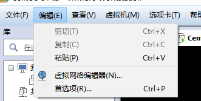
  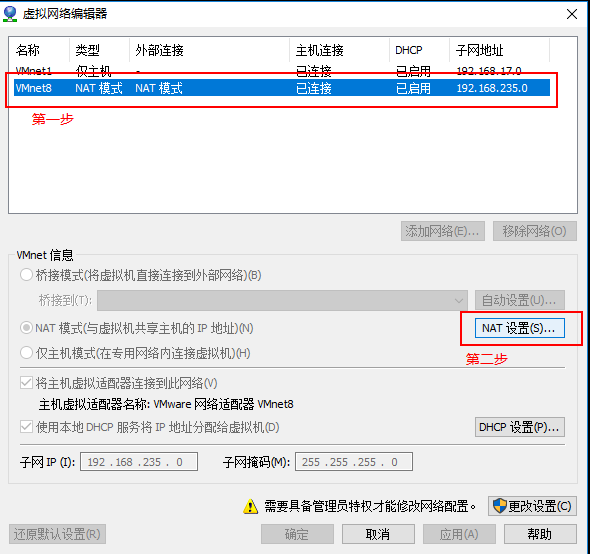

  可知当前VMware的ip地址的235网段， 0 是网络号， 1 给windows用了， 2 是网关， 255 是广播地址。

  所以能配置的地址范围是 192.168.235.3-192.168.235.254
  
  ### 网络文件配置
  
  ```shell
  [root@localhost ~]# cd /etc/sysconfig/network-scripts/
  [root@localhost network-scripts]# ll
  total 224
  -rw-r--r--. 1 root root   327 Jun  8 15:07 ifcfg-ens33
  ```

1. 如果文件里 有**HWADDR** 这个键值对，需要将这个键值对注释起来，这个是网卡的硬件地址，全球唯一。等下要用这个克隆出四台虚拟机。VM会为每个虚拟机分配网卡硬件地址，为避免网卡地址冲突，这台机器的网i卡地址先注释起来

2. 删除 UUID 这个键值对

3. ONBOOT=no， 默认情况下网卡是禁用的状态，这里需要改成yes

4. BOOTPROTO=dhcp，网络参数的配置。为避免每次重启都要修改ip地址，这里将 dhcp 改为 static

5. 配置虚拟网络地址，该地址可从VM处获得
   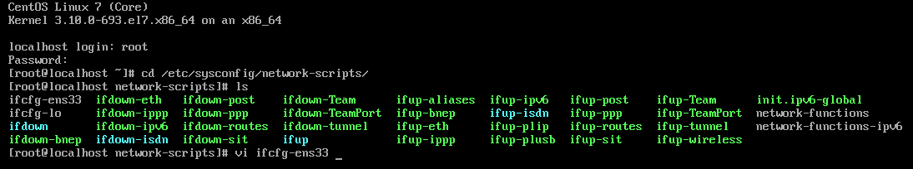
   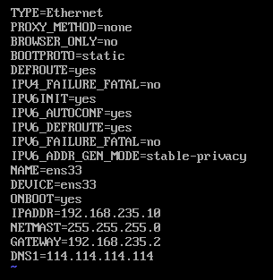

6. 重启网络服务
   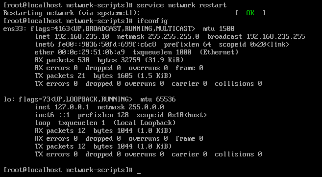

## 二、关闭防火墙
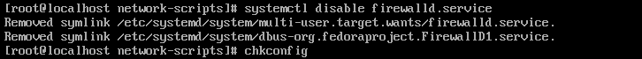

## 三、关闭selinux
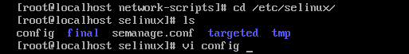
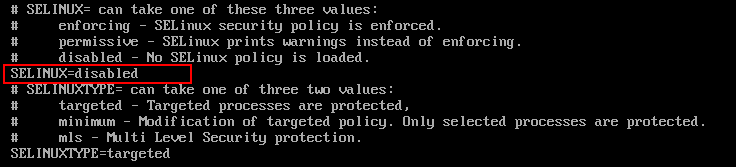

## 四、配置hosts文件

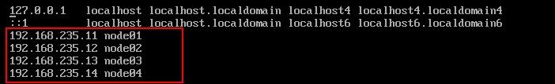

## 五、关机、拍摄快照并克隆出四台机器
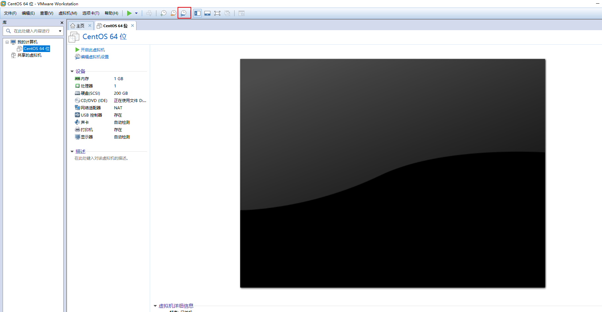
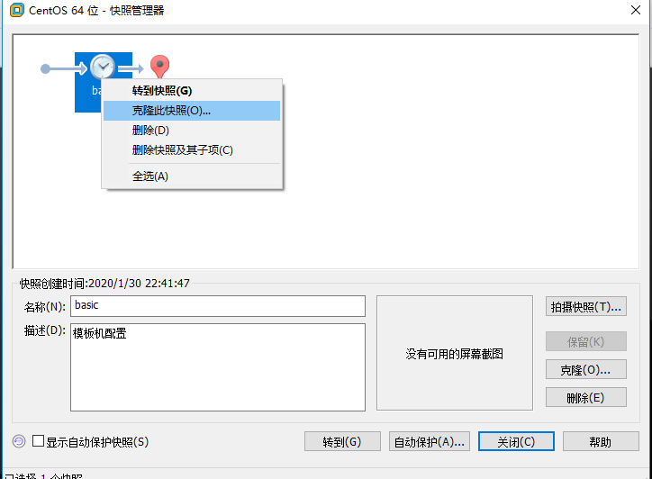