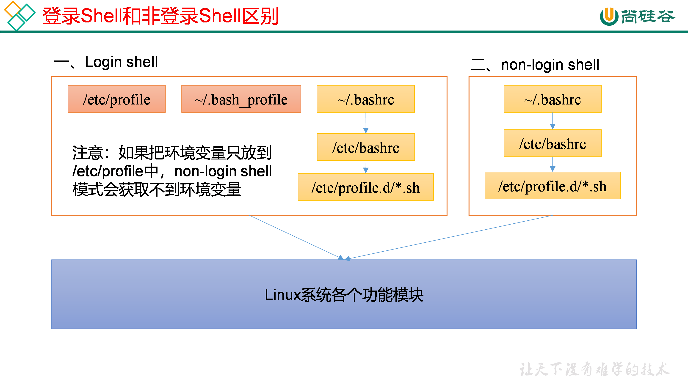
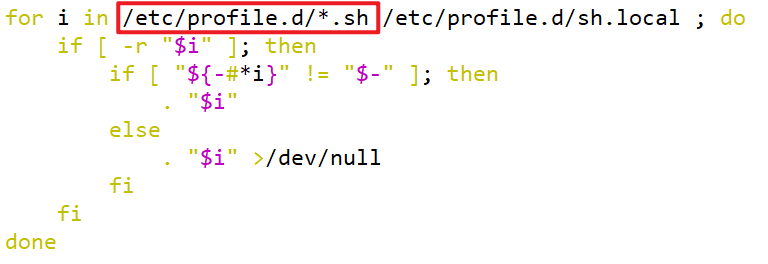

# linux 自定义快捷命令

```
参考地址
https://www.cnblogs.com/xiangsikai/p/10741612.html
```

```shell
[root@node01 ~]# cd /etc/
[root@node01 etc]# pwd
/etc
[root@node01 etc]# vi bashrc 
alias apphome="cd /opt/stanlong/" # 加在最后一行
[root@node01 etc]# source bashrc  # 使自定义命令生效
```

##  Linux 环境变量

Linux的环境变量可在多个文件中配置，如 ` /etc/profile `，` /etc/profile.d/*.sh `，` ~/.bashrc`，` ~/.bash_profile `等，下面说明上述几个文件之间的关系和区别。

bash的运行模式可分为login shell和non-login shell。

例如，我们通过终端，输入用户名、密码，登录系统之后，得到就是一个login shell。而当我们执行以下命令ssh node01 command，在node01执行command的就是一个non-login shell



这两种shell的主要区别在于，它们启动时会加载不同的配置文件，login shell启动时会加载` /etc/profile，` `~/.bash_profile`，` ~/.bashrc` 。non-login shell启动时会加载` ~/.bashrc `

而在加载` ~/.bashrc`（实际是` ~/.bashrc `中加载的` /etc/bashrc` ）或 `/etc/profile `时，都会执行如下代码片段，



不管是login shell还是non-login shell，启动时都会加载/etc/profile.d/*.sh中的环境变量