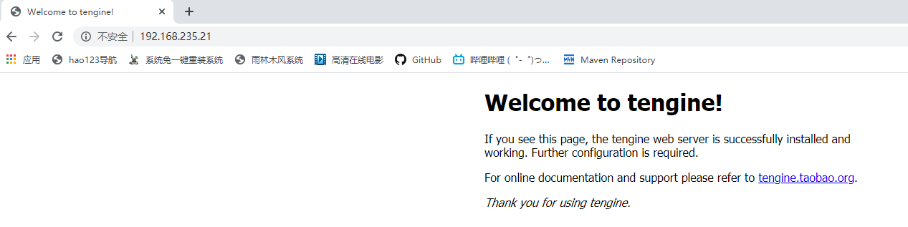

# 编译安装

**安装 tengine-2.1.0.tar.gz** 

1. 解压 tengine-2.1.0.tar.gz

   ```shell
   [root@node01 ~]# tar -xf tengine-2.1.0.tar.gz
   ```

2. 进入解压后的目录 tengine-2.1.0, 查看README，找到 Installation
```shell
Installation
------------
Tengine can be downloaded at http://tengine.taobao.org/download/tengine.tar.gz . You can also checkout the latest source code from GitHub at https://github.com/alibaba/tengine

To install Tengine, just follow these three steps:
    $ ./configure
    $ make
    # make install

By default, it will be installed to /usr/local/nginx. You can use the '--prefix' option to specify the root directory.
If you want to know all the 'configure' options, you should run './configure --help' for help.
```
3. 按提示，执行安装命令，默认会安装到 /usr/local/nginx， 这里安装到 /opt/nginx
```shell
[root@gmall tengine-2.1.0]# ./configure --prefix=/opt/nginx
./configure: error: C compiler cc is not found
```
报错说没有C编译器，安装gcc编译器
```shell
[root@gmall tengine-2.1.0]# yum install gcc -y
```
安装完gcc后继续执行 ./configure 命令
报错缺少 PCRE 库

```shell
./configure: error: the HTTP rewrite module requires the PCRE library.
```
安装PCRE库
```shell
[root@gmall tengine-2.1.0]# yum install pcre-devel -y
```
继续安装，又报错，缺少 OpenSSL 库
```shell
./configure: error: SSL modules require the OpenSSL library.
```
安装OpenSSL库
```shell
[root@gmall tengine-2.1.0]# yum install openssl-devel -y
```
所有需要的库安装完毕后，再安装nginx，安装成功
```shell
[root@gmall tengine-2.1.0]# ll
total 656
-rw-r--r-- 1 50469 users    889 Dec 16  2014 AUTHORS.te
drwxr-xr-x 6 50469 users    297 Dec 16  2014 auto
-rw-r--r-- 1 50469 users 236013 Dec 16  2014 CHANGES
-rw-r--r-- 1 50469 users  16993 Dec 19  2014 CHANGES.cn
-rw-r--r-- 1 50469 users 359556 Dec 16  2014 CHANGES.ru
-rw-r--r-- 1 50469 users  22193 Dec 19  2014 CHANGES.te
drwxr-xr-x 2 50469 users    184 Dec 16  2014 conf
-rwxr-xr-x 1 50469 users   2435 Dec 16  2014 configure
drwxr-xr-x 4 50469 users    109 Dec 16  2014 contrib
drwxr-xr-x 3 50469 users     21 Dec 16  2014 docs
drwxr-xr-x 2 50469 users     40 Dec 16  2014 html
-rw-r--r-- 1 50469 users   1676 Dec 16  2014 LICENSE
-rw-r--r-- 1 root  root     432 Feb  2 19:03 Makefile  -- 多了一个Makefile文件
drwxr-xr-x 2 50469 users     21 Dec 16  2014 man
drwxr-xr-x 4 root  root     203 Feb  2 19:03 objs
drwxr-xr-x 3 50469 users     20 Dec 16  2014 packages
-rw-r--r-- 1 50469 users   3223 Dec 19  2014 README
-rw-r--r-- 1 50469 users   3661 Dec 19  2014 README.markdown
drwxr-xr-x 9 50469 users     89 Dec 16  2014 src
drwxr-xr-x 4 50469 users     43 Dec 16  2014 tests
-rw-r--r-- 1 50469 users     43 Dec 16  2014 THANKS.te
```
4. Makefile 文件内容
```shell
[root@gmall tengine-2.1.0]# vi Makefile
default:        build
clean:
        rm -rf Makefile objs
build:
        $(MAKE) -f objs/Makefile
        $(MAKE) -f objs/Makefile manpage
test:
        $(MAKE) -f objs/Makefile test
install:
        $(MAKE) -f objs/Makefile install
dso_install:
        $(MAKE) -f objs/Makefile dso_install
```
执行make命令
```shell
[root@gmall tengine-2.1.0]# make
[root@gmall tengine-2.1.0]# make install
```
安装成功之后， 在 /opt/目录下会有一个nginx目录
启动nginx

```shell
[root@gmall opt]# cd nginx/
[root@gmall nginx]# ll
total 8
drwxr-xr-x 2 root root 4096 Feb  2 19:18 conf
drwxr-xr-x 2 root root   40 Feb  2 19:18 html
drwxr-xr-x 2 root root 4096 Feb  2 19:18 include
drwxr-xr-x 2 root root    6 Feb  2 19:18 logs
drwxr-xr-x 2 root root    6 Feb  2 19:18 modules
drwxr-xr-x 2 root root   35 Feb  2 19:18 sbin
[root@gmall nginx]# cd sbin/
[root@gmall sbin]# ll
total 5868
-rwxr-xr-x 1 root root   16271 Feb  2 19:18 dso_tool
-rwxr-xr-x 1 root root 5991448 Feb  2 19:18 nginx
[root@gmall sbin]# ./nginx  #启动nginx
[root@gmall sbin]# ./nginx -s stop  #关闭nginx
```
在浏览器中访问nginx


# rpm 安装

**以安装 jdk-8u65-linux-x64.rpm 为例**

**rpm 相关参数 **

```shell
-a：查询所有套件；
-b<完成阶段><套件档>+或-t <完成阶段><套件档>+：设置包装套件的完成阶段，并指定套件档的文件名称；
-c：只列出组态配置文件，本参数需配合"-l"参数使用；
-d：只列出文本文件，本参数需配合"-l"参数使用；
-e<套件档>或--erase<套件档>：删除指定的套件；
-f<文件>+：查询拥有指定文件的套件；
-h或--hash：套件安装时列出标记；
-i：显示套件的相关信息；
-i<套件档>或--install<套件档>：安装指定的套件档；
-l：显示套件的文件列表；
-p<套件档>+：查询指定的RPM套件档；
-q：使用询问模式，当遇到任何问题时，rpm指令会先询问用户；
-R：显示套件的关联性信息；
-s：显示文件状态，本参数需配合"-l"参数使用；
-U<套件档>或--upgrade<套件档>：升级指定的套件档；
-v：显示指令执行过程；
-vv：详细显示指令执行过程，便于排错。

安装jdk
[root@gmall opt]# rpm -ivh jdk-8u65-linux-x64.rpm
```
**rpm 查询相关命令**

```shell
rpm -q <软件名>	查询系统是否安装了指定名称的软件	rpm -q gaim
rpm -qa	查询系统中所有安装的软件	rpm -qa
rpm -qf <文件名>	查询已安装的文件属于哪个软件包（需要指出文件所在绝对路径）	rpm -qf /usr/share/pixmaps/javaws.png
rpm -ql <软件名>	查询已安装的软件包的安装位置	rpm -ql gaim
rpm -qi <软件名>	查询已安装的软件包的信息	rpm -qc gaim
rpm -qd <软件名>	查询已安装的软件包的文档的安装位置	rpm -qd gaim
rpm -qR <软件名>	查询已安装的软件包所依赖的软件和文件	rpm -qR rpm-python

查询是否安装了jdk
[root@gmall opt]# rpm -qa | grep "jdk"
jdk1.8.0_65-1.8.0_65-fcs.x86_64

查询已安装的软件包的安装位置
[root@gmall opt]# rpm -ql jdk1.8.0_65-1.8.0_65-fcs.x86_64 | more
可知 jdk安装到 /usr/java/jdk1.8.0_65/ 目录下

查询已安装的文件属于哪个软件包（需要指出文件所在绝对路径）
[root@gmall opt]# rpm -qf /usr/java/jdk1.8.0_65/bin/javac
jdk1.8.0_65-1.8.0_65-fcs.x86_64
```

**rpm安装java的特殊性**

jdk安装目录

```shell
[root@node01 java]# pwd
/usr/java
[root@node01 java]# ll
total 0
lrwxrwxrwx 1 root root  16 Jun 10 05:41 default -> /usr/java/latest
drwxr-xr-x 9 root root 268 Jun 10 05:41 jdk1.8.0_65
lrwxrwxrwx 1 root root  21 Jun 10 05:41 latest -> /usr/java/jdk1.8.0_65
[root@node01 alternatives]# whereis java
java: /usr/bin/java /usr/share/man/man1/java.1
[root@node01 alternatives]# ls -l /usr/bin/java
lrwxrwxrwx 1 root root 22 Jun 10 05:41 /usr/bin/java -> /etc/alternatives/java
[root@node01 alternatives]# ll /etc/alternatives/ | grep /bin/java
lrwxrwxrwx  1 root root 34 Jun 10 05:41 java -> /usr/java/jdk1.8.0_65/jre/bin/java
lrwxrwxrwx  1 root root 31 Jun 10 05:41 javac -> /usr/java/jdk1.8.0_65/bin/javac
lrwxrwxrwx  1 root root 33 Jun 10 05:41 javadoc -> /usr/java/jdk1.8.0_65/bin/javadoc
lrwxrwxrwx  1 root root 40 Jun 10 05:41 javafxpackager -> /usr/java/jdk1.8.0_65/bin/javafxpackager
lrwxrwxrwx  1 root root 31 Jun 10 05:41 javah -> /usr/java/jdk1.8.0_65/bin/javah
lrwxrwxrwx  1 root root 31 Jun 10 05:41 javap -> /usr/java/jdk1.8.0_65/bin/javap
lrwxrwxrwx  1 root root 38 Jun 10 05:41 javapackager -> /usr/java/jdk1.8.0_65/bin/javapackager
lrwxrwxrwx  1 root root 38 Jun 10 05:41 java-rmi.cgi -> /usr/java/jdk1.8.0_65/bin/java-rmi.cgi
lrwxrwxrwx  1 root root 32 Jun 10 05:41 javaws -> /usr/java/jdk1.8.0_65/bin/javaws
[root@node01 ~]# ll /etc/alternatives/ | grep jps
lrwxrwxrwx  1 root root 29 Jun 10 05:41 jps -> /usr/java/jdk1.8.0_65/bin/jps
lrwxrwxrwx  1 root root 36 Jun 10 05:41 jps.1 -> /usr/java/jdk1.8.0_65/man/man1/jps.1
```

**java配置环境变量**

```shell
[root@node01 ~]# vi /etc/profile
在文件最后添加这两行
export JAVA_HOME=/usr/java/jdk1.8.0_65
export PATH=$PATH:$JAVA_HOME/bin
重新加载 profile 文件
[root@node01 ~]# source /etc/profile
```

# yum安装

```
[root@gmall opt]# cd /etc/yum.repos.d/
[root@gmall yum.repos.d]# ll
total 28
-rw-r--r--. 1 root root 1664 Aug 30  2017 CentOS-Base.repo
-rw-r--r--. 1 root root 1309 Aug 30  2017 CentOS-CR.repo
-rw-r--r--. 1 root root  649 Aug 30  2017 CentOS-Debuginfo.repo
-rw-r--r--. 1 root root  314 Aug 30  2017 CentOS-fasttrack.repo
-rw-r--r--. 1 root root  630 Aug 30  2017 CentOS-Media.repo
-rw-r--r--. 1 root root 1331 Aug 30  2017 CentOS-Sources.repo
-rw-r--r--. 1 root root 3830 Aug 30  2017 CentOS-Vault.repo

```
**安装aliyun在yum仓库**
https://developer.aliyun.com/mirror/centos?spm=a2c6h.13651102.0.0.3e221b112ElOiq

1. 安装  wget

   ```shell
   [root@gmall yum.repos.d]# yum install wget -y
   ```

2. 备份 CentOS-Base.repo

   ```shell
   [root@gmall yum.repos.d]# mv /etc/yum.repos.d/CentOS-Base.repo /etc/yum.repos.d/CentOS-Base.repo.backup
   [root@gmall yum.repos.d]# ll
   total 28
   -rw-r--r--. 1 root root 1664 Aug 30  2017 CentOS-Base.repo.backup
   -rw-r--r--. 1 root root 1309 Aug 30  2017 CentOS-CR.repo
   -rw-r--r--. 1 root root  649 Aug 30  2017 CentOS-Debuginfo.repo
   -rw-r--r--. 1 root root  314 Aug 30  2017 CentOS-fasttrack.repo
   -rw-r--r--. 1 root root  630 Aug 30  2017 CentOS-Media.repo
   -rw-r--r--. 1 root root 1331 Aug 30  2017 CentOS-Sources.repo
   -rw-r--r--. 1 root root 3830 Aug 30  2017 CentOS-Vault.repo
   ```

3. 下载aliyun仓库

   ```shell
   [root@gmall yum.repos.d]# wget -O /etc/yum.repos.d/CentOS-Base.repo http://mirrors.aliyun.com/repo/Centos-7.repo
   [root@gmall yum.repos.d]# vi CentOS-Base.repo
   baseurl=http://mirrors.aliyun.com/centos/$releasever/updates/$basearch/
           http://mirrors.aliyuncs.com/centos/$releasever/updates/$basearch/
           http://mirrors.cloud.aliyuncs.com/centos/$releasever/updates/$basearch/
   ```

4. 运行 yum makecache 生成缓存

   ```shell
   [root@gmall yum.repos.d]# yum clean all
   [root@gmall yum.repos.d]# yum makecache
   ```

**yum命令**

```
repolist：查看yum仓库列表
install：安装rpm软件包；
update：更新rpm软件包；
check-update：检查是否有可用的更新rpm软件包；
remove：删除指定的rpm软件包；
list：显示软件包的信息；
search：检查软件包的信息；
info：显示指定的rpm软件包的描述信息和概要信息；
clean：清理yum过期的缓存；
shell：进入yum的shell提示符；
resolvedep：显示rpm软件包的依赖关系；
localinstall：安装本地的rpm软件包；
localupdate：显示本地rpm软件包进行更新；
deplist：显示rpm软件包的所有依赖关系。
```


