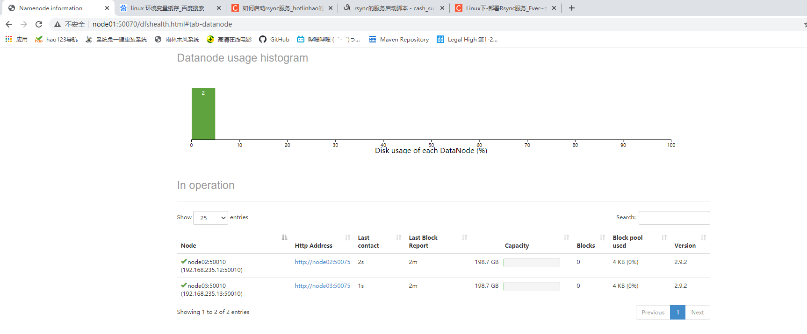

# Hadoop完全分布式搭建

## 集群规划

|        | NN   | SNN  | DN   |
| ------ | ---- | ---- | ---- |
| node01 | NN   |      |      |
| node02 |      | SNN  | DN   |
| node03 |      |      | DN   |

NN 基于内存存储，对内存要求比较高

## 环境检查

参考07Hadoop/02单节点伪分布式搭建

## hadoop部署

### 解压hadoop到指定目录

```shell
[root@node01 ~]# tar -zxf hadoop-2.9.2.tar.gz -C /opt/stanlong/hadoop-cluster/
```

### 配置hadoop环境变量

```shell
[root@node01 hadoop-2.9.2]# vi /etc/profile

78 # export HADOOP_HOME=/opt/stanlong/hadoop-single/hadoop-2.9.2 # HADOOP单节点环境变量
79 export HADOOP_HOME=/opt/stanlong/hadoop-cluster/hadoop-2.9.2 # HADOOP完全分布式环境变量
80 export PATH=$PATH:$JAVA_HOME/bin:$HADOOP_HOME/bin:$HADOOP_HOME/sbin

使环境变量生效
[root@node01 bin]# source /etc/profile

# 输入ha能看到命令提示说明环境变量配置成功
[root@node01 bin]# ha
hadoop             hadoop.cmd         hadoop-daemon.sh   hadoop-daemons.sh  halt               hardlink           hash      
```

### java环境变量二次配置

```shell
[root@node01 hadoop]# pwd
/opt/stanlong/hadoop-cluster/hadoop-2.9.2/etc/hadoop
[root@node01 hadoop]# vi hadoop-env.sh 
  24 # The java implementation to use.
  25 export JAVA_HOME=/usr/java/jdk1.8.0_65
[root@node01 hadoop]# vi mapred-env.sh 
  16 export JAVA_HOME=/usr/java/jdk1.8.0_65
[root@node01 hadoop]# vi yarn-env.sh
  23 export JAVA_HOME=/usr/java/jdk1.8.0_65
```

### 编辑 core-site.xml(NN)

```shell
[root@node01 hadoop]# vi core-site.xml
```

```xml
<?xml version="1.0" encoding="UTF-8"?>
<?xml-stylesheet type="text/xsl" href="configuration.xsl"?>
<!--
  Licensed under the Apache License, Version 2.0 (the "License");
  you may not use this file except in compliance with the License.
  You may obtain a copy of the License at

    http://www.apache.org/licenses/LICENSE-2.0

  Unless required by applicable law or agreed to in writing, software
  distributed under the License is distributed on an "AS IS" BASIS,
  WITHOUT WARRANTIES OR CONDITIONS OF ANY KIND, either express or implied.
  See the License for the specific language governing permissions and
  limitations under the License. See accompanying LICENSE file.
-->

<!-- Put site-specific property overrides in this file. -->

<configuration>
    <!-- 规划了namenode在哪启动 -->
    <property>
        <name>fs.defaultFS</name>
        <value>hdfs://node01:9000</value>
    </property>
    <!-- 配置NN数据存放路径,目录必须为空 -->
    <property>
        <name>hadoop.tmp.dir</name>
        <value>/var/data/hadoop/full</value>
    </property>
</configuration>
```

### 编辑 hdfs-site.xml(NN)

```shell
[root@node01 hadoop]# vi hdfs-site.xml
```

```xml
<?xml version="1.0" encoding="UTF-8"?>
<?xml-stylesheet type="text/xsl" href="configuration.xsl"?>
<!--
  Licensed under the Apache License, Version 2.0 (the "License");
  you may not use this file except in compliance with the License.
  You may obtain a copy of the License at

    http://www.apache.org/licenses/LICENSE-2.0

  Unless required by applicable law or agreed to in writing, software
  distributed under the License is distributed on an "AS IS" BASIS,
  WITHOUT WARRANTIES OR CONDITIONS OF ANY KIND, either express or implied.
  See the License for the specific language governing permissions and
  limitations under the License. See accompanying LICENSE file.
-->

<!-- Put site-specific property overrides in this file. -->

<configuration>
    <property>
        <name>dfs.replication</name>
        <value>1</value>
    </property>
    <!-- 规划了secondaryName在哪启动 -->
    <property>
        <name>dfs.namenode.secondary.http-address</name>
        <value>node02:50090</value>
    </property>
</configuration>
```

### 编辑 slaves（DN）

```shell
[root@node01 hadoop]# vi slaves # slaves 规划了DataNode 在哪启动
# 把文件中的 localhost 替换成 node02 node03
node02
node03
```

### 分发hadoop

把 hadoop 配置分发到 node02，node03上去

分发脚本参考 23自定义集群脚本/分发脚本

```shell
[root@node01 myshell]# ./rsyncd.sh /opt/stanlong/hadoop-cluster/hadoop-2.9.2
```

### 分发/etc/profile文件

```shell
[root@node01 myshell]# ./rsyncd.sh /etc/profile
```

使node02和node03上的profile文件生效

```shell
[root@node02 ~]# source /etc/profile
```

### namenode格式化

```shell
[root@node01 hadoop]# hdfs namenode -format
当看到
common.Storage: Storage directory /var/data/hadoop/full/dfs/name has been successfully formatted 说明格式化成功
```

如果执行 格式化命令时发现命令仍格式化 **/var/data/hadoop/local/dfs/name**， 说明当前连接窗口中出现了hash缓存，关闭当前窗口，重新开一个即可

### 启动dfs

```shell
[root@node01 ~]# start-dfs.sh 
Starting namenodes on [node01]
node01: starting namenode, logging to /opt/stanlong/hadoop-cluster/hadoop-2.9.2/logs/hadoop-root-namenode-node01.out
node03: starting datanode, logging to /opt/stanlong/hadoop-cluster/hadoop-2.9.2/logs/hadoop-root-datanode-node03.out
node02: starting datanode, logging to /opt/stanlong/hadoop-cluster/hadoop-2.9.2/logs/hadoop-root-datanode-node02.out
Starting secondary namenodes [node02]
node02: starting secondarynamenode, logging to /opt/stanlong/hadoop-cluster/hadoop-2.9.2/logs/hadoop-root-secondarynamenode-node02.out
[root@node01 ~]# 
```

### 查看各节点的进程

```shell
[root@node01 ~]# jps
4118 Jps
3737 NameNode

[root@node02 ~]# jps
3616 Jps
3527 SecondaryNameNode
3467 DataNode

[root@node03 ~]# jps
3401 DataNode
3481 Jps
```

### 网页访问

http://node01:50070/dfshealth.html#tab-datanode



