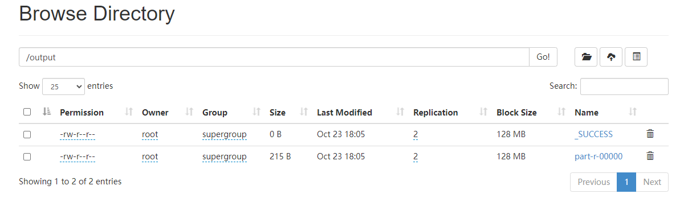
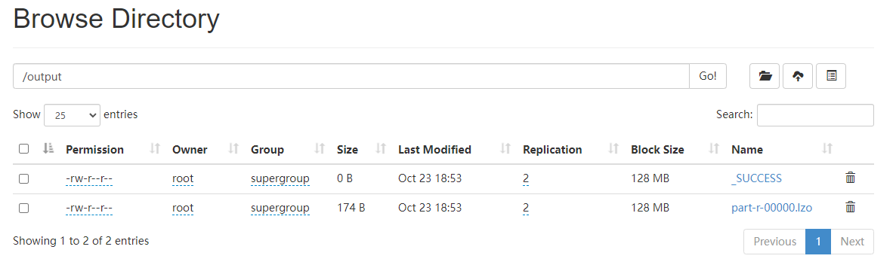
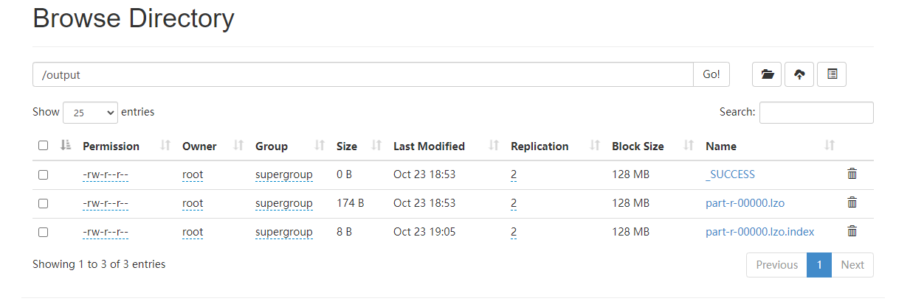

# Hadoop配置LZO压缩

LZO（LZO是Lempel-Ziv-Oberhumer的缩写）是一种高压缩比和解压速度极快的编码，它的特点是解压缩速度非常快，无损压缩，压缩后的数据能准确还原，lzo是基于block分块的，允许数据被分解成chunk，能够被并行的解压。LZO库实现了许多有下述特点的算法：

　　（1）、解压简单，速度非常快。 

　　（2）、解压不需要内存。

　　（3）、压缩相当地快。

　　（4）、压缩需要64 kB的内存。

　　（5）、允许在压缩部分以损失压缩速度为代价提高压缩率，解压速度不会降低。

　　（6）、包括生成预先压缩数据的压缩级别，这样可以得到相当有竞争力的压缩比。

　　（7）、另外还有一个只需要8 kB内存的压缩级别。

　　（8）、算法是线程安全的。

　　（9）、算法是无损的。

hadoop-lzo编译过程参考

https://www.cnblogs.com/caoshouling/p/14091113.html

1. 将编译好后的hadoop-lzo-0.4.21.jar 放入hadoop-2.9.2/share/hadoop/common

```shell
[root@node01 ~]# mv hadoop-lzo-0.4.21.jar /opt/stanlong/hadoop-ha/hadoop-2.9.2/share/hadoop/common
```

2. 分发hadoop-lzo-0.4.21.jar到 node02，node03，nodr04上

```shell
[root@node01 common]# pwd
/opt/stanlong/hadoop-ha/hadoop-2.9.2/share/hadoop/common
[root@node01 common]# ~/myshell/rsyncd.sh hadoop-lzo-0.4.21.jar
```

3. core-site.xml增加配置支持LZO压缩

```shell
[root@node01 ~]# cd /opt/stanlong/hadoop-ha/hadoop-2.9.2/etc/hadoop/
[root@node01 hadoop]# vi core-site.xml
```

```xml
<property>
<name>io.compression.codecs</name>
<value>
org.apache.hadoop.io.compress.GzipCodec,
org.apache.hadoop.io.compress.DefaultCodec,
org.apache.hadoop.io.compress.BZip2Codec,
org.apache.hadoop.io.compress.SnappyCodec,
com.hadoop.compression.lzo.LzoCodec,
com.hadoop.compression.lzo.LzopCodec
</value>
</property>

<property>
    <name>io.compression.codec.lzo.class</name>
    <value>com.hadoop.compression.lzo.LzoCodec</value>
</property>
```

4. 分发 core-site.xml到 node02，node03，nodr04上

```shell
[root@node01 hadoop]# ~/myshell/rsyncd.sh core-site.xml 
```

5. 重启hadoop

```shell
[root@node01 hadoop]# stop-all.sh
[root@node01 hadoop]# start-all.sh
```

6. 测试

```shell
1. 在 hdfs 上创建文件存放路径

[root@node01 myshell]# hdfs dfs -mkdir /input

2. 准备测试文件 
[root@node01 ~]# vi stu.txt
任意添加几行内容
[root@node01 ~]# hdfs dfs -put -f stu.txt /input

3. 执行测试命令
[root@node01 mapreduce]# pwd
/opt/stanlong/hadoop-ha/hadoop-2.9.2/share/hadoop/mapreduce

[root@node01 mapreduce]# hadoop jar hadoop-mapreduce-examples-2.9.2.jar wordcount -Dmapreduce.output.fileoutputformat.compress=true -Dmapreduce.output.fileoutputformat.compress.codec=com.hadoop.compression.lzo.LzopCodec /input/stu.txt /output
```

没有开启lzo压缩



开启lzo压缩



7. LZO创建索引

   LZO压缩文件的可切片特性依赖于其索引，故我们需要手动为LZO压缩文件创建索引。若无索引，则LZO文件的切片只有一个

```pwd
[root@node01 mapreduce]# hadoop jar /opt/stanlong/hadoop-ha/hadoop-2.9.2/share/hadoop/common/hadoop-lzo-0.4.21.jar com.hadoop.compression.lzo.DistributedLzoIndexer /output
```

