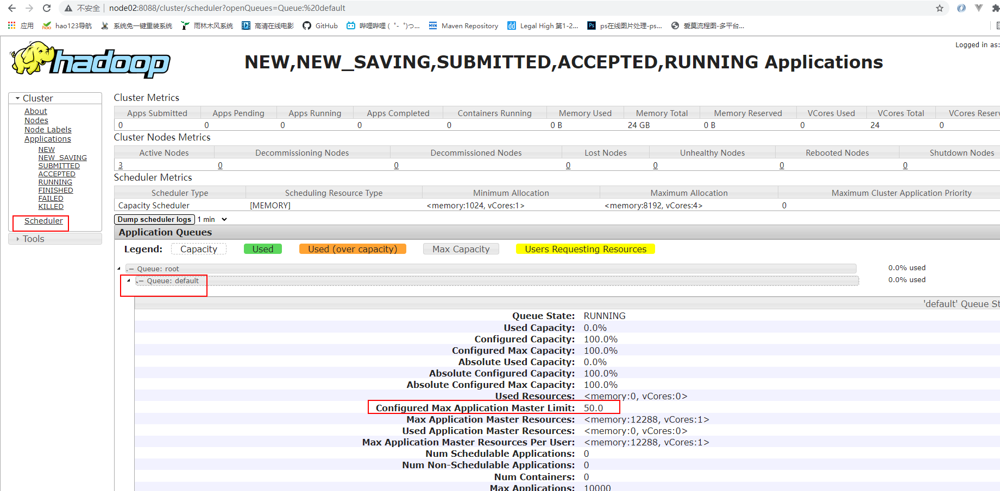

# Yarn配置

**增加ApplicationMaster资源比例**

容量调度器对每个资源队列中同时运行的Application Master占用的资源进行了限制，该限制通过yarn.scheduler.capacity.maximum-am-resource-percent参数实现，其默认值是0.1，表示每个资源队列上Application Master最多可使用的资源为该队列总资源的10%，目的是防止大部分资源都被Application Master占用，而导致Map/Reduce Task无法执行。

**生产环境该参数可使用默认值**。但学习环境，集群资源总数很少，如果只分配10%的资源给Application Master，则可能出现，同一时刻只能运行一个Job的情况，因为一个Application Master使用的资源就可能已经达到10%的上限了。故此处可将该值适当调大。

```shell
[root@node01 hadoop]# pwd
/opt/stanlong/hadoop-ha/hadoop-2.9.2/etc/hadoop

[root@node01 hadoop]# vi capacity-scheduler.xml

<!-- 修改这里，默认0.1， 我改成了0.5 -->
<property>
    <name>yarn.scheduler.capacity.maximum-am-resource-percent</name>
    <value>0.5</value> 
</property>

# 分发
[root@node01 hadoop]# ~/myshell/rsyncd.sh capacity-scheduler.xml 
```

重启Yarn集群， 查看结果

http://node02:8088/cluster




