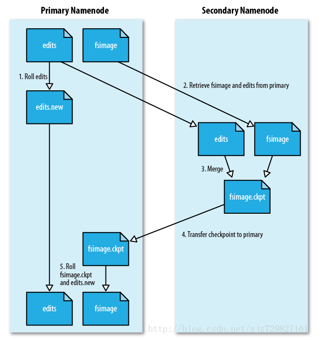
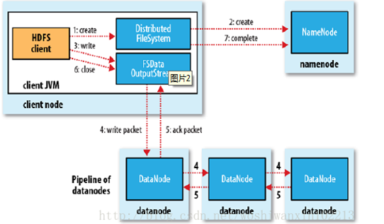

# Hadoop

## 简介

- 分布式存储系统HDFS
  - 提供了高可靠性，高扩展性和高吞吐率的数据存储服务
- 分布式计算框架MapReduce
  - 易于编程，高容错，高吞吐率
- 分布式资源管理框架YARN
  - 负责集群资源的管理和调度

## HDFS

优点：高容错性，适合批处理，适合处理大数据，可构建在廉价的机器上

缺点：低延迟数据访问，小文件存取，并发写入、文件随机修改

### 存储模型

1. HDFS系统中，文件线性按字节切割成块（Block），且每个块都有偏移量（offset）和id

   

2. 各文件block大小可以不一样，比如A的块大小为4KB，B的块大小为8KB，但是每个文件中，除了最后一个块大小可以与其余块不同，其余块大小必须相同

3. block块应根据硬件的I/O特性调整，在Hadoop 1.x版本时，block块大小默认为64MB，在Hadoop 2.x版本时，block块大小默认为128MB

4. 由于是分布式环境，所以block块被分散在集群的各个节点中，但是block具有location（也就是说每个block块会有一个属性记录当前block块的地址）

5. block块具有副本（replication），副本是满足可靠性和性能的关键，副本不能出现在同一节点（为了容灾考虑）上，副本之间没有主从概念，所有副本“地位”一致，比如block 1有3个副本，则说明整个集群中有3个block 1，  副本数不要超过节点数量

6. 文件上传时可以指定block块的大小和副本数，上传之后只能修改副本数，不能再更改block块的大小了

7. 文件是一次写入多次读取的，且不支持修改文件，相当于只读。不修改的原因很简单，因为这会造成block块大小不一致，offset不成规律。但是允许在文件后追加数据，因为这不会更改前面block块的大小，不影响offset

### 架构模型

1. HDFS是主从架构（Master/Slave）
2. 由一个Namenode（主）和一些Datanode（从）组成
3. Datanode 与 Namenode保持心跳，提交Block列表
4. 每个文件都包括：文件数据本身（data）和文件的元数据（metadata）
5. Namenode存储和管理metadata，也就是与文件数据无关的元数据，并维护了一个层次型的文件目录树
6. Datanode负责存储data，也就是文件数据本身，并提供block块的读写
7. 客户端（client）与Namenode交互文件元数据，与Datanode交互文件Block数据


​																				HDFS 架构图


#### NameNode

- 基于内存存储
  - 基于内存存储，不会和磁盘发生交换
- 主要功能
  - 接受客户端的读写服务
  - 收集DataNode汇报的Block信息
- NameNode保存metaData信息包括
  - 文件owership和permissions
  - 文件大小，时间
  - 文件包含哪些Block, Block列表（偏移量和位置信息）
  - Block副本保存在哪个DataNode（由DataNode启动时上报）
  - metadata存储到磁盘文件名为"fsimage"
  - Block的位置信息不会保存到fsimage(其是保存在内存中)
  - edits记录对medadata的操作日志

#### DataNode

- 存储数据(Block)
- 启动DN线程的时候会向NN汇报block信息
- 通过向NN发送心跳保持与其联系(3秒一次)，如果NN 10分钟没有收到DN的心跳，则认为其已经lost，并copy其上的block到其他 DN

#### SecondaryNameNode

- 主要负责下载NameNode中的fsImage文件和Edits文件，并合并生成新的fsImage文件，并推送给NameNode， 减少NN启动时间



#### 安全模式

```
当 Hadoop的NameNode节点启动时，会进入安全模式阶段。在此阶段，DataNode会向NameNode上传它们数据块的列表，让 NameNode得到块的位置信息，并对每个文件对应的数据块副本进行统计。当最小副本条件满足时，即一定比例的数据块都达到最小副本数，系统就会退出安全模式，而这需要一定的延迟时间。当最小副本条件未达到要求时，就会对副本数不足的数据块安排DataNode进行复制，直至达到最小副本数。而在安全模式下，系统会处于只读状态，NameNode不会处理任何块的复制和删除命令。
```

#### Block的副本放置策略

- 第一个副本：放置在上传文件的DN; 如果是集群外提交，则随机挑选一台磁盘不太满，cpu不太忙的节点
- 第二个副本：放置在于第一个副本不同的机架的节点上
- 第三个副本：与第二个副本相同的机架的节点
- 更多副本：随机节点

#### 读写流程

- 写流程

  1. 客户端通过调用 DistributedFileSystem 的create方法，创建一个新的文件
  2. DistributedFileSystem 通过 RPC（远程过程调用）调用 NameNode，去创建一个没有blocks关联的新文件。创建前，NameNode 会做各种校验，比如文件是否存在，客户端有无权限去创建等。如果校验通过，NameNode 就会记录下新文件，否则就会抛出IO异常
  3. 前两步结束后会返回 FSDataOutputStream 的对象，和读文件的时候相似，FSDataOutputStream 被封装成 DFSOutputStream，DFSOutputStream 可以协调 NameNode和 DataNode。客户端开始写数据到DFSOutputStream,DFSOutputStream会把数据切成一个个小packet，然后排成队列 data queue
  4. DataStreamer 会去处理接受 data queue，它先问询 NameNode 这个新的 block 最适合存储的在哪几个DataNode里，比如重复数是3，那么就找到3个最适合的 DataNode，把它们排成一个 pipeline。DataStreamer 把 packet 按队列输出到管道的第一个 DataNode 中，第一个 DataNode又把 packet 输出到第二个 DataNode 中，以此类推
  5. DFSOutputStream 还有一个队列叫 ack queue，也是由 packet 组成，等待DataNode的收到响应，当pipeline中的所有DataNode都表示已经收到的时候，这时akc queue才会把对应的packet包移除掉
  6. 客户端完成写数据后，调用close方法关闭写入流
  7. DataStreamer 把剩余的包都刷到 pipeline 里，然后等待 ack 信息，收到最后一个 ack 后，通知 DataNode 把文件标示为已完成

  

- 读流程

  1. 首先调用FileSystem对象的open方法，其实获取的是一个DistributedFileSystem的实例
  2. DistributedFileSystem通过RPC(远程过程调用)获得文件的第一批block的locations，同一block按照重复数会返回多个locations，这些locations按照hadoop拓扑结构排序，距离客户端近的排在前面
  3. 前两步会返回一个FSDataInputStream对象，该对象会被封装成 DFSInputStream对象，DFSInputStream可以方便的管理datanode和namenode数据流。客户端调用read方法，DFSInputStream就会找出离客户端最近的datanode并连接datanode
  4. 数据从datanode源源不断的流向客户端
  5. 如果第一个block块的数据读完了，就会关闭指向第一个block块的datanode连接，接着读取下一个block块。这些操作对客户端来说是透明的，从客户端的角度来看只是读一个持续不断的流
  6. 如果第一批block都读完了，DFSInputStream就会去namenode拿下一批blocks的location，然后继续读，如果所有的block块都读完，这时就会关闭掉所有的流

  

## MapReduce

 mapreduce是hadoop中一个批量计算的框架, 包括MapTask和ReduceTask。MapTask的输出是ReduceTask的输入，所以只有MapTask执行完了才能执行ReduceTask

### MR原语

输入数据集--》map映射成一个中间数据集（k,v）--》reduce

相同的key为一组，调用一次reduce方法，方法内迭代这一组数据进行计算

### MR计算框架


input：hdfs 存储的数据作为mr的输入，也称为原始数据，数据比较大，可以是视频 图片 文档等。。。

split: 切片，对输入数据进行分割 切片，分发到不同的节点计算

map: 映射 也可以叫建模，对数据切片并行的进行建模，有多少个切片就有多少个map进程。

SM：sort&merge 合并排序，对map的而结果进行合并排序操作

shuff：对相同的key值的数据移动到同一个block中

redu：对shuff的结果计算，数据清洗和处理，

### MR角色

#### JobTracker

- 负责资源管理和作业控制
- 核心，主，单点

#### TaskTracker

- 负责任务的运行

#### Client

- 规划作业计算分布
- 提交资源到HDFS

#### 弊端

- JobTracker：负载过重，容易出现单点故障
- 资源管理和调度强耦合，其他计算框架需要重复实现资源管理
- 不同框架对资源不能全局管理

## YARN

 Apache Yarn（Yet Another Resource Negotiator的缩写）是hadoop集群资源管理器系统，Yarn从hadoop 2引入，最初是为了改善MapReduce的实现，解耦资源与计算。但是它具有通用性，同样执行其他分布式计算模式。

### YARN角色

#### ResourceManager

 ResourceManager的主要职责在于调度

- 主， 核心
- 集群节点资源管理

#### NodeManager

NodeManager是yarn节点的一个“工作进程”代理，管理hadoop集群中独立的计算节点，主要负责与ResourceManager通信，负责启动和管理应用程序的container的生命周期，监控它们的资源使用情况（cpu和内存），跟踪节点的监控状态，管理日志等。并报告给RM

- 与MR汇报资源
- 管理Container生命周期
- 计算框架中的角色都以Container表示

#### Container

Container是Yarn框架的计算单元，是具体执行应用task（如map task、reduce task）的基本单位。Container和集群节点的关系是：一个节点会运行多个Container，但一个Container不会跨节点。


