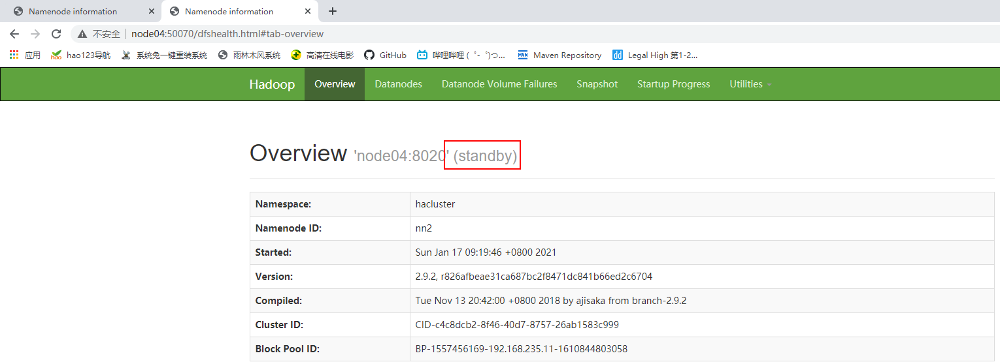
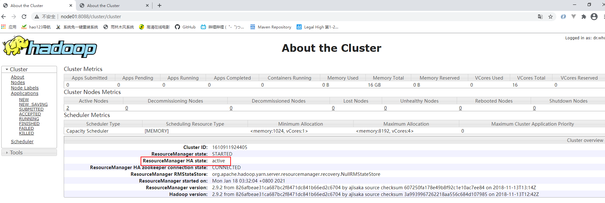
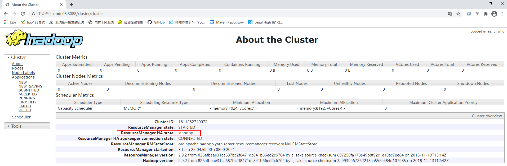

# Hadoop HA搭建

## HA背景

- HDFS存在的问题
  - NN单点故障，难以应用于在线场景
  - NN压力过大，且内存受限，扩展性不好
- MapReduce存在的问题
  - JobTracker访问压力大，影响系统扩展
  - 难以支持除MapReduce之外的计算框架，比如Spark，Storm等

**HA架构图**


## 节点规划

|        | NN     | DN   | ZK   | ZKFC | JNN  | RS   | NM   |
| ------ | ------ | ---- | ---- | ---- | ---- | ---- | ---- |
| node01 | NN(主) |      | ZK   | ZKFC | JNN  | RS   |      |
| node02 |        | DN   | ZK   |      |      |      | NM   |
| node03 |        | DN   | ZK   |      |      |      | NM   |
| node04 | NN(备) |      | ZK   | ZKFC | JNN  | RS   |      |

### 角色说明

- JNN : 当客户端发送请求给主NameNode时，元数据写到一个共享的磁盘中（两个Namenode都可以访问），这样元数据就可以保持一致了. JNN 保证了NameNode的高可用性, NN依赖JNN同步edits.log
- ZKFC：作为一个ZK集群的客户端，用来监控NN的状态信息， 每个运行NN的节点必须要运行一个zkfc。ZKFC跟着NN启动，不是人为规划的
- RS:ResourceManager把NameNode和ZKFC糅合成一个进程，开启HA后会自动到ZK争抢锁。争抢到的为Active， 没争抢到的为Standby
- NM: NodeManager与DataNode做一比一配置，实现计算向数据移动

## 环境检查

参考07Hadoop/02单节点伪分布式搭建。

此外node04被设置为NN，要做对自己的免密钥，对node01的免密钥

## 部署zookeeeper集群

参考 08Zookeeper

## 部署hadoop

### 解压hadoop到指定目录

```shell
[root@node01 ~]# tar -zxf hadoop-2.9.2.tar.gz -C /opt/stanlong/hadoop-ha/
```

### 配置hadoop环境变量

```shell
[root@node01 hadoop-2.9.2]# vi /etc/profile

78 # export HADOOP_HOME=/opt/stanlong/hadoop-single/hadoop-2.9.2 # HADOOP单节点环境变量
79 # export HADOOP_HOME=/opt/stanlong/hadoop-cluster/hadoop-2.9.2 # HADOOP完全分布式环境变量
80 # export HADOOP_HOME=/opt/stanlong/hadoop-ha/hadoop-2.9.2 # HADOOP-HA环境变量
81 export PATH=$PATH:$JAVA_HOME/bin:$HADOOP_HOME/bin:$HADOOP_HOME/sbin

使环境变量生效
[root@node01 bin]# source /etc/profile

# 输入ha能看到命令提示说明环境变量配置成功
[root@node01 bin]# ha
hadoop             hadoop.cmd         hadoop-daemon.sh   hadoop-daemons.sh  halt               hardlink           hash      
```

### java环境变量二次配置

```shell
[root@node01 hadoop]# pwd
/opt/stanlong/hadoop-cluster/hadoop-2.9.2/etc/hadoop
[root@node01 hadoop]# vi hadoop-env.sh 
  24 # The java implementation to use.
  25 export JAVA_HOME=/usr/java/jdk1.8.0_65
[root@node01 hadoop]# vi mapred-env.sh 
  16 export JAVA_HOME=/usr/java/jdk1.8.0_65
[root@node01 hadoop]# vi yarn-env.sh
  23 export JAVA_HOME=/usr/java/jdk1.8.0_65
```

### 编辑 core-site.xml(NN)

```shell
[root@node01 hadoop]# vi core-site.xml
```

```shell
<?xml version="1.0" encoding="UTF-8"?>
<?xml-stylesheet type="text/xsl" href="configuration.xsl"?>
<!--
  Licensed under the Apache License, Version 2.0 (the "License");
  you may not use this file except in compliance with the License.
  You may obtain a copy of the License at

    http://www.apache.org/licenses/LICENSE-2.0

  Unless required by applicable law or agreed to in writing, software
  distributed under the License is distributed on an "AS IS" BASIS,
  WITHOUT WARRANTIES OR CONDITIONS OF ANY KIND, either express or implied.
  See the License for the specific language governing permissions and
  limitations under the License. See accompanying LICENSE file.
-->

<!-- Put site-specific property overrides in this file. -->

<configuration>
    <!-- 规划了namenode在哪启动 -->
    <property>
        <name>fs.defaultFS</name>
        <value>hdfs://hacluster</value>
    </property>
    <!-- 配置NN数据存放路径,目录必须为空 -->
    <property>
        <name>hadoop.tmp.dir</name>
        <value>/var/data/hadoop/ha/data</value>
    </property>
    <!-- zookeeper集群信息 -->
	<property>
		<name>ha.zookeeper.quorum</name>
		<value>node01:2181,node02:2181,node03:2181,node04:2181</value>
	</property>
</configuration>
```

### 编辑 hdfs-site.xml(NN)

1. 配置逻辑到物理的映射
2. 配置JNN
3. 故障切换实现代理的方法

```shell
[root@node01 hadoop]# vi hdfs-site.xml
```

```shell
<?xml version="1.0" encoding="UTF-8"?>
<?xml-stylesheet type="text/xsl" href="configuration.xsl"?>
<!--
  Licensed under the Apache License, Version 2.0 (the "License");
  you may not use this file except in compliance with the License.
  You may obtain a copy of the License at

    http://www.apache.org/licenses/LICENSE-2.0

  Unless required by applicable law or agreed to in writing, software
  distributed under the License is distributed on an "AS IS" BASIS,
  WITHOUT WARRANTIES OR CONDITIONS OF ANY KIND, either express or implied.
  See the License for the specific language governing permissions and
  limitations under the License. See accompanying LICENSE file.
-->

<!-- Put site-specific property overrides in this file. -->

<configuration>
    <!-- 设置了四个节点，副本数设为2 -->
    <property>
        <name>dfs.replication</name>
        <value>2</value>
    </property>
    <!-- HA模式不需要规划secondaryName -->
	<!-- <property>
        <name>dfs.namenode.secondary.http-address</name>
        <value>node02:50090</value>
    </property> -->
    <!-- 配置逻辑到物理的映射 -->
    <!-- namenode HA集群的别名 -->
	<property>
		<name>dfs.nameservices</name>
		<value>hacluster</value>
	</property>
	<!-- HA集群下的两个namenode的别名nn1,nn2 -->
	<property>
		<name>dfs.ha.namenodes.hacluster</name>
		<value>nn1,nn2</value>
	</property>
	<!-- namenode1监听的地址 -->
	<property>
		<name>dfs.namenode.rpc-address.hacluster.nn1</name>
		<value>node01:8020</value>
	</property>
	<!-- namenode2监听的地址 -->
	<property>
		<name>dfs.namenode.rpc-address.hacluster.nn2</name>
		<value>node04:8020</value>
	</property>
	<!-- namenode1客户端访问的物理地址以及端口 -->
	<property>
		<name>dfs.namenode.http-address.hacluster.nn1</name>
		<value>node01:50070</value>
	</property>
	<!-- namenode2客户端访问的物理地址以及端口 -->
	<property>
		<name>dfs.namenode.http-address.hacluster.nn2</name>
		<value>node04:50070</value>
	</property>

	<!-- 配置JNN -->
	<property>
		<name>dfs.namenode.shared.edits.dir</name>
		<value>qjournal://node01:8485;node04:8485/hacluster</value>
	</property>
	<!-- journalNode 存放edit.log文件的路径 -->
	<property>
		<name>dfs.journalnode.edits.dir</name>
		<value>/var/data/hadoop/ha/jnn</value>
	</property>
	
	<!-- 故障切换实现代理的方法 -->
	<property>
		<name>dfs.client.failover.proxy.provider.hacluster</name>
<value>org.apache.hadoop.hdfs.server.namenode.ha.ConfiguredFailoverProxyProvider</value>
	</property>
	<!-- zkfc进程进行回调需要免秘钥 -->
	<property>
		<name>dfs.ha.fencing.methods</name>
		<value>sshfence</value>
	</property>
	<!-- zkfc进程进行回调需要免秘钥，私钥路径 -->
	<property>
		<name>dfs.ha.fencing.ssh.private-key-files</name>
		<value>/root/.ssh/id_dsa</value>
	</property>
	<!-- 开启zookeeper的自动故障转移功能 -->
	<property>
		<name>dfs.ha.automatic-failover.enabled</name>
		<value>true</value>
	</property>
</configuration>
```

### 编辑mapred-site.xml(MR)

```shell
[root@node01 hadoop]# cp mapred-site.xml.template mapred-site.xml
[root@node01 hadoop]# vi mapred-site.xml
```

```xml
<?xml version="1.0"?>
<?xml-stylesheet type="text/xsl" href="configuration.xsl"?>
<!--
  Licensed under the Apache License, Version 2.0 (the "License");
  you may not use this file except in compliance with the License.
  You may obtain a copy of the License at

    http://www.apache.org/licenses/LICENSE-2.0

  Unless required by applicable law or agreed to in writing, software
  distributed under the License is distributed on an "AS IS" BASIS,
  WITHOUT WARRANTIES OR CONDITIONS OF ANY KIND, either express or implied.
  See the License for the specific language governing permissions and
  limitations under the License. See accompanying LICENSE file.
-->

<!-- Put site-specific property overrides in this file. -->
<!-- 开启MapReduce On YARN -->
<configuration>
	<property>
        <name>mapreduce.framework.name</name>
        <value>yarn</value>
    </property>
</configuration>
```

### 编辑yarn-site.xml(YARN)

```shell
[root@node01 hadoop]# vi yarn-site.xml 
```

```xml
<?xml version="1.0"?>
<!--
  Licensed under the Apache License, Version 2.0 (the "License");
  you may not use this file except in compliance with the License.
  You may obtain a copy of the License at

    http://www.apache.org/licenses/LICENSE-2.0

  Unless required by applicable law or agreed to in writing, software
  distributed under the License is distributed on an "AS IS" BASIS,
  WITHOUT WARRANTIES OR CONDITIONS OF ANY KIND, either express or implied.
  See the License for the specific language governing permissions and
  limitations under the License. See accompanying LICENSE file.
-->
<configuration>

<!-- Site specific YARN configuration properties -->
    <property>
　　　　<name>yarn.nodemanager.aux-services</name>
　　　　<value>mapreduce_shuffle</value>
　　</property>
	<!-- 开启resourcemanager自动故障转移 -->
　　<property>
   　　<name>yarn.resourcemanager.ha.enabled</name>
   　　<value>true</value>
　　</property>
    <property>
   　　<name>yarn.resourcemanager.zk-address</name>
   　　<value>node01:2181,node02:2181,node03:2181,node04:2181</value>
　　</property>

   <!-- 配置RS集群标识 -->
　　<property>
   　　<name>yarn.resourcemanager.cluster-id</name>
   　　<value>cluster1</value>
　　</property>
    
	<!-- 逻辑节点到物理节点的映射 -->
　　<property>
   　　<name>yarn.resourcemanager.ha.rm-ids</name>
   　　<value>rm1,rm2</value>
　　</property>
　　<property>
   　　<name>yarn.resourcemanager.hostname.rm1</name>
   　　<value>node01</value>
　　</property>
　　<property>
   　　<name>yarn.resourcemanager.hostname.rm2</name>
   　　<value>node04</value>
　　</property>

</configuration>

```

### 编辑 slaves（DN）(NM)

```shell
[root@node01 hadoop]# vi slaves # slaves 规划了DataNode 在哪启动
# 把文件中的 localhost 替换成 node02 node03
node02
node03
```

### 分发hadoop

把 hadoop 配置分发到 node02，node03， node04上去

分发脚本参考 23自定义集群脚本/分发脚本

```shell
[root@node01 myshell]# ./rsyncd.sh /opt/stanlong/hadoop-ha/hadoop-2.9.2
```

### 分发/etc/profile文件

```shell
[root@node01 myshell]# ./rsyncd.sh /etc/profile
```

使node02，node03，node04上的profile文件生效

```shell
[root@node02 ~]# source /etc/profile
```

## 启动Hadoop-HA

**按顺序依次启动**

### 启动zookeeper

部署完zookeeper集群后，启动zookeeper

### 启动JNN

现在有两个NN，需要通过JNN来传递数据，所以在格式化之前先启动JNN

```shell
[root@node01 ~]# hadoop-daemon.sh start journalnode
starting journalnode, logging to /opt/stanlong/hadoop-ha/hadoop-2.9.2/logs/hadoop-root-journalnode-node01.out

[root@node04 stanlong]# hadoop-daemon.sh start journalnode
starting journalnode, logging to /opt/stanlong/hadoop-ha/hadoop-2.9.2/logs/hadoop-root-journalnode-node04.out
```

### 格式化主namenode

```shell
[root@node01 hadoop]# hdfs namenode -format
```

### 启动主namenode

```shell
[root@node01 ~]# hadoop-daemon.sh start namenode
```

### 启动备namenode

```shell
[root@node04 stanlong]# hdfs namenode -bootstrapStandby
```

备namenode启动提示

```
STARTUP_MSG:   build = https://git-wip-us.apache.org/repos/asf/hadoop.git -r 826afbeae31ca687bc2f8471dc841b66ed2c6704; compiled by 'ajisaka' on 2018-11-13T12:42Z
STARTUP_MSG:   java = 1.8.0_65
************************************************************/
21/01/17 09:03:52 INFO namenode.NameNode: registered UNIX signal handlers for [TERM, HUP, INT]
21/01/17 09:03:53 INFO namenode.NameNode: createNameNode [-bootstrapStandby]
=====================================================
About to bootstrap Standby ID nn2 from:
           Nameservice ID: hacluster
        Other Namenode ID: nn1
  Other NN's HTTP address: http://node01:50070
  Other NN's IPC  address: node01/192.168.235.11:8020
             Namespace ID: 2138035154
            Block pool ID: BP-1557456169-192.168.235.11-1610844803058
               Cluster ID: CID-c4c8dcb2-8f46-40d7-8757-26ab1583c999
           Layout version: -63
       isUpgradeFinalized: true
=====================================================
21/01/17 09:03:55 INFO common.Storage: Storage directory /var/data/hadoop/ha/data/dfs/name has been successfully formatted.
21/01/17 09:03:55 INFO namenode.FSEditLog: Edit logging is async:true
21/01/17 09:03:55 WARN client.QuorumJournalManager: Quorum journal URI 'qjournal://node01:8485;node04:8485/hacluster' has an even number of Journal Nodes specified. This is not recommended!
21/01/17 09:03:56 INFO namenode.TransferFsImage: Opening connection to http://node01:50070/imagetransfer?getimage=1&txid=0&storageInfo=-63:2138035154:1610844803058:CID-c4c8dcb2-8f46-40d7-8757-26ab1583c999&bootstrapstandby=true
21/01/17 09:03:56 INFO namenode.TransferFsImage: Image Transfer timeout configured to 60000 milliseconds
21/01/17 09:03:57 INFO namenode.TransferFsImage: Combined time for fsimage download and fsync to all disks took 0.03s. The fsimage download took 0.02s at 0.00 KB/s. Synchronous (fsync) write to disk of /var/data/hadoop/ha/data/dfs/name/current/fsimage.ckpt_0000000000000000000 took 0.00s.
21/01/17 09:03:57 INFO namenode.TransferFsImage: Downloaded file fsimage.ckpt_0000000000000000000 size 323 bytes.
21/01/17 09:03:57 INFO namenode.NameNode: SHUTDOWN_MSG: 
/************************************************************
SHUTDOWN_MSG: Shutting down NameNode at node04/192.168.235.14
************************************************************/
```

### 格式化zookeeper

```shell
[root@node01 ~]# hdfs zkfc -formatZK

日志提示
 Successfully created /hadoop-ha/hacluster in ZK
```

**验证zk**

```shell
[root@node01 ~]# zkCli.sh

[zk: localhost:2181(CONNECTED) 0] ls / # 查看zk根目录的内容
[zookeeper, hadoop-ha]
[zk: localhost:2181(CONNECTED) 2] ls /hadoop-ha
[hacluster]
[zk: localhost:2181(CONNECTED) 3] ls /hadoop-ha/hacluster
[]
```

### 启动dfs

```shell
[root@node01 hadoop]# start-dfs.sh 
```

### 启动YARN

```shell
[root@node01 ~]# start-yarn.sh 
```

### 启动备RS

```shell
[root@node04 ~]# yarn-daemon.sh start resourcemanager
```

## 页面访问(NN)

http://node01:50070/dfshealth.html#tab-overview





## 页面访问(RS)

http://node01:8088/cluster



http://node04:8088/cluster/cluster （直接访问根目录跳转到node01，需要填具体的访问路径）



## 查看节点jps

```shell
[root@node01 myshell]# ./cluster-jps.sh 
--------- node01 ----------
16336 ResourceManager
14565 QuorumPeerMain
16054 DFSZKFailoverController
15515 JournalNode
15611 NameNode
20126 Jps
--------- node02 ----------
15591 NodeManager
14314 QuorumPeerMain
19051 Jps
15293 DataNode
--------- node03 ----------
19057 Jps
14281 QuorumPeerMain
15594 NodeManager
15295 DataNode
--------- node04 ----------
15472 NameNode
19763 Jps
15364 JournalNode
15608 DFSZKFailoverController
14441 QuorumPeerMain
16249 ResourceManager
```

## 使用脚本启动集群

脚本参考 23自定义集群脚本/启动Hadoop-HA.md

## 查看zookeeper锁

```shell
[zk: localhost:2181(CONNECTED) 0] ls /
[zookeeper, hadoop-ha]
[zk: localhost:2181(CONNECTED) 1] ls /hadoop-ha
[hacluster]
[zk: localhost:2181(CONNECTED) 2] ls /hadoop-ha/hacluster
[ActiveBreadCrumb, ActiveStandbyElectorLock]
[zk: localhost:2181(CONNECTED) 3] get /hadoop-ha/hacluster/ActiveStandbyElectorLock

	haclusternn1node01 �>(�> # 可见此时node01抢到了锁
cZxid = 0x100000010
ctime = Sun Jan 17 09:20:07 CST 2021
mZxid = 0x100000010
mtime = Sun Jan 17 09:20:07 CST 2021
pZxid = 0x100000010
cversion = 0
dataVersion = 0
aclVersion = 0
ephemeralOwner = 0x400008891f20000
dataLength = 30
numChildren = 0
```