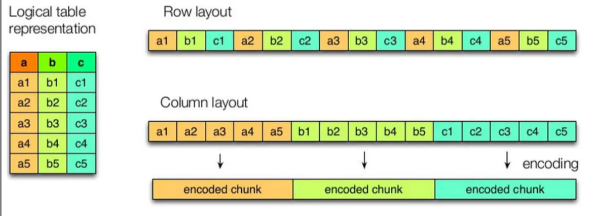

# 压缩和存储

查看Hadoop支持的压缩格式

```shell
[root@node01 native]# hadoop checknative
21/02/05 06:09:10 INFO bzip2.Bzip2Factory: Successfully loaded & initialized native-bzip2 library system-native
21/02/05 06:09:10 INFO zlib.ZlibFactory: Successfully loaded & initialized native-zlib library
Native library checking:
hadoop:  true /opt/stanlong/hadoop-ha/hadoop-2.9.2/lib/native/libhadoop.so.1.0.0
zlib:    true /lib64/libz.so.1
snappy:  true /lib64/libsnappy.so.1
zstd  :  false 
lz4:     true revision:10301
bzip2:   true /lib64/libbz2.so.1
openssl: true /lib64/libcrypto.so
```

## 开启Map输出阶段的压缩

开启map输出阶段压缩可以减少job中map和Reduce task间数据传输量

### 参数配置

```properties
# 开启hive中间传输数据压缩功能
set hive.exec.compress.intermediate=true;
# 开启mapreduce中map输出压缩功能
set mapreduce.map.output.compress=true;
# 设置mapreduce中map输出数据的压缩方式
set mapreduce.map.output.compress.codec=org.apache.hadoop.io.compress.SnappyCodec;
```

### 执行查询

未开启压缩前

```sql
0: jdbc:hive2://node01:10000> select count(ename) name from emp;
INFO  : Number of reduce tasks determined at compile time: 1
INFO  : In order to change the average load for a reducer (in bytes):
INFO  :   set hive.exec.reducers.bytes.per.reducer=<number>
INFO  : In order to limit the maximum number of reducers:
INFO  :   set hive.exec.reducers.max=<number>
INFO  : In order to set a constant number of reducers:
INFO  :   set mapreduce.job.reduces=<number>
INFO  : number of splits:2
INFO  : Submitting tokens for job: job_1612469998745_0001
INFO  : The url to track the job: http://node03:8088/proxy/application_1612469998745_0001/
INFO  : Starting Job = job_1612469998745_0001, Tracking URL = http://node03:8088/proxy/application_1612469998745_0001/
INFO  : Kill Command = /opt/stanlong/hadoop-ha/hadoop-2.9.2/bin/hadoop job  -kill job_1612469998745_0001
INFO  : Hadoop job information for Stage-1: number of mappers: 2; number of reducers: 1
INFO  : 2021-02-05 06:24:07,688 Stage-1 map = 0%,  reduce = 0%
INFO  : 2021-02-05 06:25:09,252 Stage-1 map = 0%,  reduce = 0%
INFO  : 2021-02-05 06:25:29,789 Stage-1 map = 100%,  reduce = 0%, Cumulative CPU 24.09 sec
INFO  : 2021-02-05 06:25:43,581 Stage-1 map = 100%,  reduce = 100%, Cumulative CPU 27.69 sec
INFO  : MapReduce Total cumulative CPU time: 27 seconds 690 msec
INFO  : Ended Job = job_1612469998745_0001
+-------+--+
| name  |
+-------+--+
| 14    |
+-------+--+
1 row selected (178.528 seconds)
```

开启压缩后

```sql
0: jdbc:hive2://node01:10000> set hive.exec.compress.intermediate;
+---------------------------------------+--+
|                  set                  |
+---------------------------------------+--+
| hive.exec.compress.intermediate=true  |
+---------------------------------------+--+
1 row selected (0.009 seconds)
0: jdbc:hive2://node01:10000> set mapreduce.map.output.compress;
+-------------------------------------+--+
|                 set                 |
+-------------------------------------+--+
| mapreduce.map.output.compress=true  |
+-------------------------------------+--+
1 row selected (0.012 seconds)
0: jdbc:hive2://node01:10000> set mapreduce.map.output.compress.codec;
+--------------------------------------------------------------------------------+--+
|                                      set                                       |
+--------------------------------------------------------------------------------+--+
| mapreduce.map.output.compress.codec=org.apache.hadoop.io.compress.SnappyCodec  |
+--------------------------------------------------------------------------------+--+
1 row selected (0.01 seconds)

0: jdbc:hive2://node01:10000> select count(ename) name from emp;
INFO  : Number of reduce tasks determined at compile time: 1
INFO  : In order to change the average load for a reducer (in bytes):
INFO  :   set hive.exec.reducers.bytes.per.reducer=<number>
INFO  : In order to limit the maximum number of reducers:
INFO  :   set hive.exec.reducers.max=<number>
INFO  : In order to set a constant number of reducers:
INFO  :   set mapreduce.job.reduces=<number>
INFO  : number of splits:2
INFO  : Submitting tokens for job: job_1612469998745_0002
INFO  : The url to track the job: http://node03:8088/proxy/application_1612469998745_0002/
INFO  : Starting Job = job_1612469998745_0002, Tracking URL = http://node03:8088/proxy/application_1612469998745_0002/
INFO  : Kill Command = /opt/stanlong/hadoop-ha/hadoop-2.9.2/bin/hadoop job  -kill job_1612469998745_0002
INFO  : Hadoop job information for Stage-1: number of mappers: 2; number of reducers: 1
INFO  : 2021-02-05 06:28:30,314 Stage-1 map = 0%,  reduce = 0%
INFO  : 2021-02-05 06:28:43,007 Stage-1 map = 50%,  reduce = 0%, Cumulative CPU 2.4 sec
INFO  : 2021-02-05 06:29:41,628 Stage-1 map = 50%,  reduce = 17%, Cumulative CPU 2.4 sec
INFO  : 2021-02-05 06:30:06,063 Stage-1 map = 100%,  reduce = 17%, Cumulative CPU 29.41 sec
INFO  : 2021-02-05 06:30:13,792 Stage-1 map = 100%,  reduce = 100%, Cumulative CPU 33.01 sec
INFO  : MapReduce Total cumulative CPU time: 33 seconds 10 msec
INFO  : Ended Job = job_1612469998745_0002
+-------+--+
| name  |
+-------+--+
| 14    |
+-------+--+
1 row selected (127.585 seconds)
```

## 开启Reduce输出阶段压缩

当Hive将输出写入到表中时，输出内容同样可以进行压缩。属性`hive.exec.compress.output`控制着这个功能。用户可能需要保持默认设置文件中的默认值false，这样默认的输出就是非压缩的纯文本文件了。用户可以通过在查询语句或执行脚本中设置这个值为true，来开启输出结果压缩功能。

### 参数配置

```properties
# 开启hive最终输出数据压缩功能
set hive.exec.compress.output=true;
# 开启mapreduce最终输出数据压缩
set mapreduce.output.fileoutputformat.compress=true;
# 设置mapreduce最终数据输出压缩方式
set mapreduce.output.fileoutputformat.compress.codec=org.apache.hadoop.io.compress.SnappyCodec;
# 设置mapreduce最终数据输出压缩为块压缩
set mapreduce.output.fileoutputformat.compress.type=BLOCK;
```

### 执行查询

未开启压缩

```sql
hive> insert overwrite local directory
    >  '/var/data/hive/student' select * from student;
# 查看数据
[root@node02 ~]# cd /var/data/hive/student
[root@node02 student]# ll
total 4
-rw-r--r-- 1 root root 45 Feb  5 07:04 000000_0
[root@node02 student]# cat 000000_0 
1001沈万三
1002朱元璋
1003陆春香
```

开启压缩

```sql
hive> set hive.exec.compress.output;
hive.exec.compress.output=true
hive> set mapreduce.output.fileoutputformat.compress;
mapreduce.output.fileoutputformat.compress=true
hive> set mapreduce.output.fileoutputformat.compress.codec;
mapreduce.output.fileoutputformat.compress.codec=org.apache.hadoop.io.compress.SnappyCodec
hive> set mapreduce.output.fileoutputformat.compress.type;
mapreduce.output.fileoutputformat.compress.type=BLOCK

hive> insert overwrite local directory
    >  '/var/data/hive/student_snappy' select * from student;

# 查看数据
[root@node02 student]# cd /var/data/hive/student_snappy
[root@node02 student_snappy]# ll
total 4
-rw-r--r-- 1 root root 54 Feb  5 07:09 000000_0.snappy
[root@node02 student_snappy]# cat 000000_0.snappy 
-.-p1001沈万三
1002朱元璋,3陆春香
```

## 存储



左边为逻辑表，右边第一个为行式存储，第二个为列式存储。

**列存储特点：**

因为每个字段的数据聚集存储，在查询只需要少数几个字段的时候，能大大减少读取的数据量；每个字段的数据类型一定是相同的，列式存储可以针对性的设计更好的设计压缩算法。

**行存储特点：**

查询满足条件的一整行数据的时候，列存储则需要去每个聚集的字段找到对应的每个列的值，行存储只需要找到其中一个值，其余的值都在相邻地方，所以此时行存储查询的速度更快

| 格式         | 存储方式 | 压缩方式                                                   | 具体特点                                                     |
| ------------ | -------- | ---------------------------------------------------------- | ------------------------------------------------------------ |
| TEXTFILE     | 按行存储 | Gzip,Bzip2                                                 | 默认格式,存储空间消耗比较大，并且压缩的text 无法分割和合并 查询的效率最低,可以直接存储，加载数据的速度最高 |
| SEQUENCEFILE | 按行存储 | NONE，RECORD，BLOCK。Record压缩率低，一般建议使用BLOCK压缩 | 存储空间消耗最大,压缩的文件可以分割和合并 查询效率高，需要通过text文件转化来加载 |
| RCFILE       | 按列存储 |                                                            | 存储空间最小，查询的效率最高 ，需要通过text文件转化来加载，加载的速度最低。压缩快 快速列存取。读记录尽量涉及到的block最少 读取需要的列只需要读取每个row group 的头部定义。 读取全量数据的操作 性能可能比sequencefile没有明显的优势 |
| ORC          | 按列存储 | zlib(default),snappy                                       | 压缩快,快速列存取 ,效率比rcfile高,是rcfile的改良版本         |
| PARQUET      | 按列存储 |                                                            | 相对于PRC，Parquet压缩比较低，查询效率较低，不支持update、insert和ACID.但是Parquet支持Impala查询引擎 |
| AVRO         | 按行存储 |                                                            |                                                              |

存储文件的压缩比总结：ORC > Parquet > textFile

存储文件的查询速度总结：查询速度相近

**创建一个非压缩的的ORC存储方式**

```sql
create table log_orc_none(
track_time string,
url string,
session_id string,
referer string,
ip string,
end_user_id string,
city_id string
)
row format delimited fields terminated by '\t'
stored as orc tblproperties ("orc.compress"="NONE");
```

**创建一个SNAPPY压缩的ORC存储方式**

```sql
create table log_orc_snappy(
track_time string,
url string,
session_id string,
referer string,
ip string,
end_user_id string,
city_id string
)
row format delimited fields terminated by '\t'
stored as orc tblproperties ("orc.compress"="SNAPPY");
```

