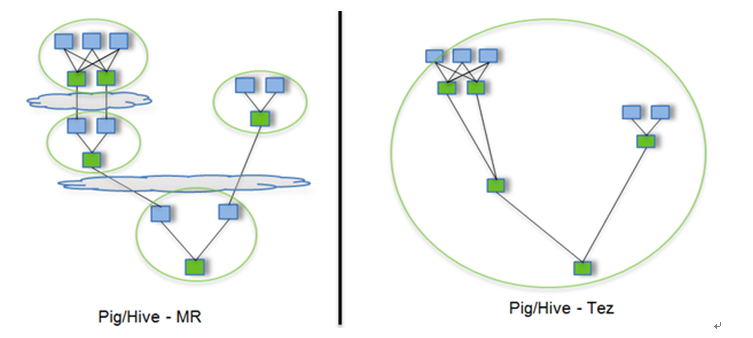

# Hive运行Tez引擎

Tez是一个Hive的运行引擎，性能优于MR。看下图



用Hive直接编写MR程序，假设有四个有依赖关系的MR作业，上图中，绿色是Reduce Task，云状表示写屏蔽，需要将中间结果持久化写到HDFS。

Tez可以将多个有依赖的作业转换为一个作业，这样只需写一次HDFS，且中间节点较少，从而大大提升作业的计算性能。

## 节点规划

| node01, node02, node03, node04 |
| ------------------------------ |
| apache-tez-0.9.1               |

## 安装

```shell
[root@node01 ~]# tar -zxf apache-tez-0.9.2-bin.tar.gz -C /opt/stanlong/hive/
```

## 配置 hive-env.sh

```shell
[root@node01 apache-tez-0.9.2-bin]# pwd
/opt/stanlong/hive/apache-tez-0.9.2-bin

[root@node01 conf]# pwd
/opt/stanlong/hive/apache-hive-2.3.9-bin/conf
[root@node01 conf]# vi hive-env.sh
```

```shell
# 配置tez引擎
export TEZ_HOME=/opt/stanlong/hive/apache-tez-0.9.2-bin    #tez的解压目录
export TEZ_JARS=""
for jar in `ls $TEZ_HOME |grep jar`; do
    export TEZ_JARS=$TEZ_JARS:$TEZ_HOME/$jar
done
for jar in `ls $TEZ_HOME/lib`; do
    export TEZ_JARS=$TEZ_JARS:$TEZ_HOME/lib/$jar
done

export HIVE_AUX_JARS_PATH=/opt/stanlong/hadoop-ha/hadoop-2.9.2/share/hadoop/common/hadoop-lzo-0.4.21.jar$TEZ_JARS
```

## 配置hive-site.xml

```shell
[root@node01 conf]# pwd
/opt/stanlong/hive/apache-hive-2.3.-bin/conf
[root@node01 conf]# vi hive-site.xml
```

```xml
<property>
    <name>hive.execution.engine</name>
    <value>tez</value>
</property>
```

## 配置tez-site.xml

```shell
[root@node01 conf]# pwd
/opt/stanlong/hive/apache-hive-2.3.9-bin/conf
[root@node01 conf]# vi tez-site.xml
```

```xml
<?xml version="1.0" encoding="UTF-8"?>
<?xml-stylesheet type="text/xsl" href="configuration.xsl"?>
<configuration>
    <property>
        <name>tez.lib.uris</name>    
        <value>${fs.defaultFS}/tez/tez-0.9.2,${fs.defaultFS}/tez/tez-0.9.2/lib</value>
    </property>
    <property>
        <name>tez.lib.uris.classpath</name>    	
        <value>${fs.defaultFS}/tez/tez-0.9.2,${fs.defaultFS}/tez/tez-0.9.2/lib</value>
    </property>
    <property>
         <name>tez.use.cluster.hadoop-libs</name>
         <value>true</value>
    </property>
    <property>
         <name>tez.history.logging.service.class</name>        
         <value>org.apache.tez.dag.history.logging.ats.ATSHistoryLoggingService</value>
    </property>
</configuration>
```

## 上传Tez到集群

```shell
[root@node01 ~]# hdfs dfs -mkdir /tez
[root@node01 ~]# hdfs dfs -put /opt/stanlong/hive/apache-tez-0.9.2-bin/ /tez
[root@node01 ~]# hdfs dfs -mv /tez/apache-tez-0.9.2-bin /tez/tez-0.9.2
```

## 测试

```shell
show databases;
+----------------+--+
| database_name  |
+----------------+--+
| default        |
| gmall          |
| homework       |
+----------------+--+

use default;

create table stu_tez(
id int,
name string);

0: jdbc:hive2://node01:10000> insert into stu_tez values(1,"zhangsan");
INFO  : Tez session hasn't been created yet. Opening session
INFO  : 

INFO  : Status: Running (Executing on YARN cluster with App id application_1613928585113_0002)

INFO  : Map 1: -/-	
INFO  : Map 1: 0/1	
INFO  : Map 1: 0/1	
INFO  : Map 1: 0/1	
INFO  : Map 1: 0/1	
INFO  : Map 1: 0/1	
INFO  : Map 1: 0(+1)/1	
INFO  : Map 1: 0(+1)/1	
INFO  : Map 1: 1/1	
INFO  : Loading data to table default.stu_tez from hdfs://hacluster/user/hivedb/warehouse/stu_tez/.hive-staging_hive_2021-02-22_01-50-43_055_6010164217206492839-4/-ext-10000
INFO  : Table default.stu_tez stats: [numFiles=1, numRows=1, totalSize=11, rawDataSize=10]
No rows affected (83.419 seconds)
```

## 分发

将 apache-hive-2.3.9-bin 分发到node02，node03， node04 上去

## 小结

运行Tez时检查到用过多内存而被NodeManager杀死进程问题

```shell
0: jdbc:hive2://node01:10000> insert into stu_tez values(1,"zhangsan");
INFO  : Session is already open
INFO  : Tez session was closed. Reopening...
ERROR : Failed to execute tez graph.
org.apache.tez.dag.api.SessionNotRunning: TezSession has already shutdown. Application application_1613928585113_0001 failed 2 times due to AM Container for appattempt_1613928585113_0001_000002 exited with  exitCode: -103
Failing this attempt.Diagnostics: [2021-02-22 01:41:14.426]Container [pid=8464,containerID=container_1613928585113_0001_02_000001] is running beyond virtual memory limits. Current usage: 81.0 MB of 1 GB physical memory used; 2.5 GB of 2.1 GB virtual memory used. Killing container.
Dump of the process-tree for container_1613928585113_0001_02_000001 :
```

这种问题是从机上运行的Container试图使用过多的内存，而被NodeManager kill掉了

**解决方法**

关掉虚拟内存检查。修改yarn-site.xml

```shell
[root@node01 hadoop]# pwd
/opt/stanlong/hadoop-ha/hadoop-2.9.2/etc/hadoop
[root@node01 hadoop]# vi yarn-site.xml
```

```xml
<property>
    <name>yarn.nodemanager.vmem-check-enabled</name>
    <value>false</value>
</property>
```

```shell
分发到其他节点后重启yarn
[root@node01 hadoop]# ~/myshell/rsyncd.sh yarn-site.xml
```

