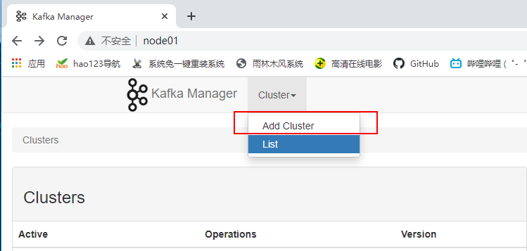
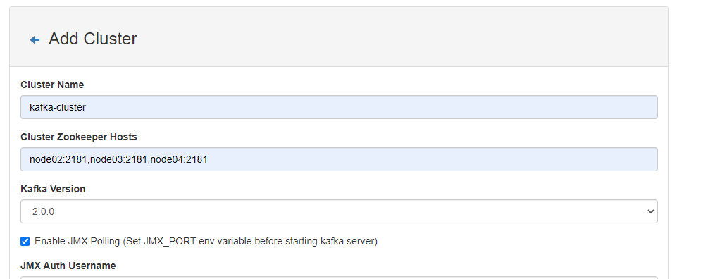
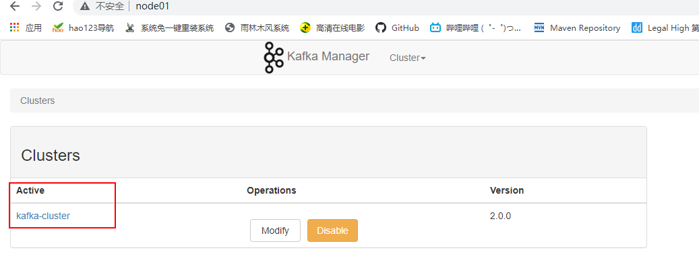
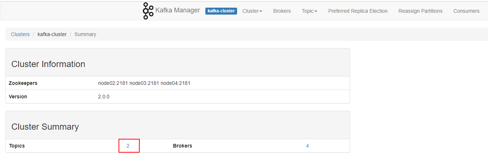
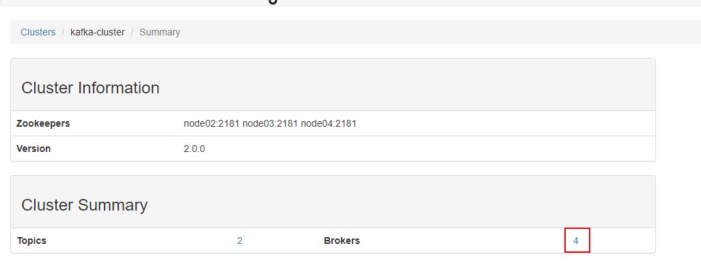
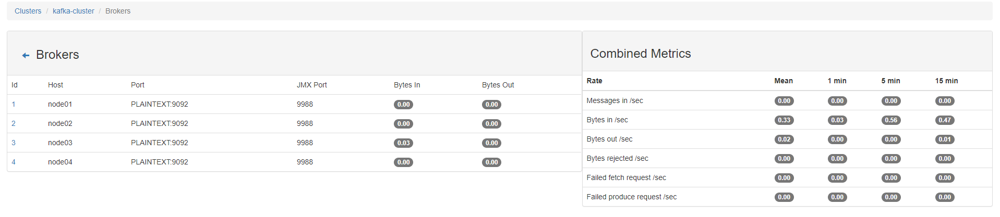

# KafkaManager

## 定义

Kafka Manager是yahoo的一个Kafka监控管理项目

## 节点规划

| node01                 |
| ---------------------- |
| kafka-manager-1.3.3.22 |

## 安装

**解压**

```shell
[root@node01 ~]# unzip -d /opt/stanlong/kafka/ kafka-manager-1.3.3.22.zip
```

**配置application.conf**

```shell
[root@node01 conf]# pwd
/opt/stanlong/kafka/kafka-manager-1.3.3.22/conf
[root@node01 conf]# vi application.conf
# Copyright 2015 Yahoo Inc. Licensed under the Apache License, Version 2.0
# See accompanying LICENSE file.

# This is the main configuration file for the application.
# ~~~~~

# Secret key
# ~~~~~
# The secret key is used to secure cryptographics functions.
# If you deploy your application to several instances be sure to use the same key!
play.crypto.secret="^<csmm5Fx4d=r2HEX8pelM3iBkFVv?k[mc;IZE<_Qoq8EkX_/7@Zt6dP05Pzea3U"
play.crypto.secret=${?APPLICATION_SECRET}

# The application languages
# ~~~~~
play.i18n.langs=["en"]

play.http.requestHandler = "play.http.DefaultHttpRequestHandler"
play.http.context = "/"
play.application.loader=loader.KafkaManagerLoader

kafka-manager.zkhosts="kafka-manager-zookeeper:2181"
# 配置 kafka-manager.zkhosts
kafka-manager.zkhosts="node02:2181,node03:2181,node04:2181"
pinned-dispatcher.type="PinnedDispatcher"
pinned-dispatcher.executor="thread-pool-executor"
application.features=["KMClusterManagerFeature","KMTopicManagerFeature","KMPreferredReplicaElectionFeature","KMReassignPartitionsFeature"]

akka {
  loggers = ["akka.event.slf4j.Slf4jLogger"]
  loglevel = "INFO"
}

akka.logger-startup-timeout = 60s

basicAuthentication.enabled=false
basicAuthentication.enabled=${?KAFKA_MANAGER_AUTH_ENABLED}
basicAuthentication.username="admin"
basicAuthentication.username=${?KAFKA_MANAGER_USERNAME}
basicAuthentication.password="password"
basicAuthentication.password=${?KAFKA_MANAGER_PASSWORD}
basicAuthentication.realm="Kafka-Manager"
basicAuthentication.excluded=["/api/health"] # ping the health of your instance without authentification

kafka-manager.consumer.properties.file=${?CONSUMER_PROPERTIES_FILE}
```

## 启动

```shell
[root@node01 kafka-manager-1.3.3.22]# pwd
/opt/stanlong/kafka/kafka-manager-1.3.3.22
[root@node01 kafka-manager-1.3.3.22]# nohup bin/kafka-manager -Dhttp.port=7456 > /var/data/kafka-manager/start.log 2>&1 &
```

**页面访问**

http://node01:7456/












