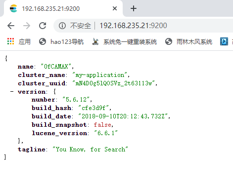

# Elasticsearch

## docker容器安装elasticsearch 

1. docker 镜像下载

   ```
   docker pull elasticsearch:5.6.8
   ```

2. 安装es容器

   ```
   docker run -di --name=changgou_elasticsearch -p 9200:9200 -p 9300:9300 elasticsearch:5.6.8 
   ```

   9200端口（Web管理平台端口） 9300(默认服务端口)

   浏览器输入地址访问 http://192.168.235.21:9200

   

3. 开启远程连接

   上面安装完成后，es并不能正常使用， elastcsearch从5版本以后默认不开启远程连接，程序直接连接会报错

   需要修改es配置开启远程连接，代码如下：

   登录容器

   ```
   docker exec -it changgou_elasticsearch /bin/bash
   ```

   执行如下操作

   ```shell
   [root@changgou ~]# docker exec -it changgou_elasticsearch /bin/bash
   root@eee8bb3d5248:/usr/share/elasticsearch# dir
   NOTICE.txt  README.textile  bin  config  data  lib  logs  modules  plugins
   root@eee8bb3d5248:/usr/share/elasticsearch# cd config/
   root@eee8bb3d5248:/usr/share/elasticsearch/config#
   ```

   修改 elasticsearch.yml文件

   ```
   root@eee8bb3d5248:/usr/share/elasticsearch/config# vi elasticsearch.yml
   
   http.host: 0.0.0.0
   
   # Uncomment the following lines for a production cluster deployment
   transport.host: 0.0.0.0 # 这里有行注释，去掉它
   #discovery.zen.minimum_master_nodes: 1
   cluster.name: my-application # 当前集群节点的名称
   http.cors.enabled: true      # 开启跨域
   http.cors.allow-origin: "*"  # 允许所有域名跨域
   network.host: 192.168.235.21 
   ```

4. 系统参数配置

   修改 vi /etc/security/limits.conf, 追加内容（nofile是单个进程允许打开的最大文件个数， soft nofile 是软限制， hard nofile 是硬限制）

   ```shell
   [root@changgou ~]# vi /etc/security/limits.conf
   
   61 # End of file
   62 * soft nofile 65536
   63 * hard nofile 65536
   ```

   修改 vi /etc/sysctl.conf, 追加内容（限制一个进程可以拥有的VMA（虚拟内存区域）的数据）

   ```
   [root@changgou ~]# vi /etc/sysctl.conf
   
   11 vm.max_map_count=655360
   ```

   执行下面的命令，使配置立即生效

   ```
   [root@changgou ~]# sysctl -p
   vm.max_map_count = 655360
   ```

   重新启动虚拟机，再次启动容器

5. 如果想让容器开机重启，可以执行下面命令

   ```
   docker update --restart=always 容器名称或者容器id
   ```

小提示： Docker 中的es内存不足，无法运行

```shell
[root@changgou ~]# docker exec -it changgou_elasticsearch /bin/bash
root@eee8bb3d5248:/usr/share/elasticsearch# cd /etc/elasticsearch/
root@eee8bb3d5248:/etc/elasticsearch# ls
elasticsearch.yml  jvm.options	log4j2.properties  scripts
root@eee8bb3d5248:/etc/elasticsearch# vi jvm.options 

22 -Xms2g 设置内存大小为2G
23 -Xmx2g 设置内存大小为2G
```

