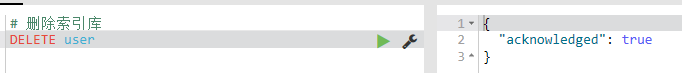
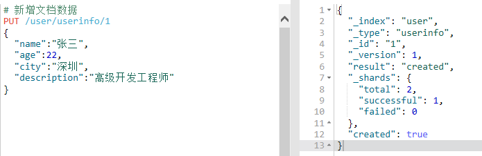
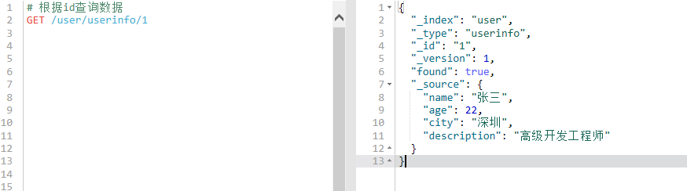
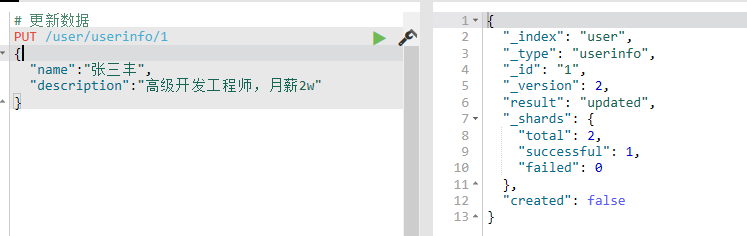
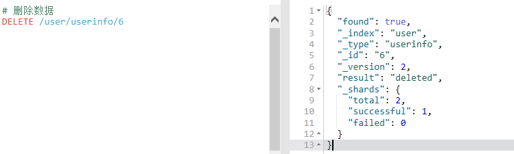
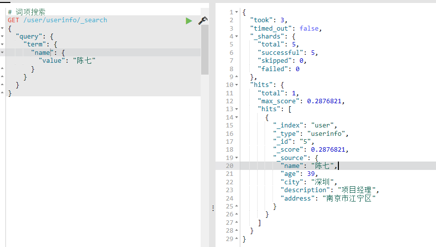

# Kibana的使用

1. 查询所有索引

   ```java
   GET _cat/indices?v
   ```

   

2. 新增索引

   ```
   PUT /索引名称
   ```

   

3. 删除索引

   ```
   DELETE /索引名称
   ```

   

4. 创建映射

   ```
   PUT /user/userinfo/_mapping 
   {
     "properties":{
       "name":{
         "type":"text",
         "analyzer": "ik_smart",
         "search_analyzer": "ik_smart",
         "store": false
       },
       "city":{
         "type":"text",
         "analyzer": "ik_smart",
         "search_analyzer": "ik_smart",
         "store": false
       },
       "age":{
         "type":"long",
         "store": false
       },
       "description":{
         "type":"text",
         "analyzer": "ik_smart",
         "search_analyzer": "ik_smart",
         "store": false
       }
     }
   }
   ```

   

5. 新增文档数据

   ```
   PUT /user/userinfo/1
   {
     "name":"张三",
     "age":22,
     "city":"深圳",
     "description":"高级开发工程师"
   }
   
   # 测试用，多新增几条
   PUT /user/userinfo/2
   {
     "name":"李四",
     "age":30,
     "city":"深圳",
     "description":"初级工程师"
   }
   
   PUT /user/userinfo/3
   {
     "name":"王五",
     "age":35,
     "city":"深圳",
     "description":"产品经理"
   }
   
   PUT /user/userinfo/4
   {
     "name":"赵六",
     "age":37,
     "city":"深圳",
     "description":"项目经理"
   }
   
   PUT /user/userinfo/5
   {
     "name":"陈七",
     "age":39,
     "city":"深圳",
     "description":"项目经理",
     "address":"南京市江宁区"
   }
   
   PUT /user/userinfo/6
   {
     "name":"朱八",
     "age":42,
     "city":"深圳",
     "description":"销售经理",
     "address":"南京市江宁区"
   }
   ```

   

6. 根据id查询数据

   

7. 覆盖更新

   

   再次查询"_id"为1的数据，会发现数据已经被覆盖了

   

8. 更新数据(POST)

   

9. 删除数据

   

10. 查询user索引库下的所有数据

    

11. Sort 排序

    ```
    # 按age降序排列
    GET /user/_search
    {
      "query":{
        "match_all": {
          
        }
      },
      "sort": [
        {
          "age": {
            "order": "desc"
          }
        }
      ]
    }
    ```

    

12. 分页

from: 从N的记录开始查询

size:每页显示的条数

```
GET /user/_search
{
  "query":{
    "match_all": {
      
    }
  },
  "sort": [
    {
      "age": {
        "order": "desc"
      }
    }
  ],
  "from": 0,
  "size": 2
}
```


13. 词项搜索

```
GET /user/userinfo/_search
{
  "query": {
    "term": {
      "name": {
        "value": "陈七"
      }
    }
  }
}
```



14. 多个词项搜索

    ```
    GET /user/userinfo/_search
    {
      "query": {
        "terms": {
          "name": [
            "陈七",
            "张三丰"
          ]
        }
      }
    }
    ```

    

15. 范围过滤搜索

    ```
    GET /user/userinfo/_search
    {
      "query": {
        "range": {
          "age": {
            "gte": 35,
            "lte": 40
          }
        }
      }
    }
    ```

    

16. exits 过滤

    exists 过滤可以用于查找包含某个域的数据

    ```
    #  查询存在 address 域的数据
    GET /user/userinfo/_search
    {
      "query": {
        "exists":{
          "field":"address"
        }
      }
    }
    ```
    
    

17. bool 过滤

    bool 过滤可以用来合并多个过滤条件，它包含以下操作符

    * must: 多个查询条件的完全匹配，相当于and

    * must_not: 多个查询条件的相反匹配， 相当于not

    * should: 至少有一个查询条件匹配，相当于or

      这些参数可以分别继承一个过滤条件或者一个过滤条件的数组：

      ```
      # 搜索在深圳的用户
      # 并且年龄在30-40之间
      
      GET /user/userinfo/_search
      {
        "query":{
          "bool":{
            "must":[
              {
                "term":{
                  "city":{
                    "value":"深圳"
                  }
                }
              }
            ]
            ,"must":[
              {
                "range":{
                  "age":{
                    "gte":37,
                    "lte":40
                  }
                }
              }
            ]
          }
        }
      }
      ```

      

查询语句可优化

```
# 搜索在深圳的用户
# 并且年龄在30-40之间

GET /user/userinfo/_search
{
  "query":{
    "bool":{
      "must":[
        {
          "term":{
            "city":{
              "value":"深圳"
            }
          }
        },
        {
          "range":{
            "age":{
              "gte":37,
              "lte":40
            }
          }
        }
      ]
    }
  }
}
```

18. 查询所有数据

    ```
    #  查询所有数据
    GET /user/userinfo/_search
    {
      "query": {
        "match_all": {}
      }
    }
    ```

19. 搜索某个字段的值

    ```
    GET /user/userinfo/_search
    {
      "query": {
        "match": {
          "name": "李四"
        }
      }
    }
    ```

    

20. 前缀搜索

    ```
    # 前缀搜索
    # 搜索姓张
    GET /user/userinfo/_search
    {
      "query": {
        "prefix": {
          "name": {
            "value": "张"
          }
        }
      }
    }
    ```

    

21. 多个域匹配搜索

    ```
    #  多个域匹配搜索
    # decsription|city中都有深圳的数据
    GET /user/userinfo/_search
    {
      "query": {
        "multi_match": {
          "query": "深圳",
          "fields": ["city", "description"]
        }
      }
    }
    ```

    