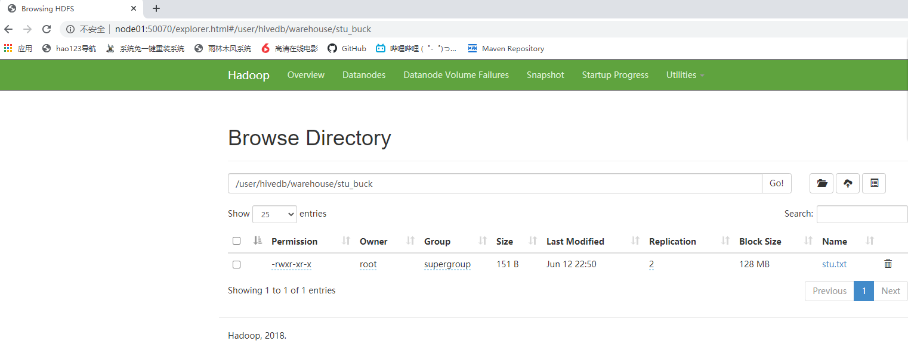

# Hive

Hive 是基于Hadoop的一个数据仓库工具，可以将结构化的数据文件映射成一张表，并提供类SQL的查询功能。

本质是：将HQL转化成MapReduce程序

1）Hive处理的数据存储在HDFS

2）Hive分析数据底层的实现是MapReduce

3）执行程序运行在Yarn上


## 节点规划

|        |      |
| ------ | ---- |
| node01 | Hive |

## Hive安装部署

### 启动hadoop集群

参考07Hadoop/04HA搭建启动hadoop集群

### 解压

```shell
[root@node01 ~]# tar -zxf apache-hive-1.2.2-bin.tar.gz -C /opt/stanlong/hive
```

### 配置hive-env.sh

```shell
[root@node01 conf]# pwd
/opt/stanlong/hive/apache-hive-1.2.2-bin/conf
[root@node01 conf]# cp hive-env.sh.template hive-env.sh
[root@node01 conf]# vi hive-env.sh
```

```properties
# Licensed to the Apache Software Foundation (ASF) under one
# or more contributor license agreements.  See the NOTICE file
# distributed with this work for additional information
# regarding copyright ownership.  The ASF licenses this file
# to you under the Apache License, Version 2.0 (the
# "License"); you may not use this file except in compliance
# with the License.  You may obtain a copy of the License at
#
#     http://www.apache.org/licenses/LICENSE-2.0
#
# Unless required by applicable law or agreed to in writing, software
# distributed under the License is distributed on an "AS IS" BASIS,
# WITHOUT WARRANTIES OR CONDITIONS OF ANY KIND, either express or implied.
# See the License for the specific language governing permissions and
# limitations under the License.

# Set Hive and Hadoop environment variables here. These variables can be used
# to control the execution of Hive. It should be used by admins to configure
# the Hive installation (so that users do not have to set environment variables
# or set command line parameters to get correct behavior).
#
# The hive service being invoked (CLI/HWI etc.) is available via the environment
# variable SERVICE


# Hive Client memory usage can be an issue if a large number of clients
# are running at the same time. The flags below have been useful in 
# reducing memory usage:
#
# if [ "$SERVICE" = "cli" ]; then
#   if [ -z "$DEBUG" ]; then
#     export HADOOP_OPTS="$HADOOP_OPTS -XX:NewRatio=12 -Xms10m -XX:MaxHeapFreeRatio=40 -XX:MinHeapFreeRatio=15 -XX:+UseParNewGC -XX:-UseGCOverheadLimit"
#   else
#     export HADOOP_OPTS="$HADOOP_OPTS -XX:NewRatio=12 -Xms10m -XX:MaxHeapFreeRatio=40 -XX:MinHeapFreeRatio=15 -XX:-UseGCOverheadLimit"
#   fi
# fi

# The heap size of the jvm stared by hive shell script can be controlled via:
#
# export HADOOP_HEAPSIZE=1024
#
# Larger heap size may be required when running queries over large number of files or partitions. 
# By default hive shell scripts use a heap size of 256 (MB).  Larger heap size would also be 
# appropriate for hive server (hwi etc).


# Set HADOOP_HOME to point to a specific hadoop install directory
# 配置Hadoop环境变量，在/etc/profile里配置过的话，这里也可以不用再配置
# export HADOOP_HOME=/opt/stanlong/hadoop-ha/hadoop-2.9.2

# Hive Configuration Directory can be controlled by:
# 配置Hive配置文件的路径
export HIVE_CONF_DIR=/opt/stanlong/hive/apache-hive-1.2.2-bin/conf

# Folder containing extra ibraries required for hive compilation/execution can be controlled by:
# export HIVE_AUX_JARS_PATH=
```

### 启动hive

```shell
[root@node01 bin]# pwd
/opt/stanlong/hive/apache-hive-1.2.2-bin/bin
[root@node01 bin]# ./hive

Logging initialized using configuration in jar:file:/opt/stanlong/hive/lib/hive-common-1.2.2.jar!/hive-log4j.properties
hive> 
```

### 退出hive

```sql
hive> quit;
```

### 更改hive 默认配置

默认情况：Hive内部表都属于缺省库default，在HDFS的目录为/user/hive/warehouse/

在HDFS上创建hive默认目录/tmp和/user/hive/warehouse两个目录并修改他们的同组权限可写

```shell
[root@node01 hive]# hdfs dfs -mkdir /tmp
[root@node01 hive]# hdfs dfs -mkdir -p /user/hive/warehouse
[root@node01 hive]# hdfs dfs -chmod g+w /tmp
[root@node01 hive]# hdfs dfs -chmod g+w /user/hive/warehouse
```

定位下这个错 Error during job, obtaining debugging information...


**3.Hive基本操作**

- 启动hive

```sql
[root@node01 hive]# pwd
/opt/stanlong/hive
[root@node01 hive]# bin/hive

Logging initialized using configuration in jar:file:/opt/stanlong/hive/lib/hive-common-1.2.2.jar!/hive-log4j.properties
hive> 
```

- 退出hive

```sql

[root@node01 hive]#
```

## 将本地文件导入hive案例

将本地/root/student.txt这个目录下的数据导入到hive的student(id int, name string)表中

- 数据准备

```shell
[root@node01 ~]# vi student.txt
1001	zhangshan
1002	lishi
1003	zhaoliu
```

注意以tab键间隔

- hive实际操作

  - 创建student表, 并声明文件分隔符’\t’

  ```shell
  hive> create table student(id int, name string) ROW FORMAT DELIMITED FIELDS TERMINATED
      >  BY '\t';
  OK
  Time taken: 3.487 seconds
  ```

  - 加载/root/student.txt文件到student数据库表中

  ```shell
  hive> load data local inpath '/root/student.txt' into table student;
  Loading data to table default.student
  Table default.student stats: [numFiles=1, totalSize=39]
  OK
  Time taken: 2.733 seconds
  hive> 
  ```

  - Hive查询结果

  ```sql
  hive> select * from student;
  OK
  1001	zhangshan
  1002	lishi
  1003	zhaoliu
  Time taken: 0.788 seconds, Fetched: 3 row(s)
  hive> 
  ```

## mysql安装（参考 MySql_DBA/安装mysql.docx）

安装完数据库之后需要修改下user表

```sql
mysql>update user set host='%' where host='localhost';
```


## hive元数据配置到mysql

- 拷贝mysql连接驱动到 hive/lib目录下

```shell
[root@node01 ~]# cp mysql-connector-java-5.1.37.jar /opt/stanlong/hive/lib/
```

- 配置Metastore到MySql

  - 在 /hive/conf目录下创建一个hive-site.xml

  ```shell
  [root@node01 conf]# pwd
  /opt/stanlong/hive/conf
  [root@node01 conf]# touch hive-site.xml
  ```

  - 配置 hive-site.xml文件中

  官方文档地址 https://cwiki.apache.org/confluence/display/Hive/AdminManual+MetastoreAdmin

  ```xml
  <?xml version="1.0" encoding="UTF-8" standalone="no"?>
  <?xml-stylesheet type="text/xsl" href="configuration.xsl"?>
  <configuration>
  
  	<!-- 配置hive文件在hdfs上的保存路径 -->
      <property>
          <name>hive.metastore.warehouse.dir</name>  
          <value>/user/hivedb/warehouse</value>
      </property>
      <property>
          <name>hive.metastore.local</name>
          <!-- 单用户模式下值为 false -->
          <value>false</value>
      </property>
      <property>
          <!-- 元数据库的链接地址 mysql -->
          <name>javax.jdo.option.ConnectionURL</name>  
          <value>jdbc:mysql://192.168.235.11:3306/hivedb?createDatabaseIfNotExist=true</value>
      </property>
      <property>
          <!-- 指定mysql驱动 -->
          <name>javax.jdo.option.ConnectionDriverName</name>
          <value>com.mysql.jdbc.Driver</value>
      </property>
      <property>
          <!-- 指定mysql用户名 -->
          <name>javax.jdo.option.ConnectionUserName</name>
          <value>root</value>
      </property>
      <property>
          <name>javax.jdo.option.ConnectionPassword</name>
          <value>root</value>
      </property>
  	
  	<!-- 表头信息配置 -->
  	<property>
  		<name>hive.cli.print.header</name>
  		<value>true</value>
  	</property>
  
  	<!-- 显示当前数据库 -->
  	<property>
  		<name>hive.cli.print.current.db</name>
  		<value>true</value>
  	</property>
  
  </configuration>
  ```

  - 配置好之后重启hive会发现mysql目录下多了一个 hivedb的数据库

  ```shell
  mysql> show databases;
  +--------------------+
  | Database           |
  +--------------------+
  | information_schema |
  | hivedb             |
  | mysql              |
  | performance_schema |
  | sys                |
  +--------------------+
  5 rows in set (0.00 sec)
  ```

## Hive JDBC 访问

- 启动hiveserver2, 这是一个阻塞进程

```shell
[root@node01 conf]# hiveserver2
20/06/12 03:26:42 WARN conf.HiveConf: HiveConf of name hive.metastore.local does not exist
```

- 新起一个窗口，启动beeline

```shell
[root@node01 ~]# beeline
Beeline version 1.2.2 by Apache Hive
beeline> 
```

- 连接hiveserver2

```shell
beeline> !connect jdbc:hive2://node01:10000
Connecting to jdbc:hive2://node01:10000
Enter username for jdbc:hive2://node01:10000: root
Enter password for jdbc:hive2://node01:10000: ****
Connected to: Apache Hive (version 1.2.2)
Driver: Hive JDBC (version 1.2.2)
Transaction isolation: TRANSACTION_REPEATABLE_READ
0: jdbc:hive2://node01:10000> 
```

## Hive常用交互命令

```shell
[root@node01 ~]# hive -help
20/06/12 03:36:03 WARN conf.HiveConf: HiveConf of name hive.metastore.local does not exist
usage: hive
 -d,--define <key=value>          Variable subsitution to apply to hive
                                  commands. e.g. -d A=B or --define A=B
    --database <databasename>     Specify the database to use
 -e <quoted-query-string>         SQL from command line
 -f <filename>                    SQL from files
 -H,--help                        Print help information
    --hiveconf <property=value>   Use value for given property
    --hivevar <key=value>         Variable subsitution to apply to hive
                                  commands. e.g. --hivevar A=B
 -i <filename>                    Initialization SQL file
 -S,--silent                      Silent mode in interactive shell
 -v,--verbose                     Verbose mode (echo executed SQL to the
                                  console)
[root@node01 ~]# 
```

- -e 不进入hive的交互窗口执行sql语句

```shell
[root@node01 ~]# hive -e "select * from student";
20/06/12 03:39:41 WARN conf.HiveConf: HiveConf of name hive.metastore.local does not exist

Logging initialized using configuration in jar:file:/opt/stanlong/hive/lib/hive-common-1.2.2.jar!/hive-log4j.properties
OK
student.id	student.name
1001	zhangshan
1002	lishi
1003	zhaoliu
Time taken: 6.374 seconds, Fetched: 3 row(s)
```

- -f 执行脚本中sql语句

  - 创建hivef.sql文件

  ```shell
  [root@node01 ~]# touch hivef.sql
  ```

  - 在文件中写入正确的Sql语句

  ```shell
  [root@node01 ~]# vi hivef.sql
  select *from student;
  ```

  - 执行文件中的sql语句

  ```shell
  [root@node01 ~]# hive -f hivef.sql 
  20/06/12 03:42:23 WARN conf.HiveConf: HiveConf of name hive.metastore.local does not exist
  
  Logging initialized using configuration in jar:file:/opt/stanlong/hive/lib/hive-common-1.2.2.jar!/hive-log4j.properties
  OK
  student.id	student.name
  1001	zhangshan
  1002	lishi
  1003	zhaoliu
  Time taken: 4.916 seconds, Fetched: 3 row(s)
  ```

# Hive其他操作命令

- 在hive cli命令窗口中如何查看hdfs文件系统， 在beeline也可以查看

```shell
0: jdbc:hive2://node01:10000> dfs -ls /;
+-------------------------------------------------------------------+--+
|                            DFS Output                             |
+-------------------------------------------------------------------+--+
| Found 2 items                                                     |
| drwx-wx-wx   - root supergroup          0 2020-06-12 01:11 /tmp   |
| drwxr-xr-x   - root supergroup          0 2020-06-12 02:06 /user  |
+-------------------------------------------------------------------+--+
3 rows selected (0.269 seconds)
```

- 在hive cli命令窗口中如何查看本地文件系统

```shell
hive (default)> ! ls /opt/stanlong;
hadoop-2.9.2
hadoop-2.9.2-full
hive
hive (default)> 
```

## Hive常见属性配置

- Hive数据仓库位置配置， 修改hive-site.xml文件

```xml
<!-- 配置hive文件在hdfs上的保存路径 -->
<property>
	<name>hive.metastore.warehouse.dir</name>
	<value>/user/hivedb/warehouse</value>
</property>
```

配置同组用户有执行权限

```shell
[root@node01 ~]# hdfs dfs -chmod g+w /user/hive/warehouse
```

## Hive运行日志信息配置

- Hive的log默认存放在/tmp/root/hive.log目录下

```shell
[root@node01 conf]# cd /tmp/root/
[root@node01 root]# ll
total 1988
drwx------ 2 root root       6 Jun 12 03:26 4d156c34-1b5e-4a12-8d1a-6e748d9d42e4
-rw-r--r-- 1 root root       0 Jun 12 03:26 4d156c34-1b5e-4a12-8d1a-6e748d9d42e47941722375069889495.pipeout
drwx------ 2 root root       6 Jun 12 03:48 73682e93-575e-4949-bea0-e096dcaeaa85
-rw-r--r-- 1 root root       0 Jun 12 03:48 73682e93-575e-4949-bea0-e096dcaeaa85100815794926489045.pipeout
-rw-r--r-- 1 root root 2031794 Jun 12 03:50 hive.log
drwxr-xr-x 2 root root       6 Jun 12 03:50 operation_logs
[root@node01 root]# 
```

- 修改hive的log存放日志到/opt/stanlong/hive/logs

  - 修改/opt/stanlong/hive/conf/hive-log4j.properties.template文件名称为

    hive-log4j.properties

    ```shell
    [root@node01 conf]# cp hive-log4j.properties.template hive-log4j.properties
    ```

  - 在hive-log4j.properties文件中修改log存放位置

    ```shell
    [root@node01 conf]# vi hive-log4j.properties
    20 hive.log.dir=/opt/stanlong/hive/logs
    ```

## 参数配置方式

- 查看当前所有的配置信息

```shell
hive (default)> set;
```

- 参数的配置三种方式

  - 配置文件方式

  ```
  默认配置文件：hive-default.xml 
  用户自定义配置文件：hive-site.xml
  	注意：用户自定义配置会覆盖默认配置。另外，Hive也会读入Hadoop的配置，因为Hive是作为Hadoop的客户端启动的，Hive的配置会覆盖Hadoop的配置。配置文件的设定对本机启动的所有Hive进程都有效。
  ```

  - 命令行参数方式

  ```
  启动Hive时，可以在命令行添加-hiveconf param=value来设定参数
  例如: [root@node01 conf]# hive -hiveconf mapred.reduce.tasks=10;
  注意：仅对本次hive启动有效
  查看参数设置: hive (default)> set mapred.reduce.tasks;
  ```

  - 参数声明方式

  ```
  可以在HQL中使用SET关键字设定参数
  例如：hive (default)> set mapred.reduce.tasks=100;
  注意：仅对本次hive启动有效。
  查看参数设置
  hive (default)> set mapred.reduce.tasks;
  ```

  上述三种设定方式的优先级依次递增。即配置文件<命令行参数<参数声明。注意某些系统级的参数，例如log4j相关的设定，必须用前两种方式设定，因为那些参数的读取在会话建立以前已经完成了

# Hive数据类型

- 基本数据类型

| Hive数据类型 | Java数据类型 | 长度                                                 | 例子                                  |
| ------------ | ------------ | ---------------------------------------------------- | ------------------------------------- |
| TINYINT      | byte         | 1byte有符号整数                                      | 20                                    |
| SMALINT      | short        | 2byte有符号整数                                      | 20                                    |
| INT          | int          | 4byte有符号整数                                      | 20                                    |
| BIGINT       | long         | 8byte有符号整数                                      | 20                                    |
| BOOLEAN      | boolean      | 布尔类型，true或者false                              | TRUE FALSE                            |
| FLOAT        | float        | 单精度浮点数                                         | 3.14159                               |
| DOUBLE       | double       | 双精度浮点数                                         | 3.14159                               |
| STRING       | string       | 字符系列。可以指定字符集。可以使用单引号或者双引号。 | 'now is the time'  "for all good men" |
| TIMESTAMP    |              | 时间类型                                             |                                       |
| BINARY       |              | 字节数组                                             |                                       |

对于Hive的String类型相当于数据库的varchar类型，该类型是一个可变的字符串，不过它不能声明其中最多能存储多少个字符，理论上它可以存储2GB的字符数

- 集合数据类型

| 数据类型 | 描述                                                         | 语法示例 |
| -------- | ------------------------------------------------------------ | -------- |
| STRUCT   | 和c语言中的struct类似，都可以通过“点”符号访问元素内容。例如，如果某个列的数据类型是STRUCT{first STRING, last STRING},那么第1个元素可以通过字段.first来引用。 | struct() |
| MAP      | MAP是一组键-值对元组集合，使用数组表示法可以访问数据。例如，如果某个列的数据类型是MAP，其中键->值对是’first’->’John’和’last’->’Doe’，那么可以通过字段名[‘last’]获取最后一个元素 | map()    |
| ARRAY    | 数组是一组具有相同类型和名称的变量的集合。这些变量称为数组的元素，每个数组元素都有一个编号，编号从零开始。例如，数组值为[‘John’, ‘Doe’]，那么第2个元素可以通过数组名[1]进行引用。 | Array()  |

Hive有三种复杂数据类型ARRAY、MAP 和 STRUCT。ARRAY和MAP与Java中的Array和Map类似，而STRUCT与C语言中的Struct类似，它封装了一个命名字段集合，复杂数据类型允许任意层次的嵌套。

-   案例实操

1） 假设某表有如下一行，我们用JSON格式来表示其数据结构。在Hive下访问的格式为

  ```json
{
    "name": "songsong",
    "friends": ["bingbing" , "lili"] ,       //列表Array, 
    "children": {                      //键值Map,
        "xiao song": 18 ,
        "xiaoxiao song": 19
    }
    "address": {                      //结构Struct,
        "street": "hui long guan" ,
        "city": "beijing" 
    }
}
  ```

2）基于上述数据结构，我们在Hive里创建对应的表，并导入数据

-   创建本地测试文件test.txt


  ```shell
[root@node01 conf]# vi test.txt
songsong,bingbing_lili,xiao song:18_xiaoxiao song:19,hui long guan_beijing
yangyang,caicai_susu,xiao yang:18_xiaoxiao yang:19,chao yang_beijing
  ```

注意：MAP，STRUCT和ARRAY里的元素间关系都可以用同一个字符表示，这里用“_”

3）Hive上创建测试表test

```sql
create table test(
name string,
friends array<string>,
children map<string, int>,
address struct<street:string, city:string>
)
row format delimited fields terminated by ','
collection items terminated by '_'
map keys terminated by ':'
lines terminated by '\n';
```

字段解释：

row format delimited fields terminated by ',' -- 列分隔符

collection items terminated by '_'    --MAP STRUCT 和 ARRAY 的分隔符(数据分割符号)

map keys terminated by ':'             -- MAP中的key与value的分隔符

lines terminated by '\n';               -- 行分隔符

4）导入文本数据到测试表

```shell
0: jdbc:hive2://node01:10000> load data local inpath '/root/test.txt' into table test;
INFO  : Loading data to table default.test from file:/root/test.txt
INFO  : Table default.test stats: [numFiles=1, totalSize=145]
No rows affected (1.165 seconds)
0: jdbc:hive2://node01:10000> 
```

5）访问三种集合列里的数据，以下分别是ARRAY，MAP，STRUCT的访问方式

```sql
0: jdbc:hive2://node01:10000> select friends[1],children['xiao song'],address.city from test
0: jdbc:hive2://node01:10000> where name="songsong";
+-------+------+----------+--+
|  _c0  | _c1  |   city   |
+-------+------+----------+--+
| lili  | 18   | beijing  |
+-------+------+----------+--+
1 row selected (1.118 seconds)
0: jdbc:hive2://node01:10000> 
```

## 类型转化

Hive的原子数据类型是可以进行隐式转换的，类似于Java的类型转换，例如某表达式使用INT类型，TINYINT会自动转换为INT类型，但是Hive不会进行反向转化，例如，某表达式使用TINYINT类型，INT不会自动转换为TINYINT类型，它会返回错误，除非使用CAST操作。

1．隐式类型转换规则如下

（1）任何整数类型都可以隐式地转换为一个范围更广的类型，如TINYINT可以转换成INT，INT可以转换成BIGINT。

（2）所有整数类型、FLOAT和STRING类型都可以隐式地转换成DOUBLE。

（3）TINYINT、SMALLINT、INT都可以转换为FLOAT。

（4）BOOLEAN类型不可以转换为任何其它的类型。

2．可以使用CAST操作显示进行数据类型转换

例如CAST('1' AS INT)将把字符串'1' 转换成整数1；如果强制类型转换失败，如执行CAST('X' AS INT)，表达式返回空值 NULL

# DDL数据定义

- 创建数据库

```shell
0: jdbc:hive2://node01:10000> create database if not exists db_hive;
```

- 创建一个数据库，指定数据库在HDFS上存放的位置

```sql
0: jdbc:hive2://node01:10000> create database db_hive2 location '/db_hive2.db';
```


  

-   修改数据库

  使用ALTER DATABASE命令为某个数据库的DBPROPERTIES设置键-值对属性值，来描述这个数据库的属性信息。数据库的其他元数据信息都是不可更改的，包括数据库名和数据库所在的目录位置

```shell
0: jdbc:hive2://node01:10000> alter database db_hive set dbproperties('createtime'='20170830');
No rows affected (0.162 seconds)
```

在hive中查看修改结果

```
0: jdbc:hive2://node01:10000> desc database extended db_hive;
+----------+----------+----------------------------------------------------+-------------+-------------+------------------------+--+
| db_name  | comment  |                      location                      | owner_name  | owner_type  |       parameters       |
+----------+----------+----------------------------------------------------+-------------+-------------+------------------------+--+
| db_hive  |          | hdfs://mycluster/user/hivedb/warehouse/db_hive.db  | root        | USER        | {createtime=20170830}  |
+----------+----------+----------------------------------------------------+-------------+-------------+------------------------+--+
1 row selected (0.13 seconds)
0: jdbc:hive2://node01:10000> 

```

- 删除数据库

如果数据库不为空，可以采用cascade命令，强制删除

```shell
0: jdbc:hive2://node01:10000> drop database db_hive cascade;
No rows affected (0.507 seconds)
```

## 创建表

### 管理表

默认创建的表都是所谓的管理表，有时也被称为内部表。因为这种表，Hive会（或多或少地）控制着数据的生命周期。Hive默认情况下会将这些表的数据存储在由配置项hive.metastore.warehouse.dir(例如，/user/hive/warehouse)所定义的目录的子目录下。  当我们删除一个管理表时，Hive也会删除这个表中数据。管理表不适合和其他工具共享数据

- 建表语法

```sql
CREATE [EXTERNAL] TABLE [IF NOT EXISTS] table_name 
[(col_name data_type [COMMENT col_comment], ...)] 
[COMMENT table_comment] 
[PARTITIONED BY (col_name data_type [COMMENT col_comment], ...)] 
[CLUSTERED BY (col_name, col_name, ...) 
[SORTED BY (col_name [ASC|DESC], ...)] INTO num_buckets BUCKETS] 
[ROW FORMAT row_format] 
[STORED AS file_format] 
[LOCATION hdfs_path]
```

- 字段解释说明

（1）CREATE TABLE 创建一个指定名字的表。如果相同名字的表已经存在，则抛出异常；用户可以用 IF NOT EXISTS 选项来忽略这个异常。

（2）EXTERNAL关键字可以让用户创建一个外部表，在建表的同时指定一个指向实际数据的路径（LOCATION），Hive创建内部表时，会将数据移动到数据仓库指向的路径；若创建外部表，仅记录数据所在的路径，不对数据的位置做任何改变。在删除表的时候，内部表的元数据和数据会被一起删除，而外部表只删除元数据，不删除数据。

（3）COMMENT：为表和列添加注释。

（4）PARTITIONED BY创建分区表

（5）CLUSTERED BY创建分桶表

（6）SORTED BY不常用

（7）ROW FORMAT 

DELIMITED [FIELDS TERMINATED BY char] [COLLECTION ITEMS TERMINATED BY char]

​    [MAP KEYS TERMINATED BY char] [LINES TERMINATED BY char] 

  | SERDE serde_name [WITH SERDEPROPERTIES (property_name=property_value, property_name=property_value, ...)]

用户在建表的时候可以自定义SerDe或者使用自带的SerDe。如果没有指定ROW FORMAT 或者ROW FORMAT DELIMITED，将会使用自带的SerDe。在建表的时候，用户还需要为表指定列，用户在指定表的列的同时也会指定自定义的SerDe，Hive通过SerDe确定表的具体的列的数据。

SerDe是Serialize/Deserilize的简称，目的是用于序列化和反序列化。

（8）STORED AS指定存储文件类型

常用的存储文件类型：SEQUENCEFILE（二进制序列文件）、TEXTFILE（文本）、RCFILE（列式存储格式文件）

如果文件数据是纯文本，可以使用STORED AS TEXTFILE。如果数据需要压缩，使用 STORED AS SEQUENCEFILE。

（9）LOCATION ：指定表在HDFS上的存储位置。

（10）LIKE允许用户复制现有的表结构，但是不复制数据。

- 案例实操

  - 普通创建表

  ```sql
  create table if not exists student2(
  id int, name string
  )
  row format delimited fields terminated by '\t'
  stored as textfile
  location '/user/hive/warehouse/student2';
  ```

  - 根据查询结果创建表（查询的结果会添加到新创建的表中）

  ```sql
  create table if not exists student3 as select id, name from student;
  ```

  - 根据已经存在的表结构创建表

  ```sql
  create table if not exists student4 like student;
  ```

  - 查询表的类型

  ```sql
  hive (default)> desc formatted student2;
  ```

### 外部表

因为表是外部表，所以Hive并非认为其完全拥有这份数据。删除该表并不会删除掉这份数据，不过描述表的元数据信息会被删除掉。

- 内部表和外部表的使用场景

每天将收集到的网站日志定期流入HDFS文本文件。在外部表（原始日志表）的基础上做大量的统计分析，用到的中间表、结果表使用内部表存储，数据通过SELECT+INSERT进入内部表。

- 案例实操

  1. 数据准备

  dept.txt

  ```sql
  10	ACCOUNTING	1700
  20	RESEARCH	1800
  30	SALES	1900
  40	OPERATIONS	1700
  ```

  emp.txt

  ```
  7369	SMITH	CLERK	7902	1980-12-17	800.00		20
  7499	ALLEN	SALESMAN	7698	1981-2-20	1600.00	300.00	30
  7521	WARD	SALESMAN	7698	1981-2-22	1250.00	500.00	30
  7566	JONES	MANAGER	7839	1981-4-2	2975.00		20
  7654	MARTIN	SALESMAN	7698	1981-9-28	1250.00	1400.00	30
  7698	BLAKE	MANAGER	7839	1981-5-1	2850.00		30
  7782	CLARK	MANAGER	7839	1981-6-9	2450.00		10
  7788	SCOTT	ANALYST	7566	1987-4-19	3000.00		20
  7839	KING	PRESIDENT		1981-11-17	5000.00		10
  7844	TURNER	SALESMAN	7698	1981-9-8	1500.00	0.00	30
  7876	ADAMS	CLERK	7788	1987-5-23	1100.00		20
  7900	JAMES	CLERK	7698	1981-12-3	950.00		30
  7902	FORD	ANALYST	7566	1981-12-3	3000.00		20
  7934	MILLER	CLERK	7782	1982-1-23	1300.00		10
  ```

  2. 创建部门表 和 创建员工表   

  ```sql
  create external table if not exists default.dept(
  deptno int,
  dname string,
  loc int
  )
  row format delimited fields terminated by '\t';
  ```

  ```sql
   create external table if not exists default.emp(
      empno int,
      ename string,
      job string,
      mgr int,
      hiredate string, 
      sal double, 
      comm double,
      deptno int)
      row format delimited fields terminated by '\t';
  ```

  3. 查看创建的表

  ```sql
  0: jdbc:hive2://node01:10000> show tables;
  +-----------+--+
  | tab_name  |
  +-----------+--+
  | dept      |
  | emp       |
  | student   |
  | test      |
  +-----------+--+
  4 rows selected (0.108 seconds)
  ```

  4. 向外部表中导入数据

  ```sql
  0: jdbc:hive2://node01:10000> load data local inpath '/root/emp.txt' into table default.emp;
  0: jdbc:hive2://node01:10000> load data local inpath '/root/dept.txt' into table default.dept;
  ```

  5.查询结果

  ```sql
  0: jdbc:hive2://node01:10000> select * from dept;
  +--------------+-------------+-----------+--+
  | dept.deptno  | dept.dname  | dept.loc  |
  +--------------+-------------+-----------+--+
  | 10           | ACCOUNTING  | 1700      |
  | 20           | RESEARCH    | 1800      |
  | 30           | SALES       | 1900      |
  | 40           | OPERATIONS  | 1700      |
  +--------------+-------------+-----------+--+
  ```

- 内部表与外部表的互相转换

  - 修改内部表student2为外部表

  ```sql
  alter table student2 set tblproperties('EXTERNAL'='TRUE');
  ```

  - 修改外部表student2为内部表

  ```sql
  alter table student2 set tblproperties('EXTERNAL'='FALSE');
  ```

  注意：('EXTERNAL'='TRUE')和('EXTERNAL'='FALSE')为固定写法，区分大小写

### 分区表

- 创建分区表

```sql
hive (default)> create table dept_partition(
deptno int, dname string, loc string
)
partitioned by (month string)
row format delimited fields terminated by '\t';
```

- 加载数据到分区表中

```sql
0: jdbc:hive2://node01:10000> load data local inpath '/root/dept.txt' into table default.dept_partition partition(month='201709');
INFO  : Loading data to table default.dept_partition partition (month=201709) from file:/root/dept.txt
INFO  : Partition default.dept_partition{month=201709} stats: [numFiles=1, numRows=0, totalSize=69, rawDataSize=0]
No rows affected (1.241 seconds)
0: jdbc:hive2://node01:10000> load data local inpath '/root/dept.txt' into table default.dept_partition partition(month='201708');
0: jdbc:hive2://node01:10000> load data local inpath '/root/dept.txt' into table default.dept_partition partition(month='201707');
```


- 增加分区

```sql
alter table dept_partition add partition(month='201706') ;
```

- 增加多个分区

```sql
alter table dept_partition add partition(month='201705') partition(month='201704');
```

- 删除单个分区

```sql
alter table dept_partition drop partition (month='201704');
```

- 同时删除多个分区

```sql
alter table dept_partition drop partition (month='201705'), partition (month='201706');
```

- 查看分区表有多少分区

```sql
show partitions dept_partition;
```

- 分区表注意事项

  - 创建二级分区表

  ```sql
  create table dept_partition2(
                 deptno int, dname string, loc string
                 )
                 partitioned by (month string, day string)
                 row format delimited fields terminated by '\t';
  
  ```

  - 加载数据到二级分区表中

  ```sql
  load data local inpath '/root/dept.txt' into table default.dept_partition2 partition(month='201709', day='13');
  ```

  - 查询分区表数据

  ```sql
  select * from dept_partition2 where month='201709' and day='13';
  ```

- 把数据直接上传到分区目录上，让分区表和数据产生关联的三种方式

  **1.上传数据后修复**

  - 上传数据

  ```shell
  dfs -mkdir -p /user/hivedb/warehouse/dept_partition2/month=201709/day=12;
  dfs -put /root/dept.txt /user/hivedb/warehouse/dept_partition2/month=201709/day=12;
  ```

  - 执行修复命令

  ```sql
  msck repair table dept_partition2;
  ```

  - 执行查询

  ```sql
  select * from dept_partition2 where month='201709' and day='12';
  ```

  **2.上传数据后添加分区**

  - 上传数据

  ```sql
  dfs -mkdir -p /user/hivedb/warehouse/dept_partition2/month=201709/day=11;
  dfs -put /root/dept.txt  /user/hivedb/warehouse/dept_partition2/month=201709/day=11;
  ```

  - 执行添加分区

  ```sql
  alter table dept_partition2 add partition(month='201709',day='11');
  ```

  - 查询数据

  ```sql
  select * from dept_partition2 where month='201709' and day='11';
  ```

  **3.创建文件夹后load数据到分区**

  - 创建目录

  ```sql
  dfs -mkdir -p /user/hivedb/warehouse/dept_partition2/month=201709/day=10;
  ```

  - 上传数据

  ```sql
  load data local inpath '/root/dept.txt' into table dept_partition2 partition(month='201709',day='10');
  ```

  - 查询数据

  ```sql
  select * from dept_partition2 where month='201709' and day='10';
  ```

## 修改表

- 重命名表

```sql
ALTER TABLE table_name RENAME TO new_table_name
```

- 增加/修改/替换列信息

  - 添加列

  ```sql
  alter table dept_partition add columns(deptdesc string);
  ```

  - 更新列

  ```sql
  alter table dept_partition change column deptdesc desc int;
  ```

  - 替换列

  ```sql
  alter table dept_partition replace columns(deptno string, dname
   string, loc string);
  ```

# 基本查询

## 正则匹配

- RLike

RLIKE子句是Hive中这个功能的一个扩展，其可以通过Java的正则表达式这个更强大的语言来指定匹配条件

```sql
查找薪水中含有2的员工信息
hive (default)> select * from emp where sal RLIKE '[2]';
```

## 排序

- Order By：全局排序，一个Reducer

- 每个MapReduce内部排序（Sort By）

  Sort By：每个Reducer内部进行排序，对全局结果集来说不是排序

  - 设置reduce个数

  ```sql
  hive (default)> set mapreduce.job.reduces=3;
  ```

  - 查看设置reduce个数

  ```sql
  hive (default)> set mapreduce.job.reduces;
  ```

  - 根据部门编号降序查看员工信息

  ```sql
  hive (default)> select * from emp sort by empno desc;
  ```

- 分区排序（Distribute By）

  Distribute By：类似MR中partition，进行分区，结合sort by使用。  注意，Hive要求DISTRIBUTE BY语句要写在SORT BY语句之前。

  对于distribute by进行测试，一定要分配多reduce进行处理，否则无法看到distribute by的效果

-  Cluster By

  当distribute by和sorts by字段相同时，可以使用cluster by方式。

  cluster by除了具有distribute by的功能外还兼具sort by的功能。但是排序只能是升序排序，不能指定排序规则为ASC或者DESC

  - 以下两种写法等价

  ```sql
  hive (default)> select * from emp cluster by deptno;
  hive (default)> select * from emp distribute by deptno sort by deptno;
  ```

## 分桶及抽样查询

### 分桶表数据存储

分区针对的是数据的存储路径；分桶针对的是数据文件。

分区提供一个隔离数据和优化查询的便利方式。不过，并非所有的数据集都可形成合理的分区，特别是之前所提到过的要确定合适的划分大小这个疑虑。

分桶是将数据集分解成更容易管理的若干部分的另一个技术

- **先创建分桶表，通过直接导入数据文件的方式（这种方式并没有生成四个桶）**

  - 数据准备

  stu.txt

  ```
  1001	ss1
  1002	ss2
  1003	ss3
  1004	ss4
  1005	ss5
  1006	ss6
  1007	ss7
  1008	ss8
  1009	ss9
  1010	ss10
  1011	ss11
  1012	ss12
  1013	ss13
  1014	ss14
  1015	ss15
  1016	ss16
  ```

  - 创建分桶表

  ```sql
  create table stu_buck(id int, name string)
  clustered by(id) 
  into 4 buckets
  row format delimited fields terminated by '\t';
  ```

  - 查看表结构

  ```sql
  desc formatted stu_buck;
  | Num Buckets:                  | 4                                                   
  ```

  - 导入数据到分桶表中

  ```sql
  load data local inpath '/root/stu.txt' into table stu_buck;
  ```

  

发现并没有分成4个桶，

- **创建分桶表时，数据通过子查询的方式导入(这种方式只生成了一个桶)**

  - 先建一个普通的stu表

  ```sql
  create table stu(id int, name string)
  row format delimited fields terminated by '\t';
  ```

  - 向普通的stu表中导入数据

  ```sql
  load data local inpath '/root/stu.txt' into table stu;
  ```

  - 清空stu_buck表中数据

  ```sql
  truncate table stu_buck;
  ```

  - 通过子查询的方式,导入数据到分桶表

  ```sql
  insert into table stu_buck
  select id, name from stu;
  ```

  这步执行的时候报错了

  ```xml
  2020-06-12 12:17:35,748 FATAL [main] org.apache.hadoop.mapreduce.v2.app.MRAppMaster: Error starting MRAppMaster
  ```

  
  
  解决方法:
  
  ```
  HA机制下yarn-site.xml需要加入以下配置:
  
  <property> 
      <name>yarn.resourcemanager.webapp.address.rm1</name>  
      <value>xxx1:8088</value> 
  </property>  
  
  <property> 
      <name>yarn.resourcemanager.webapp.address.rm2</name>  
      <value>xxx2:8088</value> 
  </property>
  其中xxx1和xxx2需要替换成你的ResourceManager的主机名
  ```
  
  配置完成后重启虚拟机即可。
  
  - 发现还是只有一个分桶
  
  

- **设置分桶属性(这样会生成四个桶)**

```sql
hive (default)> set hive.enforce.bucketing=true;
hive (default)> set mapreduce.job.reduces=-1;
hive (default)> insert into table stu_buck
select id, name from stu;
```


### 分桶抽样查询

对于非常大的数据集，有时用户需要使用的是一个具有代表性的查询结果而不是全部结果。Hive可以通过对表进行抽样来满足这个需求。

查询表stu_buck中的数据

```sql
hive (default)> select * from stu_buck tablesample(bucket 1 out of 4 on id);
```

注：tablesample是抽样语句，语法：TABLESAMPLE(BUCKET x OUT OF y) 。

y必须是table总bucket数的倍数或者因子。hive根据y的大小，决定抽样的比例。例如，table总共分了4份，当y=2时，抽取(4/2=)2个bucket的数据，当y=8时，抽取(4/8=)1/2个bucket的数据。

x表示从哪个bucket开始抽取，如果需要取多个分区，以后的分区号为当前分区号加上y。例如，table总bucket数为4，tablesample(bucket 1 out of 2)，表示总共抽取（4/2=）2个bucket的数据，抽取第1(x)个和第3(x+y)个bucket的数据。

注意：x的值必须小于等于y的值，否则

FAILED: SemanticException [Error 10061]: Numerator should not be bigger than denominator in sample clause for table stu_buck

# 其他查询函数

## 空字段赋值

NVL：给值为NULL的数据赋值，它的格式是NVL( string1, replace_with)。它的功能是如果string1为NULL，则NVL函数返回replace_with的值，否则返回string1的值，如果两个参数都为NULL ，则返回NULL

## 行转列

```
CONCAT(string A/col, string B/col…)：返回输入字符串连接后的结果，支持任意个输入字符串;
```

```
CONCAT_WS(separator, str1, str2,...)：它是一个特殊形式的 CONCAT()。第一个参数剩余参数间的分隔符。分隔符可以是与剩余参数一样的字符串。如果分隔符是 NULL，返回值也将为 NULL。这个函数会跳过分隔符参数后的任何 NULL 和空字符串。分隔符将被加到被连接的字符串之间;
```

```
COLLECT_SET(col)：函数只接受基本数据类型，它的主要作用是将某字段的值进行去重汇总，产生array类型字段
```

### COLLECT_SET

1）创建原数据表

```sql
hive (gmall)>
drop table if exists stud;
create table stud (name string, area string, course string, score int);
```

2）向原数据表中插入数据

```sql
hive (gmall)>
insert into table stud values('zhang3','bj','math',88);
insert into table stud values('li4','bj','math',99);
insert into table stud values('wang5','sh','chinese',92);
insert into table stud values('zhao6','sh','chinese',54);
insert into table stud values('tian7','bj','chinese',91);
```

3）查询表中数据

```sql
hive (gmall)> select * from stud;
stud.name    stud.area    stud.course   stud.score
zhang3 bj   math  88
li4   bj   math  99
wang5  sh   chinese 92
zhao6  sh   chinese 54
tian7  bj   chinese 91
```

4）把同一分组的不同行的数据聚合成一个集合 

```sql
hive (gmall)> select course, collect_set(area), avg(score) from stud group by course;

chinese ["sh","bj"]   79.0

math  ["bj"] 93.5
```

5） 用下标可以取某一个

```sql
hive (gmall)> select course, collect_set(area)[0], avg(score) from stud group by course;

chinese sh   79.0

math  bj   93.5
```

## 列转行

```
EXPLODE(col)：将hive一列中复杂的array或者map结构拆分成多行。
LATERAL VIEW
用法：LATERAL VIEW udtf(expression) tableAlias AS columnAlias
解释：用于和split, explode等UDTF一起使用，它能够将一列数据拆成多行数据，在此基础上可以对拆分后的数据进行聚合
```

# 函数

## 系统内置函数

- 查看系统自带的函数

```sql
hive> show functions;
```

- 显示自带的函数的用法

```sql
hive> desc function upper;
```

- 详细显示自带的函数的用法

```sql
hive> desc function extended upper;
```

# 企业级调优

## Fetch抓取

Fetch抓取是指，Hive中对某些情况的查询可以不必使用MapReduce计算。例如：SELECT * FROM employees;在这种情况下，Hive可以简单地读取employee对应的存储目录下的文件，然后输出查询结果到控制台。

在hive-default.xml.template文件中hive.fetch.task.conversion默认是more，老版本hive默认是minimal，该属性修改为more以后，在全局查找、字段查找、limit查找等都不走mapreduce。

```xml
<property>
    <name>hive.fetch.task.conversion</name>
    <value>more</value>
  </property>
```

## 本地模式

大多数的Hadoop Job是需要Hadoop提供的完整的可扩展性来处理大数据集的。不过，有时Hive的输入数据量是非常小的。在这种情况下，为查询触发执行任务消耗的时间可能会比实际job的执行时间要多的多。对于大多数这种情况，Hive可以通过本地模式在单台机器上处理所有的任务。对于小数据集，执行时间可以明显被缩短。

用户可以通过设置hive.exec.mode.local.auto的值为true，来让Hive在适当的时候自动启动这个优化

```sql
set hive.exec.mode.local.auto=true;  //开启本地mr
//设置local mr的最大输入数据量，当输入数据量小于这个值时采用local  mr的方式，默认为134217728，即128M
set hive.exec.mode.local.auto.inputbytes.max=50000000;
//设置local mr的最大输入文件个数，当输入文件个数小于这个值时采用local mr的方式，默认为4
set hive.exec.mode.local.auto.input.files.max=10;
```

## 表的优化

### 小表、大表Join

将key相对分散，并且数据量小的表放在join的左边，这样可以有效减少内存溢出错误发生的几率；再进一步，可以使用map join让小的维度表（1000条以下的记录条数）先进内存。在map端完成reduce。

实际测试发现：新版的hive已经对小表JOIN大表和大表JOIN小表进行了优化。小表放在左边和右边已经没有明显区别。

### 大表Join大表

- 空KEY过滤

有时join超时是因为某些key对应的数据太多，而相同key对应的数据都会发送到相同的reducer上，从而导致内存不够。此时我们应该仔细分析这些异常的key，很多情况下，这些key对应的数据是异常数据，我们需要在SQL语句中进行过滤

- 空key转换

  有时虽然某个key为空对应的数据很多，但是相应的数据不是异常数据，必须要包含在join的结果中，此时我们可以表a中key为空的字段赋一个随机的值，使得数据随机均匀地分不到不同的reducer上

- MapJoin

  如果不指定MapJoin或者不符合MapJoin的条件，那么Hive解析器会将Join操作转换成Common Join，即：在Reduce阶段完成join。容易发生数据倾斜。可以用MapJoin把小表全部加载到内存在map端进行join，避免reducer处理

  - 开启MapJoin参数设置

  ```sql
  1）设置自动选择Mapjoin
  set hive.auto.convert.join = true; 默认为true
  （2）大表小表的阈值设置（默认25M一下认为是小表）：
  set hive.mapjoin.smalltable.filesize=25000000;
  ```

### Group By

默认情况下，Map阶段同一Key数据分发给一个reduce，当一个key数据过大时就倾斜了。

  并不是所有的聚合操作都需要在Reduce端完成，很多聚合操作都可以先在Map端进行部分聚合，最后在Reduce端得出最终结果

- 开启Map端聚合参数设置

```sql
（1）是否在Map端进行聚合，默认为True
hive.map.aggr = true
（2）在Map端进行聚合操作的条目数目
hive.groupby.mapaggr.checkinterval = 100000
（3）有数据倾斜的时候进行负载均衡（默认是false）
hive.groupby.skewindata = true
```

当选项设定为 true，生成的查询计划会有两个MR Job。第一个MR Job中，Map的输出结果会随机分布到Reduce中，每个Reduce做部分聚合操作，并输出结果，这样处理的结果是相同的Group By Key有可能被分发到不同的Reduce中，从而达到负载均衡的目的；第二个MR Job再根据预处理的数据结果按照Group By Key分布到Reduce中（这个过程可以保证相同的Group By Key被分布到同一个Reduce中），最后完成最终的聚合操作

###  Count(Distinct) 去重统计

数据量小的时候无所谓，数据量大的情况下，由于COUNT DISTINCT操作需要用一个Reduce Task来完成，这一个Reduce需要处理的数据量太大，就会导致整个Job很难完成，一般COUNT DISTINCT使用先GROUP BY再COUNT的方式替换

### 避免笛卡尔积

尽量避免笛卡尔积，join的时候不加on条件，或者无效的on条件，Hive只能使用1个reducer来完成笛卡尔积

### 行列过滤

列处理：在SELECT中，只拿需要的列，如果有，尽量使用分区过滤，少用SELECT *。

行处理：在分区剪裁中，当使用外关联时，如果将副表的过滤条件写在Where后面，那么就会先全表关联，之后再过滤

 ### 动态分区调整

  关系型数据库中，对分区表Insert数据时候，数据库自动会根据分区字段的值，将数据插入到相应的分区中，Hive中也提供了类似的机制，即动态分区(Dynamic Partition)，只不过，使用Hive的动态分区，需要进行相应的配置

```sql
开启动态分区参数设置
（1）开启动态分区功能（默认true，开启）
hive.exec.dynamic.partition=true
（2）设置为非严格模式（动态分区的模式，默认strict，表示必须指定至少一个分区为静态分区，nonstrict模式表示允许所有的分区字段都可以使用动态分区。）
hive.exec.dynamic.partition.mode=nonstrict
（3）在所有执行MR的节点上，最大一共可以创建多少个动态分区。
hive.exec.max.dynamic.partitions=1000
	（4）在每个执行MR的节点上，最大可以创建多少个动态分区。该参数需要根据实际的数据来设定。比如：源数据中包含了一年的数据，即day字段有365个值，那么该参数就需要设置成大于365，如果使用默认值100，则会报错。
hive.exec.max.dynamic.partitions.pernode=100
（5）整个MR Job中，最大可以创建多少个HDFS文件。
hive.exec.max.created.files=100000
（6）当有空分区生成时，是否抛出异常。一般不需要设置。
hive.error.on.empty.partition=false
```

### 分桶

### 分区

## 避免数据倾斜

### 合理设置Map数

1）通常情况下，作业会通过input的目录产生一个或者多个map任务。
主要的决定因素有：input的文件总个数，input的文件大小，集群设置的文件块大小。
2）是不是map数越多越好？
答案是否定的。如果一个任务有很多小文件（远远小于块大小128m），则每个小文件也会被当做一个块，用一个map任务来完成，而一个map任务启动和初始化的时间远远大于逻辑处理的时间，就会造成很大的资源浪费。而且，同时可执行的map数是受限的。
3）是不是保证每个map处理接近128m的文件块，就高枕无忧了？
答案也是不一定。比如有一个127m的文件，正常会用一个map去完成，但这个文件只有一个或者两个小字段，却有几千万的记录，如果map处理的逻辑比较复杂，用一个map任务去做，肯定也比较耗时。
针对上面的问题2和3，我们需要采取两种方式来解决：即减少map数和增加map数；

### 小文件进行合并

在map执行前合并小文件，减少map数：CombineHiveInputFormat具有对小文件进行合并的功能（系统默认的格式）。HiveInputFormat没有对小文件合并功能。

```sql
set hive.input.format= org.apache.hadoop.hive.ql.io.CombineHiveInputFormat;
```

### 复杂文件增加Map数

当input的文件都很大，任务逻辑复杂，map执行非常慢的时候，可以考虑增加Map数，来使得每个map处理的数据量减少，从而提高任务的执行效率。

增加map的方法为：根据computeSliteSize(Math.max(minSize,Math.min(maxSize,blocksize)))=blocksize=128M公式，调整maxSize最大值。让maxSize最大值低于blocksize就可以增加map的个数。

### 合理设置Reduce数

```sql
1．调整reduce个数方法一
（1）每个Reduce处理的数据量默认是256MB
hive.exec.reducers.bytes.per.reducer=256000000
（2）每个任务最大的reduce数，默认为1009
hive.exec.reducers.max=1009
（3）计算reducer数的公式
N=min(参数2，总输入数据量/参数1)
2．调整reduce个数方法二
在hadoop的mapred-default.xml文件中修改
设置每个job的Reduce个数
set mapreduce.job.reduces = 15;
3．reduce个数并不是越多越好
1）过多的启动和初始化reduce也会消耗时间和资源；
2）另外，有多少个reduce，就会有多少个输出文件，如果生成了很多个小文件，那么如果这些小文件作为下一个任务的输入，则也会出现小文件过多的问题；
在设置reduce个数的时候也需要考虑这两个原则：处理大数据量利用合适的reduce数；使单个reduce任务处理数据量大小要合适
```

## 并行执行

Hive会将一个查询转化成一个或者多个阶段。这样的阶段可以是MapReduce阶段、抽样阶段、合并阶段、limit阶段。或者Hive执行过程中可能需要的其他阶段。默认情况下，Hive一次只会执行一个阶段。不过，某个特定的job可能包含众多的阶段，而这些阶段可能并非完全互相依赖的，也就是说有些阶段是可以并行执行的，这样可能使得整个job的执行时间缩短。不过，如果有更多的阶段可以并行执行，那么job可能就越快完成。

​    通过设置参数hive.exec.parallel值为true，就可以开启并发执行。不过，在共享集群中，需要注意下，如果job中并行阶段增多，那么集群利用率就会增加。

`set hive.exec.parallel=true;       //打开任务并行执行`

`set hive.exec.parallel.thread.number=16; //同一个sql允许最大并行度，默认为8。`

当然，得是在系统资源比较空闲的时候才有优势，否则，没资源，并行也起不来

  ## 严格模式

Hive提供了一个严格模式，可以防止用户执行那些可能意想不到的不好的影响的查询。

​    通过设置属性hive.mapred.mode值为默认是非严格模式nonstrict 。开启严格模式需要修改hive.mapred.mode值为strict，开启严格模式可以禁止3种类型的查询

```xml
<property>
    <name>hive.mapred.mode</name>
    <value>strict</value>
</property>
```

1)    对于分区表，除非where语句中含有分区字段过滤条件来限制范围，否则不允许执行。换句话说，就是用户不允许扫描所有分区。进行这个限制的原因是，通常分区表都拥有非常大的数据集，而且数据增加迅速。没有进行分区限制的查询可能会消耗令人不可接受的巨大资源来处理这个表。

2)    对于使用了order by语句的查询，要求必须使用limit语句。因为order by为了执行排序过程会将所有的结果数据分发到同一个Reducer中进行处理，强制要求用户增加这个LIMIT语句可以防止Reducer额外执行很长一段时间。

3)    限制笛卡尔积的查询。对关系型数据库非常了解的用户可能期望在执行JOIN查询的时候不使用ON语句而是使用where语句，这样关系数据库的执行优化器就可以高效地将WHERE语句转化成那个ON语句。不幸的是，Hive并不会执行这种优化，因此，如果表足够大，那么这个查询就会出现不可控的情况。

## JVM重用

JVM重用是Hadoop调优参数的内容，其对Hive的性能具有非常大的影响，特别是对于很难避免小文件的场景或task特别多的场景，这类场景大多数执行时间都很短。

Hadoop的默认配置通常是使用派生JVM来执行map和Reduce任务的。这时JVM的启动过程可能会造成相当大的开销，尤其是执行的job包含有成百上千task任务的情况。JVM重用可以使得JVM实例在同一个job中重新使用N次。N的值可以在Hadoop的mapred-site.xml文件中进行配置。通常在10-20之间，具体多少需要根据具体业务场景测试得出。

```xml
<property>
  <name>mapreduce.job.jvm.numtasks</name>
  <value>10</value>
</property>
```

这个功能的缺点是，开启JVM重用将一直占用使用到的task插槽，以便进行重用，直到任务完成后才能释放。如果某个“不平衡的”job中有某几个reduce task执行的时间要比其他Reduce task消耗的时间多的多的话，那么保留的插槽就会一直空闲着却无法被其他的job使用，直到所有的task都结束了才会释放

## 推测执行

在分布式集群环境下，因为程序Bug（包括Hadoop本身的bug），负载不均衡或者资源分布不均等原因，会造成同一个作业的多个任务之间运行速度不一致，有些任务的运行速度可能明显慢于其他任务（比如一个作业的某个任务进度只有50%，而其他所有任务已经运行完毕），则这些任务会拖慢作业的整体执行进度。为了避免这种情况发生，Hadoop采用了推测执行（Speculative Execution）机制，它根据一定的法则推测出“拖后腿”的任务，并为这样的任务启动一个备份任务，让该任务与原始任务同时处理同一份数据，并最终选用最先成功运行完成任务的计算结果作为最终结果。

设置开启推测执行参数：Hadoop的mapred-site.xml文件中进行配置

```xml
<property>
  <name>mapreduce.map.speculative</name>
  <value>true</value>
</property>

<property>
  <name>mapreduce.reduce.speculative</name>
  <value>true</value>
</property>
```

hive本身也提供了配置项来控制reduce-side的推测执行

```xml
<property>
    <name>hive.mapred.reduce.tasks.speculative.execution</name>
    <value>true</value>
  </property>
```

关于调优这些推测执行变量，还很难给一个具体的建议。如果用户对于运行时的偏差非常敏感的话，那么可以将这些功能关闭掉。如果用户因为输入数据量很大而需要执行长时间的map或者Reduce task的话，那么启动推测执行造成的浪费是非常巨大大

## 压缩

## 执行计划

（1）查看下面这条语句的执行计划

```sql
hive (default)> explain select * from emp;
hive (default)> explain select deptno, avg(sal) avg_sal from emp group by deptno;
```

（2）查看详细执行计划

```sql
hive (default)> explain extended select * from emp;
hive (default)> explain extended select deptno, avg(sal) avg_sal from emp group by deptno;
```

# 常见错误及解决方案

## JVM堆内存溢出

描述：java.lang.OutOfMemoryError: Java heap space

解决：在yarn-site.xml中加入如下代码

```xml
<property>
	<name>yarn.scheduler.maximum-allocation-mb</name>
	<value>2048</value>
</property>
<property>
  	<name>yarn.scheduler.minimum-allocation-mb</name>
  	<value>2048</value>
</property>
<property>
	<name>yarn.nodemanager.vmem-pmem-ratio</name>
	<value>2.1</value>
</property>
<property>
	<name>mapred.child.java.opts</name>
	<value>-Xmx1024m</value>
</property>
```

# Hive 运行引擎Tez

Tez是一个Hive的运行引擎，性能优于MR。为什么优于MR呢？看下图。


用Hive直接编写MR程序，假设有四个有依赖关系的MR作业，上图中，绿色是Reduce Task，云状表示写屏蔽，需要将中间结果持久化写到HDFS。

Tez可以将多个有依赖的作业转换为一个作业，这样只需写一次HDFS，且中间节点较少，从而大大提升作业的计算性能。

## 安装包准备

1. 下载tez的依赖包：http://tez.apache.org
2. 拷贝，解压缩，修改名称

```shell
[root@node01 ~]# tar -zxf apache-tez-0.9.2-bin.tar.gz
[root@node01 ~]# mv apache-tez-0.9.2-bin /opt/stanlong/
[root@node01 ~]# cd /opt/stanlong/
[root@node01 stanlong]# ll
total 4
drwxr-xr-x  5  502 games 4096 Mar 19  2019 apache-tez-0.9.2-bin
drwxr-xr-x  9 root root   210 Jun 20 11:12 flume
drwxr-xr-x 10 root root   161 Jun 11 10:27 hadoop-2.9.2
drwxr-xr-x 10 root root   161 Jun 11 10:13 hadoop-2.9.2-full
drwxr-xr-x  8 root root   172 Jun 14 11:28 hbase
drwxr-xr-x 10 root root   208 Jun 12 03:59 hive
drwxr-xr-x  7 root root   101 Jun 22 01:17 kafka
drwxr-xr-x  8 root root   138 Jun 26 21:49 kafka-manager
[root@node01 stanlong]# mv apache-tez-0.9.2-bin/ tez-0.9.2
[root@node01 stanlong]# ll
total 4
drwxr-xr-x  9 root root   210 Jun 20 11:12 flume
drwxr-xr-x 10 root root   161 Jun 11 10:27 hadoop-2.9.2
drwxr-xr-x 10 root root   161 Jun 11 10:13 hadoop-2.9.2-full
drwxr-xr-x  8 root root   172 Jun 14 11:28 hbase
drwxr-xr-x 10 root root   208 Jun 12 03:59 hive
drwxr-xr-x  7 root root   101 Jun 22 01:17 kafka
drwxr-xr-x  8 root root   138 Jun 26 21:49 kafka-manager
drwxr-xr-x  5  502 games 4096 Mar 19  2019 tez-0.9.2
[root@node01 stanlong]# 
```

## 在Hive中配置Tez

1. 进入到Hive的配置目录：

```shell
[root@node01 stanlong]# cd /opt/stanlong/hive/conf/
```

2. 在hive-env.sh文件中添加tez环境变量配置和依赖包环境变量配置

```shell
[root@node01 conf]# vi hive-env.sh
export TEZ_HOME=/opt/stanlong/tez-0.9.2
export TEZ_JARS=""
for jar in `ls $TEZ_HOME |grep jar`; do
    export TEZ_JARS=$TEZ_JARS:$TEZ_HOME/$jar
done
for jar in `ls $TEZ_HOME/lib`; do
    export TEZ_JARS=$TEZ_JARS:$TEZ_HOME/lib/$jar
done

export HIVE_AUX_JARS_PATH=/opt/stanlong/hadoop-2.9.2/share/hadoop/common/hadoop-lzo-0.4.20.jar$TEZ_JARS
```

3. 在hive-site.xml文件中添加如下配置，更改hive计算引擎

```xml
[root@node01 conf]# vi core-site.xml 
<property>
    <name>hive.execution.engine</name>
    <value>tez</value>
</property>

```

## 配置Tez

- 在Hive的/opt/stanlong/hive/conf下面创建一个tez-site.xml文件

```xml
[root@node01 conf]# vi tez-site.xml

<?xml version="1.0" encoding="UTF-8"?>
<?xml-stylesheet type="text/xsl" href="configuration.xsl"?>
<configuration>
	<property>
		<name>tez.lib.uris</name>    
		<value>${fs.defaultFS}/tez/tez-0.9.1,${fs.defaultFS}/tez/tez-0.9.1/lib</value>
	</property>
	<property>
		<name>tez.lib.uris.classpath</name>    	
		<value>${fs.defaultFS}/tez/tez-0.9.1,${fs.defaultFS}/tez/tez-0.9.1/lib</value>
	</property>
	<property>
		 <name>tez.use.cluster.hadoop-libs</name>
		 <value>true</value>
	</property>
	<property>
		 <name>tez.history.logging.service.class</name>        
		 <value>org.apache.tez.dag.history.logging.ats.ATSHistoryLoggingService</value>
	</property>
</configuration>

```

## 上传Tez到集群

将/opt/stanlong/tez-0.9.1上传到HDFS的/tez路径

```shell
[root@node01 conf]# hadoop dfs -mkdir /tez
[root@node01 conf]# hadoop dfs -put /opt/stanlong/tez-0.9.2 /tez
[root@node01 conf]# hadoop dfs -ls /tez
Found 1 items
drwxr-xr-x   - root supergroup          0 2020-06-26 22:24 /tez/tez-0.9.2

```

## 测试

```shell
[root@node01 hive]# hive

hive (default)> create table student(
id int,
name string);

hive (default)> insert into student values(1,"zhangsan");

如果没报错，就算成功了
hive (default)> select * from student;
1       zhangsan
```

## 小结

1. 运行Tez时检查到用过多内存而被NodeManager杀死进程问题：

```
Caused by: org.apache.tez.dag.api.SessionNotRunning: TezSession has already shutdown. Application application_1546781144082_0005 failed 2 times due to AM Container for appattempt_1546781144082_0005_000002 exited with  exitCode: -103
For more detailed output, check application tracking page:http://hadoop103:8088/cluster/app/application_1546781144082_0005Then, click on links to logs of each attempt.
Diagnostics: Container [pid=11116,containerID=container_1546781144082_0005_02_000001] is running beyond virtual memory limits. Current usage: 216.3 MB of 1 GB physical memory used; 2.6 GB of 2.1 GB virtual memory used. Killing container.
```

这种问题是从机上运行的Container试图使用过多的内存，而被NodeManager kill掉了。

```
[摘录] The NodeManager is killing your container. It sounds like you are trying to use hadoop streaming which is running as a child process of the map-reduce task. The NodeManager monitors the entire process tree of the task and if it eats up more memory than the maximum set in mapreduce.map.memory.mb or mapreduce.reduce.memory.mb respectively, we would expect the Nodemanager to kill the task, otherwise your task is stealing memory belonging to other containers, which you don't want.
```

解决方法：

方案一：或者是关掉虚拟内存检查。我们选这个，修改yarn-site.xml

```xml
<property>
<name>yarn.nodemanager.vmem-check-enabled</name>
<value>false</value>
</property>
```

方案二：mapred-site.xml中设置Map和Reduce任务的内存配置如下：(value中实际配置的内存需要根据自己机器内存大小及应用情况进行修改)

```xml
<property>
　　<name>mapreduce.map.memory.mb</name>
　　<value>1536</value>
</property>
<property>
　　<name>mapreduce.map.java.opts</name>
　　<value>-Xmx1024M</value>
</property>
<property>
　　<name>mapreduce.reduce.memory.mb</name>
　　<value>3072</value>
</property>
<property>
　　<name>mapreduce.reduce.java.opts</name>
　　<value>-Xmx2560M</value>
</property>
```


