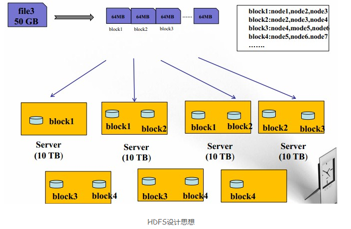

# Hadoop

## 简介

- 分布式存储系统HDFS
  - 提供了高可靠性，高扩展性和高吞吐率的数据存储服务
- 分布式计算框架MapReduce
  - 易于编程，高容错，高吞吐率
- 分布式资源管理框架YARN
  - 负责集群资源的管理和调度

## HDFS

优点：高容错性，适合批处理，适合处理大数据，可构建在廉价的机器上

缺点：低延迟数据访问，小文件存取，并发写入、文件随机修改

### 存储模型

1. HDFS系统中，文件线性按字节切割成块（Block），且每个块都有偏移量（offset）和id

   

2. 各文件block大小可以不一样，比如A的块大小为4KB，B的块大小为8KB，但是每个文件中，除了最后一个块大小可以与其余块不同，其余块大小必须相同

3. block块应根据硬件的I/O特性调整，在Hadoop 1.x版本时，block块大小默认为64MB，在Hadoop 2.x版本时，block块大小默认为128MB

4. 由于是分布式环境，所以block块被分散在集群的各个节点中，但是block具有location（也就是说每个block块会有一个属性记录当前block块的地址）

5. block块具有副本（replication），副本是满足可靠性和性能的关键，副本不能出现在同一节点（为了容灾考虑）上，副本之间没有主从概念，所有副本“地位”一致，比如block 1有3个副本，则说明整个集群中有3个block 1，  副本数不要超过节点数量

6. 文件上传时可以指定block块的大小和副本数，上传之后只能修改副本数，不能再更改block块的大小了

7. 文件是一次写入多次读取的，且不支持修改文件，相当于只读。不修改的原因很简单，因为这会造成block块大小不一致，offset不成规律。但是允许在文件后追加数据，因为这不会更改前面block块的大小，不影响offset

### 架构模型

1. HDFS是主从架构（Master/Slave）
2. 由一个Namenode（主）和一些Datanode（从）组成
3. Datanode 与 Namenode保持心跳，提交Block列表
4. 每个文件都包括：文件数据本身（data）和文件的元数据（metadata）
5. Namenode存储和管理metadata，也就是与文件数据无关的元数据，并维护了一个层次型的文件目录树
6. Datanode负责存储data，也就是文件数据本身，并提供block块的读写
7. 客户端（client）与Namenode交互文件元数据，与Datanode交互文件Block数据

​																				HDFS 架构图

#### NameNode

- 基于内存存储
  - 基于内存存储，不会和磁盘发生交换
- 主要功能
  - 接受客户端的读写服务
  - 收集DataNode汇报的Block信息
- NameNode保存metaData信息包括
  - 文件owership和permissions
  - 文件大小，时间
  - 文件包含哪些Block, Block列表（偏移量和位置信息）
  - Block副本保存在哪个DataNode（由DataNode启动时上报）
  - metadata存储到磁盘文件名为"fsimage"
  - Block的位置信息不会保存到fsimage(其是保存在内存中)
  - edits记录对medadata的操作日志

#### DataNode

- 存储数据(Block)
- 启动DN线程的时候会向NN汇报block信息
- 通过向NN发送心跳保持与其联系(3秒一次)，如果NN 10分钟没有收到DN的心跳，则认为其已经lost，并copy其上的block到其他 DN