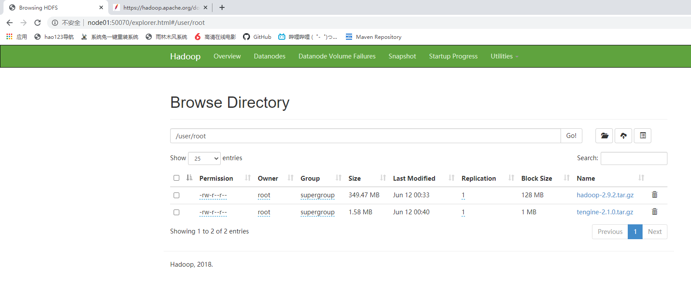

# Hadoop单机伪分布式搭建

## 操作系统环境信息准备

1. 检查hosts文件, node02映射正确

   ```shell
   [root@node01 stanlong]# cat /etc/hosts
   127.0.0.1   localhost localhost.localdomain localhost4 localhost4.localdomain4
   ::1         localhost localhost.localdomain localhost6 localhost6.localdomain6
   192.168.235.11 node01
   192.168.235.12 node02
   192.168.235.13 node03
   192.168.235.14 node04
   [root@node01 stanlong]# 
   ```

2. 检查hostname

   ```shell
   [root@node01 stanlong]# hostname
   node01
   [root@node01 stanlong]# cat /etc/sysconfig/network
   # Created by anaconda
   HOSTNAME=node01
   [root@node01 stanlong]# 
   ```

3. 安装jdk并配置环境变量（参考软件安装）
4. 配置单机免密钥登录（参考 02Linux基本命令/免密钥配置.md）

- Hadoop版本 hadoop-2.9.2

```shell
[root@node01 ~]# ll
total 564108
-rw-r--r-- 1 root root  11026056 Jun  9 11:57 apache-tomcat-9.0.30.tar.gz
-rw-r--r-- 1 root root 366447449 Jun 11 01:58 hadoop-2.9.2.tar.gz
```

- 解压

```shell
[root@node01 ~]# tar -zxf hadoop-2.9.2.tar.gz 
[root@node01 ~]# ll
total 564108
-rw-r--r-- 1 root root     11026056 Jun  9 11:57 apache-tomcat-9.0.30.tar.gz
drwxr-xr-x 9  501 dialout       149 Nov 13  2018 hadoop-2.9.2
```

- 将 hadoop-2.9.2 移动到 /opt/stanlong/ 目录下

```shell
[root@node01 ~]# mkdir -p /opt/stanlong
[root@node01 ~]# mv hadoop-2.9.2 /opt/stanlong/
[root@node01 ~]# cd /opt/stanlong/
[root@node01 stanlong]# ll
total 0
drwxr-xr-x 9 501 dialout 149 Nov 13  2018 hadoop-2.9.2
```

- 配置 hadoop环境变量

```shell
[root@node01 bin]# vi /etc/profile

在文件末尾添加HADOOP环境变量
export HADOOP_HOME=/opt/stanlong/hadoop-2.9.2
export PATH=$PATH:$JAVA_HOME/bin:$HADOOP_HOME/bin:$HADOOP_HOME/sbin

使环境变量生效
[root@node01 bin]# source /etc/profile
```

- java环境变量二次配置

```shell
[root@node01 hadoop]# pwd
/opt/stanlong/hadoop-2.9.2/etc/hadoop
[root@node01 hadoop]# ll
total 160
-rw-r--r-- 1 501 dialout  7861 Nov 13  2018 capacity-scheduler.xml
-rw-r--r-- 1 501 dialout  1335 Nov 13  2018 configuration.xsl
-rw-r--r-- 1 501 dialout  1211 Nov 13  2018 container-executor.cfg
-rw-r--r-- 1 501 dialout   774 Nov 13  2018 core-site.xml
-rw-r--r-- 1 501 dialout  4133 Nov 13  2018 hadoop-env.cmd
-rw-r--r-- 1 501 dialout  4969 Nov 13  2018 hadoop-env.sh
-rw-r--r-- 1 501 dialout  2598 Nov 13  2018 hadoop-metrics2.properties
-rw-r--r-- 1 501 dialout  2490 Nov 13  2018 hadoop-metrics.properties
-rw-r--r-- 1 501 dialout 10206 Nov 13  2018 hadoop-policy.xml
-rw-r--r-- 1 501 dialout   775 Nov 13  2018 hdfs-site.xml
-rw-r--r-- 1 501 dialout  2230 Nov 13  2018 httpfs-env.sh
-rw-r--r-- 1 501 dialout  1657 Nov 13  2018 httpfs-log4j.properties
-rw-r--r-- 1 501 dialout    21 Nov 13  2018 httpfs-signature.secret
-rw-r--r-- 1 501 dialout   620 Nov 13  2018 httpfs-site.xml
-rw-r--r-- 1 501 dialout  3518 Nov 13  2018 kms-acls.xml
-rw-r--r-- 1 501 dialout  3139 Nov 13  2018 kms-env.sh
-rw-r--r-- 1 501 dialout  1788 Nov 13  2018 kms-log4j.properties
-rw-r--r-- 1 501 dialout  5939 Nov 13  2018 kms-site.xml
-rw-r--r-- 1 501 dialout 14016 Nov 13  2018 log4j.properties
-rw-r--r-- 1 501 dialout  1076 Nov 13  2018 mapred-env.cmd
-rw-r--r-- 1 501 dialout  1507 Nov 13  2018 mapred-env.sh
-rw-r--r-- 1 501 dialout  4113 Nov 13  2018 mapred-queues.xml.template
-rw-r--r-- 1 501 dialout   758 Nov 13  2018 mapred-site.xml.template
-rw-r--r-- 1 501 dialout    10 Nov 13  2018 slaves
-rw-r--r-- 1 501 dialout  2316 Nov 13  2018 ssl-client.xml.example
-rw-r--r-- 1 501 dialout  2697 Nov 13  2018 ssl-server.xml.example
-rw-r--r-- 1 501 dialout  2250 Nov 13  2018 yarn-env.cmd
-rw-r--r-- 1 501 dialout  4876 Nov 13  2018 yarn-env.sh
-rw-r--r-- 1 501 dialout   690 Nov 13  2018 yarn-site.xml
[root@node01 hadoop]# vi hadoop-env.sh 
  24 # The java implementation to use.
  25 export JAVA_HOME=/usr/java/jdk1.8.0_65
[root@node01 hadoop]# vi mapred-env.sh 
  16 export JAVA_HOME=/usr/java/jdk1.8.0_65
[root@node01 hadoop]# vi yarn-env.sh
  23 export JAVA_HOME=/usr/java/jdk1.8.0_65
```

- 编辑 core-site.xml(namenode配置)

```shell
[root@node01 hadoop]# vi core-site.xml

<configuration>
    <property>
        <name>fs.defaultFS</name>
        <value>hdfs://node01:9000</value>
    </property>
</configuration>
```

- 配置namenode数据存放路径

```shell
[root@node01 hadoop]# vi core-site.xml
<configuration>
	<property>
        <name>hadoop.tmp.dir</name>
        <value>/var/data/hadoop/local</value> 目录必须为空
    </property>
<configuration>
```

- 编辑 hdfs-site.xml(namenode配置)

```shell
[root@node01 hadoop]# vi hdfs-site.xml
<configuration>
    <property>
        <name>dfs.replication</name>
        <value>1</value>
    </property>
</configuration>
```

- 编辑 slaves（datanode配置）

```shell
[root@node01 hadoop]# vi slaves

把 localhost改成 node01
```

- namenode格式化

```shell
[root@node01 hadoop]# hdfs namenode -format
当看到 20/06/11 12:19:14 INFO common.Storage: Storage directory /var/data/hadoop/local/dfs/name has been successfully formatted.
说明格式化成功
```

- 启动 dfs

```shell
[root@node01 current]# start-dfs.sh 
Starting namenodes on [node01]
node01: starting namenode, logging to /opt/stanlong/hadoop-2.9.2/logs/hadoop-root-namenode-node01.out
node01: starting datanode, logging to /opt/stanlong/hadoop-2.9.2/logs/hadoop-root-datanode-node01.out
Starting secondary namenodes [0.0.0.0]
0.0.0.0: starting secondarynamenode, logging to /opt/stanlong/hadoop-2.9.2/logs/hadoop-root-secondarynamenode-node01.out
```

- 停止dfs

```shell
[root@node01 current]# stop-dfs.sh 
Stopping namenodes on [node01]
node01: stopping namenode
node01: stopping datanode
Stopping secondary namenodes [0.0.0.0]
0.0.0.0: stopping secondarynamenode
```

- 查看进程

```shell
[root@node01 current]# jps
21520 Jps
21335 SecondaryNameNode
21162 DataNode
21067 NameNode
```

- 网页访问

http://node01:50070/dfshealth.html#tab-overview

-  dfs 文件操作命令

```shell
新建用户
[root@node01 current]# hdfs dfs -mkdir -p /user/root
上传文件
[root@node01 ~]# hdfs dfs -put hadoop-2.9.2.tar.gz  /user/root
指定上传文件的块大小
[root@node01 ~]# hdfs dfs -D dfs.blocksize=1048576 -put tengine-2.1.0.tar.gz
```

hdfs 相关参数配置地址

https://hadoop.apache.org/docs/stable/hadoop-project-dist/hadoop-hdfs/hdfs-default.xml



- 文件在hdfs上的存储路径

```shell
[root@node01 subdir0]# pwd
/var/data/hadoop/local/dfs/data/current/BP-2022337354-192.168.235.11-1591892354334/current/finalized/subdir0/subdir0
[root@node01 subdir0]# ll
total 362300
-rw-r--r-- 1 root root 134217728 Jun 11 12:33 blk_1073741825
-rw-r--r-- 1 root root   1048583 Jun 11 12:33 blk_1073741825_1001.meta
-rw-r--r-- 1 root root 134217728 Jun 11 12:33 blk_1073741826
-rw-r--r-- 1 root root   1048583 Jun 11 12:33 blk_1073741826_1002.meta
-rw-r--r-- 1 root root  98011993 Jun 11 12:33 blk_1073741827
-rw-r--r-- 1 root root    765727 Jun 11 12:33 blk_1073741827_1003.meta
-rw-r--r-- 1 root root   1048576 Jun 11 12:40 blk_1073741828
-rw-r--r-- 1 root root      8199 Jun 11 12:40 blk_1073741828_1004.meta
-rw-r--r-- 1 root root    604664 Jun 11 12:40 blk_1073741829
-rw-r--r-- 1 root root      4731 Jun 11 12:40 blk_1073741829_1005.meta
[root@node01 subdir0]# 
```

