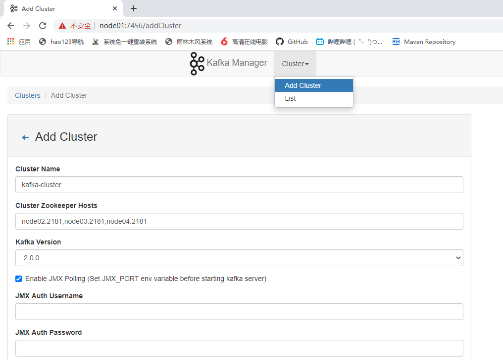
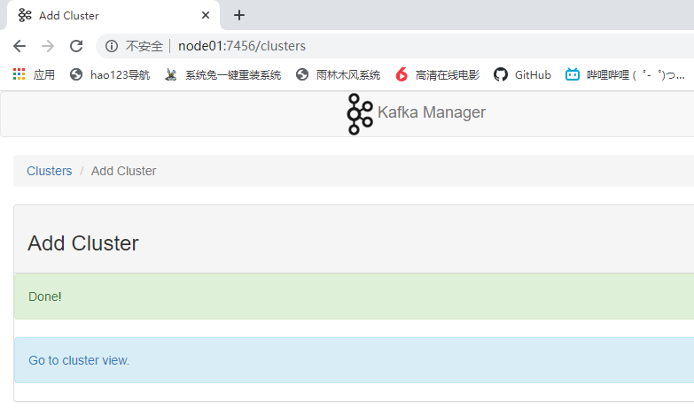
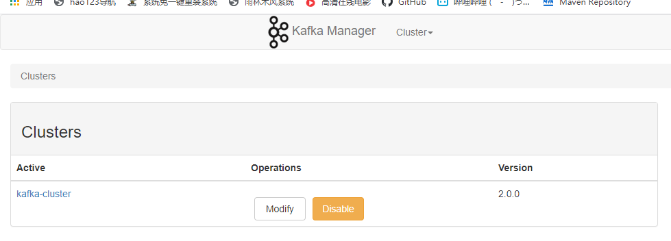

# Kafka

## 定义

在流式计算中，Kafka一般用来缓存数据，Storm通过消费Kafka的数据进行计算。

1）Apache Kafka是一个开源**消息队列**系统，由Scala写成。是由Apache软件基金会开发的一个开源消息系统项目。

2）Kafka是一个分布式消息队列。Kafka对消息保存时根据Topic进行归类，发送消息者称为Producer，消息接受者称为Consumer，此外kafka集群有多个kafka实例组成，每个实例(server)称为broker。

3）无论是kafka集群，还是consumer都依赖于**zookeeper**集群保存一些meta信息，来保证系统可用性。

## 架构


## 组件

**Producer** ：消息生产者，就是向 kafka broker 发消息的客户端；

**Consumer** ：消息消费者，向 kafka broker 取消息的客户端；

**Topic** ：可以理解为一个队列；

**Consumer Group （CG）**：这是kafka用来实现一个topic消息的广播（发给所有的consumer）
和单播（发给任意一个 consumer）的手段。一个 topic 可以有多个 CG。topic 的消息会复制
（不是真的复制，是概念上的）到所有的 CG，但每个 partion 只会把消息发给该 CG 中的一
个 consumer。如果需要实现广播，只要每个 consumer 有一个独立的 CG 就可以了。要实现
单播只要所有的 consumer 在同一个 CG。用 CG 还可以将 consumer 进行自由的分组而不需
要多次发送消息到不同的 topic；

**Broker** ：一台 kafka 服务器就是一个 broker。一个集群由多个 broker 组成。一个 broker
可以容纳多个 topic；

**Partition**：为了实现扩展性，一个非常大的 topic 可以分布到多个 broker（即服务器）上，
一个 topic 可以分为多个 partition，每个 partition 是一个有序的队列。partition 中的每条消息
都会被分配一个有序的 id（offset）。kafka 只保证按一个 partition 中的顺序将消息发给
consumer，不保证一个 topic 的整体（多个 partition 间）的顺序；

**Offset**：kafka 的存储文件都是按照 offset.kafka 来命名，用 offset 做名字的好处是方便查
找。例如你想找位于 2049 的位置，只要找到 2048.kafka 的文件即可。当然 the first offset 就
是 00000000000.kafka。

## 节点规划

| kafka_2.13-2.5.0 | node01 | node02 | node03 | node04 |
| ---------------- | ------ | ------ | ------ | ------ |
| kafka            | kafka  | kafka  | kafka  | kafka  |

## 安装

```shell
[root@node01 ~]# tar -zxf kafka_2.13-2.5.0.tgz -C /opt/stanlong/kafka/
[root@node01 kafka]# cd /opt/stanlong/kafka/
[root@node01 kafka]# mv kafka_2.13-2.5.0/ kafka
[root@node01 kafka]# ll
total 0
drwxr-xr-x 6 root root 89 Apr  8  2020 kafka
```

## 修改配置文件

```shell
[root@node01 config]# pwd
/opt/stanlong/kafka/kafka/config
[root@node01 config]# vi server.properties
```

```properties
# Licensed to the Apache Software Foundation (ASF) under one or more
# contributor license agreements.  See the NOTICE file distributed with
# this work for additional information regarding copyright ownership.
# The ASF licenses this file to You under the Apache License, Version 2.0
# (the "License"); you may not use this file except in compliance with
# the License.  You may obtain a copy of the License at
#
#    http://www.apache.org/licenses/LICENSE-2.0
#
# Unless required by applicable law or agreed to in writing, software
# distributed under the License is distributed on an "AS IS" BASIS,
# WITHOUT WARRANTIES OR CONDITIONS OF ANY KIND, either express or implied.
# See the License for the specific language governing permissions and
# limitations under the License.

# see kafka.server.KafkaConfig for additional details and defaults

############################# Server Basics #############################

# The id of the broker. This must be set to a unique integer for each broker.
# broker.id 是唯一的整数，集群里每台机器都不一样
broker.id=1 

############################# Socket Server Settings #############################


# The number of threads that the server uses for receiving requests from the network and sending responses to the network
num.network.threads=3

# The number of threads that the server uses for processing requests, which may include disk I/O
num.io.threads=8

# The send buffer (SO_SNDBUF) used by the socket server
socket.send.buffer.bytes=102400

# The receive buffer (SO_RCVBUF) used by the socket server
socket.receive.buffer.bytes=102400

# The maximum size of a request that the socket server will accept (protection against OOM)
socket.request.max.bytes=104857600


############################# Log Basics #############################

# A comma separated list of directories under which to store log files
# 定义日志目录
log.dirs=/var/data/kafka

# The default number of log partitions per topic. More partitions allow greater
# parallelism for consumption, but this will also result in more files across
# the brokers.
num.partitions=1

# The number of threads per data directory to be used for log recovery at startup and flushing at shutdown.
# This value is recommended to be increased for installations with data dirs located in RAID array.
num.recovery.threads.per.data.dir=1

############################# Internal Topic Settings  #############################
# The replication factor for the group metadata internal topics "__consumer_offsets" and "__transaction_state"
# For anything other than development testing, a value greater than 1 is recommended to ensure availability such as 3.
offsets.topic.replication.factor=1
transaction.state.log.replication.factor=1
transaction.state.log.min.isr=1

############################# Log Retention Policy #############################

# The following configurations control the disposal of log segments. The policy can
# be set to delete segments after a period of time, or after a given size has accumulated.
# A segment will be deleted whenever *either* of these criteria are met. Deletion always happens
# from the end of the log.

# The minimum age of a log file to be eligible for deletion due to age
log.retention.hours=168

# A size-based retention policy for logs. Segments are pruned from the log unless the remaining
# segments drop below log.retention.bytes. Functions independently of log.retention.hours.
#log.retention.bytes=1073741824

# The maximum size of a log segment file. When this size is reached a new log segment will be created.
log.segment.bytes=1073741824

# The interval at which log segments are checked to see if they can be deleted according
# to the retention policies
log.retention.check.interval.ms=300000

############################# Zookeeper #############################

# Zookeeper connection string (see zookeeper docs for details).
# This is a comma separated host:port pairs, each corresponding to a zk
# server. e.g. "127.0.0.1:3000,127.0.0.1:3001,127.0.0.1:3002".
# You can also append an optional chroot string to the urls to specify the
# root directory for all kafka znodes.
# 配置zookeeper地址
zookeeper.connect=node02:2181,node03:2181,node04:2181

# Timeout in ms for connecting to zookeeper
zookeeper.connection.timeout.ms=18000

############################# Group Coordinator Settings #############################

# The following configuration specifies the time, in milliseconds, that the GroupCoordinator will delay the initial consumer rebalance.
# The rebalance will be further delayed by the value of group.initial.rebalance.delay.ms as new members join the group, up to a maximum of max.poll.interval.ms.
# The default value for this is 3 seconds.
# We override this to 0 here as it makes for a better out-of-the-box experience for development and testing.
# However, in production environments the default value of 3 seconds is more suitable as this will help to avoid unnecessary, and potentially expensive, rebalances during application startup.
group.initial.rebalance.delay.ms=0
```

## 分发kafka

```shell
[root@node01 kafka]# pwd
/opt/stanlong/kafka
[root@node01 kafka]# ~/myshell/rsyncd.sh kafka/
```

## 配置其他节点

登录node02，node03，node04上去，改 server.properties 里broker.id的值分别为 2，3，4


## 启动kafka

```shell
kafka依赖zookeeper，需要先启动 zookeeper
[root@node01 config]# zk.sh start
[root@node01 kafka]# bin/kafka-server-start.sh -daemon config/server.properties 
[root@node01 kafka]# jps
9092 Jps
9054 Kafka
[root@node01 kafka]# 
```

## kafka 群启脚本

```shell
#!/bin/bash

case $1 in
"start"){
	for i in node01 node02 node03 node04
	do
		echo "***********$i***********"
		ssh $i "/opt/stanlong/kafka/bin/kafka-server-start.sh -daemon /opt/stanlong/kafka/config/server.properties"
	done
};;
"stop"){
	for i in node01 node02 node03 node04
	do
		echo "***********$i***********"
		ssh $i "/opt/stanlong/kafka/bin/kafka-server-stop.sh"
	done
};;
esac
```

## kafka 常用命令

- 创建topic

```shell
[root@node01 kafka]# bin/kafka-topics.sh --zookeeper node02:2181 --create --replication-factor 3 --partitions 1 --topic first-topic
Created topic first-topic.
```

- 查看当前服务器中的所有 topic

```shell
[root@node01 kafka]# bin/kafka-topics.sh --zookeeper node02:2181 --list
first
first-topic
[root@node01 kafka]# 
```

- 删除topic

```shell
[root@node01 kafka]# bin/kafka-topics.sh --zookeeper node02:2181 --delete --topic first
Topic first is marked for deletion.
Note: This will have no impact if delete.topic.enable is not set to true.
[root@node01 kafka]# 
```

需要 server.properties 中设置 delete.topic.enable=true 否则只是标记删除或者直接重启

- 查看某个 Topic 的详情

```shell
[root@node01 kafka]# bin/kafka-topics.sh --zookeeper node02:2181 --describe --topic first-topic
Topic: first-topic	PartitionCount: 1	ReplicationFactor: 3	Configs: 
	Topic: first-topic	Partition: 0	Leader: 2	Replicas: 2,1,3	Isr: 2,1,3
[root@node01 kafka]# 
```

- 生产者发送消息

```shell
[root@node01 kafka]# bin/kafka-console-producer.sh --broker-list node02:9092 --topic first-topic
>Hello
>
```

- 消费者消费消息

```shell
[root@node02 kafka]# bin/kafka-console-consumer.sh --bootstrap-server node02:9092 --topic first-topic
Hello
```

# kafka manager

## 安装kafka manager

```shell
[root@node01 ~]# unzip kafka-manager-1.3.3.22.zip 
[root@node01 ~]# mv kafka-manager-1.3.3.22 /opt/stanlong/
[root@node01 ~]# cd /opt/stanlong/
[root@node01 stanlong]# mv kafka-manager-1.3.3.22/ kafka-manager
```

## 配置 application.conf

```shell
[root@node01 conf]# pwd
/opt/stanlong/kafka-manager/conf
[root@node01 conf]# ll
total 24
-rw-r--r-- 1 root root 1600 Dec 22  2018 application.conf
-rw-r--r-- 1 root root  184 Dec 22  2018 consumer.properties
-rw-r--r-- 1 root root 2108 Dec 22  2018 logback.xml
-rw-r--r-- 1 root root 1367 Dec 22  2018 logger.xml
-rw-r--r-- 1 root root 7423 Dec 22  2018 routes
[root@node01 conf]# vi application.conf 
24 kafka-manager.zkhosts="node02:2181,node03:2181,node04:2181"
```

## 启动 kafkamanager

```shell
[root@node01 kafka-manager]# mkdir logs
[root@node01 kafka-manager]# nohup bin/kafka-manager -Dhttp.port=7456 >/opt/stanlong/kafka-manager/logs/start.log 2>&1 &
```



点保存之后看到的界面



点 clusters



## kafka manager 的使用

https://blog.csdn.net/u011089412/article/details/87895652

# kafka 压测

1. Kafka压测

   用Kafka官方自带的脚本，对Kafka进行压测。Kafka压测时，可以查看到哪个地方出现了瓶颈（CPU，内存，网络IO）。一般都是网络IO达到瓶颈。 

   kafka-consumer-perf-test.sh

   kafka-producer-perf-test.sh

2. Kafka Producer压力测试

   （1）在/opt/module/kafka/bin目录下面有这两个文件。我们来测试一下

   ```shell
   [root@node01 kafka]# bin/kafka-producer-perf-test.sh --topic test --record-size 100 --num-records 100000 --throughput 1000 --producer-props bootstrap.servers=node02:9092,node03:9092,node04:9092
   ```

   说明：record-size是一条信息有多大，单位是字节。num-records是总共发送多少条信息。throughput 是每秒多少条信息。

   （2）Kafka会打印下面的信息

   ```shell
   5000 records sent, 999.4 records/sec (0.10 MB/sec), 1.9 ms avg latency, 254.0 max latency.
   
   5002 records sent, 1000.4 records/sec (0.10 MB/sec), 0.7 ms avg latency, 12.0 max latency.
   
   5001 records sent, 1000.0 records/sec (0.10 MB/sec), 0.8 ms avg latency, 4.0 max latency.
   
   5000 records sent, 1000.0 records/sec (0.10 MB/sec), 0.7 ms avg latency, 3.0 max latency.
   
   5000 records sent, 1000.0 records/sec (0.10 MB/sec), 0.8 ms avg latency, 5.0 max latency.
   ```

   参数解析：本例中一共写入10w条消息，每秒向Kafka写入了0.10MB的数据，平均是1000条消息/秒，每次写入的平均延迟为0.8毫秒，最大的延迟为254毫秒。

   3）Kafka Consumer压力测试

   Consumer的测试，如果这四个指标（IO，CPU，内存，网络）都不能改变，考虑增加分区数来提升性能。

   ```shell
   [root@node01 kafka]# bin/kafka-consumer-perf-test.sh --bootstrap-server node02:9092 --topic test --fetch-size 10000 --messages 10000000 --threads 1
   ```

   参数说明：

   --zookeeper 指定zookeeper的链接信息

   --topic 指定topic的名称

   --fetch-size 指定每次fetch的数据的大小

   --messages 总共要消费的消息个数

   测试结果说明：

   ```shell
   start.time, end.time, data.consumed.in.MB, MB.sec, data.consumed.in.nMsg, nMsg.sec
   
   2019-02-19 20:29:07:566, 2019-02-19 20:29:12:170, 9.5368, 2.0714, 100010, 21722.4153
   ```

   开始测试时间，测试结束数据，最大吞吐率9.5368MB/s，平均每秒消费2.0714MB/s，最大每秒消费100010条，平均每秒消费21722.4153条。

# Kafka机器数量计算

Kafka机器数量（经验公式）=2*（峰值生产速度*副本数/100）+1

先要预估一天大概产生多少数据，然后用Kafka自带的生产压测（只测试Kafka的写入速度，保证数据不积压），计算出峰值生产速度。再根据设定的副本数，就能预估出需要部署Kafka的数量。

比如我们采用压力测试测出写入的速度是10M/s一台，峰值的业务数据的速度是50M/s。副本数为2。

Kafka机器数量=2*（50*2/100）+ 1=3台