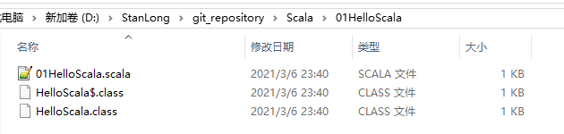

# Spark

## 定义

Spark 是一种基于内存的快速、通用、可扩展的大数据分析计算引擎

- Spark 是一种由 Scala 语言开发的快速、通用、可扩展的大数据分析引擎

- Spark Core 中提供了 Spark 最基础与最核心的功能

- Spark SQL 是Spark 用来操作结构化数据的组件。通过 Spark SQL，用户可以使用SQL 或者 Apache Hive 版本的 SQL 方言（HQL）来查询数据。

- Spark Streaming 是 Spark 平台上针对实时数据进行流式计算的组件，提供了丰富的处理数据流的API

## 核心模块


**Spark Core**

Spark Core 中提供了 Spark 最基础与最核心的功能，Spark 其他的功能如：Spark SQL， Spark Streaming，GraphX, MLlib 都是在 Spark Core 的基础上进行扩展的

**Spark SQL**

Spark SQL 是Spark 用来操作结构化数据的组件。通过 Spark SQL，用户可以使用 SQL或者Apache Hive 版本的 SQL 方言（HQL）来查询数据。

**Spark Streaming**

Spark Streaming 是 Spark 平台上针对实时数据进行流式计算的组件，提供了丰富的处理数据流的API。

**Spark MLlib**

MLlib 是 Spark 提供的一个机器学习算法库。MLlib 不仅提供了模型评估、数据导入等额外的功能，还提供了一些更底层的机器学习原语。

**Spark GraphX**

GraphX 是 Spark 面向图计算提供的框架与算法库。

## 上手实例


# spark 安装

```shell
[root@node01 ~]# tar zxf spark-3.0.0-bin-hadoop2.7.tgz
[root@node01 ~]# mv spark-3.0.0-bin-hadoop2.7 /opt/stanlong/
[root@node01 ~]# cd /opt/stanlong/
[root@node01 stanlong]# mv spark-3.0.0-bin-hadoop2.7/ spark
[root@node01 stanlong]# ll
total 4
drwxr-xr-x  9 root root   210 Jun 20 11:12 flume
drwxr-xr-x 10 root root   161 Jun 11 10:27 hadoop-2.9.2
drwxr-xr-x 10 root root   161 Jun 11 10:13 hadoop-2.9.2-full
drwxr-xr-x  8 root root   172 Jun 14 11:28 hbase
drwxr-xr-x 10 root root   245 Jun 28 11:04 hive
drwxr-xr-x  7 root root   101 Jun 22 01:17 kafka
drwxr-xr-x  8 root root   119 Jun 29 03:44 kafka-manager
drwxr-xr-x 13 1000  1000  211 Jun  6 08:09 spark
drwxr-xr-x  5  502 games 4096 Mar 19  2019 tez-0.9.2
[root@node01 stanlong]# 
```

## 配置spark环境变量

```sql
[root@node01 spark]# vi /etc/profile

 81 export SPARK_HOME=/opt/stanlong/spark
     82 export PATH=$PATH:$JAVA_HOME/bin:$HADOOP_HOME/bin:$HADOOP_HOME/sbin:$HIVE_HOME/bin:$HBASE_HOME/bin:$SPARK_HOME/bin:$SPARK_HOME/sbin

[root@node01 spark]# source /etc/profile
```

# 官方求PI案例

```sql
spark-submit \
--class org.apache.spark.examples.SparkPi \
--executor-memory 1G \
--total-executor-cores 2 \
/opt/stanlong/spark/examples/jars/spark-examples_2.12-3.0.0.jar \
100
```

执行结果


- 语法介绍

```
（1）基本语法
bin/spark-submit \
--class <main-class>
--master <master-url> \
--deploy-mode <deploy-mode> \
--conf <key>=<value> \
... # other options
<application-jar> \
[application-arguments]
（2）参数说明：
--master 指定 Master 的地址，默认为 Local
--class: 你的应用的启动类 (如 org.apache.spark.examples.SparkPi)
--deploy-mode: 是否发布你的驱动到 worker 节点(cluster) 或者作为一个本地客户端
(client) (default: client)*
--conf: 任意的 Spark 配置属性， 格式 key=value. 如果值包含空格，可以加引号
“key=value”
application-jar: 打包好的应用 jar,包含依赖. 这个 URL 在集群中全局可见。 比如
hdfs:// 共享存储系统， 如果是 file:// path， 那么所有的节点的 path 都包含同样的 jar
application-arguments: 传给 main()方法的参数
--executor-memory 1G 指定每个 executor 可用内存为 1G
--total-executor-cores 2 指定每个 executor 使用的 cup 核数为 2 个
```

# wordcount 案例

1. 准备文件

```shell
[root@node01 ~]# mkdir input
[root@node01 ~]# cd input
[root@node01 input]# vi 1.txt
[root@node01 input]# vi 2.txt
[root@node01 input]# cat 1.txt
Hello World
Hello spark
[root@node01 input]# cat 2.txt
Hello StanLong
```

2.  启动spark-shell

```shell
[root@node01 input]# spark-shell
To adjust logging level use sc.setLogLevel(newLevel). For SparkR, use setLogLevel(newLevel).
Spark context Web UI available at http://node01:4040
Spark context available as 'sc' (master = local[*], app id = local-1593593683764).
Spark session available as 'spark'.
Welcome to
      ____              __
     / __/__  ___ _____/ /__
    _\ \/ _ \/ _ `/ __/  '_/
   /___/ .__/\_,_/_/ /_/\_\   version 3.0.0
      /_/
         
Using Scala version 2.12.10 (Java HotSpot(TM) 64-Bit Server VM, Java 1.8.0_65)
Type in expressions to have them evaluated.
Type :help for more information.

scala> 
```

spark web页面访问地址



3. 运行wordcount程序

```shell
scala> sc.textFile("/root/input").flatMap(_.split(" ")).map((_,1)).reduceByKey(_+_).collect
res8: Array[(String, Int)] = Array((Hello,3), (World,1), (StanLong,1), (spark,1))
```


