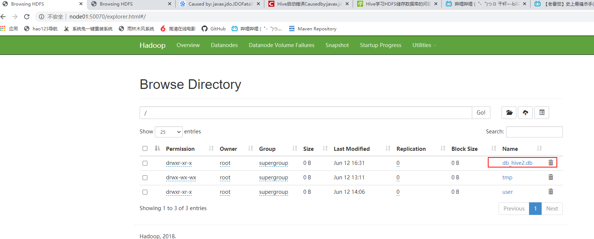

# Hive

本质是：将HQL转化成MapReduce程序

1）Hive处理的数据存储在HDFS

2）Hive分析数据底层的实现是MapReduce

3）执行程序运行在Yarn上


# Hive安装部署

**1.Hive安装及配置**

- 把apache-hive-1.2.2-bin.tar.gz上传到node01上，并解压并移动到 /opt/stanlong目录下

```shell
[root@node01 ~]# tar -zxf apache-hive-1.2.2-bin.tar.gz
[root@node01 ~]# ll
total 652868
drwxr-xr-x 8 root root       159 Jun 12 00:44 apache-hive-1.2.2-bin
-rw-r--r-- 1 root root  90859180 Jun 11 23:21 apache-hive-1.2.2-bin.tar.gz
-rw-r--r-- 1 root root  11026056 Jun  9 11:57 apache-tomcat-9.0.30.tar.gz
-rw-r--r-- 1 root root 366447449 Jun 11 01:58 hadoop-2.9.2.tar.gz
-rw-r--r-- 1 root root 160102255 Jun  9 11:57 jdk-8u65-linux-x64.rpm
-rw-r--r-- 1 root root     25680 Jul 26  2019 mysql57-community-release-el7-11.noarch.rpm
-rw-r--r-- 1 root root   1738465 Jun  9 11:57 redis-4.0.10.tar.gz
-rw-r--r-- 1 root root   1653240 Jun  9 11:57 tengine-2.1.0.tar.gz
-rw-r--r-- 1 root root  36668066 Jun  9 11:57 zookeeper-3.4.11.tar.gz
[root@node01 ~]# mv apache-hive-1.2.2-bin /opt/stanlong/

将 apache-hive-1.2.2-bin 重命名为hive
[root@node01 stanlong]# cd /opt/stanlong/
[root@node01 stanlong]# mv apache-hive-1.2.2-bin/ hive
[root@node01 stanlong]# ll
total 0
drwxr-xr-x 10 root root 161 Jun 11 10:27 hadoop-2.9.2
drwxr-xr-x 10 root root 161 Jun 11 10:13 hadoop-2.9.2-full
drwxr-xr-x  8 root root 159 Jun 12 00:44 hive
[root@node01 stanlong]# 
```

- 配置hive-env.sh

```
[root@node01 stanlong]# cd hive/conf/
[root@node01 conf]# cp hive-env.sh.template hive-env.sh
[root@node01 conf]# vi hive-env.sh
```

```shell
47 # Set HADOOP_HOME to point to a specific hadoop install directory
48 export HADOOP_HOME=/opt/stanlong/hadoop-2.9.2
49 
50 # Hive Configuration Directory can be controlled by:
51 export HIVE_CONF_DIR=/opt/stanlong/hive/conf
```

**2.Hadoop集群配置**

- 启动hdfs和yran

```shell
[root@node01 hive]# start-dfs.sh 
[root@node01 hive]# start-yarn.sh
```

- 在HDFS上创建/tmp和/user/hive/warehouse两个目录并修改他们的同组权限可写

```shell
[root@node01 hive]# hdfs dfs -mkdir /tmp
[root@node01 hive]# hdfs dfs -mkdir -p /user/hive/warehouse
[root@node01 hive]# hdfs dfs -chmod g+w /tmp
[root@node01 hive]# hdfs dfs -chmod g+w /user/hive/warehouse
```

**3.Hive基本操作**

- 启动hive

```sql
[root@node01 hive]# pwd
/opt/stanlong/hive
[root@node01 hive]# bin/hive

Logging initialized using configuration in jar:file:/opt/stanlong/hive/lib/hive-common-1.2.2.jar!/hive-log4j.properties
hive> 
```

- 退出hive

```sql
hive> quit;
[root@node01 hive]#
```

## 将本地文件导入hive案例

将本地/root/student.txt这个目录下的数据导入到hive的student(id int, name string)表中

- 数据准备

```shell
[root@node01 ~]# vi student.txt
1001	zhangshan
1002	lishi
1003	zhaoliu
```

注意以tab键间隔

- hive实际操作

  - 创建student表, 并声明文件分隔符’\t’

  ```shell
  hive> create table student(id int, name string) ROW FORMAT DELIMITED FIELDS TERMINATED
      >  BY '\t';
  OK
  Time taken: 3.487 seconds
  ```

  - 加载/root/student.txt文件到student数据库表中

  ```shell
  hive> load data local inpath '/root/student.txt' into table student;
  Loading data to table default.student
  Table default.student stats: [numFiles=1, totalSize=39]
  OK
  Time taken: 2.733 seconds
  hive> 
  ```

  - Hive查询结果

  ```sql
  hive> select * from student;
  OK
  1001	zhangshan
  1002	lishi
  1003	zhaoliu
  Time taken: 0.788 seconds, Fetched: 3 row(s)
  hive> 
  ```

## mysql安装（参考 MySql_DBA/安装mysql.docx）

安装完数据库之后需要修改下user表

```sql
mysql>update user set host='%' where host='localhost';
```


## hive元数据配置到mysql

- 拷贝mysql连接驱动到 hive/lib目录下

```shell
[root@node01 ~]# cp mysql-connector-java-5.1.37.jar /opt/stanlong/hive/lib/
```

- 配置Metastore到MySql

  - 在 /hive/conf目录下创建一个hive-site.xml

  ```shell
  [root@node01 conf]# pwd
  /opt/stanlong/hive/conf
  [root@node01 conf]# touch hive-site.xml
  ```

  - 配置 hive-site.xml文件中

  官方文档地址 https://cwiki.apache.org/confluence/display/Hive/AdminManual+MetastoreAdmin

  ```xml
  <?xml version="1.0" encoding="UTF-8" standalone="no"?>
  <?xml-stylesheet type="text/xsl" href="configuration.xsl"?>
  <configuration>
  
  	<!-- 配置hive文件在hdfs上的保存路径 -->
      <property>
          <name>hive.metastore.warehouse.dir</name>  
          <value>/user/hivedb/warehouse</value>
      </property>
      <property>
          <name>hive.metastore.local</name>
          <!-- 单用户模式下值为 false -->
          <value>false</value>
      </property>
      <property>
          <!-- 元数据库的链接地址 mysql -->
          <name>javax.jdo.option.ConnectionURL</name>  
          <value>jdbc:mysql://192.168.235.11:3306/hivedb?createDatabaseIfNotExist=true</value>
      </property>
      <property>
          <!-- 指定mysql驱动 -->
          <name>javax.jdo.option.ConnectionDriverName</name>
          <value>com.mysql.jdbc.Driver</value>
      </property>
      <property>
          <!-- 指定mysql用户名 -->
          <name>javax.jdo.option.ConnectionUserName</name>
          <value>root</value>
      </property>
      <property>
          <name>javax.jdo.option.ConnectionPassword</name>
          <value>root</value>
      </property>
  	
  	<!-- 表头信息配置 -->
  	<property>
  		<name>hive.cli.print.header</name>
  		<value>true</value>
  	</property>
  
  	<!-- 显示当前数据库 -->
  	<property>
  		<name>hive.cli.print.current.db</name>
  		<value>true</value>
  	</property>
  
  </configuration>
  ```

  - 配置好之后重启hive会发现mysql目录下多了一个 hivedb的数据库

  ```shell
  mysql> show databases;
  +--------------------+
  | Database           |
  +--------------------+
  | information_schema |
  | hivedb             |
  | mysql              |
  | performance_schema |
  | sys                |
  +--------------------+
  5 rows in set (0.00 sec)
  ```

## Hive JDBC 访问

- 启动hiveserver2, 这是一个阻塞进程

```shell
[root@node01 conf]# hiveserver2
20/06/12 03:26:42 WARN conf.HiveConf: HiveConf of name hive.metastore.local does not exist
```

- 新起一个窗口，启动beeline

```shell
[root@node01 ~]# beeline
Beeline version 1.2.2 by Apache Hive
beeline> 
```

- 连接hiveserver2

```shell
beeline> !connect jdbc:hive2://node01:10000
Connecting to jdbc:hive2://node01:10000
Enter username for jdbc:hive2://node01:10000: root
Enter password for jdbc:hive2://node01:10000: ****
Connected to: Apache Hive (version 1.2.2)
Driver: Hive JDBC (version 1.2.2)
Transaction isolation: TRANSACTION_REPEATABLE_READ
0: jdbc:hive2://node01:10000> 
```

## Hive常用交互命令

```shell
[root@node01 ~]# hive -help
20/06/12 03:36:03 WARN conf.HiveConf: HiveConf of name hive.metastore.local does not exist
usage: hive
 -d,--define <key=value>          Variable subsitution to apply to hive
                                  commands. e.g. -d A=B or --define A=B
    --database <databasename>     Specify the database to use
 -e <quoted-query-string>         SQL from command line
 -f <filename>                    SQL from files
 -H,--help                        Print help information
    --hiveconf <property=value>   Use value for given property
    --hivevar <key=value>         Variable subsitution to apply to hive
                                  commands. e.g. --hivevar A=B
 -i <filename>                    Initialization SQL file
 -S,--silent                      Silent mode in interactive shell
 -v,--verbose                     Verbose mode (echo executed SQL to the
                                  console)
[root@node01 ~]# 
```

- -e 不进入hive的交互窗口执行sql语句

```shell
[root@node01 ~]# hive -e "select * from student";
20/06/12 03:39:41 WARN conf.HiveConf: HiveConf of name hive.metastore.local does not exist

Logging initialized using configuration in jar:file:/opt/stanlong/hive/lib/hive-common-1.2.2.jar!/hive-log4j.properties
OK
student.id	student.name
1001	zhangshan
1002	lishi
1003	zhaoliu
Time taken: 6.374 seconds, Fetched: 3 row(s)
```

- -f 执行脚本中sql语句

  - 创建hivef.sql文件

  ```shell
  [root@node01 ~]# touch hivef.sql
  ```

  - 在文件中写入正确的Sql语句

  ```shell
  [root@node01 ~]# vi hivef.sql
  select *from student;
  ```

  - 执行文件中的sql语句

  ```shell
  [root@node01 ~]# hive -f hivef.sql 
  20/06/12 03:42:23 WARN conf.HiveConf: HiveConf of name hive.metastore.local does not exist
  
  Logging initialized using configuration in jar:file:/opt/stanlong/hive/lib/hive-common-1.2.2.jar!/hive-log4j.properties
  OK
  student.id	student.name
  1001	zhangshan
  1002	lishi
  1003	zhaoliu
  Time taken: 4.916 seconds, Fetched: 3 row(s)
  ```

# Hive其他操作命令

- 在hive cli命令窗口中如何查看hdfs文件系统， 在beeline也可以查看

```shell
0: jdbc:hive2://node01:10000> dfs -ls /;
+-------------------------------------------------------------------+--+
|                            DFS Output                             |
+-------------------------------------------------------------------+--+
| Found 2 items                                                     |
| drwx-wx-wx   - root supergroup          0 2020-06-12 01:11 /tmp   |
| drwxr-xr-x   - root supergroup          0 2020-06-12 02:06 /user  |
+-------------------------------------------------------------------+--+
3 rows selected (0.269 seconds)
```

- 在hive cli命令窗口中如何查看本地文件系统

```shell
hive (default)> ! ls /opt/stanlong;
hadoop-2.9.2
hadoop-2.9.2-full
hive
hive (default)> 
```

## Hive常见属性配置

- Hive数据仓库位置配置， 修改hive-site.xml文件

```xml
<!-- 配置hive文件在hdfs上的保存路径 -->
<property>
	<name>hive.metastore.warehouse.dir</name>
	<value>/user/hivedb/warehouse</value>
</property>
```

配置同组用户有执行权限

```shell
[root@node01 ~]# hdfs dfs -chmod g+w /user/hive/warehouse
```

## Hive运行日志信息配置

- Hive的log默认存放在/tmp/root/hive.log目录下

```shell
[root@node01 conf]# cd /tmp/root/
[root@node01 root]# ll
total 1988
drwx------ 2 root root       6 Jun 12 03:26 4d156c34-1b5e-4a12-8d1a-6e748d9d42e4
-rw-r--r-- 1 root root       0 Jun 12 03:26 4d156c34-1b5e-4a12-8d1a-6e748d9d42e47941722375069889495.pipeout
drwx------ 2 root root       6 Jun 12 03:48 73682e93-575e-4949-bea0-e096dcaeaa85
-rw-r--r-- 1 root root       0 Jun 12 03:48 73682e93-575e-4949-bea0-e096dcaeaa85100815794926489045.pipeout
-rw-r--r-- 1 root root 2031794 Jun 12 03:50 hive.log
drwxr-xr-x 2 root root       6 Jun 12 03:50 operation_logs
[root@node01 root]# 
```

- 修改hive的log存放日志到/opt/stanlong/hive/logs

  - 修改/opt/stanlong/hive/conf/hive-log4j.properties.template文件名称为

    hive-log4j.properties

    ```shell
    [root@node01 conf]# cp hive-log4j.properties.template hive-log4j.properties
    ```

  - 在hive-log4j.properties文件中修改log存放位置

    ```shell
    [root@node01 conf]# vi hive-log4j.properties
    20 hive.log.dir=/opt/stanlong/hive/logs
    ```

## 参数配置方式

- 查看当前所有的配置信息

```shell
hive (default)> set;
```

- 参数的配置三种方式

  - 配置文件方式

  ```
  默认配置文件：hive-default.xml 
  用户自定义配置文件：hive-site.xml
  	注意：用户自定义配置会覆盖默认配置。另外，Hive也会读入Hadoop的配置，因为Hive是作为Hadoop的客户端启动的，Hive的配置会覆盖Hadoop的配置。配置文件的设定对本机启动的所有Hive进程都有效。
  ```

  - 命令行参数方式

  ```
  启动Hive时，可以在命令行添加-hiveconf param=value来设定参数
  例如: [root@node01 conf]# hive -hiveconf mapred.reduce.tasks=10;
  注意：仅对本次hive启动有效
  查看参数设置: hive (default)> set mapred.reduce.tasks;
  ```

  - 参数声明方式

  ```
  可以在HQL中使用SET关键字设定参数
  例如：hive (default)> set mapred.reduce.tasks=100;
  注意：仅对本次hive启动有效。
  查看参数设置
  hive (default)> set mapred.reduce.tasks;
  ```

  上述三种设定方式的优先级依次递增。即配置文件<命令行参数<参数声明。注意某些系统级的参数，例如log4j相关的设定，必须用前两种方式设定，因为那些参数的读取在会话建立以前已经完成了

# Hive数据类型

- 基本数据类型

| Hive数据类型 | Java数据类型 | 长度                                                 | 例子                                  |
| ------------ | ------------ | ---------------------------------------------------- | ------------------------------------- |
| TINYINT      | byte         | 1byte有符号整数                                      | 20                                    |
| SMALINT      | short        | 2byte有符号整数                                      | 20                                    |
| INT          | int          | 4byte有符号整数                                      | 20                                    |
| BIGINT       | long         | 8byte有符号整数                                      | 20                                    |
| BOOLEAN      | boolean      | 布尔类型，true或者false                              | TRUE FALSE                            |
| FLOAT        | float        | 单精度浮点数                                         | 3.14159                               |
| DOUBLE       | double       | 双精度浮点数                                         | 3.14159                               |
| STRING       | string       | 字符系列。可以指定字符集。可以使用单引号或者双引号。 | 'now is the time'  "for all good men" |
| TIMESTAMP    |              | 时间类型                                             |                                       |
| BINARY       |              | 字节数组                                             |                                       |

对于Hive的String类型相当于数据库的varchar类型，该类型是一个可变的字符串，不过它不能声明其中最多能存储多少个字符，理论上它可以存储2GB的字符数

- 集合数据类型

| 数据类型 | 描述                                                         | 语法示例 |
| -------- | ------------------------------------------------------------ | -------- |
| STRUCT   | 和c语言中的struct类似，都可以通过“点”符号访问元素内容。例如，如果某个列的数据类型是STRUCT{first STRING, last STRING},那么第1个元素可以通过字段.first来引用。 | struct() |
| MAP      | MAP是一组键-值对元组集合，使用数组表示法可以访问数据。例如，如果某个列的数据类型是MAP，其中键->值对是’first’->’John’和’last’->’Doe’，那么可以通过字段名[‘last’]获取最后一个元素 | map()    |
| ARRAY    | 数组是一组具有相同类型和名称的变量的集合。这些变量称为数组的元素，每个数组元素都有一个编号，编号从零开始。例如，数组值为[‘John’, ‘Doe’]，那么第2个元素可以通过数组名[1]进行引用。 | Array()  |

Hive有三种复杂数据类型ARRAY、MAP 和 STRUCT。ARRAY和MAP与Java中的Array和Map类似，而STRUCT与C语言中的Struct类似，它封装了一个命名字段集合，复杂数据类型允许任意层次的嵌套。

-   案例实操

1） 假设某表有如下一行，我们用JSON格式来表示其数据结构。在Hive下访问的格式为

  ```json
{
    "name": "songsong",
    "friends": ["bingbing" , "lili"] ,       //列表Array, 
    "children": {                      //键值Map,
        "xiao song": 18 ,
        "xiaoxiao song": 19
    }
    "address": {                      //结构Struct,
        "street": "hui long guan" ,
        "city": "beijing" 
    }
}
  ```

2）基于上述数据结构，我们在Hive里创建对应的表，并导入数据

-   创建本地测试文件test.txt


  ```shell
[root@node01 conf]# vi test.txt
songsong,bingbing_lili,xiao song:18_xiaoxiao song:19,hui long guan_beijing
yangyang,caicai_susu,xiao yang:18_xiaoxiao yang:19,chao yang_beijing
  ```

注意：MAP，STRUCT和ARRAY里的元素间关系都可以用同一个字符表示，这里用“_”

3）Hive上创建测试表test

```sql
create table test(
name string,
friends array<string>,
children map<string, int>,
address struct<street:string, city:string>
)
row format delimited fields terminated by ','
collection items terminated by '_'
map keys terminated by ':'
lines terminated by '\n';
```

字段解释：

row format delimited fields terminated by ',' -- 列分隔符

collection items terminated by '_'    --MAP STRUCT 和 ARRAY 的分隔符(数据分割符号)

map keys terminated by ':'             -- MAP中的key与value的分隔符

lines terminated by '\n';               -- 行分隔符

4）导入文本数据到测试表

```shell
0: jdbc:hive2://node01:10000> load data local inpath '/root/test.txt' into table test;
INFO  : Loading data to table default.test from file:/root/test.txt
INFO  : Table default.test stats: [numFiles=1, totalSize=145]
No rows affected (1.165 seconds)
0: jdbc:hive2://node01:10000> 
```

5）访问三种集合列里的数据，以下分别是ARRAY，MAP，STRUCT的访问方式

```sql
0: jdbc:hive2://node01:10000> select friends[1],children['xiao song'],address.city from test
0: jdbc:hive2://node01:10000> where name="songsong";
+-------+------+----------+--+
|  _c0  | _c1  |   city   |
+-------+------+----------+--+
| lili  | 18   | beijing  |
+-------+------+----------+--+
1 row selected (1.118 seconds)
0: jdbc:hive2://node01:10000> 
```

## 类型转化

Hive的原子数据类型是可以进行隐式转换的，类似于Java的类型转换，例如某表达式使用INT类型，TINYINT会自动转换为INT类型，但是Hive不会进行反向转化，例如，某表达式使用TINYINT类型，INT不会自动转换为TINYINT类型，它会返回错误，除非使用CAST操作。

1．隐式类型转换规则如下

（1）任何整数类型都可以隐式地转换为一个范围更广的类型，如TINYINT可以转换成INT，INT可以转换成BIGINT。

（2）所有整数类型、FLOAT和STRING类型都可以隐式地转换成DOUBLE。

（3）TINYINT、SMALLINT、INT都可以转换为FLOAT。

（4）BOOLEAN类型不可以转换为任何其它的类型。

2．可以使用CAST操作显示进行数据类型转换

例如CAST('1' AS INT)将把字符串'1' 转换成整数1；如果强制类型转换失败，如执行CAST('X' AS INT)，表达式返回空值 NULL

# DDL数据定义

- 创建数据库

```shell
0: jdbc:hive2://node01:10000> create database if not exists db_hive;
```

- 创建一个数据库，指定数据库在HDFS上存放的位置

```sql
0: jdbc:hive2://node01:10000> create database db_hive2 location '/db_hive2.db';
```



  

-   修改数据库

  使用ALTER DATABASE命令为某个数据库的DBPROPERTIES设置键-值对属性值，来描述这个数据库的属性信息。数据库的其他元数据信息都是不可更改的，包括数据库名和数据库所在的目录位置

```shell
0: jdbc:hive2://node01:10000> alter database db_hive set dbproperties('createtime'='20170830');
No rows affected (0.162 seconds)
```

在hive中查看修改结果

```
0: jdbc:hive2://node01:10000> desc database extended db_hive;
+----------+----------+----------------------------------------------------+-------------+-------------+------------------------+--+
| db_name  | comment  |                      location                      | owner_name  | owner_type  |       parameters       |
+----------+----------+----------------------------------------------------+-------------+-------------+------------------------+--+
| db_hive  |          | hdfs://mycluster/user/hivedb/warehouse/db_hive.db  | root        | USER        | {createtime=20170830}  |
+----------+----------+----------------------------------------------------+-------------+-------------+------------------------+--+
1 row selected (0.13 seconds)
0: jdbc:hive2://node01:10000> 

```

- 删除数据库

如果数据库不为空，可以采用cascade命令，强制删除

```shell
0: jdbc:hive2://node01:10000> drop database db_hive cascade;
No rows affected (0.507 seconds)
```

## 创建表

### 管理表

默认创建的表都是所谓的管理表，有时也被称为内部表。因为这种表，Hive会（或多或少地）控制着数据的生命周期。Hive默认情况下会将这些表的数据存储在由配置项hive.metastore.warehouse.dir(例如，/user/hive/warehouse)所定义的目录的子目录下。  当我们删除一个管理表时，Hive也会删除这个表中数据。管理表不适合和其他工具共享数据

- 建表语法

```sql
CREATE [EXTERNAL] TABLE [IF NOT EXISTS] table_name 
[(col_name data_type [COMMENT col_comment], ...)] 
[COMMENT table_comment] 
[PARTITIONED BY (col_name data_type [COMMENT col_comment], ...)] 
[CLUSTERED BY (col_name, col_name, ...) 
[SORTED BY (col_name [ASC|DESC], ...)] INTO num_buckets BUCKETS] 
[ROW FORMAT row_format] 
[STORED AS file_format] 
[LOCATION hdfs_path]
```

- 字段解释说明

（1）CREATE TABLE 创建一个指定名字的表。如果相同名字的表已经存在，则抛出异常；用户可以用 IF NOT EXISTS 选项来忽略这个异常。

（2）EXTERNAL关键字可以让用户创建一个外部表，在建表的同时指定一个指向实际数据的路径（LOCATION），Hive创建内部表时，会将数据移动到数据仓库指向的路径；若创建外部表，仅记录数据所在的路径，不对数据的位置做任何改变。在删除表的时候，内部表的元数据和数据会被一起删除，而外部表只删除元数据，不删除数据。

（3）COMMENT：为表和列添加注释。

（4）PARTITIONED BY创建分区表

（5）CLUSTERED BY创建分桶表

（6）SORTED BY不常用

（7）ROW FORMAT 

DELIMITED [FIELDS TERMINATED BY char] [COLLECTION ITEMS TERMINATED BY char]

​    [MAP KEYS TERMINATED BY char] [LINES TERMINATED BY char] 

  | SERDE serde_name [WITH SERDEPROPERTIES (property_name=property_value, property_name=property_value, ...)]

用户在建表的时候可以自定义SerDe或者使用自带的SerDe。如果没有指定ROW FORMAT 或者ROW FORMAT DELIMITED，将会使用自带的SerDe。在建表的时候，用户还需要为表指定列，用户在指定表的列的同时也会指定自定义的SerDe，Hive通过SerDe确定表的具体的列的数据。

SerDe是Serialize/Deserilize的简称，目的是用于序列化和反序列化。

（8）STORED AS指定存储文件类型

常用的存储文件类型：SEQUENCEFILE（二进制序列文件）、TEXTFILE（文本）、RCFILE（列式存储格式文件）

如果文件数据是纯文本，可以使用STORED AS TEXTFILE。如果数据需要压缩，使用 STORED AS SEQUENCEFILE。

（9）LOCATION ：指定表在HDFS上的存储位置。

（10）LIKE允许用户复制现有的表结构，但是不复制数据。

- 案例实操

  - 普通创建表

  ```sql
  create table if not exists student2(
  id int, name string
  )
  row format delimited fields terminated by '\t'
  stored as textfile
  location '/user/hive/warehouse/student2';
  ```

  - 根据查询结果创建表（查询的结果会添加到新创建的表中）

  ```sql
  create table if not exists student3 as select id, name from student;
  ```

  - 根据已经存在的表结构创建表

  ```sql
  create table if not exists student4 like student;
  ```

  - 查询表的类型

  ```sql
  hive (default)> desc formatted student2;
  ```

### 外部表

因为表是外部表，所以Hive并非认为其完全拥有这份数据。删除该表并不会删除掉这份数据，不过描述表的元数据信息会被删除掉。

- 内部表和外部表的使用场景

每天将收集到的网站日志定期流入HDFS文本文件。在外部表（原始日志表）的基础上做大量的统计分析，用到的中间表、结果表使用内部表存储，数据通过SELECT+INSERT进入内部表。

- 案例实操

  - 数据准备

    dept.txt

  ```
  10	ACCOUNTING	1700
  20	RESEARCH	1800
  30	SALES	1900
  40	OPERATIONS	1700
  ```

  emp.txt

  ```
  7369	SMITH	CLERK	7902	1980-12-17	800.00		20
  7499	ALLEN	SALESMAN	7698	1981-2-20	1600.00	300.00	30
  7521	WARD	SALESMAN	7698	1981-2-22	1250.00	500.00	30
  7566	JONES	MANAGER	7839	1981-4-2	2975.00		20
  7654	MARTIN	SALESMAN	7698	1981-9-28	1250.00	1400.00	30
  7698	BLAKE	MANAGER	7839	1981-5-1	2850.00		30
  7782	CLARK	MANAGER	7839	1981-6-9	2450.00		10
  7788	SCOTT	ANALYST	7566	1987-4-19	3000.00		20
  7839	KING	PRESIDENT		1981-11-17	5000.00		10
  7844	TURNER	SALESMAN	7698	1981-9-8	1500.00	0.00	30
  7876	ADAMS	CLERK	7788	1987-5-23	1100.00		20
  7900	JAMES	CLERK	7698	1981-12-3	950.00		30
  7902	FORD	ANALYST	7566	1981-12-3	3000.00		20
  7934	MILLER	CLERK	7782	1982-1-23	1300.00		10
  ```

  - 建表语句

    创建部门表

    ```
    create external table if not exists default.dept(
    deptno int,
    dname string,
    loc int
    )
    row format delimited fields terminated by '\t';
    
    ```

    创建员工表

    ```
    create external table if not exists default.emp(
    empno int,
    ename string,
    job string,
    mgr int,
    hiredate string, 
    sal double, 
    comm double,
    deptno int)
    row format delimited fields terminated by '\t';
    ```

  - 查看创建的表
  
  ```sql
  0: jdbc:hive2://node01:10000> show tables;
  +-----------+--+
  | tab_name  |
  +-----------+--+
  | dept      |
  | emp       |
  | student   |
  | test      |
  +-----------+--+
  4 rows selected (0.108 seconds)
  ```
  
  - 向外部表中导入数据
  
  ```sql
  0: jdbc:hive2://node01:10000> load data local inpath '/root/emp.txt' into table default.emp;
  0: jdbc:hive2://node01:10000> load data local inpath '/root/dept.txt' into table default.dept;
  ```
  
  - 查询结果
  
  ```sql
  0: jdbc:hive2://node01:10000> select * from dept;
  +--------------+-------------+-----------+--+
  | dept.deptno  | dept.dname  | dept.loc  |
  +--------------+-------------+-----------+--+
  | 10           | ACCOUNTING  | 1700      |
  | 20           | RESEARCH    | 1800      |
  | 30           | SALES       | 1900      |
  | 40           | OPERATIONS  | 1700      |
  +--------------+-------------+-----------+--+
  ```
  
- 内部表与外部表的互相转换

  - 修改内部表student2为外部表

  ```sql
  alter table student2 set tblproperties('EXTERNAL'='TRUE');
  ```

  - 修改外部表student2为内部表

  ```sql
  alter table student2 set tblproperties('EXTERNAL'='FALSE');
  ```

  注意：('EXTERNAL'='TRUE')和('EXTERNAL'='FALSE')为固定写法，区分大小写

### 分区表

- 创建分区表

```sql
hive (default)> create table dept_partition(
deptno int, dname string, loc string
)
partitioned by (month string)
row format delimited fields terminated by '\t';
```

- 加载数据到分区表中

```sql
0: jdbc:hive2://node01:10000> load data local inpath '/root/dept.txt' into table default.dept_partition partition(month='201709');
INFO  : Loading data to table default.dept_partition partition (month=201709) from file:/root/dept.txt
INFO  : Partition default.dept_partition{month=201709} stats: [numFiles=1, numRows=0, totalSize=69, rawDataSize=0]
No rows affected (1.241 seconds)
0: jdbc:hive2://node01:10000> load data local inpath '/root/dept.txt' into table default.dept_partition partition(month='201708');
0: jdbc:hive2://node01:10000> load data local inpath '/root/dept.txt' into table default.dept_partition partition(month='201707');
```


- 增加分区

```sql
alter table dept_partition add partition(month='201706') ;
```

- 增加多个分区

```sql
alter table dept_partition add partition(month='201705') partition(month='201704');
```

- 删除单个分区

```sql
alter table dept_partition drop partition (month='201704');
```

- 同时删除多个分区

```sql
alter table dept_partition drop partition (month='201705'), partition (month='201706');
```

- 查看分区表有多少分区

```sql
show partitions dept_partition;
```

- 分区表注意事项

  - 创建二级分区表

  ```sql
  create table dept_partition2(
                 deptno int, dname string, loc string
                 )
                 partitioned by (month string, day string)
                 row format delimited fields terminated by '\t';
  
  ```

  - 加载数据到二级分区表中

  ```sql
  load data local inpath '/root/dept.txt' into table default.dept_partition2 partition(month='201709', day='13');
  ```

  - 查询分区表数据

  ```sql
  select * from dept_partition2 where month='201709' and day='13';
  ```

- 把数据直接上传到分区目录上，让分区表和数据产生关联的三种方式

  **1.上传数据后修复**

  - 上传数据

  ```shell
  dfs -mkdir -p /user/hivedb/warehouse/dept_partition2/month=201709/day=12;
  dfs -put /root/dept.txt /user/hivedb/warehouse/dept_partition2/month=201709/day=12;
  ```

  - 执行修复命令

  ```sql
  msck repair table dept_partition2;
  ```

  - 执行查询

  ```sql
  select * from dept_partition2 where month='201709' and day='12';
  ```

  **2.上传数据后添加分区**

  - 上传数据

  ```sql
  dfs -mkdir -p /user/hivedb/warehouse/dept_partition2/month=201709/day=11;
  dfs -put /root/dept.txt  /user/hivedb/warehouse/dept_partition2/month=201709/day=11;
  ```

  - 执行添加分区

  ```sql
  alter table dept_partition2 add partition(month='201709',day='11');
  ```

  - 查询数据

  ```sql
  select * from dept_partition2 where month='201709' and day='11';
  ```

  **3.创建文件夹后load数据到分区**

  - 创建目录

  ```sql
  dfs -mkdir -p /user/hivedb/warehouse/dept_partition2/month=201709/day=10;
  ```

  - 上传数据

  ```sql
  load data local inpath '/root/dept.txt' into table dept_partition2 partition(month='201709',day='10');
  ```

  - 查询数据

  ```sql
  select * from dept_partition2 where month='201709' and day='10';
  ```

## 修改表

- 重命名表

```sql
ALTER TABLE table_name RENAME TO new_table_name
```

- 增加/修改/替换列信息

  - 添加列

  ```sql
  alter table dept_partition add columns(deptdesc string);
  ```

  - 更新列

  ```sql
  alter table dept_partition change column deptdesc desc int;
  ```

  - 替换列

  ```sql
  alter table dept_partition replace columns(deptno string, dname
   string, loc string);
  ```

# DML数据操作

### 向表中装载数据

语法：hive> load data [local] inpath '/opt/module/datas/student.txt' overwrite | into table student [partition (partcol1=val1,…)];

```
（1）load data:表示加载数据
（2）local:表示从本地加载数据到hive表；否则从HDFS加载数据到hive表
（3）inpath:表示加载数据的路径
（4）overwrite:表示覆盖表中已有数据，否则表示追加
（5）into table:表示加载到哪张表
（6）student:表示具体的表
（7）partition:表示上传到指定分区
```

- **实操**

  - 创建一张表

  ```sql
  hive (default)> create table student(id string, name string) row format delimited fields terminated by '\t';
  ```

  - 加载本地文件到hive

  ```sql
  hive (default)> load data local inpath '/opt/module/datas/student.txt' into table default.student;
  ```

  - 加载HDFS文件到hive中,   上传文件到HDFS

  ```sql
  hive (default)> dfs -put /opt/module/datas/student.txt /user/atguigu/hive;
  ```

  - 加载数据覆盖表中已有的数据，上传文件到HDFS

  ```sql
  hive (default)> dfs -put /opt/module/datas/student.txt /user/atguigu/hive;
  ```

  - 加载数据覆盖表中已有的数据

  ```sql
  hive (default)> load data inpath '/user/atguigu/hive/student.txt' overwrite into table default.student;
  ```

- **通过查询语句向表中插入数据**

  - 创建一张分区表

  ```sql
  hive (default)> create table student(id int, name string) partitioned by (month string) row format delimited fields terminated by '\t';
  ```

  - 基本插入数据

  ```sql
  hive (default)> insert overwrite table student partition(month='201708')
               select id, name from student where month='201709';
  ```

  - 多插入模式（根据多张表查询结果）

  ```sql
  hive (default)> from student
                insert overwrite table student partition(month='201707')
                select id, name where month='201709'
                insert overwrite table student partition(month='201706')
                select id, name where month='201709';
  ```

- **查询语句中创建表并加载数据**

  - 根据查询结果创建表

  ```sql
  create table if not exists student3
  as select id, name from student;
  ```

- **创建表时通过Location指定加载数据路径**

  - 创建表，并指定在hdfs上的位置

  ```sql
  hive (default)> create table if not exists student5(
                id int, name string
                )
                row format delimited fields terminated by '\t'
                location '/user/hive/warehouse/student5';
  ```

  - 上传数据到hdfs上

  ```sql
  hive (default)> dfs -put /opt/module/datas/student.txt
  /user/hive/warehouse/student5;
  ```

  - 查询数据

  ```sql
  hive (default)> select * from student5;
  ```

- **Import数据到指定Hive表中**

```sql
hive (default)> import table student2 partition(month='201709') from
 '/user/hive/warehouse/export/student';
```

### 数据导出

-  **Insert导出**

  - 将查询的结果导出到本地

  ```sql
  hive (default)> insert overwrite local directory '/opt/module/datas/export/student'
              select * from student;
  ```

  - 将查询的结果格式化导出到本地

  ```sql
  hive(default)>insert overwrite local directory '/opt/module/datas/export/student1'
             ROW FORMAT DELIMITED FIELDS TERMINATED BY '\t'             select * from student;
  ```

  - 将查询的结果导出到HDFS上(没有local)

  ```sql
  hive (default)> insert overwrite directory '/user/atguigu/student2'
               ROW FORMAT DELIMITED FIELDS TERMINATED BY '\t' 
               select * from student;
  ```

- Hadoop命令导出到本地

```sql
hive (default)> dfs -get /user/hive/warehouse/student/month=201709/000000_0
/opt/module/datas/export/student3.txt;
```

- Hive Shell 命令导出

```sql
[atguigu@hadoop102 hive]$ bin/hive -e 'select * from default.student;' >
 /opt/module/datas/export/student4.txt;
```

- Export导出到HDFS上

```sql
(defahiveult)> export table default.student to
 '/user/hive/warehouse/export/student';
```

# 基本查询

## 正则匹配

- RLike

RLIKE子句是Hive中这个功能的一个扩展，其可以通过Java的正则表达式这个更强大的语言来指定匹配条件

```sql
查找薪水中含有2的员工信息
hive (default)> select * from emp where sal RLIKE '[2]';
```

## 排序

- 每个MapReduce内部排序（Sort By）

  Sort By：每个Reducer内部进行排序，对全局结果集来说不是排序

- 分区排序（Distribute By）

  Distribute By：类似MR中partition，进行分区，结合sort by使用。  注意，Hive要求DISTRIBUTE BY语句要写在SORT BY语句之前。

  对于distribute by进行测试，一定要分配多reduce进行处理，否则无法看到distribute by的效果

-  Cluster By

  当distribute by和sorts by字段相同时，可以使用cluster by方式。

  cluster by除了具有distribute by的功能外还兼具sort by的功能。但是排序只能是升序排序，不能指定排序规则为ASC或者DESC

  - 以下两种写法等价

  ```sql
  hive (default)> select * from emp cluster by deptno;
  hive (default)> select * from emp distribute by deptno sort by deptno;
  ```

## 分桶及抽样查询

分区针对的是数据的存储路径；分桶针对的是数据文件。

分区提供一个隔离数据和优化查询的便利方式。不过，并非所有的数据集都可形成合理的分区，特别是之前所提到过的要确定合适的划分大小这个疑虑。

分桶是将数据集分解成更容易管理的若干部分的另一个技术


  

  

  

  


  

  


