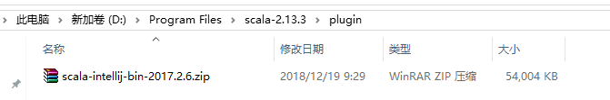
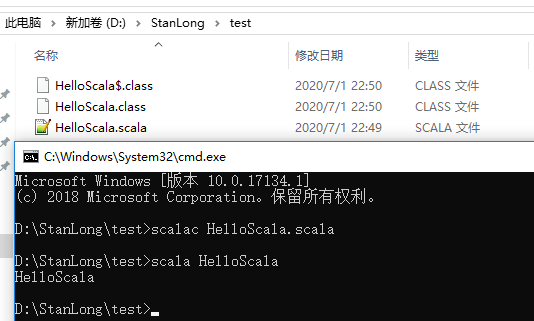
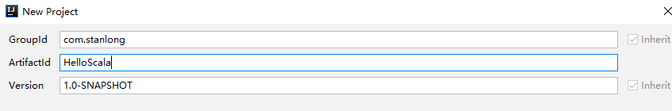

# Scala

# Scala 语言的特点

Scala是一门以java虚拟机（JVM）为运行环境并将面向对象和函数式编程的最佳特性结合在一起
的静态类型编程语言。 

- Scala 是一门多范式 (multi-paradigm) 的编程语言，Scala支持面向对象和函数式编程
- Scala源代码(.scala)会被编译成Java字节码(.class)，然后运行于JVM之上，并可以调用现有的Java类库，实现两种语言的无缝对接。
- scala 单作为一门语言来看， 非常的简洁高效  （三元运算， ++ ， --）
- Scala 在设计时，马丁·奥德斯基 是参考了Java的设计思想，可以说Scala是源于java，同时马丁·奥德斯基 也加入了自己的思想，将函数式编程语言的特点融合到JAVA中, 因此，对于学习过Java的同学，只要在学习Scala的过程中，搞清楚Scala 和 java相同点和不同点，就可以快速的掌握Scala这门语言
- 快速有效掌握Scala的建议 [1. 学习scala 特有的语法 2. 搞清楚 scala 和java 区别 3. 如何规范的使用scala]

# Scala安装

## Scala Windows 环境下安装

- 下载地址

https://www.scala-lang.org/download/

下载  scala-2.13.3.zip 版本 解压后配置环境变量，在命令行输入 scala 如图，环境变量配置成功


## Scala Linux 环境安装

```shell
[root@node01 ~]# tar -zxf scala-2.13.3.tgz 
[root@node01 ~]# mv scala-2.13.3 /opt/stanlong/
[root@node01 ~]# cd /opt/stanlong/
[root@node01 stanlong]# mv scala-2.13.3/ scala
[root@node01 stanlong]# ll
total 4
drwxr-xr-x  9 root root   210 Jun 20 11:12 flume
drwxr-xr-x 10 root root   161 Jun 11 10:27 hadoop-2.9.2
drwxr-xr-x 10 root root   161 Jun 11 10:13 hadoop-2.9.2-full
drwxr-xr-x  8 root root   172 Jun 14 11:28 hbase
drwxr-xr-x 10 root root   245 Jun 28 11:04 hive
drwxr-xr-x  7 root root   101 Jun 22 01:17 kafka
drwxr-xr-x  8 root root   119 Jun 29 03:44 kafka-manager
drwxrwxr-x  6 2000  2000   79 Jun 25 16:59 scala
drwxr-xr-x 13 1000  1000  211 Jun  6 08:09 spark
drwxr-xr-x  5  502 games 4096 Mar 19  2019 tez-0.9.2

配置环境 scala 环境变量
[root@node01 scala]# vi /etc/profile
export SCALA_HOME=/opt/stanlong/scalaexport PATH=$PATH:$JAVA_HOME/bin:$HADOOP_HOME/bin:$HADOOP_HOME/sbin:$HIVE_HOME/bin:$HBASE_HOME/bin:$SPARK_HOME/bin:$SPARK_HOME/sbin:$SCALA_HOME/bin
```

# idea 安装 scala 插件



我这个版本的可以直接下载，自己下载太慢了


# scala 快速开发入门

## 用文本编辑器编写HelloScala

```sc
// 1.object 表示一个伴生对象
// 2.HelloScala 对象的名字，底层真正对应的类名是 HelloScala$,对象是HelloScala$类型的一个静态对象 //MODULE$
//3. 当我们编写一个 Object HelloScala 是底层会生成两个 .class 文件，分别是 HelloScala 和 //HelloScala$
object HelloScala{
	// def 表示是一个方法，这是一个关键字
	// main 表示方法的名字，表示程序的入口
	// args 表示形参， scala的特点是将参数名写在前，类型写在后面
	// Array[String] 表示类型是一个数组
	// :Unit 表示该函数的返回值为空
	def main(args:Array[String]):Unit={
		println("HelloScala")
	}
}
```

执行



scala在运行是的流程如下

```java
1.先从 HelloScala 的main 开始执行
public static void main(String[] paramArrayOfString){
    HelloScala..MODULE$.main(paramArrayOfString);
}
2. 然后调用的是 HelloScala$里的方法 HelloScala.MODULE$.main
即执行了下面的代码
public void main(String[] args){
    Predef..MODULE$.println("HelloScala");
}
```

## 用idea 编写HelloScala

1. 新建maven工程



2. 在项目下新建 scala 文件夹，并标记为 source


3. 加入scala框架


4. 新建一个 scala程序


