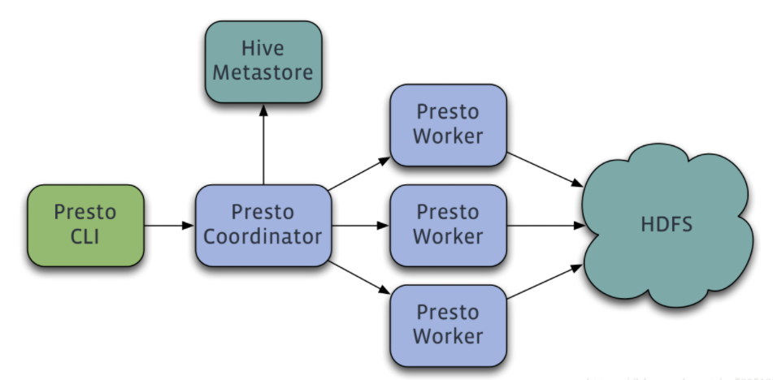

# Presto

## 定义

Presto是一个开源的分布式SQL查询引擎，适用于交互式分析查询，数据量支持GB到PB字节。注意：虽然Presto可以解析SQL，但它不是一个标准的数据库。不是MySQL、Oracle的代替品，也不能用来处理在线事务（OLTP）

## 应用场景

Presto支持在线数据查询，包括Hive，关系数据库（MySQL、Oracle）以及专有数据存储。一条Presto查询可以将多个数据源的数据进行合并，可以跨越整个组织进行分析。

Presto主要用来处理响应时间小于1秒到几分钟的场景

## 架构

Presto是一个运行在多台服务器上的分布式系统。完整安装包括一个Coordinator和多个Worker。由客户端提交查询，从Presto命令行CLI提交到Coordinator。Coordinator进行解析，分析并执行查询计划，然后分发处理队列到Worker



Presto有两类服务器：Coordinator和Worker。

1）**Coordinator**

Coordinator服务器是用来解析语句，执行计划分析和管理Presto的Worker结点。Presto安装必须有一个Coordinator和多个Worker。如果用于开发环境和测试，则一个Presto实例可以同时担任这两个角色。

Coordinator跟踪每个Work的活动情况并协调查询语句的执行。Coordinator为每个查询建立模型，模型包含多个Stage，每个Stage再转为Task分发到不同的Worker上执行。

Coordinator与Worker、Client通信是通过REST API。

2）**Worker**

Worker是负责执行任务和处理数据。Worker从Connector获取数据。Worker之间会交换中间数据。Coordinator是负责从Worker获取结果并返回最终结果给Client。

当Worker启动时，会广播自己去发现 Coordinator，并告知 Coordinator它是可用，随时可以接受Task。

Worker与Coordinator、Worker通信是通过REST API。

3）**数据源**

贯穿全文，你会看到一些术语：Connector、Catelog、Schema和Table。这些是Presto特定的数据源

（1）**Connector**

Connector是适配器，用于Presto和数据源（如Hive、RDBMS）的连接。你可以认为类似JDBC那样，但却是Presto的SPI的实现，使用标准的API来与不同的数据源交互。 

Presto有几个内建Connector：JMX的Connector、System Connector（用于访问内建的System table）、Hive的Connector、TPCH（用于TPC-H基准数据）。还有很多第三方的Connector，所以Presto可以访问不同数据源的数据。 

每个Catalog都有一个特定的Connector。如果你使用catelog配置文件，你会发现每个文件都必须包含connector.name属性，用于指定catelog管理器（创建特定的Connector使用）。一个或多个catelog用同样的connector是访问同样的数据库。例如，你有两个Hive集群。你可以在一个Presto集群上配置两个catelog，两个catelog都是用Hive Connector，从而达到可以查询两个Hive集群。

（2）**Catelog**

一个Catelog包含Schema和Connector。例如，你配置JMX的catelog，通过JXM Connector访问JXM信息。当你执行一条SQL语句时，可以同时运行在多个catelog。

Presto处理table时，是通过表的完全限定（fully-qualified）名来找到catelog。例如，一个表的权限定名是hive.test_data.test，则test是表名，test_data是schema，hive是catelog。 

Catelog的定义文件是在Presto的配置目录中。

（3）**Schema**

Schema是用于组织table。把catelog好schema结合在一起来包含一组的表。当通过Presto访问hive或Mysq时，一个schema会同时转为hive和mysql的同等概念。

（4）**Table**

Table跟关系型的表定义一样，但数据和表的映射是交给Connector

## 优点

1）Presto与Hive对比，都能够处理PB级别的海量数据分析，但Presto是基于内存运算，减少没必要的硬盘IO，所以更快。

2）能够连接多个数据源，跨数据源连表查，如从Hive查询大量网站访问记录，然后从Mysql中匹配出设备信息。

3）部署也比Hive简单，因为Hive是基于HDFS的，需要先部署HDFS。

## 缺点

1）虽然能够处理PB级别的海量数据分析，但不是代表Presto把PB级别都放在内存中计算的。而是根据场景，如count，avg等聚合运算，是边读数据边计算，再清内存，再读数据再计算，这种耗的内存并不高。但是连表查，就可能产生大量的临时数据，因此速度会变慢，反而Hive此时会更擅长。 

2）为了达到实时查询，可能会想到用它直连MySql来操作查询，这效率并不会提升，瓶颈依然在MySql，此时还引入网络瓶颈，所以会比原本直接操作数据库要慢

## 节点规划

|             | node01      | node02 | node03 |
| ----------- | ----------- | ------ | ------ |
| Coordinator | Coordinator |        |        |
| Worker      |             | Worker | Worker |

## 安装

服务端下载地址 https://repo1.maven.org/maven2/com/facebook/presto/presto-server

客户端下载地址 https://repo1.maven.org/maven2/com/facebook/presto/presto-cli

图形界面客户端下载地址

https://github.com/yanagishima/yanagishima

```shell
[root@node01 ~]# tar -zxf presto-server-0.196.tar.gz -C /opt/stanlong/presto/
```

## 配置

```shell
[root@node01 presto-server-0.196]# pwd
/opt/stanlong/presto/presto-server-0.196
[root@node01 presto-server-0.196]# mkdir -p /var/data/presto # 存储数据
[root@node01 presto-server-0.196]# mkdir etc  # 存储配置文件
[root@node01 presto-server-0.196]# cd etc/
```

### JVM配置

```shell
[root@node01 etc]# vi jvm.config
-server
-Xmx16G
-XX:+UseG1GC
-XX:G1HeapRegionSize=32M
-XX:+UseGCOverheadLimit
-XX:+ExplicitGCInvokesConcurrent
-XX:+HeapDumpOnOutOfMemoryError
-XX:+ExitOnOutOfMemoryError
```

### 节点属性配置

```shell
[root@node01 etc]# vi node.properties
node.environment=warehouse
node.id=node01
node.data-dir=/var/data/presto
---------------------------------------------------------------------------------------
node.environment：集群名称。所有在同一个集群中的Presto节点必须拥有相同的集群名称。
node.id：每个Presto节点的唯一标示。每个节点的node.id都必须是唯一的。
node.data-dir： 数据存储目录的位置（操作系统上的路径）。Presto将会把日期和数据存储在这个目录下
```

### 角色配置

```shell
配置 coordinator
[root@node01 etc]# vi config.properties
coordinator=true
node-scheduler.include-coordinator=false
http-server.http.port=8881
query.max-memory=50GB
query.max-memory-per-node=1GB
discovery-server.enabled=true
discovery.uri=http://node01:8881

分发到node02，node03之后再配置worker
--------------------------------------------------------------------------------------
coordinator：指定当前Presto实例作为一个coordinator
node-scheduler.include-coordinator：是否允许在coordinator服务中进行调度工作。
http-server.http.port：指定HTTP server的端口。
task.max-memory=1GB：一个单独的任务使用的最大内存 。
discovery-server.enabled：Presto 通过Discovery 服务来找到集群中所有的节点。
discovery.uri：Discovery server的URI。
```

### catalog 配置

Presto通过connectors访问数据。这些connectors挂载在catalogs上， 本实例中只配置了hive的数据源

```shell
[root@node01 etc]# mkdir catalog
[root@node01 etc]# cd catalog/
[root@node01 catalog]# vi hive.properties
connector.name=hive-node01
hive.metastore.uri=thrift://node01:9083
```

### 配置Presto连接Hive

```xml
<property>
<name>hive.server2.thrift.port</name>
<value>10000</value>
</property>
<property>
<name>hive.server2.thrift.bind.host</name>
<value>node01</value>
</property>
<property>
<name>hive.metastore.uris</name>
<value>thrift://node01:9083</value>
</property>
```


## 分发

```shell
[root@node01 presto]# scp -r presto-server-0.196/ node02:`pwd`
[root@node01 presto]# scp -r presto-server-0.196/ node03:`pwd`
```

### 配置worker

```shell
[root@node02 etc]# vi node.properties
node.environment=warehouse
node.id=node02
node.data-dir=/var/presto/data
[root@node02 etc]# vi config.properties
coordinator=false
http-server.http.port=8881
query.max-memory=50GB
query.max-memory-per-node=1GB
discovery.uri=http://example.net:8881
----------------------------------------------------------------------------------------
[root@node03 etc]# vi node.properties
node.environment=warehouse
node.id=node02
node.data-dir=/var/presto/data
[root@node03 etc]# vi config.properties
coordinator=false
http-server.http.port=8881
query.max-memory=50GB
query.max-memory-per-node=1GB
discovery.uri=http://example.net:8881
```

## 启动

```shell
[root@node03 presto-server-0.196]# pwd
/opt/stanlong/presto/presto-server-0.196
[root@node01 presto-server-0.196]# bin/launcher start # 作为一个后台进程启动
-----------------------------------------------------------------------------------------
[root@node01 presto-server-0.196]# bin/launcher run   # 前台启动，控制台显示日志
```

## 命令行客户端

```shell
[root@node01 ~]# mv presto-cli-0.196-executable.jar /opt/stanlong/presto/presto-server-0.196/
[root@node01 presto-server-0.196]# pwd
/opt/stanlong/presto/presto-server-0.196
[root@node01 presto-server-0.196]# mv presto-cli-0.196-executable.jar presto-cli
[root@node01 presto-server-0.196]# chmod +x presto-cli 
[root@node01 presto-server-0.196]# ./presto-cli --server node01:8881 --catalog hive --schema default
```


