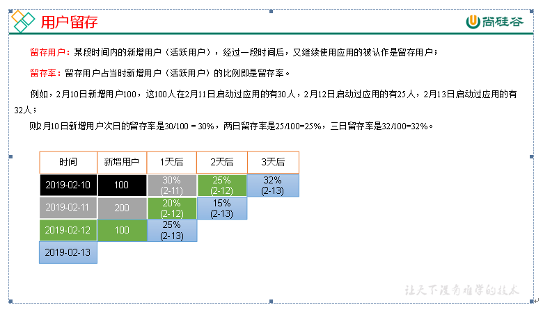

# 用户行为数据仓库


# 数仓搭建之ODS层

## 创建数据库

```shell
hive (default)> create database gmall;
说明：如果数据库存在且有数据，需要强制删除时执行：drop database gmall cascade;

hive (default)> use gmall;
```

# ODS层

原始数据层，存放原始数据，直接加载原始日志、数据，数据保持原貌不做处理。

## 创建启动日志表ods_start_log

- 创建输入数据是lzo输出是text，支持json解析的分区表

```shell
hive (gmall)> 
drop table if exists ods_start_log;
CREATE EXTERNAL TABLE ods_start_log (`line` string)
PARTITIONED BY (`dt` string)
STORED AS
  INPUTFORMAT 'com.hadoop.mapred.DeprecatedLzoTextInputFormat'
  OUTPUTFORMAT 'org.apache.hadoop.hive.ql.io.HiveIgnoreKeyTextOutputFormat'
LOCATION '/warehouse/gmall/ods/ods_start_log';
```

说明Hive的LZO压缩：https://cwiki.apache.org/confluence/display/Hive/LanguageManual+LZO

- 加载数据

```shell
hive (gmall)> load data inpath '/origin_data/gmall/log/topic_start/2020-06-25' into table gmall.ods_start_log partition(dt='2020-06-25');
```

注意：时间格式都配置成YYYY-MM-DD格式，这是Hive默认支持的时间格式

- 查看是否加载成功

```sql
hive (gmall)> select * from ods_start_log limit 2;
```

## 创建事件日志表ods_event_log

- 创建输入数据是lzo输出是text，支持json解析的分区表

```sql
hive (gmall)> 
drop table if exists ods_event_log;
CREATE EXTERNAL TABLE ods_event_log(`line` string)
PARTITIONED BY (`dt` string)
STORED AS
  INPUTFORMAT 'com.hadoop.mapred.DeprecatedLzoTextInputFormat'
  OUTPUTFORMAT 'org.apache.hadoop.hive.ql.io.HiveIgnoreKeyTextOutputFormat'
LOCATION '/warehouse/gmall/ods/ods_event_log';
```

- 加载数据

```shell
hive (gmall)> 
load data inpath '/origin_data/gmall/log/topic_event/2020-06-25' into table gmall.ods_event_log partition(dt='2020-06-25');
```

- 查看是否加载成功

```sql
hive (gmall)> select * from ods_event_log limit 2;
```

## ODS层加载数据脚本

```shell
[root@node01 ~]# cd bin/
[root@node01 bin]# vi ods_log.sh

#!/bin/bash

# 定义变量方便修改
APP=gmall
hive=/opt/stanlong/hive/bin/hive

# 如果是输入的日期按照取输入日期；如果没输入日期取当前时间的前一天
if [ -n "$1" ] ;then
   do_date=$1
else 
   do_date=`date -d "-1 day" +%F`
fi 

echo "===日志日期为 $do_date==="
sql="
load data inpath '/origin_data/gmall/log/topic_start/$do_date' into table "$APP".ods_start_log partition(dt='$do_date');

load data inpath '/origin_data/gmall/log/topic_event/$do_date' into table "$APP".ods_event_log partition(dt='$do_date');
"

$hive -e "$sql"

```

说明1：

[ -n 变量值 ] 判断变量的值，是否为空

-- 变量的值，非空，返回true

-- 变量的值，为空，返回false

说明2：

查看date命令的使用，[atguigu@hadoop102 ~]$ date --help

# 数仓搭建之DWD层

对ODS层数据进行清洗（去除空值，脏数据，超过极限范围的数据，行式存储改为列存储，改压缩格式）

## DWD层启动表数据解析

- 创建启动表

```sql
hive (gmall)> 
drop table if exists dwd_start_log;
CREATE EXTERNAL TABLE dwd_start_log(
`mid_id` string,
`user_id` string, 
`version_code` string, 
`version_name` string, 
`lang` string, 
`source` string, 
`os` string, 
`area` string, 
`model` string,
`brand` string, 
`sdk_version` string, 
`gmail` string, 
`height_width` string,  
`app_time` string,
`network` string, 
`lng` string, 
`lat` string, 
`entry` string, 
`open_ad_type` string, 
`action` string, 
`loading_time` string, 
`detail` string, 
`extend1` string
)
PARTITIONED BY (dt string)
location '/warehouse/gmall/dwd/dwd_start_log/';
```

- 向启动表导入数据

```sql
hive (gmall)> 
insert overwrite table dwd_start_log
PARTITION (dt='2020-06-25')
select 
    get_json_object(line,'$.mid') mid_id,
    get_json_object(line,'$.uid') user_id,
    get_json_object(line,'$.vc') version_code,
    get_json_object(line,'$.vn') version_name,
    get_json_object(line,'$.l') lang,
    get_json_object(line,'$.sr') source,
    get_json_object(line,'$.os') os,
    get_json_object(line,'$.ar') area,
    get_json_object(line,'$.md') model,
    get_json_object(line,'$.ba') brand,
    get_json_object(line,'$.sv') sdk_version,
    get_json_object(line,'$.g') gmail,
    get_json_object(line,'$.hw') height_width,
    get_json_object(line,'$.t') app_time,
    get_json_object(line,'$.nw') network,
    get_json_object(line,'$.ln') lng,
    get_json_object(line,'$.la') lat,
    get_json_object(line,'$.entry') entry,
    get_json_object(line,'$.open_ad_type') open_ad_type,
    get_json_object(line,'$.action') action,
    get_json_object(line,'$.loading_time') loading_time,
    get_json_object(line,'$.detail') detail,
    get_json_object(line,'$.extend1') extend1
from ods_start_log 
where dt='2020-06-25';
```

- 测试

```shell
hive (gmall)> select * from dwd_start_log limit 2;
```

- DWD层启动表加载数据脚本

```shell
#!/bin/bash

# 定义变量方便修改
APP=gmall
hive=/opt/stanlong/hive/bin/hive

# 如果是输入的日期按照取输入日期；如果没输入日期取当前时间的前一天
if [ -n "$1" ] ;then
        do_date=$1
else
        do_date=`date -d "-1 day" +%F`
fi

sql="
set hive.exec.dynamic.partition.mode=nonstrict;

insert overwrite table "$APP".dwd_start_log
PARTITION (dt='$do_date')
select
    get_json_object(line,'$.mid') mid_id,
    get_json_object(line,'$.uid') user_id,
    get_json_object(line,'$.vc') version_code,
    get_json_object(line,'$.vn') version_name,
    get_json_object(line,'$.l') lang,
    get_json_object(line,'$.sr') source,
    get_json_object(line,'$.os') os,
    get_json_object(line,'$.ar') area,
    get_json_object(line,'$.md') model,
    get_json_object(line,'$.ba') brand,
    get_json_object(line,'$.sv') sdk_version,
    get_json_object(line,'$.g') gmail,
    get_json_object(line,'$.hw') height_width,
    get_json_object(line,'$.t') app_time,
    get_json_object(line,'$.nw') network,
    get_json_object(line,'$.ln') lng,
    get_json_object(line,'$.la') lat,
    get_json_object(line,'$.entry') entry,
    get_json_object(line,'$.open_ad_type') open_ad_type,
    get_json_object(line,'$.action') action,
    get_json_object(line,'$.loading_time') loading_time,
    get_json_object(line,'$.detail') detail,
    get_json_object(line,'$.extend1') extend1
from "$APP".ods_start_log
where dt='$do_date';
"

$hive -e "$sql"
```

## DWD层事件表数据解析

- 创建基础明细表

```sql
hive (gmall)> 
drop table if exists dwd_base_event_log;
CREATE EXTERNAL TABLE dwd_base_event_log(
`mid_id` string,
`user_id` string, 
`version_code` string, 
`version_name` string, 
`lang` string, 
`source` string, 
`os` string, 
`area` string, 
`model` string,
`brand` string, 
`sdk_version` string, 
`gmail` string, 
`height_width` string, 
`app_time` string, 
`network` string, 
`lng` string, 
`lat` string, 
`event_name` string, 
`event_json` string, 
`server_time` string)
PARTITIONED BY (`dt` string)
stored as parquet
location '/warehouse/gmall/dwd/dwd_base_event_log/';
```

说明：其中event_name和event_json用来对应事件名和整个事件。这个地方将原始日志1对多的形式拆分出来了。操作的时候我们需要将原始日志展平，需要用到UDF和UDTF

- 自定义UDF函数（解析公共字段）

1）创建一个maven工程：hivefunction

2）创建包名：com.atguigu.udf

3）在pom.xml文件中添加如下内容

```xml
<properties>
    <project.build.sourceEncoding>UTF8</project.build.sourceEncoding>
    <hive.version>1.2.1</hive.version>
</properties>

<dependencies>
    <!--添加hive依赖-->
    <dependency>
        <groupId>org.apache.hive</groupId>
        <artifactId>hive-exec</artifactId>
        <version>${hive.version}</version>
    </dependency>
</dependencies>

<build>
    <plugins>
        <plugin>
            <artifactId>maven-compiler-plugin</artifactId>
            <version>2.3.2</version>
            <configuration>
                <source>1.8</source>
                <target>1.8</target>
            </configuration>
        </plugin>
        <plugin>
            <artifactId>maven-assembly-plugin</artifactId>
            <configuration>
                <descriptorRefs>
                    <descriptorRef>jar-with-dependencies</descriptorRef>
                </descriptorRefs>
            </configuration>
            <executions>
                <execution>
                    <id>make-assembly</id>
                    <phase>package</phase>
                    <goals>
                        <goal>single</goal>
                    </goals>
                </execution>
            </executions>
        </plugin>
    </plugins>
</build>
```

4）UDF用于解析公共字段

```java
package com.atguigu.udf;

import org.apache.commons.lang.StringUtils;
import org.apache.hadoop.hive.ql.exec.UDF;
import org.json.JSONException;
import org.json.JSONObject;

public class BaseFieldUDF extends UDF {

    public String evaluate(String line, String jsonkeysString) {
        
        // 0 准备一个sb
        StringBuilder sb = new StringBuilder();

        // 1 切割jsonkeys  mid uid vc vn l sr os ar md
        String[] jsonkeys = jsonkeysString.split(",");

        // 2 处理line   服务器时间 | json
        String[] logContents = line.split("\\|");

        // 3 合法性校验
        if (logContents.length != 2 || StringUtils.isBlank(logContents[1])) {
            return "";
        }

        // 4 开始处理json
        try {
            JSONObject jsonObject = new JSONObject(logContents[1]);

            // 获取cm里面的对象
            JSONObject base = jsonObject.getJSONObject("cm");

            // 循环遍历取值
            for (int i = 0; i < jsonkeys.length; i++) {
                String filedName = jsonkeys[i].trim();

                if (base.has(filedName)) {
                    sb.append(base.getString(filedName)).append("\t");
                } else {
                    sb.append("\t");
                }
            }

            sb.append(jsonObject.getString("et")).append("\t");
            sb.append(logContents[0]).append("\t");
        } catch (JSONException e) {
            e.printStackTrace();
        }

        return sb.toString();
    }

    public static void main(String[] args) {

        String line = "1541217850324|{\"cm\":{\"mid\":\"m7856\",\"uid\":\"u8739\",\"ln\":\"-74.8\",\"sv\":\"V2.2.2\",\"os\":\"8.1.3\",\"g\":\"P7XC9126@gmail.com\",\"nw\":\"3G\",\"l\":\"es\",\"vc\":\"6\",\"hw\":\"640*960\",\"ar\":\"MX\",\"t\":\"1541204134250\",\"la\":\"-31.7\",\"md\":\"huawei-17\",\"vn\":\"1.1.2\",\"sr\":\"O\",\"ba\":\"Huawei\"},\"ap\":\"weather\",\"et\":[{\"ett\":\"1541146624055\",\"en\":\"display\",\"kv\":{\"goodsid\":\"n4195\",\"copyright\":\"ESPN\",\"content_provider\":\"CNN\",\"extend2\":\"5\",\"action\":\"2\",\"extend1\":\"2\",\"place\":\"3\",\"showtype\":\"2\",\"category\":\"72\",\"newstype\":\"5\"}},{\"ett\":\"1541213331817\",\"en\":\"loading\",\"kv\":{\"extend2\":\"\",\"loading_time\":\"15\",\"action\":\"3\",\"extend1\":\"\",\"type1\":\"\",\"type\":\"3\",\"loading_way\":\"1\"}},{\"ett\":\"1541126195645\",\"en\":\"ad\",\"kv\":{\"entry\":\"3\",\"show_style\":\"0\",\"action\":\"2\",\"detail\":\"325\",\"source\":\"4\",\"behavior\":\"2\",\"content\":\"1\",\"newstype\":\"5\"}},{\"ett\":\"1541202678812\",\"en\":\"notification\",\"kv\":{\"ap_time\":\"1541184614380\",\"action\":\"3\",\"type\":\"4\",\"content\":\"\"}},{\"ett\":\"1541194686688\",\"en\":\"active_background\",\"kv\":{\"active_source\":\"3\"}}]}";
        String x = new BaseFieldUDF().evaluate(line, "mid,uid,vc,vn,l,sr,os,ar,md,ba,sv,g,hw,nw,ln,la,t");
        System.out.println(x);
    }
}
```

注意：使用main函数主要用于模拟数据测试

- 自定义UDTF函数（解析具体事件字段）

1）创建包名：com.atguigu.udtf

2）在com.atguigu.udtf包下创建类名：EventJsonUDTF

3）用于展开业务字段

```java
package com.atguigu.udtf;

import org.apache.commons.lang.StringUtils;
import org.apache.hadoop.hive.ql.exec.UDFArgumentException;
import org.apache.hadoop.hive.ql.metadata.HiveException;
import org.apache.hadoop.hive.ql.udf.generic.GenericUDTF;
import org.apache.hadoop.hive.serde2.objectinspector.ObjectInspector;
import org.apache.hadoop.hive.serde2.objectinspector.ObjectInspectorFactory;
import org.apache.hadoop.hive.serde2.objectinspector.StructObjectInspector;
import org.apache.hadoop.hive.serde2.objectinspector.primitive.PrimitiveObjectInspectorFactory;
import org.json.JSONArray;
import org.json.JSONException;

import java.util.ArrayList;

public class EventJsonUDTF extends GenericUDTF {

    //该方法中，我们将指定输出参数的名称和参数类型：
    @Override
    public StructObjectInspector initialize(ObjectInspector[] argOIs) throws UDFArgumentException {

        ArrayList<String> fieldNames = new ArrayList<String>();
        ArrayList<ObjectInspector> fieldOIs = new ArrayList<ObjectInspector>();

        fieldNames.add("event_name");
        fieldOIs.add(PrimitiveObjectInspectorFactory.javaStringObjectInspector);
        fieldNames.add("event_json");
        fieldOIs.add(PrimitiveObjectInspectorFactory.javaStringObjectInspector);

        return ObjectInspectorFactory.getStandardStructObjectInspector(fieldNames, fieldOIs);
    }

    //输入1条记录，输出若干条结果
    @Override
    public void process(Object[] objects) throws HiveException {

        // 获取传入的et
        String input = objects[0].toString();

        // 如果传进来的数据为空，直接返回过滤掉该数据
        if (StringUtils.isBlank(input)) {
            return;
        } else {

            try {
                // 获取一共有几个事件（ad/facoriters）
                JSONArray ja = new JSONArray(input);

                if (ja == null)
                    return;

                // 循环遍历每一个事件
                for (int i = 0; i < ja.length(); i++) {
                    String[] result = new String[2];

                    try {
                        // 取出每个的事件名称（ad/facoriters）
                        result[0] = ja.getJSONObject(i).getString("en");

                        // 取出每一个事件整体
                        result[1] = ja.getString(i);
                    } catch (JSONException e) {
                        continue;
                    }

                    // 将结果返回
                    forward(result);
                }
            } catch (JSONException e) {
                e.printStackTrace();
            }
        }
    }

    //当没有记录处理的时候该方法会被调用，用来清理代码或者产生额外的输出
    @Override
    public void close() throws HiveException {

    }
}
```

2）打包


3）将hivefunction-1.0-SNAPSHOT上传到node01的/opt/stalong/hive/

```shell
[root@node01 ~]# mv hivefunction-1.0-SNAPSHOT.jar /opt/stanlong/hive/
```

4）将jar包添加到Hive的classpath

```shell
hive (gmall)> add jar /opt/stanlong/hive/hivefunction-1.0-SNAPSHOT.jar;
```

5）创建临时函数与开发好的java class关联

```shell
hive (gmall)> 
create temporary function base_analizer as 'com.atguigu.udf.BaseFieldUDF';

create temporary function flat_analizer as 'com.atguigu.udtf.EventJsonUDTF';
```

## 解析事件日志基础明细表

- 解析事件日志基础明细表

```sql
hive (gmall)> 
set hive.exec.dynamic.partition.mode=nonstrict;

insert overwrite table dwd_base_event_log 
PARTITION (dt='2020-06-25')
select
mid_id,
user_id,
version_code,
version_name,
lang,
source,
os,
area,
model,
brand,
sdk_version,
gmail,
height_width,
app_time,
network,
lng,
lat,
event_name,
event_json,
server_time
from
(
select
split(base_analizer(line,'mid,uid,vc,vn,l,sr,os,ar,md,ba,sv,g,hw,t,nw,ln,la'),'\t')[0]   as mid_id,
split(base_analizer(line,'mid,uid,vc,vn,l,sr,os,ar,md,ba,sv,g,hw,t,nw,ln,la'),'\t')[1]   as user_id,
split(base_analizer(line,'mid,uid,vc,vn,l,sr,os,ar,md,ba,sv,g,hw,t,nw,ln,la'),'\t')[2]   as version_code,
split(base_analizer(line,'mid,uid,vc,vn,l,sr,os,ar,md,ba,sv,g,hw,t,nw,ln,la'),'\t')[3]   as version_name,
split(base_analizer(line,'mid,uid,vc,vn,l,sr,os,ar,md,ba,sv,g,hw,t,nw,ln,la'),'\t')[4]   as lang,
split(base_analizer(line,'mid,uid,vc,vn,l,sr,os,ar,md,ba,sv,g,hw,t,nw,ln,la'),'\t')[5]   as source,
split(base_analizer(line,'mid,uid,vc,vn,l,sr,os,ar,md,ba,sv,g,hw,t,nw,ln,la'),'\t')[6]   as os,
split(base_analizer(line,'mid,uid,vc,vn,l,sr,os,ar,md,ba,sv,g,hw,t,nw,ln,la'),'\t')[7]   as area,
split(base_analizer(line,'mid,uid,vc,vn,l,sr,os,ar,md,ba,sv,g,hw,t,nw,ln,la'),'\t')[8]   as model,
split(base_analizer(line,'mid,uid,vc,vn,l,sr,os,ar,md,ba,sv,g,hw,t,nw,ln,la'),'\t')[9]   as brand,
split(base_analizer(line,'mid,uid,vc,vn,l,sr,os,ar,md,ba,sv,g,hw,t,nw,ln,la'),'\t')[10]   as sdk_version,
split(base_analizer(line,'mid,uid,vc,vn,l,sr,os,ar,md,ba,sv,g,hw,t,nw,ln,la'),'\t')[11]  as gmail,
split(base_analizer(line,'mid,uid,vc,vn,l,sr,os,ar,md,ba,sv,g,hw,t,nw,ln,la'),'\t')[12]  as height_width,
split(base_analizer(line,'mid,uid,vc,vn,l,sr,os,ar,md,ba,sv,g,hw,t,nw,ln,la'),'\t')[13]  as app_time,
split(base_analizer(line,'mid,uid,vc,vn,l,sr,os,ar,md,ba,sv,g,hw,t,nw,ln,la'),'\t')[14]  as network,
split(base_analizer(line,'mid,uid,vc,vn,l,sr,os,ar,md,ba,sv,g,hw,t,nw,ln,la'),'\t')[15]  as lng,
split(base_analizer(line,'mid,uid,vc,vn,l,sr,os,ar,md,ba,sv,g,hw,t,nw,ln,la'),'\t')[16]  as lat,
split(base_analizer(line,'mid,uid,vc,vn,l,sr,os,ar,md,ba,sv,g,hw,t,nw,ln,la'),'\t')[17]  as ops,
split(base_analizer(line,'mid,uid,vc,vn,l,sr,os,ar,md,ba,sv,g,hw,t,nw,ln,la'),'\t')[18]  as server_time
from ods_event_log where dt='2019-02-10'  and base_analizer(line,'mid,uid,vc,vn,l,sr,os,ar,md,ba,sv,g,hw,t,nw,ln,la')<>'' 
) sdk_log lateral view flat_analizer(ops) tmp_k as event_name, event_json;
```

- 测试

```sql
hive (gmall)> select * from dwd_base_event_log limit 2;
```

- DWD层数据解析脚本

```shell
vim dwd_base_log.sh

#!/bin/bash

# 定义变量方便修改
APP=gmall
hive=/opt/stanlong/hive/bin/hive

# 如果是输入的日期按照取输入日期；如果没输入日期取当前时间的前一天
if [ -n "$1" ] ;then
	do_date=$1
else 
	do_date=`date -d "-1 day" +%F`  
fi 

sql="
	add jar /opt/stanlong/hive/hivefunction-1.0-SNAPSHOT.jar;

	create temporary function base_analizer as 'com.atguigu.udf.BaseFieldUDF';
	create temporary function flat_analizer as 'com.atguigu.udtf.EventJsonUDTF';

 	set hive.exec.dynamic.partition.mode=nonstrict;

	insert overwrite table "$APP".dwd_base_event_log 
	PARTITION (dt='$do_date')
	select
	mid_id,
	user_id,
	version_code,
	version_name,
	lang,
	source ,
	os ,
	area ,
	model ,
	brand ,
	sdk_version ,
	gmail ,
	height_width ,
	network ,
	lng ,
	lat ,
	app_time ,
	event_name , 
	event_json , 
	server_time  
	from
	(
	select
	split(base_analizer(line,'mid,uid,vc,vn,l,sr,os,ar,md,ba,sv,g,hw,t,nw,ln,la'),'\t')[0]   as mid_id,
	split(base_analizer(line,'mid,uid,vc,vn,l,sr,os,ar,md,ba,sv,g,hw,t,nw,ln,la'),'\t')[1]   as user_id,
	split(base_analizer(line,'mid,uid,vc,vn,l,sr,os,ar,md,ba,sv,g,hw,t,nw,ln,la'),'\t')[2]   as version_code,
	split(base_analizer(line,'mid,uid,vc,vn,l,sr,os,ar,md,ba,sv,g,hw,t,nw,ln,la'),'\t')[3]   as version_name,
	split(base_analizer(line,'mid,uid,vc,vn,l,sr,os,ar,md,ba,sv,g,hw,t,nw,ln,la'),'\t')[4]   as lang,
	split(base_analizer(line,'mid,uid,vc,vn,l,sr,os,ar,md,ba,sv,g,hw,t,nw,ln,la'),'\t')[5]   as source,
	split(base_analizer(line,'mid,uid,vc,vn,l,sr,os,ar,md,ba,sv,g,hw,t,nw,ln,la'),'\t')[6]   as os,
	split(base_analizer(line,'mid,uid,vc,vn,l,sr,os,ar,md,ba,sv,g,hw,t,nw,ln,la'),'\t')[7]   as area,
	split(base_analizer(line,'mid,uid,vc,vn,l,sr,os,ar,md,ba,sv,g,hw,t,nw,ln,la'),'\t')[8]   as model,
	split(base_analizer(line,'mid,uid,vc,vn,l,sr,os,ar,md,ba,sv,g,hw,t,nw,ln,la'),'\t')[9]   as brand,
	split(base_analizer(line,'mid,uid,vc,vn,l,sr,os,ar,md,ba,sv,g,hw,t,nw,ln,la'),'\t')[10]   as sdk_version,
	split(base_analizer(line,'mid,uid,vc,vn,l,sr,os,ar,md,ba,sv,g,hw,t,nw,ln,la'),'\t')[11]  as gmail,
	split(base_analizer(line,'mid,uid,vc,vn,l,sr,os,ar,md,ba,sv,g,hw,t,nw,ln,la'),'\t')[12]  as height_width,
	split(base_analizer(line,'mid,uid,vc,vn,l,sr,os,ar,md,ba,sv,g,hw,t,nw,ln,la'),'\t')[13]  as app_time,
	split(base_analizer(line,'mid,uid,vc,vn,l,sr,os,ar,md,ba,sv,g,hw,t,nw,ln,la'),'\t')[14]  as network,
	split(base_analizer(line,'mid,uid,vc,vn,l,sr,os,ar,md,ba,sv,g,hw,t,nw,ln,la'),'\t')[15]  as lng,
	split(base_analizer(line,'mid,uid,vc,vn,l,sr,os,ar,md,ba,sv,g,hw,t,nw,ln,la'),'\t')[16]  as lat,
	split(base_analizer(line,'mid,uid,vc,vn,l,sr,os,ar,md,ba,sv,g,hw,t,nw,ln,la'),'\t')[17]  as ops,
	split(base_analizer(line,'mid,uid,vc,vn,l,sr,os,ar,md,ba,sv,g,hw,t,nw,ln,la'),'\t')[18]  as server_time
	from "$APP".ods_event_log where dt='$do_date'  and base_analizer(line,'mid,uid,vc,vn,l,sr,os,ar,md,ba,sv,g,hw,t,nw,ln,la')<>'' 
	) sdk_log lateral view flat_analizer(ops) tmp_k as event_name, event_json;
"

$hive -e "$sql"
```

# DWD层事件表获取

## 商品点击表

- 建表

```sql
drop table if exists dwd_display_log;
CREATE EXTERNAL TABLE dwd_display_log(
`mid_id` string,
`user_id` string,
`version_code` string,
`version_name` string,
`lang` string,
`source` string,
`os` string,
`area` string,
`model` string,
`brand` string,
`sdk_version` string,
`gmail` string,
`height_width` string,
`app_time` string,
`network` string,
`lng` string,
`lat` string,
`action` string,
`goodsid` string,
`place` string,
`extend1` string,
`category` string,
`server_time` string
)
PARTITIONED BY (dt string)
location '/warehouse/gmall/dwd/dwd_display_log/';
```

- 导入数据

```sql
set hive.exec.dynamic.partition.mode=nonstrict;

insert overwrite table dwd_display_log
PARTITION (dt='2020-06-25')
select 
mid_id,
user_id,
version_code,
version_name,
lang,
source,
os,
area,
model,
brand,
sdk_version,
gmail,
height_width,
app_time,
network,
lng,
lat,
get_json_object(event_json,'$.kv.action') action,
get_json_object(event_json,'$.kv.goodsid') goodsid,
get_json_object(event_json,'$.kv.place') place,
get_json_object(event_json,'$.kv.extend1') extend1,
get_json_object(event_json,'$.kv.category') category,
server_time
from dwd_base_event_log 
where dt='2020-06-25' and event_name='display';
```

## 商品详情页表

- 建表

```sql
drop table if exists dwd_newsdetail_log;
CREATE EXTERNAL TABLE dwd_newsdetail_log(
`mid_id` string,
`user_id` string, 
`version_code` string, 
`version_name` string, 
`lang` string, 
`source` string, 
`os` string, 
`area` string, 
`model` string,
`brand` string, 
`sdk_version` string, 
`gmail` string, 
`height_width` string, 
`app_time` string,  
`network` string, 
`lng` string, 
`lat` string, 
`entry` string,
`action` string,
`goodsid` string,
`showtype` string,
`news_staytime` string,
`loading_time` string,
`type1` string,
`category` string,
`server_time` string)
PARTITIONED BY (dt string)
location '/warehouse/gmall/dwd/dwd_newsdetail_log/';
```

- 导入数据

```sql
set hive.exec.dynamic.partition.mode=nonstrict;

insert overwrite table dwd_newsdetail_log
PARTITION (dt='2020-06-25')
select 
mid_id,
user_id,
version_code,
version_name,
lang,
source,
os,
area,
model,
brand,
sdk_version,
gmail,
height_width,
app_time,
network,
lng,
lat,
get_json_object(event_json,'$.kv.entry') entry,
get_json_object(event_json,'$.kv.action') action,
get_json_object(event_json,'$.kv.goodsid') goodsid,
get_json_object(event_json,'$.kv.showtype') showtype,
get_json_object(event_json,'$.kv.news_staytime') news_staytime,
get_json_object(event_json,'$.kv.loading_time') loading_time,
get_json_object(event_json,'$.kv.type1') type1,
get_json_object(event_json,'$.kv.category') category,
server_time
from dwd_base_event_log
where dt='2020-06-25' and event_name='newsdetail';
```

## 商品列表页表

- 建表

```sql
drop table if exists dwd_loading_log;
CREATE EXTERNAL TABLE dwd_loading_log(
`mid_id` string,
`user_id` string, 
`version_code` string, 
`version_name` string, 
`lang` string, 
`source` string, 
`os` string, 
`area` string, 
`model` string,
`brand` string, 
`sdk_version` string, 
`gmail` string,
`height_width` string,  
`app_time` string,
`network` string, 
`lng` string, 
`lat` string, 
`action` string,
`loading_time` string,
`loading_way` string,
`extend1` string,
`extend2` string,
`type` string,
`type1` string,
`server_time` string)
PARTITIONED BY (dt string)
location '/warehouse/gmall/dwd/dwd_loading_log/';
```

- 导入数据

```sql
set hive.exec.dynamic.partition.mode=nonstrict;

insert overwrite table dwd_loading_log
PARTITION (dt='2020-06-25')
select 
mid_id,
user_id,
version_code,
version_name,
lang,
source,
os,
area,
model,
brand,
sdk_version,
gmail,
height_width,
app_time,
network,
lng,
lat,
get_json_object(event_json,'$.kv.action') action,
get_json_object(event_json,'$.kv.loading_time') loading_time,
get_json_object(event_json,'$.kv.loading_way') loading_way,
get_json_object(event_json,'$.kv.extend1') extend1,
get_json_object(event_json,'$.kv.extend2') extend2,
get_json_object(event_json,'$.kv.type') type,
get_json_object(event_json,'$.kv.type1') type1,
server_time
from dwd_base_event_log
where dt='2020-06-25' and event_name='loading';
```

## 广告表

- 建表

```sql
drop table if exists dwd_ad_log;
CREATE EXTERNAL TABLE dwd_ad_log(
`mid_id` string,
`user_id` string, 
`version_code` string, 
`version_name` string, 
`lang` string, 
`source` string, 
`os` string, 
`area` string, 
`model` string,
`brand` string, 
`sdk_version` string, 
`gmail` string, 
`height_width` string,  
`app_time` string,
`network` string, 
`lng` string, 
`lat` string, 
`entry` string,
`action` string,
`content` string,
`detail` string,
`ad_source` string,
`behavior` string,
`newstype` string,
`show_style` string,
`server_time` string)
PARTITIONED BY (dt string)
location '/warehouse/gmall/dwd/dwd_ad_log/';
```

- 导入数据

```sql
set hive.exec.dynamic.partition.mode=nonstrict;

insert overwrite table dwd_ad_log
PARTITION (dt='2020-06-25')
select 
mid_id,
user_id,
version_code,
version_name,
lang,
source,
os,
area,
model,
brand,
sdk_version,
gmail,
height_width,
app_time,
network,
lng,
lat,
get_json_object(event_json,'$.kv.entry') entry,
get_json_object(event_json,'$.kv.action') action,
get_json_object(event_json,'$.kv.content') content,
get_json_object(event_json,'$.kv.detail') detail,
get_json_object(event_json,'$.kv.source') ad_source,
get_json_object(event_json,'$.kv.behavior') behavior,
get_json_object(event_json,'$.kv.newstype') newstype,
get_json_object(event_json,'$.kv.show_style') show_style,
server_time
from dwd_base_event_log 
where dt='2020-06-25' and event_name='ad';
```

## 消息通知表

- 建表

```sql
drop table if exists dwd_notification_log;
CREATE EXTERNAL TABLE dwd_notification_log(
`mid_id` string,
`user_id` string, 
`version_code` string, 
`version_name` string, 
`lang` string,
`source` string, 
`os` string, 
`area` string, 
`model` string,
`brand` string, 
`sdk_version` string, 
`gmail` string, 
`height_width` string,  
`app_time` string,
`network` string, 
`lng` string, 
`lat` string, 
`action` string,
`noti_type` string,
`ap_time` string,
`content` string,
`server_time` string
)
PARTITIONED BY (dt string)
location '/warehouse/gmall/dwd/dwd_notification_log/';
```

- 导入数据

```sql
set hive.exec.dynamic.partition.mode=nonstrict;

insert overwrite table dwd_notification_log
PARTITION (dt='2020-06-25')
select 
mid_id,
user_id,
version_code,
version_name,
lang,
source,
os,
area,
model,
brand,
sdk_version,
gmail,
height_width,
app_time,
network,
lng,
lat,
get_json_object(event_json,'$.kv.action') action,
get_json_object(event_json,'$.kv.noti_type') noti_type,
get_json_object(event_json,'$.kv.ap_time') ap_time,
get_json_object(event_json,'$.kv.content') content,
server_time
from dwd_base_event_log
where dt='2020-06-25' and event_name='notification';
```

## 用户前台活跃表

- 建表

```sql
drop table if exists dwd_active_foreground_log;
CREATE EXTERNAL TABLE dwd_active_foreground_log(
`mid_id` string,
`user_id` string,
`version_code` string,
`version_name` string,
`lang` string,
`source` string,
`os` string,
`area` string,
`model` string,
`brand` string,
`sdk_version` string,
`gmail` string,
`height_width` string,
`app_time` string,
`network` string,
`lng` string,
`lat` string,
`push_id` string,
`access` string,
`server_time` string)
PARTITIONED BY (dt string)
location '/warehouse/gmall/dwd/dwd_foreground_log/';
```

- 导入数据

```sql
set hive.exec.dynamic.partition.mode=nonstrict;

insert overwrite table dwd_active_foreground_log
PARTITION (dt='2020-06-25')
select 
mid_id,
user_id,
version_code,
version_name,
lang,
source,
os,
area,
model,
brand,
sdk_version,
gmail,
height_width,
app_time,
network,
lng,
lat,
get_json_object(event_json,'$.kv.push_id') push_id,
get_json_object(event_json,'$.kv.access') access,
server_time
from dwd_base_event_log
where dt='2020-06-25' and event_name='active_foreground';
```

## 用户后台活跃表

- 建表

```sql
drop table if exists dwd_active_background_log;
CREATE EXTERNAL TABLE dwd_active_background_log(
`mid_id` string,
`user_id` string,
`version_code` string,
`version_name` string,
`lang` string,
`source` string,
`os` string,
`area` string,
`model` string,
`brand` string,
`sdk_version` string,
`gmail` string,
 `height_width` string,
`app_time` string,
`network` string,
`lng` string,
`lat` string,
`active_source` string,
`server_time` string
)
PARTITIONED BY (dt string)
location '/warehouse/gmall/dwd/dwd_background_log/';
```

- 导入数据

```sql
set hive.exec.dynamic.partition.mode=nonstrict;

insert overwrite table dwd_active_background_log
PARTITION (dt='2020-06-25')
select 
mid_id,
user_id,
version_code,
version_name,
lang,
source,
os,
area,
model,
brand,
sdk_version,
gmail,
height_width,
app_time,
network,
lng,
lat,
get_json_object(event_json,'$.kv.active_source') active_source,
server_time
from dwd_base_event_log
where dt='2020-06-25' and event_name='active_background';
```

## 评论表

- 建表

```sql
drop table if exists dwd_comment_log;
CREATE EXTERNAL TABLE dwd_comment_log(
`mid_id` string,
`user_id` string,
`version_code` string,
`version_name` string,
`lang` string,
`source` string,
`os` string,
`area` string,
`model` string,
`brand` string,
`sdk_version` string,
`gmail` string,
`height_width` string,
`app_time` string,
`network` string,
`lng` string,
`lat` string,
`comment_id` int,
`userid` int,
`p_comment_id` int, 
`content` string,
`addtime` string,
`other_id` int,
`praise_count` int,
`reply_count` int,
`server_time` string
)
PARTITIONED BY (dt string)
location '/warehouse/gmall/dwd/dwd_comment_log/';
```

- 导入数据

```sql
set hive.exec.dynamic.partition.mode=nonstrict;

insert overwrite table dwd_comment_log
PARTITION (dt='2020-06-25')
select 
mid_id,
user_id,
version_code,
version_name,
lang,
source,
os,
area,
model,
brand,
sdk_version,
gmail,
height_width,
app_time,
network,
lng,
lat,
get_json_object(event_json,'$.kv.comment_id') comment_id,
get_json_object(event_json,'$.kv.userid') userid,
get_json_object(event_json,'$.kv.p_comment_id') p_comment_id,
get_json_object(event_json,'$.kv.content') content,
get_json_object(event_json,'$.kv.addtime') addtime,
get_json_object(event_json,'$.kv.other_id') other_id,
get_json_object(event_json,'$.kv.praise_count') praise_count,
get_json_object(event_json,'$.kv.reply_count') reply_count,
server_time
from dwd_base_event_log
where dt='2020-06-25' and event_name='comment';
```

## 收藏表

- 建表

```sql
drop table if exists dwd_favorites_log;
CREATE EXTERNAL TABLE dwd_favorites_log(
`mid_id` string,
`user_id` string, 
`version_code` string, 
`version_name` string, 
`lang` string, 
`source` string, 
`os` string, 
`area` string, 
`model` string,
`brand` string, 
`sdk_version` string, 
`gmail` string, 
`height_width` string,  
`app_time` string,
`network` string, 
`lng` string, 
`lat` string, 
`id` int, 
`course_id` int, 
`userid` int,
`add_time` string,
`server_time` string
)
PARTITIONED BY (dt string)
location '/warehouse/gmall/dwd/dwd_favorites_log/';
```

- 导入数据

```sql
set hive.exec.dynamic.partition.mode=nonstrict;

insert overwrite table dwd_favorites_log
PARTITION (dt='2020-06-25')
select 
mid_id,
user_id,
version_code,
version_name,
lang,
source,
os,
area,
model,
brand,
sdk_version,
gmail,
height_width,
app_time,
network,
lng,
lat,
get_json_object(event_json,'$.kv.id') id,
get_json_object(event_json,'$.kv.course_id') course_id,
get_json_object(event_json,'$.kv.userid') userid,
get_json_object(event_json,'$.kv.add_time') add_time,
server_time
from dwd_base_event_log 
where dt='2020-06-25' and event_name='favorites';
```

## 点赞表

- 建表

```sql
drop table if exists dwd_praise_log;
CREATE EXTERNAL TABLE dwd_praise_log(
`mid_id` string,
`user_id` string, 
`version_code` string, 
`version_name` string, 
`lang` string, 
`source` string, 
`os` string, 
`area` string, 
`model` string,
`brand` string, 
`sdk_version` string, 
`gmail` string, 
`height_width` string,  
`app_time` string,
`network` string, 
`lng` string, 
`lat` string, 
`id` string, 
`userid` string, 
`target_id` string,
`type` string,
`add_time` string,
`server_time` string
)
PARTITIONED BY (dt string)
location '/warehouse/gmall/dwd/dwd_praise_log/';
```

- 导入数据

```sql
set hive.exec.dynamic.partition.mode=nonstrict;

insert overwrite table dwd_praise_log
PARTITION (dt='2020-06-25')
select 
mid_id,
user_id,
version_code,
version_name,
lang,
source,
os,
area,
model,
brand,
sdk_version,
gmail,
height_width,
app_time,
network,
lng,
lat,
get_json_object(event_json,'$.kv.id') id,
get_json_object(event_json,'$.kv.userid') userid,
get_json_object(event_json,'$.kv.target_id') target_id,
get_json_object(event_json,'$.kv.type') type,
get_json_object(event_json,'$.kv.add_time') add_time,
server_time
from dwd_base_event_log
where dt='2020-06-25' and event_name='praise';
```


## 错误日志表

- 建表

```sql
drop table if exists dwd_error_log;
CREATE EXTERNAL TABLE dwd_error_log(
`mid_id` string,
`user_id` string, 
`version_code` string, 
`version_name` string, 
`lang` string, 
`source` string, 
`os` string, 
`area` string, 
`model` string,
`brand` string, 
`sdk_version` string, 
`gmail` string, 
`height_width` string,  
`app_time` string,
`network` string, 
`lng` string, 
`lat` string, 
`errorBrief` string, 
`errorDetail` string, 
`server_time` string)
PARTITIONED BY (dt string)
location '/warehouse/gmall/dwd/dwd_error_log/';
```

- 导入数据

```sql
set hive.exec.dynamic.partition.mode=nonstrict;

insert overwrite table dwd_error_log
PARTITION (dt='2020-06-25')
select 
mid_id,
user_id,
version_code,
version_name,
lang,
source,
os,
area,
model,
brand,
sdk_version,
gmail,
height_width,
app_time,
network,
lng,
lat,
get_json_object(event_json,'$.kv.errorBrief') errorBrief,
get_json_object(event_json,'$.kv.errorDetail') errorDetail,
server_time
from dwd_base_event_log 
where dt='2020-06-25' and event_name='error';
```

## DWD层事件表加载数据脚本

```shell
#!/bin/bash

# 定义变量方便修改
APP=gmall
hive=/opt/stanlong/hive/bin/hive

# 如果是输入的日期按照取输入日期；如果没输入日期取当前时间的前一天
if [ -n "$1" ] ;then
	do_date=$1
else 
	do_date=`date -d "-1 day" +%F`  
fi 

sql="
set hive.exec.dynamic.partition.mode=nonstrict;

insert overwrite table "$APP".dwd_display_log
PARTITION (dt='$do_date')
select 
	mid_id,
	user_id,
	version_code,
	version_name,
	lang,
	source,
	os,
	area,
	model,
	brand,
	sdk_version,
	gmail,
	height_width,
	app_time,
	network,
	lng,
	lat,
	get_json_object(event_json,'$.kv.action') action,
	get_json_object(event_json,'$.kv.goodsid') goodsid,
	get_json_object(event_json,'$.kv.place') place,
	get_json_object(event_json,'$.kv.extend1') extend1,
	get_json_object(event_json,'$.kv.category') category,
	server_time
from "$APP".dwd_base_event_log 
where dt='$do_date' and event_name='display';


insert overwrite table "$APP".dwd_newsdetail_log
PARTITION (dt='$do_date')
select 
	mid_id,
	user_id,
	version_code,
	version_name,
	lang,
	source,
	os,
	area,
	model,
	brand,
	sdk_version,
	gmail,
	height_width,
	app_time,
	network,
	lng,
	lat,
	get_json_object(event_json,'$.kv.entry') entry,
	get_json_object(event_json,'$.kv.action') action,
	get_json_object(event_json,'$.kv.goodsid') goodsid,
	get_json_object(event_json,'$.kv.showtype') showtype,
	get_json_object(event_json,'$.kv.news_staytime') news_staytime,
	get_json_object(event_json,'$.kv.loading_time') loading_time,
	get_json_object(event_json,'$.kv.type1') type1,
	get_json_object(event_json,'$.kv.category') category,
	server_time
from "$APP".dwd_base_event_log 
where dt='$do_date' and event_name='newsdetail';


insert overwrite table "$APP".dwd_loading_log
PARTITION (dt='$do_date')
select 
	mid_id,
	user_id,
	version_code,
	version_name,
	lang,
	source,
	os,
	area,
	model,
	brand,
	sdk_version,
	gmail,
	height_width,
	app_time,
	network,
	lng,
	lat,
	get_json_object(event_json,'$.kv.action') action,
	get_json_object(event_json,'$.kv.loading_time') loading_time,
	get_json_object(event_json,'$.kv.loading_way') loading_way,
	get_json_object(event_json,'$.kv.extend1') extend1,
	get_json_object(event_json,'$.kv.extend2') extend2,
	get_json_object(event_json,'$.kv.type') type,
	get_json_object(event_json,'$.kv.type1') type1,
	server_time
from "$APP".dwd_base_event_log 
where dt='$do_date' and event_name='loading';


insert overwrite table "$APP".dwd_ad_log
PARTITION (dt='$do_date')
select 
	mid_id,
	user_id,
	version_code,
	version_name,
	lang,
	source,
	os,
	area,
	model,
	brand,
	sdk_version,
	gmail,
	height_width,
	app_time,
	network,
	lng,
	lat,
	get_json_object(event_json,'$.kv.entry') entry,
	get_json_object(event_json,'$.kv.action') action,
	get_json_object(event_json,'$.kv.content') content,
	get_json_object(event_json,'$.kv.detail') detail,
	get_json_object(event_json,'$.kv.source') ad_source,
	get_json_object(event_json,'$.kv.behavior') behavior,
	get_json_object(event_json,'$.kv.newstype') newstype,
	get_json_object(event_json,'$.kv.show_style') show_style,
	server_time
from "$APP".dwd_base_event_log 
where dt='$do_date' and event_name='ad';


insert overwrite table "$APP".dwd_notification_log
PARTITION (dt='$do_date')
select 
	mid_id,
	user_id,
	version_code,
	version_name,
	lang,
	source,
	os,
	area,
	model,
	brand,
	sdk_version,
	gmail,
	height_width,
	app_time,
	network,
	lng,
	lat,
	get_json_object(event_json,'$.kv.action') action,
	get_json_object(event_json,'$.kv.noti_type') noti_type,
	get_json_object(event_json,'$.kv.ap_time') ap_time,
	get_json_object(event_json,'$.kv.content') content,
	server_time
from "$APP".dwd_base_event_log 
where dt='$do_date' and event_name='notification';


insert overwrite table "$APP".dwd_active_foreground_log
PARTITION (dt='$do_date')
select 
	mid_id,
	user_id,
	version_code,
	version_name,
	lang,
	source,
	os,
	area,
	model,
	brand,
	sdk_version,
	gmail,
	height_width,
	app_time,
	network,
	lng,
	lat,
get_json_object(event_json,'$.kv.push_id') push_id,
get_json_object(event_json,'$.kv.access') access,
	server_time
from "$APP".dwd_base_event_log 
where dt='$do_date' and event_name='active_foreground';


insert overwrite table "$APP".dwd_active_background_log
PARTITION (dt='$do_date')
select 
	mid_id,
	user_id,
	version_code,
	version_name,
	lang,
	source,
	os,
	area,
	model,
	brand,
	sdk_version,
	gmail,
	height_width,
	app_time,
	network,
	lng,
	lat,
	get_json_object(event_json,'$.kv.active_source') active_source,
	server_time
from "$APP".dwd_base_event_log 
where dt='$do_date' and event_name='active_background';


insert overwrite table "$APP".dwd_comment_log
PARTITION (dt='$do_date')
select 
	mid_id,
	user_id,
	version_code,
	version_name,
	lang,
	source,
	os,
	area,
	model,
	brand,
	sdk_version,
	gmail,
	height_width,
	app_time,
	network,
	lng,
	lat,
	get_json_object(event_json,'$.kv.comment_id') comment_id,
	get_json_object(event_json,'$.kv.userid') userid,
	get_json_object(event_json,'$.kv.p_comment_id') p_comment_id,
	get_json_object(event_json,'$.kv.content') content,
	get_json_object(event_json,'$.kv.addtime') addtime,
	get_json_object(event_json,'$.kv.other_id') other_id,
	get_json_object(event_json,'$.kv.praise_count') praise_count,
	get_json_object(event_json,'$.kv.reply_count') reply_count,
	server_time
from "$APP".dwd_base_event_log 
where dt='$do_date' and event_name='comment';


insert overwrite table "$APP".dwd_favorites_log
PARTITION (dt='$do_date')
select 
	mid_id,
	user_id,
	version_code,
	version_name,
	lang,
	source,
	os,
	area,
	model,
	brand,
	sdk_version,
	gmail,
	height_width,
	app_time,
	network,
	lng,
	lat,
	get_json_object(event_json,'$.kv.id') id,
	get_json_object(event_json,'$.kv.course_id') course_id,
	get_json_object(event_json,'$.kv.userid') userid,
	get_json_object(event_json,'$.kv.add_time') add_time,
	server_time
from "$APP".dwd_base_event_log 
where dt='$do_date' and event_name='favorites';


insert overwrite table "$APP".dwd_praise_log
PARTITION (dt='$do_date')
select 
	mid_id,
	user_id,
	version_code,
	version_name,
	lang,
	source,
	os,
	area,
	model,
	brand,
	sdk_version,
	gmail,
	height_width,
	app_time,
	network,
	lng,
	lat,
	get_json_object(event_json,'$.kv.id') id,
	get_json_object(event_json,'$.kv.userid') userid,
	get_json_object(event_json,'$.kv.target_id') target_id,
	get_json_object(event_json,'$.kv.type') type,
	get_json_object(event_json,'$.kv.add_time') add_time,
	server_time
from "$APP".dwd_base_event_log 
where dt='$do_date' and event_name='praise';


insert overwrite table "$APP".dwd_error_log
PARTITION (dt='$do_date')
select 
	mid_id,
	user_id,
	version_code,
	version_name,
	lang,
	source,
	os,
	area,
	model,
	brand,
	sdk_version,
	gmail,
	height_width,
	app_time,
	network,
	lng,
	lat,
	get_json_object(event_json,'$.kv.errorBrief') errorBrief,
	get_json_object(event_json,'$.kv.errorDetail') errorDetail,
	server_time
from "$APP".dwd_base_event_log 
where dt='$do_date' and event_name='error';
"

$hive -e "$sql"
```

#  业务知识准备

## 业务术语

**1.  用户 **

用户以设备为判断标准，在移动统计中，每个独立设备认为是一个独立用户。Android系统根据IMEI号，IOS系统根据OpenUDID来标识一个独立用户，每部手机一个用户。

**2.  新增用户 **

首次联网使用应用的用户。如果一个用户首次打开某APP，那这个用户定义为新增用户；卸载再安装的设备，不会被算作一次新增。新增用户包括日新增用户、周新增用户、月新增用户。

**3.  活跃用户 **

打开应用的用户即为活跃用户，不考虑用户的使用情况。每天一台设备打开多次会被计为一个活跃用户。

**4.  周（月）活跃用户 **

某个自然周（月）内启动过应用的用户，该周（月）内的多次启动只记一个活跃用户。

**5.  月活跃率 **

月活跃用户与截止到该月累计的用户总和之间的比例。

**6.  沉默用户 **

用户仅在安装当天（次日）启动一次，后续时间无再启动行为。该指标可以反映新增用户质量和用户与APP的匹配程度。

**7.  版本分布 **

不同版本的周内各天新增用户数，活跃用户数和启动次数。利于判断APP各个版本之间的优劣和用户行为习惯。

**8.  本周回流用户 **

上周未启动过应用，本周启动了应用的用户。

**9.  连续n周活跃用户 **

连续n周，每周至少启动一次。

**10. 忠诚用户 **

连续活跃5周以上的用户

**11. 连续活跃用户 **

连续2周及以上活跃的用户

**12. 近期流失用户 **

连续n(2<= n <= 4)周没有启动应用的用户。（第n+1周没有启动过）

**13. 留存用户 **

某段时间内的新增用户，经过一段时间后，仍然使用应用的被认作是留存用户；这部分用户占当时新增用户的比例即是留存率。

例如，5月份新增用户200，这200人在6月份启动过应用的有100人，7月份启动过应用的有80人，8月份启动过应用的有50人；则5月份新增用户一个月后的留存率是50%，二个月后的留存率是40%，三个月后的留存率是25%。

**14. 用户新鲜度 **

每天启动应用的新老用户比例，即新增用户数占活跃用户数的比例。

**15. 单次使用时长 **

每次启动使用的时间长度。

**16. 日使用时长 **

累计一天内的使用时间长度。

**17. 启动次数计算标准**

IOS平台应用退到后台就算一次独立的启动；Android平台我们规定，两次启动之间的间隔小于30秒，被计算一次启动。用户在使用过程中，若因收发短信或接电话等退出应用30秒又再次返回应用中，那这两次行为应该是延续而非独立的，所以可以被算作一次使用行为，即一次启动。业内大多使用30秒这个标准，但用户还是可以自定义此时间间隔。

# 需求一：用户活跃主题 

目标：统计当日、当周、当月活动的每个设备明细

## DWS 层

### 每日活跃设备明细

- 建表

```sql
drop table if exists dws_uv_detail_day;
create external table dws_uv_detail_day
(
    `mid_id` string COMMENT '设备唯一标识',
    `user_id` string COMMENT '用户标识', 
    `version_code` string COMMENT '程序版本号', 
    `version_name` string COMMENT '程序版本名', 
    `lang` string COMMENT '系统语言', 
    `source` string COMMENT '渠道号', 
    `os` string COMMENT '安卓系统版本', 
    `area` string COMMENT '区域', 
    `model` string COMMENT '手机型号', 
    `brand` string COMMENT '手机品牌', 
    `sdk_version` string COMMENT 'sdkVersion', 
    `gmail` string COMMENT 'gmail', 
    `height_width` string COMMENT '屏幕宽高',
    `app_time` string COMMENT '客户端日志产生时的时间',
    `network` string COMMENT '网络模式',
    `lng` string COMMENT '经度',
    `lat` string COMMENT '纬度'
)
partitioned by(dt string)
stored as parquet
location '/warehouse/gmall/dws/dws_uv_detail_day'
;
```

- 数据导入

以用户单日访问为key进行聚合，如果某个用户在一天中使用了两种操作系统、两个系统版本、多个地区，登录不同账号，只取其中之一。

```sql
set hive.exec.dynamic.partition.mode=nonstrict;

insert overwrite table dws_uv_detail_day 
partition(dt='2020-06-25')
select  
    mid_id,
    concat_ws('|', collect_set(user_id)) user_id,
    concat_ws('|', collect_set(version_code)) version_code,
    concat_ws('|', collect_set(version_name)) version_name,
    concat_ws('|', collect_set(lang))lang,
    concat_ws('|', collect_set(source)) source,
    concat_ws('|', collect_set(os)) os,
    concat_ws('|', collect_set(area)) area, 
    concat_ws('|', collect_set(model)) model,
    concat_ws('|', collect_set(brand)) brand,
    concat_ws('|', collect_set(sdk_version)) sdk_version,
    concat_ws('|', collect_set(gmail)) gmail,
    concat_ws('|', collect_set(height_width)) height_width,
    concat_ws('|', collect_set(app_time)) app_time,
    concat_ws('|', collect_set(network)) network,
    concat_ws('|', collect_set(lng)) lng,
    concat_ws('|', collect_set(lat)) lat
from dwd_start_log
where dt='2020-06-25'
group by mid_id;
```

### 每周活跃设备明细

建表

```sql
drop table if exists dws_uv_detail_wk;
create external table dws_uv_detail_wk( 
    `mid_id` string COMMENT '设备唯一标识',
    `user_id` string COMMENT '用户标识', 
    `version_code` string COMMENT '程序版本号', 
    `version_name` string COMMENT '程序版本名', 
    `lang` string COMMENT '系统语言', 
    `source` string COMMENT '渠道号', 
    `os` string COMMENT '安卓系统版本', 
    `area` string COMMENT '区域', 
    `model` string COMMENT '手机型号', 
    `brand` string COMMENT '手机品牌', 
    `sdk_version` string COMMENT 'sdkVersion', 
    `gmail` string COMMENT 'gmail', 
    `height_width` string COMMENT '屏幕宽高',
    `app_time` string COMMENT '客户端日志产生时的时间',
    `network` string COMMENT '网络模式',
    `lng` string COMMENT '经度',
    `lat` string COMMENT '纬度',
    `monday_date` string COMMENT '周一日期',
    `sunday_date` string COMMENT  '周日日期' 
) COMMENT '活跃用户按周明细'
PARTITIONED BY (`wk_dt` string)
stored as parquet
location '/warehouse/gmall/dws/dws_uv_detail_wk/'
;
```

- 插入数据

```sql
set hive.exec.dynamic.partition.mode=nonstrict;

insert overwrite table dws_uv_detail_wk partition(wk_dt)
select  
    mid_id,
    concat_ws('|', collect_set(user_id)) user_id,
    concat_ws('|', collect_set(version_code)) version_code,
    concat_ws('|', collect_set(version_name)) version_name,
    concat_ws('|', collect_set(lang)) lang,
    concat_ws('|', collect_set(source)) source,
    concat_ws('|', collect_set(os)) os,
    concat_ws('|', collect_set(area)) area, 
    concat_ws('|', collect_set(model)) model,
    concat_ws('|', collect_set(brand)) brand,
    concat_ws('|', collect_set(sdk_version)) sdk_version,
    concat_ws('|', collect_set(gmail)) gmail,
    concat_ws('|', collect_set(height_width)) height_width,
    concat_ws('|', collect_set(app_time)) app_time,
    concat_ws('|', collect_set(network)) network,
    concat_ws('|', collect_set(lng)) lng,
    concat_ws('|', collect_set(lat)) lat,
    date_add(next_day('2020-06-25','MO'),-7),
    date_add(next_day('2020-06-25','MO'),-1),
    concat(date_add( next_day('2020-06-25','MO'),-7), '_' , date_add(next_day('2020-06-25','MO'),-1) 
)
from dws_uv_detail_day 
where dt>=date_add(next_day('2020-06-25','MO'),-7) and dt<=date_add(next_day('2020-06-25','MO'),-1) 
group by mid_id;
```

### 每月活跃设备明细

- 建表

```sql
drop table if exists dws_uv_detail_mn;

create external table dws_uv_detail_mn( 
    `mid_id` string COMMENT '设备唯一标识',
    `user_id` string COMMENT '用户标识', 
    `version_code` string COMMENT '程序版本号', 
    `version_name` string COMMENT '程序版本名', 
    `lang` string COMMENT '系统语言', 
    `source` string COMMENT '渠道号', 
    `os` string COMMENT '安卓系统版本', 
    `area` string COMMENT '区域', 
    `model` string COMMENT '手机型号', 
    `brand` string COMMENT '手机品牌', 
    `sdk_version` string COMMENT 'sdkVersion', 
    `gmail` string COMMENT 'gmail', 
    `height_width` string COMMENT '屏幕宽高',
    `app_time` string COMMENT '客户端日志产生时的时间',
    `network` string COMMENT '网络模式',
    `lng` string COMMENT '经度',
    `lat` string COMMENT '纬度'
) COMMENT '活跃用户按月明细'
PARTITIONED BY (`mn` string)
stored as parquet
location '/warehouse/gmall/dws/dws_uv_detail_mn/'
;
```

- 插入数据

```sql
set hive.exec.dynamic.partition.mode=nonstrict;

insert overwrite table dws_uv_detail_mn partition(mn)
select  
    mid_id,
    concat_ws('|', collect_set(user_id)) user_id,
    concat_ws('|', collect_set(version_code)) version_code,
    concat_ws('|', collect_set(version_name)) version_name,
    concat_ws('|', collect_set(lang)) lang,
    concat_ws('|', collect_set(source)) source,
    concat_ws('|', collect_set(os)) os,
    concat_ws('|', collect_set(area)) area, 
    concat_ws('|', collect_set(model)) model,
    concat_ws('|', collect_set(brand)) brand,
    concat_ws('|', collect_set(sdk_version)) sdk_version,
    concat_ws('|', collect_set(gmail)) gmail,
    concat_ws('|', collect_set(height_width)) height_width,
    concat_ws('|', collect_set(app_time)) app_time,
    concat_ws('|', collect_set(network)) network,
    concat_ws('|', collect_set(lng)) lng,
    concat_ws('|', collect_set(lat)) lat,
    date_format('2020-06-25','yyyy-MM')
from dws_uv_detail_day
where date_format(dt,'yyyy-MM') = date_format('2020-06-25','yyyy-MM')
group by mid_id;
```

### DWS层加载数据脚本

```shell
vim dws_uv_log.sh

#!/bin/bash

# 定义变量方便修改
APP=gmall
hive=/opt/stanlong/hive/bin/hive

# 如果是输入的日期按照取输入日期；如果没输入日期取当前时间的前一天
if [ -n "$1" ] ;then
	do_date=$1
else 
	do_date=`date -d "-1 day" +%F`  
fi 


sql="
  set hive.exec.dynamic.partition.mode=nonstrict;

  insert overwrite table "$APP".dws_uv_detail_day partition(dt='$do_date')
  select  
    mid_id,
    concat_ws('|', collect_set(user_id)) user_id,
    concat_ws('|', collect_set(version_code)) version_code,
    concat_ws('|', collect_set(version_name)) version_name,
    concat_ws('|', collect_set(lang)) lang,
    concat_ws('|', collect_set(source)) source,
    concat_ws('|', collect_set(os)) os,
    concat_ws('|', collect_set(area)) area, 
    concat_ws('|', collect_set(model)) model,
    concat_ws('|', collect_set(brand)) brand,
    concat_ws('|', collect_set(sdk_version)) sdk_version,
    concat_ws('|', collect_set(gmail)) gmail,
    concat_ws('|', collect_set(height_width)) height_width,
    concat_ws('|', collect_set(app_time)) app_time,
    concat_ws('|', collect_set(network)) network,
    concat_ws('|', collect_set(lng)) lng,
    concat_ws('|', collect_set(lat)) lat
  from "$APP".dwd_start_log
  where dt='$do_date'  
  group by mid_id;


  insert overwrite table "$APP".dws_uv_detail_wk partition(wk_dt)
  select  
    mid_id,
    concat_ws('|', collect_set(user_id)) user_id,
    concat_ws('|', collect_set(version_code)) version_code,
    concat_ws('|', collect_set(version_name)) version_name,
    concat_ws('|', collect_set(lang)) lang,
    concat_ws('|', collect_set(source)) source,
    concat_ws('|', collect_set(os)) os,
    concat_ws('|', collect_set(area)) area, 
    concat_ws('|', collect_set(model)) model,
    concat_ws('|', collect_set(brand)) brand,
    concat_ws('|', collect_set(sdk_version)) sdk_version,
    concat_ws('|', collect_set(gmail)) gmail,
    concat_ws('|', collect_set(height_width)) height_width,
    concat_ws('|', collect_set(app_time)) app_time,
    concat_ws('|', collect_set(network)) network,
    concat_ws('|', collect_set(lng)) lng,
    concat_ws('|', collect_set(lat)) lat,
    date_add(next_day('$do_date','MO'),-7),
    date_add(next_day('$do_date','MO'),-1),
    concat(date_add( next_day('$do_date','MO'),-7), '_' , date_add(next_day('$do_date','MO'),-1) 
  )
  from "$APP".dws_uv_detail_day
  where dt>=date_add(next_day('$do_date','MO'),-7) and dt<=date_add(next_day('$do_date','MO'),-1) 
  group by mid_id; 


  insert overwrite table "$APP".dws_uv_detail_mn partition(mn)
  select
    mid_id,
    concat_ws('|', collect_set(user_id)) user_id,
    concat_ws('|', collect_set(version_code)) version_code,
    concat_ws('|', collect_set(version_name)) version_name,
    concat_ws('|', collect_set(lang))lang,
    concat_ws('|', collect_set(source)) source,
    concat_ws('|', collect_set(os)) os,
    concat_ws('|', collect_set(area)) area, 
    concat_ws('|', collect_set(model)) model,
    concat_ws('|', collect_set(brand)) brand,
    concat_ws('|', collect_set(sdk_version)) sdk_version,
    concat_ws('|', collect_set(gmail)) gmail,
    concat_ws('|', collect_set(height_width)) height_width,
    concat_ws('|', collect_set(app_time)) app_time,
    concat_ws('|', collect_set(network)) network,
    concat_ws('|', collect_set(lng)) lng,
    concat_ws('|', collect_set(lat)) lat,
    date_format('$do_date','yyyy-MM')
  from "$APP".dws_uv_detail_day
  where date_format(dt,'yyyy-MM') = date_format('$do_date','yyyy-MM')   
  group by mid_id;
"

$hive -e "$sql"
```

## ADS层

目标：当日、当周、当月活跃设备数

### 活跃设备数

- 建表语句

```sql
drop table if exists ads_uv_count;
create external table ads_uv_count( 
    `day_count` bigint COMMENT '当日用户数量',
    `wk_count`  bigint COMMENT '当周用户数量',
    `mn_count`  bigint COMMENT '当月用户数量',
    `is_weekend` string COMMENT 'Y,N是否是周末,用于得到本周最终结果',
    `is_monthend` string COMMENT 'Y,N是否是月末,用于得到本月最终结果' 
) COMMENT '活跃设备数'
PARTITIONED BY (`dt` string)
row format delimited fields terminated by '\t'
location '/warehouse/gmall/ads/ads_uv_count/'
;
```

- 导入数据

```sql
insert into table ads_uv_count
select  
  '2020-06-25' dt,
   daycount.ct,
   wkcount.ct,
   mncount.ct,
   if(date_add(next_day('2020-06-25','MO'),-1)='2020-06-25','Y','N') ,
   if(last_day('2020-06-25')='2020-06-25','Y','N') 
from 
(
   select  
      '2020-06-25' dt,
       count(*) ct
   from dws_uv_detail_day
   where dt='2020-06-25'  
)daycount join 
( 
   select  
     '2020-06-25' dt,
     count (*) ct
   from dws_uv_detail_wk
   where wk_dt=concat(date_add(next_day('2020-06-25','MO'),-7),'_' ,date_add(next_day('2020-06-25','MO'),-1) )
) wkcount on daycount.dt=wkcount.dt
join 
( 
   select  
     '2020-06-25' dt,
     count (*) ct
   from dws_uv_detail_mn
   where mn=date_format('2020-06-25','yyyy-MM')  
)mncount on daycount.dt=mncount.dt
;
```

### ADS层加载数据脚本

```shell
vim ads_uv_log.sh

#!/bin/bash

# 定义变量方便修改
APP=gmall
hive=/opt/stanlong/hive/bin/hive

# 如果是输入的日期按照取输入日期；如果没输入日期取当前时间的前一天
if [ -n "$1" ] ;then
	do_date=$1
else 
	do_date=`date -d "-1 day" +%F`  
fi 

sql="
  set hive.exec.dynamic.partition.mode=nonstrict;

insert into table "$APP".ads_uv_count 
select  
  '$do_date' dt,
   daycount.ct,
   wkcount.ct,
   mncount.ct,
   if(date_add(next_day('$do_date','MO'),-1)='$do_date','Y','N') ,
   if(last_day('$do_date')='$do_date','Y','N') 
from 
(
   select  
      '$do_date' dt,
       count(*) ct
   from "$APP".dws_uv_detail_day
   where dt='$do_date'  
)daycount   join 
( 
   select  
     '$do_date' dt,
     count (*) ct
   from "$APP".dws_uv_detail_wk
   where wk_dt=concat(date_add(next_day('$do_date','MO'),-7),'_' ,date_add(next_day('$do_date','MO'),-1) )
)  wkcount  on daycount.dt=wkcount.dt
join 
( 
   select  
     '$do_date' dt,
     count (*) ct
   from "$APP".dws_uv_detail_mn
   where mn=date_format('$do_date','yyyy-MM')  
)mncount on daycount.dt=mncount.dt;
"

$hive -e "$sql"
```

# 需求二：用户新增主题

##  DWS层（每日新增设备明细表）

- 建表语句

```sql
drop table if exists dws_new_mid_day;
create external table dws_new_mid_day
(
    `mid_id` string COMMENT '设备唯一标识',
    `user_id` string COMMENT '用户标识', 
    `version_code` string COMMENT '程序版本号', 
    `version_name` string COMMENT '程序版本名', 
    `lang` string COMMENT '系统语言', 
    `source` string COMMENT '渠道号', 
    `os` string COMMENT '安卓系统版本', 
    `area` string COMMENT '区域', 
    `model` string COMMENT '手机型号', 
    `brand` string COMMENT '手机品牌', 
    `sdk_version` string COMMENT 'sdkVersion', 
    `gmail` string COMMENT 'gmail', 
    `height_width` string COMMENT '屏幕宽高',
    `app_time` string COMMENT '客户端日志产生时的时间',
    `network` string COMMENT '网络模式',
    `lng` string COMMENT '经度',
    `lat` string COMMENT '纬度',
    `create_date`  string  comment '创建时间' 
)  COMMENT '每日新增设备信息'
stored as parquet
location '/warehouse/gmall/dws/dws_new_mid_day/';
```

- 导入数据

```sql
insert into table dws_new_mid_day
select  
    ud.mid_id,
    ud.user_id , 
    ud.version_code , 
    ud.version_name , 
    ud.lang , 
    ud.source, 
    ud.os, 
    ud.area, 
    ud.model, 
    ud.brand, 
    ud.sdk_version, 
    ud.gmail, 
    ud.height_width,
    ud.app_time,
    ud.network,
    ud.lng,
    ud.lat,
    '2020-06-25'
from dws_uv_detail_day ud left join dws_new_mid_day nm on ud.mid_id=nm.mid_id
where ud.dt='2020-06-25' and nm.mid_id is null;
```

## ADS层（每日新增设备表）

- 建表语句

```sql
drop table if exists ads_new_mid_count;
create external table ads_new_mid_count
(
    `create_date`     string comment '创建时间' ,
    `new_mid_count`   BIGINT comment '新增设备数量' 
)  COMMENT '每日新增设备信息数量'
row format delimited fields terminated by '\t'
location '/warehouse/gmall/ads/ads_new_mid_count/';
```

- 导入数据

```sql
insert into table ads_new_mid_count 
select
create_date,
count(*)
from dws_new_mid_day
where create_date='2020-06-25'
group by create_date;
```

# 需求三：用户留存主题




## DWS层（每日留存用户明细表）

- 建表

```sql
drop table if exists dws_user_retention_day;
create external table dws_user_retention_day 
(
    `mid_id` string COMMENT '设备唯一标识',
    `user_id` string COMMENT '用户标识', 
    `version_code` string COMMENT '程序版本号', 
    `version_name` string COMMENT '程序版本名', 
`lang` string COMMENT '系统语言', 
`source` string COMMENT '渠道号', 
`os` string COMMENT '安卓系统版本', 
`area` string COMMENT '区域', 
`model` string COMMENT '手机型号', 
`brand` string COMMENT '手机品牌', 
`sdk_version` string COMMENT 'sdkVersion', 
`gmail` string COMMENT 'gmail', 
`height_width` string COMMENT '屏幕宽高',
`app_time` string COMMENT '客户端日志产生时的时间',
`network` string COMMENT '网络模式',
`lng` string COMMENT '经度',
`lat` string COMMENT '纬度',
   `create_date`    string  comment '设备新增时间',
   `retention_day`  int comment '截止当前日期留存天数'
)  COMMENT '每日用户留存情况'
PARTITIONED BY (`dt` string)
stored as parquet
location '/warehouse/gmall/dws/dws_user_retention_day/'
;
```

- 导入数据（每天计算前1天的新用户访问留存明细）

```sql
insert overwrite table dws_user_retention_day
partition(dt="2020-06-27")
select  
    nm.mid_id,
    nm.user_id , 
    nm.version_code , 
    nm.version_name , 
    nm.lang , 
    nm.source, 
    nm.os, 
    nm.area, 
    nm.model, 
    nm.brand, 
    nm.sdk_version, 
    nm.gmail, 
    nm.height_width,
    nm.app_time,
    nm.network,
    nm.lng,
    nm.lat,
nm.create_date,
1 retention_day 
from dws_uv_detail_day ud join dws_new_mid_day nm   on ud.mid_id =nm.mid_id 
where ud.dt='2020-06-27' and nm.create_date=date_add('2020-06-27',-1);
```

- 导入数据（每天计算前1,2,3，n天的新用户访问留存明细）

```sql
insert overwrite table dws_user_retention_day
partition(dt="2020-06-27")
select
    nm.mid_id,
    nm.user_id,
    nm.version_code,
    nm.version_name,
    nm.lang,
    nm.source,
    nm.os,
    nm.area,
    nm.model,
    nm.brand,
    nm.sdk_version,
    nm.gmail,
    nm.height_width,
    nm.app_time,
    nm.network,
    nm.lng,
    nm.lat,
    nm.create_date,
    1 retention_day 
from dws_uv_detail_day ud join dws_new_mid_day nm  on ud.mid_id =nm.mid_id 
where ud.dt='2020-06-27' and nm.create_date=date_add('2020-06-27',-1)

union all
select  
    nm.mid_id,
    nm.user_id , 
    nm.version_code , 
    nm.version_name , 
    nm.lang , 
    nm.source, 
    nm.os, 
    nm.area, 
    nm.model, 
    nm.brand, 
    nm.sdk_version, 
    nm.gmail, 
    nm.height_width,
    nm.app_time,
    nm.network,
    nm.lng,
    nm.lat,
    nm.create_date,
    2 retention_day 
from  dws_uv_detail_day ud join dws_new_mid_day nm   on ud.mid_id =nm.mid_id 
where ud.dt='2020-06-27' and nm.create_date=date_add('2020-06-27',-2)

union all
select  
    nm.mid_id,
    nm.user_id , 
    nm.version_code , 
    nm.version_name , 
    nm.lang , 
    nm.source, 
    nm.os, 
    nm.area, 
    nm.model, 
    nm.brand, 
    nm.sdk_version, 
    nm.gmail, 
    nm.height_width,
    nm.app_time,
    nm.network,
    nm.lng,
    nm.lat,
    nm.create_date,
    3 retention_day 
from  dws_uv_detail_day ud join dws_new_mid_day nm   on ud.mid_id =nm.mid_id 
where ud.dt='2020-06-27' and nm.create_date=date_add('2020-06-27',-3);
```

## ADS层

### 留存用户数

- 建表

```sql
drop table if exists ads_user_retention_day_count;
create external table ads_user_retention_day_count 
(
   `create_date`       string  comment '设备新增日期',
   `retention_day`     int comment '截止当前日期留存天数',
   `retention_count`    bigint comment  '留存数量'
)  COMMENT '每日用户留存情况'
row format delimited fields terminated by '\t'
location '/warehouse/gmall/ads/ads_user_retention_day_count/';
```

- 导入数据

```sql
insert into table ads_user_retention_day_count 
select
    create_date,
    retention_day,
    count(*) retention_count
from dws_user_retention_day
where dt='2020-06-25' 
group by create_date,retention_day;
```

### 留存用户比率

- 建表

```sql
drop table if exists ads_user_retention_day_rate;
create external table ads_user_retention_day_rate 
(
     `stat_date`          string comment '统计日期',
     `create_date`       string  comment '设备新增日期',
     `retention_day`     int comment '截止当前日期留存天数',
     `retention_count`    bigint comment  '留存数量',
     `new_mid_count`     bigint comment '当日设备新增数量',
     `retention_ratio`   decimal(10,2) comment '留存率'
)  COMMENT '每日用户留存情况'
row format delimited fields terminated by '\t'
location '/warehouse/gmall/ads/ads_user_retention_day_rate/';
```

- 导入数据

```sql
insert into table ads_user_retention_day_rate
select 
    '2020-06-27', 
    ur.create_date,
    ur.retention_day, 
    ur.retention_count, 
    nc.new_mid_count,
    ur.retention_count/nc.new_mid_count*100
from 
(
    select
        create_date,
        retention_day,
        count(*) retention_count
    from dws_user_retention_day
    where dt='2020-06-27' 
    group by create_date,retention_day
) ur join ads_new_mid_count nc on nc.create_date=ur.create_date;
```

