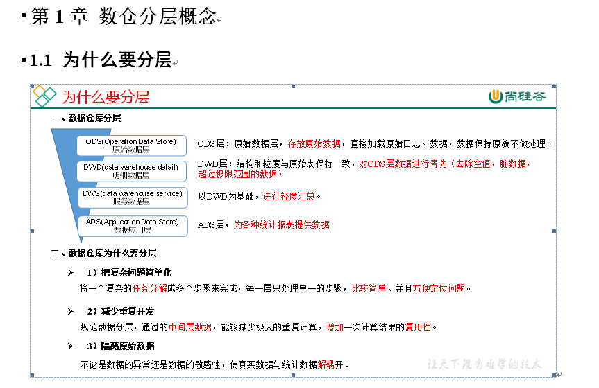

# 用户行为数据仓库



# 数仓搭建之ODS层

## 创建数据库

```shell
hive (default)> create database gmall;
说明：如果数据库存在且有数据，需要强制删除时执行：drop database gmall cascade;

hive (default)> use gmall;
```

# ODS层

原始数据层，存放原始数据，直接加载原始日志、数据，数据保持原貌不做处理。

## 创建启动日志表ods_start_log

- 创建输入数据是lzo输出是text，支持json解析的分区表

```shell
hive (gmall)> 
drop table if exists ods_start_log;
CREATE EXTERNAL TABLE ods_start_log (`line` string)
PARTITIONED BY (`dt` string)
STORED AS
  INPUTFORMAT 'com.hadoop.mapred.DeprecatedLzoTextInputFormat'
  OUTPUTFORMAT 'org.apache.hadoop.hive.ql.io.HiveIgnoreKeyTextOutputFormat'
LOCATION '/warehouse/gmall/ods/ods_start_log';
```

说明Hive的LZO压缩：https://cwiki.apache.org/confluence/display/Hive/LanguageManual+LZO

- 加载数据

```shell
hive (gmall)> load data inpath '/origin_data/gmall/log/topic_start/2020-06-25' into table gmall.ods_start_log partition(dt='2020-06-25');
```

注意：时间格式都配置成YYYY-MM-DD格式，这是Hive默认支持的时间格式

- 查看是否加载成功

```sql
hive (gmall)> select * from ods_start_log limit 2;
```

## 创建事件日志表ods_event_log

- 创建输入数据是lzo输出是text，支持json解析的分区表

```sql
hive (gmall)> 
drop table if exists ods_event_log;
CREATE EXTERNAL TABLE ods_event_log(`line` string)
PARTITIONED BY (`dt` string)
STORED AS
  INPUTFORMAT 'com.hadoop.mapred.DeprecatedLzoTextInputFormat'
  OUTPUTFORMAT 'org.apache.hadoop.hive.ql.io.HiveIgnoreKeyTextOutputFormat'
LOCATION '/warehouse/gmall/ods/ods_event_log';
```

- 加载数据

```shell
hive (gmall)> 
load data inpath '/origin_data/gmall/log/topic_event/2020-06-25' into table gmall.ods_event_log partition(dt='2020-06-25');
```

- 查看是否加载成功

```sql
hive (gmall)> select * from ods_event_log limit 2;
```

## ODS层加载数据脚本

```shell
[root@node01 ~]# cd bin/
[root@node01 bin]# vi ods_log.sh

#!/bin/bash

# 定义变量方便修改
APP=gmall
hive=/opt/stanlong/hive/bin/hive

# 如果是输入的日期按照取输入日期；如果没输入日期取当前时间的前一天
if [ -n "$1" ] ;then
   do_date=$1
else 
   do_date=`date -d "-1 day" +%F`
fi 

echo "===日志日期为 $do_date==="
sql="
load data inpath '/origin_data/gmall/log/topic_start/$do_date' into table "$APP".ods_start_log partition(dt='$do_date');

load data inpath '/origin_data/gmall/log/topic_event/$do_date' into table "$APP".ods_event_log partition(dt='$do_date');
"

$hive -e "$sql"

```

说明1：

[ -n 变量值 ] 判断变量的值，是否为空

-- 变量的值，非空，返回true

-- 变量的值，为空，返回false

说明2：

查看date命令的使用，[atguigu@hadoop102 ~]$ date --help

# 数仓搭建之DWD层

对ODS层数据进行清洗（去除空值，脏数据，超过极限范围的数据，行式存储改为列存储，改压缩格式）

## DWD层启动表数据解析

- 创建启动表

```sql
hive (gmall)> 
drop table if exists dwd_start_log;
CREATE EXTERNAL TABLE dwd_start_log(
`mid_id` string,
`user_id` string, 
`version_code` string, 
`version_name` string, 
`lang` string, 
`source` string, 
`os` string, 
`area` string, 
`model` string,
`brand` string, 
`sdk_version` string, 
`gmail` string, 
`height_width` string,  
`app_time` string,
`network` string, 
`lng` string, 
`lat` string, 
`entry` string, 
`open_ad_type` string, 
`action` string, 
`loading_time` string, 
`detail` string, 
`extend1` string
)
PARTITIONED BY (dt string)
location '/warehouse/gmall/dwd/dwd_start_log/';
```

- 向启动表导入数据

```sql
hive (gmall)> 
insert overwrite table dwd_start_log
PARTITION (dt='2020-06-25')
select 
    get_json_object(line,'$.mid') mid_id,
    get_json_object(line,'$.uid') user_id,
    get_json_object(line,'$.vc') version_code,
    get_json_object(line,'$.vn') version_name,
    get_json_object(line,'$.l') lang,
    get_json_object(line,'$.sr') source,
    get_json_object(line,'$.os') os,
    get_json_object(line,'$.ar') area,
    get_json_object(line,'$.md') model,
    get_json_object(line,'$.ba') brand,
    get_json_object(line,'$.sv') sdk_version,
    get_json_object(line,'$.g') gmail,
    get_json_object(line,'$.hw') height_width,
    get_json_object(line,'$.t') app_time,
    get_json_object(line,'$.nw') network,
    get_json_object(line,'$.ln') lng,
    get_json_object(line,'$.la') lat,
    get_json_object(line,'$.entry') entry,
    get_json_object(line,'$.open_ad_type') open_ad_type,
    get_json_object(line,'$.action') action,
    get_json_object(line,'$.loading_time') loading_time,
    get_json_object(line,'$.detail') detail,
    get_json_object(line,'$.extend1') extend1
from ods_start_log 
where dt='2020-06-25';
```

- 测试

```shell
hive (gmall)> select * from dwd_start_log limit 2;
```

- DWD层启动表加载数据脚本

```shell
#!/bin/bash

# 定义变量方便修改
APP=gmall
hive=/opt/stanlong/hive/bin/hive

# 如果是输入的日期按照取输入日期；如果没输入日期取当前时间的前一天
if [ -n "$1" ] ;then
        do_date=$1
else
        do_date=`date -d "-1 day" +%F`
fi

sql="
set hive.exec.dynamic.partition.mode=nonstrict;

insert overwrite table "$APP".dwd_start_log
PARTITION (dt='$do_date')
select
    get_json_object(line,'$.mid') mid_id,
    get_json_object(line,'$.uid') user_id,
    get_json_object(line,'$.vc') version_code,
    get_json_object(line,'$.vn') version_name,
    get_json_object(line,'$.l') lang,
    get_json_object(line,'$.sr') source,
    get_json_object(line,'$.os') os,
    get_json_object(line,'$.ar') area,
    get_json_object(line,'$.md') model,
    get_json_object(line,'$.ba') brand,
    get_json_object(line,'$.sv') sdk_version,
    get_json_object(line,'$.g') gmail,
    get_json_object(line,'$.hw') height_width,
    get_json_object(line,'$.t') app_time,
    get_json_object(line,'$.nw') network,
    get_json_object(line,'$.ln') lng,
    get_json_object(line,'$.la') lat,
    get_json_object(line,'$.entry') entry,
    get_json_object(line,'$.open_ad_type') open_ad_type,
    get_json_object(line,'$.action') action,
    get_json_object(line,'$.loading_time') loading_time,
    get_json_object(line,'$.detail') detail,
    get_json_object(line,'$.extend1') extend1
from "$APP".ods_start_log
where dt='$do_date';
"

$hive -e "$sql"
```

## DWD层事件表数据解析

- 创建基础明细表

```sql
hive (gmall)> 
drop table if exists dwd_base_event_log;
CREATE EXTERNAL TABLE dwd_base_event_log(
`mid_id` string,
`user_id` string, 
`version_code` string, 
`version_name` string, 
`lang` string, 
`source` string, 
`os` string, 
`area` string, 
`model` string,
`brand` string, 
`sdk_version` string, 
`gmail` string, 
`height_width` string, 
`app_time` string, 
`network` string, 
`lng` string, 
`lat` string, 
`event_name` string, 
`event_json` string, 
`server_time` string)
PARTITIONED BY (`dt` string)
stored as parquet
location '/warehouse/gmall/dwd/dwd_base_event_log/';
```

说明：其中event_name和event_json用来对应事件名和整个事件。这个地方将原始日志1对多的形式拆分出来了。操作的时候我们需要将原始日志展平，需要用到UDF和UDTF

- 自定义UDF函数（解析公共字段）

1）创建一个maven工程：hivefunction

2）创建包名：com.atguigu.udf

3）在pom.xml文件中添加如下内容

```xml
<properties>
    <project.build.sourceEncoding>UTF8</project.build.sourceEncoding>
    <hive.version>1.2.1</hive.version>
</properties>

<dependencies>
    <!--添加hive依赖-->
    <dependency>
        <groupId>org.apache.hive</groupId>
        <artifactId>hive-exec</artifactId>
        <version>${hive.version}</version>
    </dependency>
</dependencies>

<build>
    <plugins>
        <plugin>
            <artifactId>maven-compiler-plugin</artifactId>
            <version>2.3.2</version>
            <configuration>
                <source>1.8</source>
                <target>1.8</target>
            </configuration>
        </plugin>
        <plugin>
            <artifactId>maven-assembly-plugin</artifactId>
            <configuration>
                <descriptorRefs>
                    <descriptorRef>jar-with-dependencies</descriptorRef>
                </descriptorRefs>
            </configuration>
            <executions>
                <execution>
                    <id>make-assembly</id>
                    <phase>package</phase>
                    <goals>
                        <goal>single</goal>
                    </goals>
                </execution>
            </executions>
        </plugin>
    </plugins>
</build>
```

4）UDF用于解析公共字段

```java
package com.atguigu.udf;

import org.apache.commons.lang.StringUtils;
import org.apache.hadoop.hive.ql.exec.UDF;
import org.json.JSONException;
import org.json.JSONObject;

public class BaseFieldUDF extends UDF {

    public String evaluate(String line, String jsonkeysString) {
        
        // 0 准备一个sb
        StringBuilder sb = new StringBuilder();

        // 1 切割jsonkeys  mid uid vc vn l sr os ar md
        String[] jsonkeys = jsonkeysString.split(",");

        // 2 处理line   服务器时间 | json
        String[] logContents = line.split("\\|");

        // 3 合法性校验
        if (logContents.length != 2 || StringUtils.isBlank(logContents[1])) {
            return "";
        }

        // 4 开始处理json
        try {
            JSONObject jsonObject = new JSONObject(logContents[1]);

            // 获取cm里面的对象
            JSONObject base = jsonObject.getJSONObject("cm");

            // 循环遍历取值
            for (int i = 0; i < jsonkeys.length; i++) {
                String filedName = jsonkeys[i].trim();

                if (base.has(filedName)) {
                    sb.append(base.getString(filedName)).append("\t");
                } else {
                    sb.append("\t");
                }
            }

            sb.append(jsonObject.getString("et")).append("\t");
            sb.append(logContents[0]).append("\t");
        } catch (JSONException e) {
            e.printStackTrace();
        }

        return sb.toString();
    }

    public static void main(String[] args) {

        String line = "1541217850324|{\"cm\":{\"mid\":\"m7856\",\"uid\":\"u8739\",\"ln\":\"-74.8\",\"sv\":\"V2.2.2\",\"os\":\"8.1.3\",\"g\":\"P7XC9126@gmail.com\",\"nw\":\"3G\",\"l\":\"es\",\"vc\":\"6\",\"hw\":\"640*960\",\"ar\":\"MX\",\"t\":\"1541204134250\",\"la\":\"-31.7\",\"md\":\"huawei-17\",\"vn\":\"1.1.2\",\"sr\":\"O\",\"ba\":\"Huawei\"},\"ap\":\"weather\",\"et\":[{\"ett\":\"1541146624055\",\"en\":\"display\",\"kv\":{\"goodsid\":\"n4195\",\"copyright\":\"ESPN\",\"content_provider\":\"CNN\",\"extend2\":\"5\",\"action\":\"2\",\"extend1\":\"2\",\"place\":\"3\",\"showtype\":\"2\",\"category\":\"72\",\"newstype\":\"5\"}},{\"ett\":\"1541213331817\",\"en\":\"loading\",\"kv\":{\"extend2\":\"\",\"loading_time\":\"15\",\"action\":\"3\",\"extend1\":\"\",\"type1\":\"\",\"type\":\"3\",\"loading_way\":\"1\"}},{\"ett\":\"1541126195645\",\"en\":\"ad\",\"kv\":{\"entry\":\"3\",\"show_style\":\"0\",\"action\":\"2\",\"detail\":\"325\",\"source\":\"4\",\"behavior\":\"2\",\"content\":\"1\",\"newstype\":\"5\"}},{\"ett\":\"1541202678812\",\"en\":\"notification\",\"kv\":{\"ap_time\":\"1541184614380\",\"action\":\"3\",\"type\":\"4\",\"content\":\"\"}},{\"ett\":\"1541194686688\",\"en\":\"active_background\",\"kv\":{\"active_source\":\"3\"}}]}";
        String x = new BaseFieldUDF().evaluate(line, "mid,uid,vc,vn,l,sr,os,ar,md,ba,sv,g,hw,nw,ln,la,t");
        System.out.println(x);
    }
}
```

注意：使用main函数主要用于模拟数据测试

- 自定义UDTF函数（解析具体事件字段）

1）创建包名：com.atguigu.udtf

2）在com.atguigu.udtf包下创建类名：EventJsonUDTF

3）用于展开业务字段

```java
package com.atguigu.udtf;

import org.apache.commons.lang.StringUtils;
import org.apache.hadoop.hive.ql.exec.UDFArgumentException;
import org.apache.hadoop.hive.ql.metadata.HiveException;
import org.apache.hadoop.hive.ql.udf.generic.GenericUDTF;
import org.apache.hadoop.hive.serde2.objectinspector.ObjectInspector;
import org.apache.hadoop.hive.serde2.objectinspector.ObjectInspectorFactory;
import org.apache.hadoop.hive.serde2.objectinspector.StructObjectInspector;
import org.apache.hadoop.hive.serde2.objectinspector.primitive.PrimitiveObjectInspectorFactory;
import org.json.JSONArray;
import org.json.JSONException;

import java.util.ArrayList;

public class EventJsonUDTF extends GenericUDTF {

    //该方法中，我们将指定输出参数的名称和参数类型：
    @Override
    public StructObjectInspector initialize(ObjectInspector[] argOIs) throws UDFArgumentException {

        ArrayList<String> fieldNames = new ArrayList<String>();
        ArrayList<ObjectInspector> fieldOIs = new ArrayList<ObjectInspector>();

        fieldNames.add("event_name");
        fieldOIs.add(PrimitiveObjectInspectorFactory.javaStringObjectInspector);
        fieldNames.add("event_json");
        fieldOIs.add(PrimitiveObjectInspectorFactory.javaStringObjectInspector);

        return ObjectInspectorFactory.getStandardStructObjectInspector(fieldNames, fieldOIs);
    }

    //输入1条记录，输出若干条结果
    @Override
    public void process(Object[] objects) throws HiveException {

        // 获取传入的et
        String input = objects[0].toString();

        // 如果传进来的数据为空，直接返回过滤掉该数据
        if (StringUtils.isBlank(input)) {
            return;
        } else {

            try {
                // 获取一共有几个事件（ad/facoriters）
                JSONArray ja = new JSONArray(input);

                if (ja == null)
                    return;

                // 循环遍历每一个事件
                for (int i = 0; i < ja.length(); i++) {
                    String[] result = new String[2];

                    try {
                        // 取出每个的事件名称（ad/facoriters）
                        result[0] = ja.getJSONObject(i).getString("en");

                        // 取出每一个事件整体
                        result[1] = ja.getString(i);
                    } catch (JSONException e) {
                        continue;
                    }

                    // 将结果返回
                    forward(result);
                }
            } catch (JSONException e) {
                e.printStackTrace();
            }
        }
    }

    //当没有记录处理的时候该方法会被调用，用来清理代码或者产生额外的输出
    @Override
    public void close() throws HiveException {

    }
}
```

2）打包


3）将hivefunction-1.0-SNAPSHOT上传到node01的/opt/stalong/hive/

4）将jar包添加到Hive的classpath