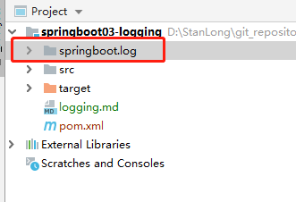

# springboot 日志


```java
// 日志级别，由低到高 trace<debug<info<warn<error
logger.trace("这是trace日志...");
logger.debug("这是debug日志...");
logger.info("这是info日志....");
logger.warn("这是warn日志...");
logger.error("这是error日志..");
```

可以在 applicatin.properties 里调整日志级别， 没有指定级别的就用springboot默认的级别（info级别）

```xml
logging.level.com.example = trace # com.example包下的所有类都是trace级别
```

配置日志输出的路径

```xml
logging.file.path=springboot.log
```



```xm
# 在控制台输出的日志格式 -5 表示左路齐， logger{50}表示50个字符
logging.pattern.console=%d{yyyy-MM-dd HH:mm:ss.SSS} {%thread} %-5level %logger{50} %msg%n

# 输出到文件中的日志格式
logging.pattern.file=%d{yyyy-MM-dd HH:mm:ss.SSS} == {%thread} %-5level %logger{50} %msg%n
```

