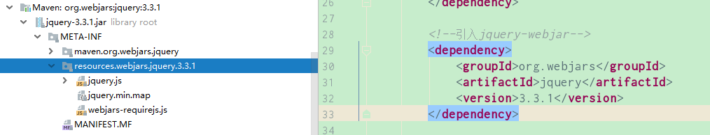
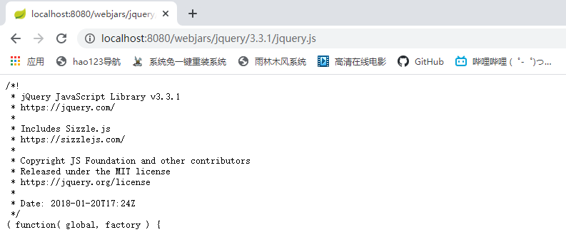
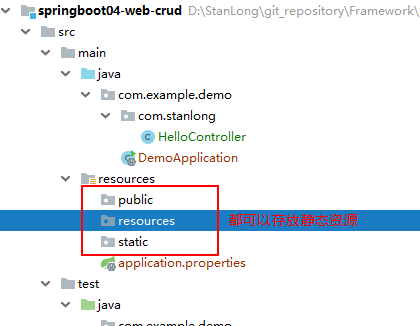
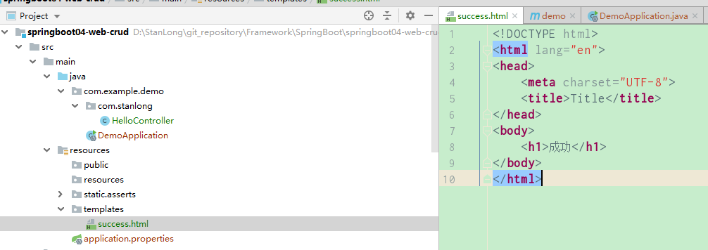
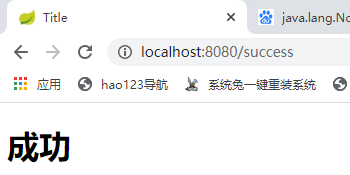

# Spring Boot web操作

## restful-crud 实验

### spring boot 对静态文件的映射规则

1）、 所有 /webjar/** ,都去 classpath:/META-INF/resources/webjars 找资源

​	webjars: 以jar包的方式引入静态资源



访问 jquery: localhost:8080/webjars/jquery/3.3.1/jquery.js

(在访问的时候只需要写webjars下资源的名称即可)



2）、"/**" 访问当前项目的任何资源（静态资源的文件夹）

```xml
"classpath:/META-INF/resources/",
"classpath:/resources/",
"classpath:/static/",
"classpath:/public/",
"/":当前项目的根路径
```



访问 localhost:8080/abc  ==》 访问 去静态资源文件夹里面找abc

3)、欢迎页：静态资源文件夹下所有的 index.html 页面; 被 "/**" 映射。

4）、所有的 **/favicon.ico 都是在静态资源文件下找


## Thymeleaf 模板引擎

1. 引入Thymeleaf

   ```xml
   <!--引入 thymeleaf-->
   <dependency>
       <groupId>org.springframework.boot</groupId>
       <artifactId>spring-boot-starter-thymeleaf</artifactId>
   </dependency>
   
   <!-- 版本覆盖 -->
   <properties>
       <!-- 修改 thymeleaf 版本 -->
       <thymeleaf.version>3.0.9.RELEASE</thymeleaf.version>
       <!-- 布局功能的支持程序  thymeleaf3主程序  layout2以上版本 -->
       <thymeleaf-layout-dialect.version>2.2.2</thymeleaf-layout-dialect.version>
   </properties>
   ```

2. 测试

   ```java
   @RequestMapping("/success")
       public String success(){
           // thymeleaf拼接路径 classpath:/templates/success.html 
           return "success"; 
       }
   ```

   

访问结果：



3.  查出一些数据在页面中展示

   ```java
   @RequestMapping("/success")
       public String success(Map<String, Object> map){
           // classpath:/templates/success.html
           map.put("hello", "你好"); //查出一些数据在页面中展示
           return "success";
       }
   ```

   ```html
   <!DOCTYPE html>
   <!--导入thymeleaf名称空间，会有语法提示 xmlns:th="http://www.thymeleaf.org -->
   <html lang="en" xmlns:th="http://www.thymeleaf.org">
   
   <head>
       <meta charset="UTF-8">
       <title>Title</title>
   </head>
   <body>
       <h1>成功</h1>
       <!-- th:text="" 将div里面的文本内容设置为后台传过来的值 -->
       <div th:text="${hello}">
   
       </div>
   </body>
   </html>
   ```

   

