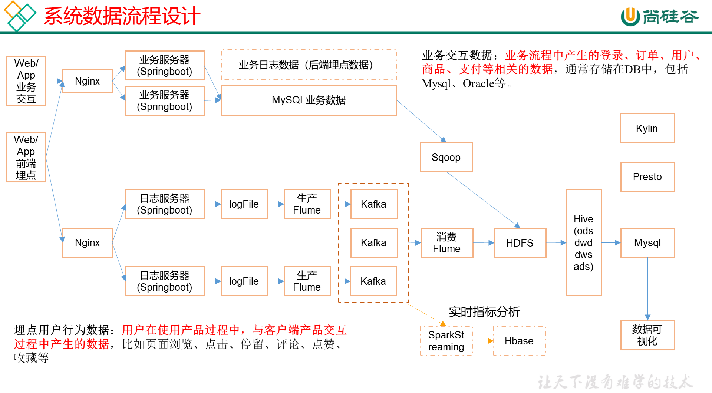
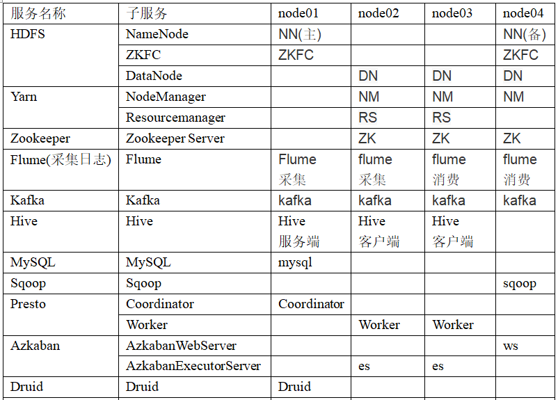

# 数仓介绍

## 数仓概念


## 项目需求及架构分析

### 项目需求

1. 数据采集平台搭建
2. 实现用户行为数据仓库的分层搭建
3. 实现业务数据仓库的分层搭建
4. 针对数据仓库中的数据进行，留存、转化率、GMV、复购率、活跃等报表分析

### 项目架构

#### 技术选型

> **数据采集传输**

Flume， Kafka，Sqoop

> **数据存储**

Mysql, HDFS

> **数据计算**

Hive, Tez, Spark

> **数据查询**

Presto, Druid

#### 数据流程设计



### 集群服务规划

**版本选择**

```
Hadoop 2.9.2
zookeeper-3.4.11
flume-1.9.0
kafka_2.13-2.5.0
```



# 数据生成模块

## 数据埋点基本格式

> 公共字段

基本所有安卓手机都包含的字段

> 业务字段

埋点上报的字段，有具体的业务类型

### 示例数据

```json
{
"ap":"xxxxx",//项目数据来源 app pc
"cm": {  //公共字段
		"mid": "",  // (String) 设备唯一标识
        "uid": "",  // (String) 用户标识
        "vc": "1",  // (String) versionCode，程序版本号
        "vn": "1.0",  // (String) versionName，程序版本名
        "l": "zh",  // (String) 系统语言
        "sr": "",  // (String) 渠道号，应用从哪个渠道来的。
        "os": "7.1.1",  // (String) Android系统版本
        "ar": "CN",  // (String) 区域
        "md": "BBB100-1",  // (String) 手机型号
        "ba": "blackberry",  // (String) 手机品牌
        "sv": "V2.2.1",  // (String) sdkVersion
        "g": "",  // (String) gmail
        "hw": "1620x1080",  // (String) heightXwidth，屏幕宽高
        "t": "1506047606608",  // (String) 客户端日志产生时的时间
        "nw": "WIFI",  // (String) 网络模式
        "ln": 0,  // (double) lng经度
        "la": 0  // (double) lat 纬度
    },
"et":  [  //事件
            {
                "ett": "1506047605364",  //客户端事件产生时间
                "en": "display",  //事件名称
                "kv": {  //事件结果，以key-value形式自行定义
                    "goodsid": "236",
                    "action": "1",
                    "extend1": "1",
"place": "2",
"category": "75"
                }
            }
        ]
}
```

### 示例日志

服务器时间戳 | 日志

```json
1540934156385|{
    "ap": "gmall", 
    "cm": {
        "uid": "1234", 
        "vc": "2", 
        "vn": "1.0", 
        "la": "EN", 
        "sr": "", 
        "os": "7.1.1", 
        "ar": "CN", 
        "md": "BBB100-1", 
        "ba": "blackberry", 
        "sv": "V2.2.1", 
        "g": "abc@gmail.com", 
        "hw": "1620x1080", 
        "t": "1506047606608", 
        "nw": "WIFI", 
        "ln": 0
    }, 
        "et": [
            {
                "ett": "1506047605364",  //客户端事件产生时间
                "en": "display",  //事件名称
                "kv": {  //事件结果，以key-value形式自行定义
                    "goodsid": "236",
                    "action": "1",
                    "extend1": "1",
"place": "2",
"category": "75"
                }
            },{
		        "ett": "1552352626835",
		        "en": "active_background",
		        "kv": {
			         "active_source": "1"
		        }
	        }
        ]
    }
}
```

## 事件日志数据

### 商品列表页

事件名称：loading

| 标签         | 含义                                                         |
| ------------ | ------------------------------------------------------------ |
| action       | 动作：开始加载=1，加载成功=2，加载失败=3                     |
| loading_time | 加载时长：计算下拉开始到接口返回数据的时间，（开始加载报0，加载成功或加载失败才上报时间） |
| loading_way  | 加载类型：1-读取缓存，2-从接口拉新数据   （加载成功才上报加载类型） |
| extend1      | 扩展字段 **Extend1**                                         |
| extend2      | 扩展字段 Extend2                                             |
| type         | 加载类型：自动加载=1，用户下拽加载=2，底部加载=3（底部条触发点击底部提示条/点击返回顶部加载） |
| type1        | 加载失败码：把加载失败状态码报回来（报空为加载成功，没有失败） |

### 商品点击

事件标签：display

| 标签     | 含义                                               |
| -------- | -------------------------------------------------- |
| action   | 动作：曝光商品=1，点击商品=2，                     |
| goodsid  | 商品ID（服务端下发的ID）                           |
| place    | 顺序（第几条商品，第一条为0，第二条为1，如此类推） |
| extend1  | 曝光类型：1 - 首次曝光 2-重复曝光                  |
| category | 分类ID（服务端定义的分类ID）                       |

### 商品详情页

事件标签：newsdetail

| 标签          | 含义                                                         |
| ------------- | ------------------------------------------------------------ |
| entry         | 页面入口来源：应用首页=1、push=2、详情页相关推荐=3           |
| action        | 动作：开始加载=1，加载成功=2（pv），加载失败=3, 退出页面=4   |
| goodsid       | 商品ID（服务端下发的ID）                                     |
| show_style    | 商品样式：0、无图、1、一张大图、2、两张图、3、三张小图、4、一张小图、5、一张大图两张小图 |
| news_staytime | 页面停留时长：从商品开始加载时开始计算，到用户关闭页面所用的时间。若中途用跳转到其它页面了，则暂停计时，待回到详情页时恢复计时。或中途划出的时间超过10分钟，则本次计时作废，不上报本次数据。如未加载成功退出，则报空。 |
| loading_time  | 加载时长：计算页面开始加载到接口返回数据的时间 （开始加载报0，加载成功或加载失败才上报时间） |
| type1         | 加载失败码：把加载失败状态码报回来（报空为加载成功，没有失败） |
| category      | 分类ID（服务端定义的分类ID）                                 |

### 广告

事件名称：ad

| 标签       | 含义                                                         |
| ---------- | ------------------------------------------------------------ |
| entry      | 入口：商品列表页=1 应用首页=2 商品详情页=3                   |
| action     | 动作：请求广告=1 取缓存广告=2 广告位展示=3 广告展示=4 广告点击=5 |
| content    | 状态：成功=1 失败=2                                          |
| detail     | 失败码（没有则上报空）                                       |
| source     | 广告来源:admob=1 facebook=2 ADX（百度）=3 VK（俄罗斯）=4     |
| behavior   | 用户行为：   主动获取广告=1    被动获取广告=2                |
| newstype   | Type: 1-  图文 2-图集 3-段子 4-GIF 5-视频 6-调查 7-纯文 8-视频+图文 9-GIF+图文 0-其他 |
| show_style | 内容样式：无图(纯文字)=6 一张大图=1 三站小图+文=4 一张小图=2 一张大图两张小图+文=3 图集+文 = 5    一张大图+文=11  GIF大图+文=12 视频(大图)+文 = 13   来源于详情页相关推荐的商品，上报样式都为0（因为都是左文右图） |

### 消息通知

事件标签：notification

| 标签    | 含义                                                         |
| ------- | ------------------------------------------------------------ |
| action  | 动作：通知产生=1，通知弹出=2，通知点击=3，常驻通知展示（不重复上报，一天之内只报一次）=4 |
| type    | 通知id：预警通知=1，天气预报（早=2，晚=3），常驻=4           |
| ap_time | 客户端弹出时间                                               |
| content | 备用字段                                                     |

### 用户前台活跃

事件标签: active_foreground

| 标签    | 含义                                         |
| ------- | -------------------------------------------- |
| push_id | 推送的消息的id，如果不是从推送消息打开，传空 |
| access  | 1.push  2.icon 3.其他                        |

### 用户后台活跃

事件标签: active_background

| 标签          | 含义                                        |
| ------------- | ------------------------------------------- |
| active_source | 1=upgrade,2=download(下载),3=plugin_upgrade |

### 评论

事件标签: comment

| **序号** | **字段名称** | **字段描述**                              | **字段类型** | **长度** | **允许空** | **缺省值** |
| -------- | ------------ | ----------------------------------------- | ------------ | -------- | ---------- | ---------- |
| 1        | comment_id   | 评论表                                    | int          | 10,0     |            |            |
| 2        | userid       | 用户id                                    | int          | 10,0     | √          | 0          |
| 3        | p_comment_id | 父级评论id(为0则是一级评论,不为0则是回复) | int          | 10,0     | √          |            |
| 4        | content      | 评论内容                                  | string       | 1000     | √          |            |
| 5        | addtime      | 创建时间                                  | string       |          | √          |            |
| 6        | other_id     | 评论的相关id                              | int          | 10,0     | √          |            |
| 7        | praise_count | 点赞数量                                  | int          | 10,0     | √          | 0          |
| 8        | reply_count  | 回复数量                                  | int          | 10,0     | √          | 0          |

### 收藏

事件标签：favorites

| **序号** | **字段名称** | **字段描述** | **字段类型** | **长度** | **允许空** | **缺省值** |
| -------- | ------------ | ------------ | ------------ | -------- | ---------- | ---------- |
| 1        | id           | 主键         | int          | 10,0     |            |            |
| 2        | course_id    | 商品id       | int          | 10,0     | √          | 0          |
| 3        | userid       | 用户ID       | int          | 10,0     | √          | 0          |
| 4        | add_time     | 创建时间     | string       |          | √          |            |

### 点赞

事件标签：praise

| **序号** | **字段名称** | **字段描述**                                            | **字段类型** | **长度** | **允许空** | **缺省值** |
| -------- | ------------ | ------------------------------------------------------- | ------------ | -------- | ---------- | ---------- |
| 1        | id           | 主键id                                                  | int          | 10,0     |            |            |
| 2        | userid       | 用户id                                                  | int          | 10,0     | √          |            |
| 3        | target_id    | 点赞的对象id                                            | int          | 10,0     | √          |            |
| 4        | type         | 点赞类型 1问答点赞 2问答评论点赞 3 文章点赞数4 评论点赞 | int          | 10,0     | √          |            |
| 5        | add_time     | 添加时间                                                | string       |          | √          |            |

### 错误日志

| errorBrief  | 错误摘要 |
| ----------- | -------- |
| errorDetail | 错误详情 |

## 启动日志数据

事件标签: start action=1可以算成前台活跃

| 标签         | 含义                                                         |
| ------------ | ------------------------------------------------------------ |
| entry        | 入口： push=1，widget=2，icon=3，notification=4, lockscreen_widget =5 |
| open_ad_type | 开屏广告类型: 开屏原生广告=1, 开屏插屏广告=2                 |
| action       | 状态：成功=1 失败=2                                          |
| loading_time | 加载时长：计算下拉开始到接口返回数据的时间，（开始加载报0，加载成功或加载失败才上报时间） |
| detail       | 失败码（没有则上报空）                                       |
| extend1      | 失败的message（没有则上报空）                                |
| en           | 日志类型start                                                |

# 数据生成脚本

见02数据采集工程.md

