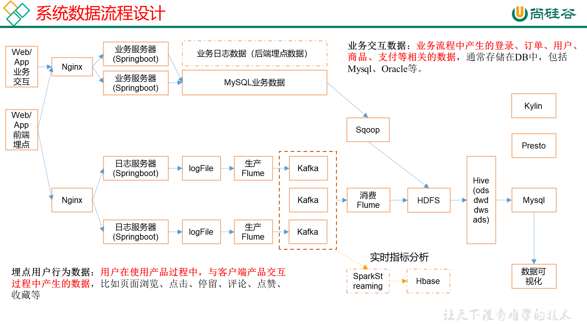

# 电商数仓

## 数仓概念


## 项目需求及架构分析

### 项目需求

1. 数据采集平台搭建
2. 实现用户行为数据仓库的分层搭建
3. 实现业务数据仓库的分层搭建
4. 针对数据仓库中的数据进行，留存、转化率、GMV、复购率、活跃等报表分析

### 项目架构

#### 技术选型

> **数据采集传输**

Flume， Kafka，Sqoop

> **数据存储**

Mysql, HDFS

> **数据计算**

Hive, Tez, Spark

> **数据查询**

Presto, Druid

#### 数据流程设计



### 集群服务规划

**版本选择**

```
Hadoop 2.9.2
zookeeper-3.4.11

```


