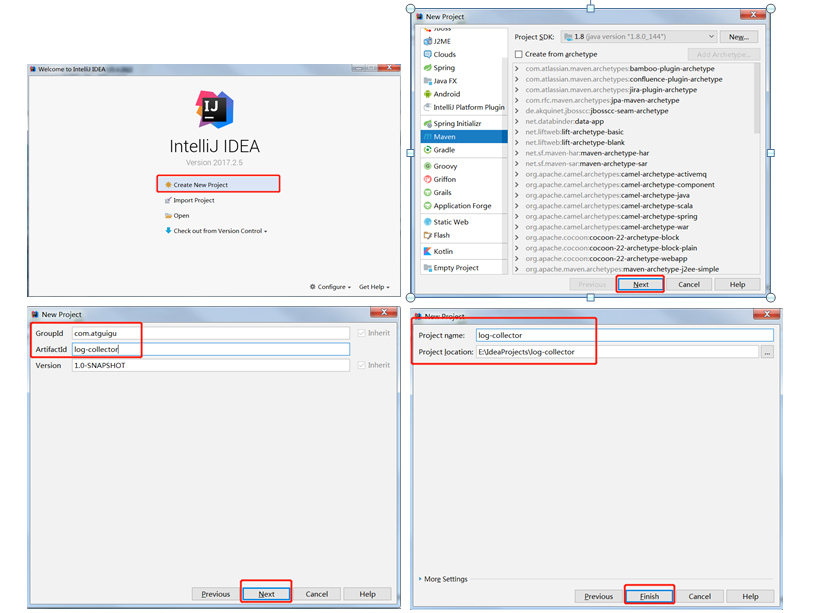
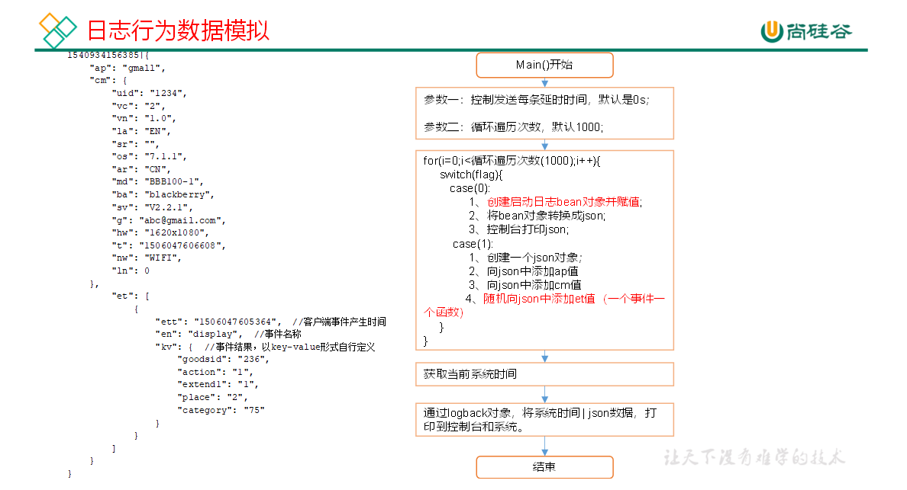
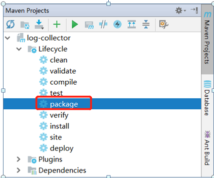
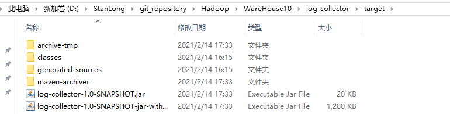

# 数据采集工程

## 创建maven工程

1. 新建maven工程 log-collector



2. 创建一个包名：com.stanlong.appclient

3. 在com.stanlong.appclient包下创建一个类，AppMain

4. 在pom.xml文件中添加如下内容

   ```xml
   <!--版本号统一-->
   <properties>
       <slf4j.version>1.7.20</slf4j.version>
       <logback.version>1.0.7</logback.version>
   </properties>
   
   <dependencies>
       <!--阿里巴巴开源json解析框架-->
       <dependency>
           <groupId>com.alibaba</groupId>
           <artifactId>fastjson</artifactId>
           <version>1.2.70</version>
       </dependency>
   
       <!--日志生成框架-->
       <dependency>
           <groupId>ch.qos.logback</groupId>
           <artifactId>logback-core</artifactId>
           <version>${logback.version}</version>
       </dependency>
       <dependency>
           <groupId>ch.qos.logback</groupId>
           <artifactId>logback-classic</artifactId>
           <version>${logback.version}</version>
       </dependency>
   </dependencies>
   
   <!--编译打包插件-->
   <build>
       <plugins>
           <plugin>
               <artifactId>maven-compiler-plugin</artifactId>
               <version>2.3.2</version>
               <configuration>
                   <source>1.8</source>
                   <target>1.8</target>
               </configuration>
           </plugin>
           <plugin>
               <artifactId>maven-assembly-plugin </artifactId>
               <configuration>
                   <descriptorRefs>
                       <descriptorRef>jar-with-dependencies</descriptorRef>
                   </descriptorRefs>
                   <archive>
                       <manifest>
                           <mainClass>com.stanlong.appclient.AppMain</mainClass>
                       </manifest>
                   </archive>
               </configuration>
               <executions>
                   <execution>
                       <id>make-assembly</id>
                       <phase>package</phase>
                       <goals>
                           <goal>single</goal>
                       </goals>
                   </execution>
               </executions>
           </plugin>
       </plugins>
   </build>
   ```

## 创建段Bean

   1. 创建包名：com.stanlong.bean
   2. 在com.stanlong.bean包下依次创建如下bean对象

### 公共日志

   ```java
   package com.stanlong.bean;
   /**
    * 公共日志
    */
   public class AppBase{
   
       private String mid; // (String) 设备唯一标识
       private String uid; // (String) 用户uid
       private String vc;  // (String) versionCode，程序版本号
       private String vn;  // (String) versionName，程序版本名
       private String l;   // (String) 系统语言
       private String sr;  // (String) 渠道号，应用从哪个渠道来的。
       private String os;  // (String) Android系统版本
       private String ar;  // (String) 区域
       private String md;  // (String) 手机型号
       private String ba;  // (String) 手机品牌
       private String sv;  // (String) sdkVersion
       private String g;   // (String) gmail
       private String hw;  // (String) heightXwidth，屏幕宽高
       private String t;   // (String) 客户端日志产生时的时间
       private String nw;  // (String) 网络模式
       private String ln;  // (double) lng经度
       private String la;  // (double) lat 纬度
       // getter,setter 方法省略
   }
   ```

   ### 启动日志

 ```java
package com.atguigu.bean;
/**
 * 启动日志
 */
public class AppStart extends AppBase {

    private String entry;//入口： push=1，widget=2，icon=3，notification=4, lockscreen_widget =5
    private String open_ad_type;//开屏广告类型:  开屏原生广告=1, 开屏插屏广告=2
    private String action;//状态：成功=1  失败=2
    private String loading_time;//加载时长：计算下拉开始到接口返回数据的时间，（开始加载报0，加载成功或加载失败才上报时间）
    private String detail;//失败码（没有则上报空）
    private String extend1;//失败的message（没有则上报空）
    private String en;//启动日志类型标记
    // getter,setter 方法省略
}
 ```

### 错误日志

```java
package com.atguigu.bean;
/**
 * 错误日志
 */
public class AppErrorLog {

    private String errorBrief;    //错误摘要
    private String errorDetail;   //错误详情
    // getter,setter 方法省略
}
```

### 商品点击日志

```java
package com.atguigu.bean;
/**
 * 商品点击日志
 */
public class AppDisplay {

    private String action;//动作：曝光商品=1，点击商品=2，
    private String goodsid;//商品ID（服务端下发的ID）
    private String place;//顺序（第几条商品，第一条为0，第二条为1，如此类推）
    private String extend1;//曝光类型：1 - 首次曝光 2-重复曝光（没有使用）
    private String category;//分类ID（服务端定义的分类ID）
    // getter,setter 方法省略
}
```

### 商品详情

```java
package com.atguigu.bean;
/**
 * 商品详情
 */
public class AppNewsDetail {

    private String entry;//页面入口来源：应用首页=1、push=2、详情页相关推荐=3
    private String action;//动作：开始加载=1，加载成功=2（pv），加载失败=3, 退出页面=4
    private String goodsid;//商品ID（服务端下发的ID）
    private String showtype;//商品样式：0、无图1、一张大图2、两张图3、三张小图4、一张小图5、一张大图两张小图    来源于详情页相关推荐的商品，上报样式都为0（因为都是左文右图）
    private String news_staytime;//页面停留时长：从商品开始加载时开始计算，到用户关闭页面所用的时间。若中途用跳转到其它页面了，则暂停计时，待回到详情页时恢复计时。或中途划出的时间超过10分钟，则本次计时作废，不上报本次数据。如未加载成功退出，则报空。
    private String loading_time;//加载时长：计算页面开始加载到接口返回数据的时间 （开始加载报0，加载成功或加载失败才上报时间）
    private String type1;//加载失败码：把加载失败状态码报回来（报空为加载成功，没有失败）
    private String category;//分类ID（服务端定义的分类ID）
    // getter,setter 方法省略
}
```

### 商品列表

```java
package com.atguigu.bean;
/**
 * 商品列表
 */
public class AppLoading {
    private String action;//动作：开始加载=1，加载成功=2，加载失败=3
    private String loading_time;//加载时长：计算下拉开始到接口返回数据的时间，（开始加载报0，加载成功或加载失败才上报时间）
    private String loading_way;//加载类型：1-读取缓存，2-从接口拉新数据   （加载成功才上报加载类型）
    private String extend1;//扩展字段 Extend1
    private String extend2;//扩展字段 Extend2
    private String type;//加载类型：自动加载=1，用户下拽加载=2，底部加载=3（底部条触发点击底部提示条/点击返回顶部加载）
    private String type1;//加载失败码：把加载失败状态码报回来（报空为加载成功，没有失败）

    // getter,setter 方法省略
}
```

### 广告

```java
package com.atguigu.bean;
/**
 * 广告
 */
public class AppAd {

    private String entry;//入口：商品列表页=1  应用首页=2 商品详情页=3
    private String action;//动作：请求广告=1 取缓存广告=2  广告位展示=3 广告展示=4 广告点击=5
    private String content;//状态：成功=1  失败=2
    private String detail;//失败码（没有则上报空）
    private String source;//广告来源:admob=1 facebook=2  ADX（百度）=3 VK（俄罗斯）=4
    private String behavior;//用户行为：    主动获取广告=1    被动获取广告=2
    private String newstype;//Type: 1- 图文 2-图集 3-段子 4-GIF 5-视频 6-调查 7-纯文 8-视频+图文  9-GIF+图文  0-其他
    private String show_style;//内容样式：无图(纯文字)=6 一张大图=1  三站小图+文=4 一张小图=2 一张大图两张小图+文=3 图集+文 = 5
                           //一张大图+文=11   GIF大图+文=12  视频(大图)+文 = 13
                           //来源于详情页相关推荐的商品，上报样式都为0（因为都是左文右图）
    // getter,setter 方法省略
}
```

### 消息通知

```java
package com.atguigu.bean;
/**
 * 消息通知日志
 */
public class AppNotification {
    private String action;//动作：通知产生=1，通知弹出=2，通知点击=3，常驻通知展示（不重复上报，一天之内只报一次）=4
    private String type;//通知id：预警通知=1，天气预报（早=2，晚=3），常驻=4
    private String ap_time;//客户端弹出时间
    private String content;//备用字段
    // getter,setter 方法省略
}
```

### 用户前台活跃

```java
package com.atguigu.bean;
/**
 * 用户前台活跃
 */
public class AppActive_foreground {
    private String push_id;//推送的消息的id，如果不是从推送消息打开，传空
    private String access;//1.push 2.icon 3.其他
    // getter,setter 方法省略
}
```

### 用户后台活跃

```java
package com.atguigu.bean;
/**
 * 用户后台活跃
 */
public class AppActive_background {
    private String active_source;//1=upgrade,2=download(下载),3=plugin_upgrade

    // getter,setter 方法省略
}
```

### 用户评论

```java
package com.atguigu.bean;
/**
 * 评论
 */
public class AppComment {

    private int comment_id;//评论表
    private int userid;//用户id
    private  int p_comment_id;//父级评论id(为0则是一级评论,不为0则是回复)
    private String content;//评论内容
    private String addtime;//创建时间
    private int other_id;//评论的相关id
    private int praise_count;//点赞数量
    private int reply_count;//回复数量
    // getter,setter 方法省略
}
```

### 用户收藏

```java
package com.atguigu.bean;
/**
 * 收藏
 */
public class AppFavorites {
    private int id;//主键
    private int course_id;//商品id
    private int userid;//用户ID
    private String add_time;//创建时间
    // getter,setter 方法省略
}
```

### 用户点赞

```java
package com.stanlong.bean;
/**
 * 点赞
 */
public class AppPraise {
    private int id; //主键id
    private int userid;//用户id
    private int target_id;//点赞的对象id
    private int type;//点赞类型 1问答点赞 2问答评论点赞 3 文章点赞数4 评论点赞
    private String add_time;//添加时间
    // getter,setter 方法省略
}
```

## 主函数



在AppMain类中添加如下内容

```java
package com.stanlong.appclient;

import java.io.UnsupportedEncodingException;
import java.util.Random;

import com.alibaba.fastjson.JSON;
import com.alibaba.fastjson.JSONArray;
import com.alibaba.fastjson.JSONObject;
import com.atguigu.bean.*;
import org.slf4j.Logger;
import org.slf4j.LoggerFactory;

/**
 * 日志行为数据模拟
 */
public class AppMain {

    private final static Logger logger = LoggerFactory.getLogger(AppMain.class);
    private static Random rand = new Random();

    // 设备id
    private static int s_mid = 0;

    // 用户id
    private static int s_uid = 0;

    // 商品id
    private static int s_goodsid = 0;

    public static void main(String[] args) {

        // 参数一：控制发送每条的延时时间，默认是0
        Long delay = args.length > 0 ? Long.parseLong(args[0]) : 0L;

        // 参数二：循环遍历次数
        int loop_len = args.length > 1 ? Integer.parseInt(args[1]) : 1000;

        // 生成数据 只生成10条数据来测试
        generateLog(delay, 10);
    }

    private static void generateLog(Long delay, int loop_len) {

        for (int i = 0; i < loop_len; i++) {

            int flag = rand.nextInt(2);

            switch (flag) {
                case (0):
                    //应用启动
                    AppStart appStart = generateStart();
                    String jsonString = JSON.toJSONString(appStart);

                    //控制台打印
                    logger.info(jsonString);
                    break;

                case (1):

                    JSONObject json = new JSONObject();

                    json.put("ap", "app");
                    json.put("cm", generateComFields());

                    JSONArray eventsArray = new JSONArray();

                    // 事件日志
                    // 商品点击，展示
                    if (rand.nextBoolean()) {
                        eventsArray.add(generateDisplay());
                        json.put("et", eventsArray);
                    }

                    // 商品详情页
                    if (rand.nextBoolean()) {
                        eventsArray.add(generateNewsDetail());
                        json.put("et", eventsArray);
                    }

                    // 商品列表页
                    if (rand.nextBoolean()) {
                        eventsArray.add(generateNewList());
                        json.put("et", eventsArray);
                    }

                    // 广告
                    if (rand.nextBoolean()) {
                        eventsArray.add(generateAd());
                        json.put("et", eventsArray);
                    }

                    // 消息通知
                    if (rand.nextBoolean()) {
                        eventsArray.add(generateNotification());
                        json.put("et", eventsArray);
                    }

                    // 用户前台活跃
                    if (rand.nextBoolean()) {
                        eventsArray.add(generatbeforeground());
                        json.put("et", eventsArray);
                    }

                    // 用户后台活跃
                    if (rand.nextBoolean()) {
                        eventsArray.add(generateBackground());
                        json.put("et", eventsArray);
                    }

                    //故障日志
                    if (rand.nextBoolean()) {
                        eventsArray.add(generateError());
                        json.put("et", eventsArray);
                    }

                    // 用户评论
                    if (rand.nextBoolean()) {
                        eventsArray.add(generateComment());
                        json.put("et", eventsArray);
                    }

                    // 用户收藏
                    if (rand.nextBoolean()) {
                        eventsArray.add(generateFavorites());
                        json.put("et", eventsArray);
                    }

                    // 用户点赞
                    if (rand.nextBoolean()) {
                        eventsArray.add(generatePraise());
                        json.put("et", eventsArray);
                    }

                    //时间
                    long millis = System.currentTimeMillis();

                    //控制台打印
                    logger.info(millis + "|" + json.toJSONString());
                    break;
            }

            // 延迟
            try {
                Thread.sleep(delay);
            } catch (InterruptedException e) {
                e.printStackTrace();
            }
        }
    }

    /**
     * 公共字段设置
     */
    private static JSONObject generateComFields() {

        AppBase appBase = new AppBase();

        //设备id
        appBase.setMid(s_mid + "");
        s_mid++;

        // 用户id
        appBase.setUid(s_uid + "");
        s_uid++;

        // 程序版本号 5,6等
        appBase.setVc("" + rand.nextInt(20));

        //程序版本名 v1.1.1
        appBase.setVn("1." + rand.nextInt(4) + "." + rand.nextInt(10));

        // 安卓系统版本
        appBase.setOs("8." + rand.nextInt(3) + "." + rand.nextInt(10));

        // 语言  es,en,pt
        int flag = rand.nextInt(3);
        switch (flag) {
            case (0):
                appBase.setL("es");
                break;
            case (1):
                appBase.setL("en");
                break;
            case (2):
                appBase.setL("pt");
                break;
        }

        // 渠道号   从哪个渠道来的
        appBase.setSr(getRandomChar(1));

        // 区域
        flag = rand.nextInt(2);
        switch (flag) {
            case 0:
                appBase.setAr("BR");
            case 1:
                appBase.setAr("MX");
        }

        // 手机品牌 ba ,手机型号 md，就取2位数字了
        flag = rand.nextInt(3);
        switch (flag) {
            case 0:
                appBase.setBa("Sumsung");
                appBase.setMd("sumsung-" + rand.nextInt(20));
                break;
            case 1:
                appBase.setBa("Huawei");
                appBase.setMd("Huawei-" + rand.nextInt(20));
                break;
            case 2:
                appBase.setBa("HTC");
                appBase.setMd("HTC-" + rand.nextInt(20));
                break;
        }

        // 嵌入sdk的版本
        appBase.setSv("V2." + rand.nextInt(10) + "." + rand.nextInt(10));
        // gmail
        appBase.setG(getRandomCharAndNumr(8) + "@gmail.com");

        // 屏幕宽高 hw
        flag = rand.nextInt(4);
        switch (flag) {
            case 0:
                appBase.setHw("640*960");
                break;
            case 1:
                appBase.setHw("640*1136");
                break;
            case 2:
                appBase.setHw("750*1134");
                break;
            case 3:
                appBase.setHw("1080*1920");
                break;
        }

        // 客户端产生日志时间
        long millis = System.currentTimeMillis();
        appBase.setT("" + (millis - rand.nextInt(99999999)));

        // 手机网络模式 3G,4G,WIFI
        flag = rand.nextInt(3);
        switch (flag) {
            case 0:
                appBase.setNw("3G");
                break;
            case 1:
                appBase.setNw("4G");
                break;
            case 2:
                appBase.setNw("WIFI");
                break;
        }

        // 拉丁美洲 西经34°46′至西经117°09；北纬32°42′至南纬53°54′
        // 经度
        appBase.setLn((-34 - rand.nextInt(83) - rand.nextInt(60) / 10.0) + "");
        // 纬度
        appBase.setLa((32 - rand.nextInt(85) - rand.nextInt(60) / 10.0) + "");

        return (JSONObject) JSON.toJSON(appBase);
    }

    /**
     * 商品展示事件
     */
    private static JSONObject generateDisplay() {

        AppDisplay appDisplay = new AppDisplay();

        boolean boolFlag = rand.nextInt(10) < 7;

        // 动作：曝光商品=1，点击商品=2，
        if (boolFlag) {
            appDisplay.setAction("1");
        } else {
            appDisplay.setAction("2");
        }

        // 商品id
        String goodsId = s_goodsid + "";
        s_goodsid++;

        appDisplay.setGoodsid(goodsId);

        // 顺序  设置成6条吧
        int flag = rand.nextInt(6);
        appDisplay.setPlace("" + flag);

        // 曝光类型
        flag = 1 + rand.nextInt(2);
        appDisplay.setExtend1("" + flag);

        // 分类
        flag = 1 + rand.nextInt(100);
        appDisplay.setCategory("" + flag);

        JSONObject jsonObject = (JSONObject) JSON.toJSON(appDisplay);

        return packEventJson("display", jsonObject);
    }

    /**
     * 商品详情页
     */
    private static JSONObject generateNewsDetail() {

        AppNewsDetail appNewsDetail = new AppNewsDetail();

        // 页面入口来源
        int flag = 1 + rand.nextInt(3);
        appNewsDetail.setEntry(flag + "");

        // 动作
        appNewsDetail.setAction("" + (rand.nextInt(4) + 1));

        // 商品id
        appNewsDetail.setGoodsid(s_goodsid + "");

        // 商品来源类型
        flag = 1 + rand.nextInt(3);
        appNewsDetail.setShowtype(flag + "");

        // 商品样式
        flag = rand.nextInt(6);
        appNewsDetail.setShowtype("" + flag);

        // 页面停留时长
        flag = rand.nextInt(10) * rand.nextInt(7);
        appNewsDetail.setNews_staytime(flag + "");

        // 加载时长
        flag = rand.nextInt(10) * rand.nextInt(7);
        appNewsDetail.setLoading_time(flag + "");

        // 加载失败码
        flag = rand.nextInt(10);
        switch (flag) {
            case 1:
                appNewsDetail.setType1("102");
                break;
            case 2:
                appNewsDetail.setType1("201");
                break;
            case 3:
                appNewsDetail.setType1("325");
                break;
            case 4:
                appNewsDetail.setType1("433");
                break;
            case 5:
                appNewsDetail.setType1("542");
                break;
            default:
                appNewsDetail.setType1("");
                break;
        }

        // 分类
        flag = 1 + rand.nextInt(100);
        appNewsDetail.setCategory("" + flag);

        JSONObject eventJson = (JSONObject) JSON.toJSON(appNewsDetail);

        return packEventJson("newsdetail", eventJson);
    }

    /**
     * 商品列表
     */
    private static JSONObject generateNewList() {

        AppLoading appLoading = new AppLoading();

        // 动作
        int flag = rand.nextInt(3) + 1;
        appLoading.setAction(flag + "");

        // 加载时长
        flag = rand.nextInt(10) * rand.nextInt(7);
        appLoading.setLoading_time(flag + "");

        // 失败码
        flag = rand.nextInt(10);
        switch (flag) {
            case 1:
                appLoading.setType1("102");
                break;
            case 2:
                appLoading.setType1("201");
                break;
            case 3:
                appLoading.setType1("325");
                break;
            case 4:
                appLoading.setType1("433");
                break;
            case 5:
                appLoading.setType1("542");
                break;
            default:
                appLoading.setType1("");
                break;
        }

        // 页面  加载类型
        flag = 1 + rand.nextInt(2);
        appLoading.setLoading_way("" + flag);

        // 扩展字段1
        appLoading.setExtend1("");

        // 扩展字段2
        appLoading.setExtend2("");

        // 用户加载类型
        flag = 1 + rand.nextInt(3);
        appLoading.setType("" + flag);

        JSONObject jsonObject = (JSONObject) JSON.toJSON(appLoading);

        return packEventJson("loading", jsonObject);
    }

    /**
     * 广告相关字段
     */
    private static JSONObject generateAd() {

        AppAd appAd = new AppAd();

        // 入口
        int flag = rand.nextInt(3) + 1;
        appAd.setEntry(flag + "");

        // 动作
        flag = rand.nextInt(5) + 1;
        appAd.setAction(flag + "");

        // 状态
        flag = rand.nextInt(10) > 6 ? 2 : 1;
        appAd.setContent(flag + "");

        // 失败码
        flag = rand.nextInt(10);
        switch (flag) {
            case 1:
                appAd.setDetail("102");
                break;
            case 2:
                appAd.setDetail("201");
                break;
            case 3:
                appAd.setDetail("325");
                break;
            case 4:
                appAd.setDetail("433");
                break;
            case 5:
                appAd.setDetail("542");
                break;
            default:
                appAd.setDetail("");
                break;
        }

        // 广告来源
        flag = rand.nextInt(4) + 1;
        appAd.setSource(flag + "");

        // 用户行为
        flag = rand.nextInt(2) + 1;
        appAd.setBehavior(flag + "");

        // 商品类型
        flag = rand.nextInt(10);
        appAd.setNewstype("" + flag);

        // 展示样式
        flag = rand.nextInt(6);
        appAd.setShow_style("" + flag);

        JSONObject jsonObject = (JSONObject) JSON.toJSON(appAd);

        return packEventJson("ad", jsonObject);
    }

    /**
     * 启动日志
     */
    private static AppStart generateStart() {

        AppStart appStart = new AppStart();

        //设备id
        appStart.setMid(s_mid + "");
        s_mid++;

        // 用户id
        appStart.setUid(s_uid + "");
        s_uid++;

        // 程序版本号 5,6等
        appStart.setVc("" + rand.nextInt(20));

        //程序版本名 v1.1.1
        appStart.setVn("1." + rand.nextInt(4) + "." + rand.nextInt(10));

        // 安卓系统版本
        appStart.setOs("8." + rand.nextInt(3) + "." + rand.nextInt(10));

        //设置日志类型
        appStart.setEn("start");

        //    语言  es,en,pt
        int flag = rand.nextInt(3);
        switch (flag) {
            case (0):
                appStart.setL("es");
                break;
            case (1):
                appStart.setL("en");
                break;
            case (2):
                appStart.setL("pt");
                break;
        }

        // 渠道号   从哪个渠道来的
        appStart.setSr(getRandomChar(1));

        // 区域
        flag = rand.nextInt(2);
        switch (flag) {
            case 0:
                appStart.setAr("BR");
            case 1:
                appStart.setAr("MX");
        }

        // 手机品牌 ba ,手机型号 md，就取2位数字了
        flag = rand.nextInt(3);
        switch (flag) {
            case 0:
                appStart.setBa("Sumsung");
                appStart.setMd("sumsung-" + rand.nextInt(20));
                break;
            case 1:
                appStart.setBa("Huawei");
                appStart.setMd("Huawei-" + rand.nextInt(20));
                break;
            case 2:
                appStart.setBa("HTC");
                appStart.setMd("HTC-" + rand.nextInt(20));
                break;
        }

        // 嵌入sdk的版本
        appStart.setSv("V2." + rand.nextInt(10) + "." + rand.nextInt(10));
        // gmail
        appStart.setG(getRandomCharAndNumr(8) + "@gmail.com");

        // 屏幕宽高 hw
        flag = rand.nextInt(4);
        switch (flag) {
            case 0:
                appStart.setHw("640*960");
                break;
            case 1:
                appStart.setHw("640*1136");
                break;
            case 2:
                appStart.setHw("750*1134");
                break;
            case 3:
                appStart.setHw("1080*1920");
                break;
        }

        // 客户端产生日志时间
        long millis = System.currentTimeMillis();
        appStart.setT("" + (millis - rand.nextInt(99999999)));

        // 手机网络模式 3G,4G,WIFI
        flag = rand.nextInt(3);
        switch (flag) {
            case 0:
                appStart.setNw("3G");
                break;
            case 1:
                appStart.setNw("4G");
                break;
            case 2:
                appStart.setNw("WIFI");
                break;
        }

        // 拉丁美洲 西经34°46′至西经117°09；北纬32°42′至南纬53°54′
        // 经度
        appStart.setLn((-34 - rand.nextInt(83) - rand.nextInt(60) / 10.0) + "");
        // 纬度
        appStart.setLa((32 - rand.nextInt(85) - rand.nextInt(60) / 10.0) + "");

        // 入口
        flag = rand.nextInt(5) + 1;
        appStart.setEntry(flag + "");

        // 开屏广告类型
        flag = rand.nextInt(2) + 1;
        appStart.setOpen_ad_type(flag + "");

        // 状态
        flag = rand.nextInt(10) > 8 ? 2 : 1;
        appStart.setAction(flag + "");

        // 加载时长
        appStart.setLoading_time(rand.nextInt(20) + "");

        // 失败码
        flag = rand.nextInt(10);
        switch (flag) {
            case 1:
                appStart.setDetail("102");
                break;
            case 2:
                appStart.setDetail("201");
                break;
            case 3:
                appStart.setDetail("325");
                break;
            case 4:
                appStart.setDetail("433");
                break;
            case 5:
                appStart.setDetail("542");
                break;
            default:
                appStart.setDetail("");
                break;
        }

        // 扩展字段
        appStart.setExtend1("");

        return appStart;
    }
    /**
     * 消息通知
     */
    private static JSONObject generateNotification() {

        AppNotification appNotification = new AppNotification();

        int flag = rand.nextInt(4) + 1;

        // 动作
        appNotification.setAction(flag + "");

        // 通知id
        flag = rand.nextInt(4) + 1;
        appNotification.setType(flag + "");

        // 客户端弹时间
        appNotification.setAp_time((System.currentTimeMillis() - rand.nextInt(99999999)) + "");

        // 备用字段
        appNotification.setContent("");

        JSONObject jsonObject = (JSONObject) JSON.toJSON(appNotification);

        return packEventJson("notification", jsonObject);
    }

    /**
     * 前台活跃
     */
    private static JSONObject generatbeforeground() {

        AppActive_foreground appActive_foreground = new AppActive_foreground();

        // 推送消息的id
        int flag = rand.nextInt(2);
        switch (flag) {
            case 1:
                appActive_foreground.setAccess(flag + "");
                break;
            default:
                appActive_foreground.setAccess("");
                break;
        }

        // 1.push 2.icon 3.其他
        flag = rand.nextInt(3) + 1;
        appActive_foreground.setPush_id(flag + "");

        JSONObject jsonObject = (JSONObject) JSON.toJSON(appActive_foreground);

        return packEventJson("active_foreground", jsonObject);
    }

    /**
     * 后台活跃
     */
    private static JSONObject generateBackground() {

        AppActive_background appActive_background = new AppActive_background();

        // 启动源
        int flag = rand.nextInt(3) + 1;
        appActive_background.setActive_source(flag + "");

        JSONObject jsonObject = (JSONObject) JSON.toJSON(appActive_background);

        return packEventJson("active_background", jsonObject);
    }

    /**
     * 错误日志数据
     */
    private static JSONObject generateError() {

        AppErrorLog appErrorLog = new AppErrorLog();

        String[] errorBriefs = {"at cn.lift.dfdf.web.AbstractBaseController.validInbound(AbstractBaseController.java:72)", "at cn.lift.appIn.control.CommandUtil.getInfo(CommandUtil.java:67)"};        //错误摘要
        String[] errorDetails = {"java.lang.NullPointerException\\n    " + "at cn.lift.appIn.web.AbstractBaseController.validInbound(AbstractBaseController.java:72)\\n " + "at cn.lift.dfdf.web.AbstractBaseController.validInbound", "at cn.lift.dfdfdf.control.CommandUtil.getInfo(CommandUtil.java:67)\\n " + "at sun.reflect.DelegatingMethodAccessorImpl.invoke(DelegatingMethodAccessorImpl.java:43)\\n" + " at java.lang.reflect.Method.invoke(Method.java:606)\\n"};        //错误详情

        //错误摘要
        appErrorLog.setErrorBrief(errorBriefs[rand.nextInt(errorBriefs.length)]);
        //错误详情
        appErrorLog.setErrorDetail(errorDetails[rand.nextInt(errorDetails.length)]);

        JSONObject jsonObject = (JSONObject) JSON.toJSON(appErrorLog);

        return packEventJson("error", jsonObject);
    }

    /**
     * 为各个事件类型的公共字段（时间、事件类型、Json数据）拼接
     */
    private static JSONObject packEventJson(String eventName, JSONObject jsonObject) {

        JSONObject eventJson = new JSONObject();

        eventJson.put("ett", (System.currentTimeMillis() - rand.nextInt(99999999)) + "");
        eventJson.put("en", eventName);
        eventJson.put("kv", jsonObject);

        return eventJson;
    }

    /**
     * 获取随机字母组合
     *
     * @param length 字符串长度
     */
    private static String getRandomChar(Integer length) {

        StringBuilder str = new StringBuilder();
        Random random = new Random();

        for (int i = 0; i < length; i++) {
            // 字符串
            str.append((char) (65 + random.nextInt(26)));// 取得大写字母
        }

        return str.toString();
    }

    /**
     * 获取随机字母数字组合
     *
     * @param length 字符串长度
     */
    private static String getRandomCharAndNumr(Integer length) {

        StringBuilder str = new StringBuilder();
        Random random = new Random();

        for (int i = 0; i < length; i++) {

            boolean b = random.nextBoolean();

            if (b) { // 字符串
                // int choice = random.nextBoolean() ? 65 : 97; 取得65大写字母还是97小写字母
                str.append((char) (65 + random.nextInt(26)));// 取得大写字母
            } else { // 数字
                str.append(String.valueOf(random.nextInt(10)));
            }
        }

        return str.toString();
    }

    /**
     * 收藏
     */
    private static JSONObject generateFavorites() {

        AppFavorites favorites = new AppFavorites();

        favorites.setCourse_id(rand.nextInt(10));
        favorites.setUserid(rand.nextInt(10));
        favorites.setAdd_time((System.currentTimeMillis() - rand.nextInt(99999999)) + "");

        JSONObject jsonObject = (JSONObject) JSON.toJSON(favorites);

        return packEventJson("favorites", jsonObject);
    }

    /**
     * 点赞
     */
    private static JSONObject generatePraise() {

        AppPraise praise = new AppPraise();

        praise.setId(rand.nextInt(10));
        praise.setUserid(rand.nextInt(10));
        praise.setTarget_id(rand.nextInt(10));
        praise.setType(rand.nextInt(4) + 1);
        praise.setAdd_time((System.currentTimeMillis() - rand.nextInt(99999999)) + "");

        JSONObject jsonObject = (JSONObject) JSON.toJSON(praise);

        return packEventJson("praise", jsonObject);
    }

    /**
     * 评论
     */
    private static JSONObject generateComment() {

        AppComment comment = new AppComment();

        comment.setComment_id(rand.nextInt(10));
        comment.setUserid(rand.nextInt(10));
        comment.setP_comment_id(rand.nextInt(5));

        comment.setContent(getCONTENT());
        comment.setAddtime((System.currentTimeMillis() - rand.nextInt(99999999)) + "");

        comment.setOther_id(rand.nextInt(10));
        comment.setPraise_count(rand.nextInt(1000));
        comment.setReply_count(rand.nextInt(200));

        JSONObject jsonObject = (JSONObject) JSON.toJSON(comment);

        return packEventJson("comment", jsonObject);
    }

    /**
     * 生成单个汉字
     */
    private static char getRandomChar() {

        String str = "";
        int hightPos; //
        int lowPos;

        Random random = new Random();

        //随机生成汉子的两个字节
        hightPos = (176 + Math.abs(random.nextInt(39)));
        lowPos = (161 + Math.abs(random.nextInt(93)));

        byte[] b = new byte[2];
        b[0] = (Integer.valueOf(hightPos)).byteValue();
        b[1] = (Integer.valueOf(lowPos)).byteValue();

        try {
            str = new String(b, "GBK");
        } catch (UnsupportedEncodingException e) {
            e.printStackTrace();
            System.out.println("错误");
        }

        return str.charAt(0);
    }

    /**
     * 拼接成多个汉字
     */
    private static String getCONTENT() {

        StringBuilder str = new StringBuilder();

        for (int i = 0; i < rand.nextInt(100); i++) {
            str.append(getRandomChar());
        }

        return str.toString();
    }
}
```

## 配置日志打印Logback

Logback主要用于在磁盘和控制台打印日志。

Logback具体使用：

1）在resources文件夹下创建logback.xml文件。

2）在logback.xml文件中填写如下配置

```xml
<?xml version="1.0" encoding="UTF-8"?>
<configuration debug="false">
   <!--定义日志文件的存储地址 勿在 LogBack 的配置中使用相对路径 -->
   <property name="LOG_HOME" value="/tmp/logs/" />

   <!-- 控制台输出 -->
   <appender name="STDOUT"
      class="ch.qos.logback.core.ConsoleAppender">
      <encoder
         class="ch.qos.logback.classic.encoder.PatternLayoutEncoder">
         <!--格式化输出：%d表示日期，%thread表示线程名，%-5level：级别从左显示5个字符宽度%msg：日志消息，%n是换行符 -->
         <pattern>%d{yyyy-MM-dd HH:mm:ss.SSS} [%thread] %-5level %logger{50} - %msg%n</pattern>
      </encoder>
   </appender>
   
   <!-- 按照每天生成日志文件。存储事件日志 -->
   <appender name="FILE"
      class="ch.qos.logback.core.rolling.RollingFileAppender">
      <!-- <File>${LOG_HOME}/app.log</File>设置日志不超过${log.max.size}时的保存路径，注意，如果是web项目会保存到Tomcat的bin目录 下 -->  
      <rollingPolicy
         class="ch.qos.logback.core.rolling.TimeBasedRollingPolicy">
         <!--日志文件输出的文件名 -->
         <FileNamePattern>${LOG_HOME}/app-%d{yyyy-MM-dd}.log</FileNamePattern>
         <!--日志文件保留天数 -->
         <MaxHistory>30</MaxHistory>
      </rollingPolicy>
      <encoder
         class="ch.qos.logback.classic.encoder.PatternLayoutEncoder">
         <pattern>%msg%n</pattern>
      </encoder>
      <!--日志文件最大的大小 -->
      <triggeringPolicy
         class="ch.qos.logback.core.rolling.SizeBasedTriggeringPolicy">
         <MaxFileSize>10MB</MaxFileSize>
      </triggeringPolicy>
   </appender>

    <!--异步打印日志-->
    <appender name ="ASYNC_FILE" class= "ch.qos.logback.classic.AsyncAppender">
        <!-- 不丢失日志.默认的,如果队列的80%已满,则会丢弃TRACT、DEBUG、INFO级别的日志 -->
        <discardingThreshold >0</discardingThreshold>
        <!-- 更改默认的队列的深度,该值会影响性能.默认值为256 -->
        <queueSize>512</queueSize>
        <!-- 添加附加的appender,最多只能添加一个 -->
        <appender-ref ref = "FILE"/>
    </appender>

    <!-- 日志输出级别 -->
   <root level="INFO">
      <appender-ref ref="STDOUT" />
      <appender-ref ref="ASYNC_FILE" />
      <appender-ref ref="error" />
   </root>
</configuration>
```

## 打包

1. 采用Maven对程序打包

   

```
[INFO] Building jar: D:\StanLong\git_repository\Hadoop\WareHouse10\log-collector\target\log-collector-1.0-SNAPSHOT-jar-with-dependencies.jar
```



采用带依赖的jar包。包含了程序运行需要的所有依赖

log-collector-1.0-SNAPSHOT-jar-with-dependencies.jar

# 生成日志

## 日志数据测试

1. 上传jar包到node01

   ```shell
   [root@node01 appmain]# pwd
   /opt/stanlong/appmain
   [root@node01 appmain]# ll
   -rw-r--r--   1 root  root   1310034 Feb 14 17:33 log-collector-1.0-SNAPSHOT-jar-with-dependencies.jar
   ```

2. 执行

   ```shell
   [root@node01 ~]# java -classpath /opt/stanlong/appmain/log-collector-1.0-SNAPSHOT-jar-with-dependencies.jar com.stanlong.appclient.AppMain  > /var/data/applog/appmain.log
   ```

3. 查看数据

   ```json
   [root@node01 logs]# cd /tmp/logs/
   [root@node01 logs]# ll
   total 708
   -rw-r--r-- 1 root root 721121 Feb 15 04:50 app-2021-02-15.log
   [root@node01 logs]# cat app-2021-02-15.log 
   
   {
   	"action": "1",
   	"ar": "MX",
   	"ba": "HTC",
   	"detail": "201",
   	"en": "start",
   	"entry": "5",
   	"extend1": "",
   	"g": "M8A75YA8@gmail.com",
   	"hw": "750*1134",
   	"l": "es",
   	"la": "-35.0",
   	"ln": "-116.2",
   	"loading_time": "18",
   	"md": "HTC-1",
   	"mid": "0",
   	"nw": "4G",
   	"open_ad_type": "1",
   	"os": "8.1.8",
   	"sr": "E",
   	"sv": "V2.2.1",
   	"t": "1613327594060",
   	"uid": "0",
   	"vc": "5",
   	"vn": "1.0.6"
   }
   1613335815760|{
   	"cm": {
   		"ln": "-47.1",
   		"sv": "V2.4.7",
   		"os": "8.2.2",
   		"g": "L88BOO6B@gmail.com",
   		"mid": "1",
   		"nw": "WIFI",
   		"l": "es",
   		"vc": "12",
   		"hw": "640*1136",
   		"ar": "MX",
   		"uid": "1",
   		"t": "1613319692090",
   		"la": "-16.8",
   		"md": "Huawei-4",
   		"vn": "1.3.8",
   		"ba": "Huawei",
   		"sr": "H"
   	},
   	"ap": "app",
   	"et": [{
   		"ett": "1613320384981",
   		"en": "newsdetail",
   		"kv": {
   			"entry": "1",
   			"goodsid": "0",
   			"news_staytime": "12",
   			"loading_time": "0",
   			"action": "4",
   			"showtype": "3",
   			"category": "25",
   			"type1": ""
   		}
   	}, {
   		"ett": "1613287109288",
   		"en": "ad",
   		"kv": {
   			"entry": "2",
   			"show_style": "1",
   			"action": "1",
   			"detail": "",
   			"source": "3",
   			"behavior": "2",
   			"content": "1",
   			"newstype": "4"
   		}
   	}, {
   		"ett": "1613332302698",
   		"en": "notification",
   		"kv": {
   			"ap_time": "1613279647316",
   			"action": "1",
   			"type": "4",
   			"content": ""
   		}
   	}, {
   		"ett": "1613301149721",
   		"en": "active_foreground",
   		"kv": {
   			"access": "",
   			"push_id": "3"
   		}
   	}, {
   		"ett": "1613236429471",
   		"en": "active_background",
   		"kv": {
   			"active_source": "1"
   		}
   	}, {
   		"ett": "1613249016857",
   		"en": "praise",
   		"kv": {
   			"target_id": 8,
   			"id": 1,
   			"type": 2,
   			"add_time": "1613326149454",
   			"userid": 6
   		}
   	}]
   }
   ```

## 分发jar包

```shell
[root@node01 appmain]# scp log-collector-1.0-SNAPSHOT-jar-with-dependencies.jar node02:`pwd`
[root@node01 appmain]# scp log-collector-1.0-SNAPSHOT-jar-with-dependencies.jar node03:`pwd`
```

## 日志生成脚本

```shell
[root@node01 appmain]# vi lg.sh

#! /bin/bash

for i in node01 node02 node03 
do
	ssh $i java -classpath /opt/stanlong/appmain/log-collector-1.0-SNAPSHOT-jar-with-dependencies.jar com.stanlong.appclient.AppMain $1 $2 > /var/data/applog/appmain.log
done

[root@node01 appmain]# chmod +x lg.sh
```

## 集群时间同步脚本

```shell
[root@node01 appmain]# vi dt.sh

#!/bin/bash
log_date=$1
for i in node02 node03 node04
do
	ssh -t $i "sudo date -s $log_date"
done

[root@node01 appmain]# chmod +x dt.sh
```


