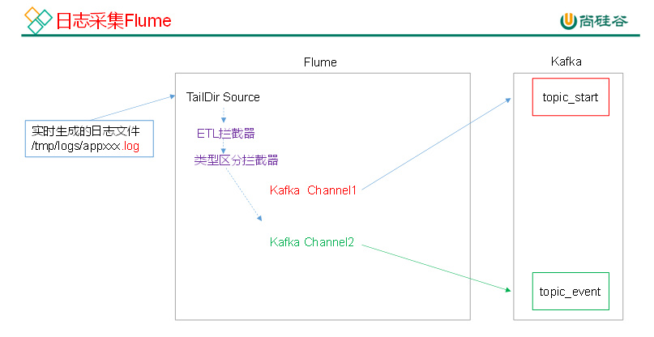
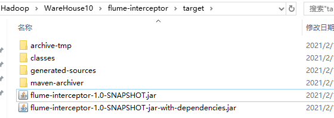

# 日志采集flume



flume 安装见Hadoop/16Flume

## flume 的具体配置

```shell
[root@node01 conf]# pwd
/opt/stanlong/flume/apache-flume-1.9.0-bin/conf
[root@node01 conf]# vi file-flume-kafka.conf

a1.sources=r1
a1.channels=c1 c2

# configure source
a1.sources.r1.type = TAILDIR
a1.sources.r1.positionFile = /opt/stanlong/flume/test/log_position.json
a1.sources.r1.filegroups = f1
a1.sources.r1.filegroups.f1 = /tmp/logs/app.+
a1.sources.r1.fileHeader = true
a1.sources.r1.channels = c1 c2

#interceptor
a1.sources.r1.interceptors =  i1 i2
a1.sources.r1.interceptors.i1.type = com.atguigu.flume.interceptor.LogETLInterceptor$Builder
a1.sources.r1.interceptors.i2.type = com.atguigu.flume.interceptor.LogTypeInterceptor$Builder

a1.sources.r1.selector.type = multiplexing
a1.sources.r1.selector.header = topic
a1.sources.r1.selector.mapping.topic_start = c1
a1.sources.r1.selector.mapping.topic_event = c2

# configure channel
a1.channels.c1.type = org.apache.flume.channel.kafka.KafkaChannel
a1.channels.c1.kafka.bootstrap.servers = node01:9092,node02:9092
a1.channels.c1.kafka.topic = topic_start
a1.channels.c1.parseAsFlumeEvent = false
a1.channels.c1.kafka.consumer.group.id = flume-consumer

a1.channels.c2.type = org.apache.flume.channel.kafka.KafkaChannel
a1.channels.c2.kafka.bootstrap.servers = node01:9092,node02:9092
a1.channels.c2.kafka.topic = topic_event
a1.channels.c2.parseAsFlumeEvent = false
a1.channels.c2.kafka.consumer.group.id = flume-consumer
```

注意：`com.stanlong.flume.interceptor.LogETLInterceptor`和`com.stanlong.flume.interceptor.LogTypeInterceptor`是自定义的拦截器的全类名。需要根据用户自定义的拦截器做相应修改

## 编写拦截器

本项目中自定义了两个拦截器，分别是：ETL拦截器、日志类型区分拦截器。

ETL拦截器主要用于，过滤时间戳不合法和Json数据不完整的日志

日志类型区分拦截器主要用于，将启动日志和事件日志区分开来，方便发往Kafka的不同Topic。

1. 创建Maven工程flume-interceptor

2. 创建包名：com.stanlong.flume.interceptor

3. 在pom.xml文件中添加如下配置

   ```xml
   <dependencies>
       <dependency>
           <groupId>org.apache.flume</groupId>
           <artifactId>flume-ng-core</artifactId>
           <version>1.7.0</version>
       </dependency>
   </dependencies>
   
   <build>
       <plugins>
           <plugin>
               <artifactId>maven-compiler-plugin</artifactId>
               <version>2.3.2</version>
               <configuration>
                   <source>1.8</source>
                   <target>1.8</target>
               </configuration>
           </plugin>
           <plugin>
               <artifactId>maven-assembly-plugin</artifactId>
               <configuration>
                   <descriptorRefs>
                       <descriptorRef>jar-with-dependencies</descriptorRef>
                   </descriptorRefs>
               </configuration>
               <executions>
                   <execution>
                       <id>make-assembly</id>
                       <phase>package</phase>
                       <goals>
                           <goal>single</goal>
                       </goals>
                   </execution>
               </executions>
           </plugin>
       </plugins>
   </build>
   ```

4. 在com.stanlong.flume.interceptor包下创建Flume日志过滤工具类

   ```java
   package com.stanlong.flume.interceptor;
   import org.apache.commons.lang.math.NumberUtils;
   /**
    * Flume日志过滤工具类
    */
   public class LogUtils {
   
       public static boolean validateEvent(String log) {
           // 服务器时间 | json
           // 1549696569054 | {"cm":{"ln":"-89.2","sv":"V2.0.4","os":"8.2.0","g":"M67B4QYU@gmail.com","nw":"4G","l":"en","vc":"18","hw":"1080*1920","ar":"MX","uid":"u8678","t":"1549679122062","la":"-27.4","md":"sumsung-12","vn":"1.1.3","ba":"Sumsung","sr":"Y"},"ap":"weather","et":[]}
   
           // 1 切割
           String[] logContents = log.split("\\|");
   
           // 2 校验
           if(logContents.length != 2){
               return false;
           }
   
           //3 校验服务器时间
           if (logContents[0].length()!=13 || !NumberUtils.isDigits(logContents[0])){
               return false;
           }
   
           // 4 校验json
           if (!logContents[1].trim().startsWith("{") || !logContents[1].trim().endsWith("}")){
               return false;
           }
   
           return true;
       }
   
       public static boolean validateStart(String log) {
   
           if (log == null){
               return false;
           }
   
           // 校验json
           if (!log.trim().startsWith("{") || !log.trim().endsWith("}")){
               return false;
           }
   
           return true;
       }
   }
   ```

5. 在com.stanlong.flume.interceptor包下创建Flume ETL拦截器LogETLInterceptor

   ```java
   package com.stanlong.flume.interceptor;
   
   import org.apache.flume.Context;
   import org.apache.flume.Event;
   import org.apache.flume.interceptor.Interceptor;
   
   import java.nio.charset.Charset;
   import java.util.ArrayList;
   import java.util.List;
   /**
    * Flume ETL拦截器
    */
   public class LogETLInterceptor implements Interceptor {
   
       @Override
       public void initialize() {
   
       }
   
       @Override
       public Event intercept(Event event) {
   
           // 1 获取数据
           byte[] body = event.getBody();
           String log = new String(body, Charset.forName("UTF-8"));
   
           // 2 判断数据类型并向Header中赋值
           if (log.contains("start")) {
               if (LogUtils.validateStart(log)){
                   return event;
               }
           }else {
               if (LogUtils.validateEvent(log)){
                   return event;
               }
           }
   
           // 3 返回校验结果
           return null;
       }
   
       @Override
       public List<Event> intercept(List<Event> events) {
   
           ArrayList<Event> interceptors = new ArrayList<>();
   
           for (Event event : events) {
               Event intercept1 = intercept(event);
   
               if (intercept1 != null){
                   interceptors.add(intercept1);
               }
           }
   
           return interceptors;
       }
   
       @Override
       public void close() {
   
       }
   
       public static class Builder implements Interceptor.Builder{
   
           @Override
           public Interceptor build() {
               return new LogETLInterceptor();
           }
   
           @Override
           public void configure(Context context) {
   
           }
       }
   }
   ```

6. Flume日志类型区分拦截器LogTypeInterceptor

   ```java
   package com.stanlong.flume.interceptor;
   
   import org.apache.flume.Context;
   import org.apache.flume.Event;
   import org.apache.flume.interceptor.Interceptor;
   
   import java.nio.charset.Charset;
   import java.util.ArrayList;
   import java.util.List;
   import java.util.Map;
   
   /**
    * Flume日志类型区分拦截器
    */
   public class LogTypeInterceptor implements Interceptor {
       @Override
       public void initialize() {
   
       }
   
       @Override
       public Event intercept(Event event) {
   
           // 区分日志类型：   body  header
           // 1 获取body数据
           byte[] body = event.getBody();
           String log = new String(body, Charset.forName("UTF-8"));
   
           // 2 获取header
           Map<String, String> headers = event.getHeaders();
   
           // 3 判断数据类型并向Header中赋值
           if (log.contains("start")) {
               headers.put("topic","topic_start");
           }else {
               headers.put("topic","topic_event");
           }
   
           return event;
       }
   
       @Override
       public List<Event> intercept(List<Event> events) {
   
           ArrayList<Event> interceptors = new ArrayList<>();
   
           for (Event event : events) {
               Event intercept1 = intercept(event);
   
               interceptors.add(intercept1);
           }
   
           return interceptors;
       }
   
       @Override
       public void close() {
   
       }
   
       public static class Builder implements  Interceptor.Builder{
   
           @Override
           public Interceptor build() {
               return new LogTypeInterceptor();
           }
   
           @Override
           public void configure(Context context) {
   
           }
       }
   }
   ```

## 打包



拦截器打包之后，只需要单独包，不需要将依赖的包上传。因为依赖包在flume的lib目录下面已经存在了