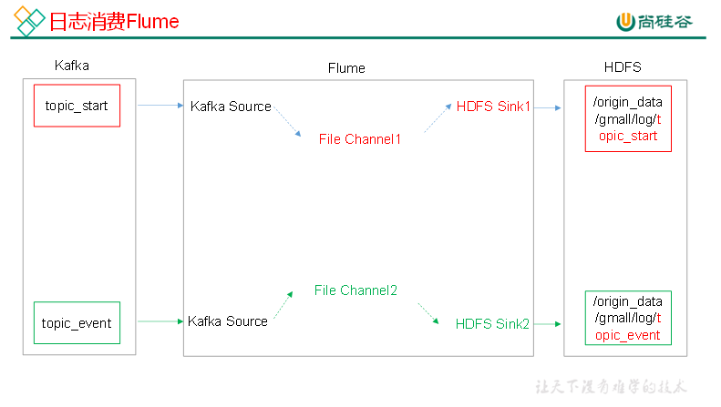
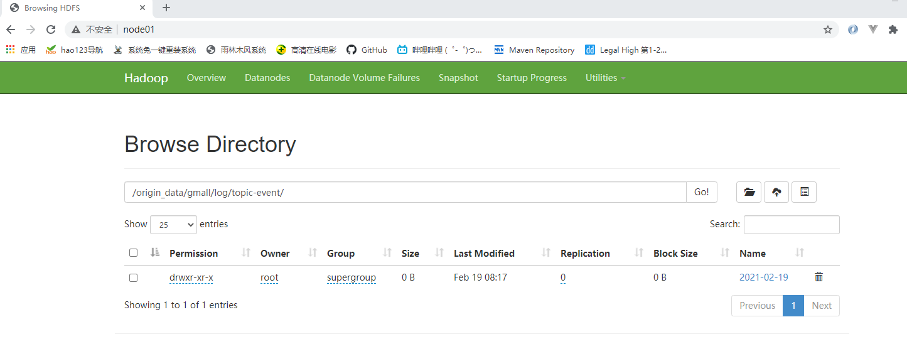

# 日志消费flume



flume 安装及规划见Hadoop/16Flume

## flume 的具体配置

```shell
[root@node03 conf]# pwd
/opt/stanlong/flume/apache-flume-1.9.0-bin/conf
[root@node03 conf]# vi kafka-flume-hdfs.conf
```

```properties
## 组件
a1.sources=r1 r2
a1.channels=c1 c2
a1.sinks=k1 k2

## source1
a1.sources.r1.type = org.apache.flume.source.kafka.KafkaSource
a1.sources.r1.batchSize = 5000
a1.sources.r1.batchDurationMillis = 2000
a1.sources.r1.kafka.bootstrap.servers = node01:9092,node02:9092,node03:9092,node04:9092
a1.sources.r1.kafka.topics=topic-start

## source2
a1.sources.r2.type = org.apache.flume.source.kafka.KafkaSource
a1.sources.r2.batchSize = 5000
a1.sources.r2.batchDurationMillis = 2000
a1.sources.r2.kafka.bootstrap.servers = node01:9092,node02:9092,node03:9092,node04:9092
a1.sources.r2.kafka.topics=topic-event

## channel1
a1.channels.c1.type = file
a1.channels.c1.checkpointDir = /opt/stanlong/flume/apache-flume-1.9.0-bin/checkpoint/behavior1
a1.channels.c1.dataDirs = /opt/stanlong/flume/apache-flume-1.9.0-bin/data/behavior1/
a1.channels.c1.maxFileSize = 2146435071
a1.channels.c1.capacity = 1000000
a1.channels.c1.keep-alive = 6

## channel2
a1.channels.c2.type = file
a1.channels.c2.checkpointDir = /opt/stanlong/flume/apache-flume-1.9.0-bin/checkpoint/behavior2
a1.channels.c2.dataDirs = /opt/stanlong/flume/apache-flume-1.9.0-bin/data/behavior2/
a1.channels.c2.maxFileSize = 2146435071
a1.channels.c2.capacity = 1000000
a1.channels.c2.keep-alive = 6

## sink1
a1.sinks.k1.type = hdfs
a1.sinks.k1.hdfs.path = hdfs://hacluster/origin_data/gmall/log/topic-start/%Y-%m-%d
a1.sinks.k1.hdfs.filePrefix = logstart-
a1.sinks.k1.hdfs.round = true
a1.sinks.k1.hdfs.roundValue = 10
a1.sinks.k1.hdfs.roundUnit = second

##sink2
a1.sinks.k2.type = hdfs
a1.sinks.k2.hdfs.path = hdfs://hacluster/origin_data/gmall/log/topic-event/%Y-%m-%d
a1.sinks.k2.hdfs.filePrefix = logevent-
a1.sinks.k2.hdfs.round = true
a1.sinks.k2.hdfs.roundValue = 10
a1.sinks.k2.hdfs.roundUnit = second

## 不要产生大量小文件
a1.sinks.k1.hdfs.rollInterval = 10
a1.sinks.k1.hdfs.rollSize = 134217728
a1.sinks.k1.hdfs.rollCount = 0

a1.sinks.k2.hdfs.rollInterval = 10
a1.sinks.k2.hdfs.rollSize = 134217728
a1.sinks.k2.hdfs.rollCount = 0

## 控制输出文件是原生文件。
a1.sinks.k1.hdfs.fileType = CompressedStream 
a1.sinks.k2.hdfs.fileType = CompressedStream 

a1.sinks.k1.hdfs.codeC = lzop
a1.sinks.k2.hdfs.codeC = lzop

## 拼装
a1.sources.r1.channels = c1
a1.sinks.k1.channel= c1

a1.sources.r2.channels = c2
a1.sinks.k2.channel= c2
```

**分发到node04上去**

```shell
[root@node03 conf]# scp kafka-flume-hdfs.conf node04:`pwd`
```

## 消费flume启停脚本

```shell
[root@node01 appmain]# pwd
/opt/stanlong/appmain
[root@node01 appmain]# vi fd.sh

#! /bin/bash

FD_HOME="/opt/stanlong/flume/apache-flume-1.9.0-bin"
case $1 in
"start"){
        for i in node03 node04
        do
                echo " --------启动 $i 消费flume-------"
                ssh $i "nohup $FD_HOME/bin/flume-ng agent --conf-file $FD_HOME/conf/kafka-flume-hdfs.conf --name a1 -Dflume.root.logger=INFO,LOGFILE >/opt/module/flume/log.txt   2>&1 &"
        done
};;
"stop"){
        for i in node03 node04
        do
                echo " --------停止 $i 消费flume-------"
                ssh $i "ps -ef | grep kafka-flume-hdfs | grep -v grep |awk '{print \$2}' | xargs kill"
        done

};;
esac
[root@node01 appmain]# chmod +x fd.sh
```

flume配置文件中 `a1.sinks.k2.hdfs.path` 配置的目录会在HDFS上自动生成

