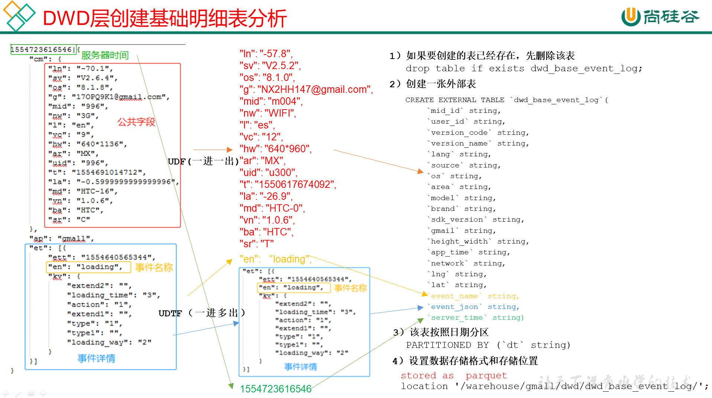

# DWD层

## 启动表

### 建表

```sql
drop table if exists dwd_start_log;
CREATE EXTERNAL TABLE dwd_start_log(
`mid_id` String,
`user_id` String, 
`version_code` String, 
`version_name` String, 
`lang` String, 
`source` String, 
`os` String, 
`area` String, 
`model` String,
`brand` String, 
`sdk_version` String, 
`gmail` String, 
`height_width` String,  
`app_time` String,
`network` String, 
`lng` String, 
`lat` String, 
`entry` String, 
`open_ad_type` String, 
`action` String, 
`loading_time` String, 
`detail` String, 
`extend1` String
)
PARTITIONED BY (pt_d String)
location '/warehouse/gmall/dwd/dwd_start_log/';
```

### 导数

```sql
insert overwrite table dwd_start_log
PARTITION (pt_d='2021-02-19')
select 
    get_json_object(line,'$.mid') mid_id,
    get_json_object(line,'$.uid') user_id,
    get_json_object(line,'$.vc') version_code,
    get_json_object(line,'$.vn') version_name,
    get_json_object(line,'$.l') lang,
    get_json_object(line,'$.sr') source,
    get_json_object(line,'$.os') os,
    get_json_object(line,'$.ar') area,
    get_json_object(line,'$.md') model,
    get_json_object(line,'$.ba') brand,
    get_json_object(line,'$.sv') sdk_version,
    get_json_object(line,'$.g') gmail,
    get_json_object(line,'$.hw') height_width,
    get_json_object(line,'$.t') app_time,
    get_json_object(line,'$.nw') network,
    get_json_object(line,'$.ln') lng,
    get_json_object(line,'$.la') lat,
    get_json_object(line,'$.entry') entry,
    get_json_object(line,'$.open_ad_type') open_ad_type,
    get_json_object(line,'$.action') action,
    get_json_object(line,'$.loading_time') loading_time,
    get_json_object(line,'$.detail') detail,
    get_json_object(line,'$.extend1') extend1
from ods_start_log 
where pt_d='2021-02-19';
```

### 测试

```sql
select * from dwd_start_log limit 1;
```

### 启动表加载脚本

```shell
[root@node01 appmain]# pwd
/opt/stanlong/appmain
[root@node01 appmain]# vi dwd_start_log.sh
```

```sql
#!/bin/bash

# 定义变量方便修改
APP=gmall
hive=/opt/stanlong/hive/apache-hive-1.2.2-bin/bin/hive

# 如果是输入的日期按照取输入日期；如果没输入日期取当前时间的前一天
if [ -n "$1" ] ;then
	do_date=$1
else 
	do_date=`date -d "-1 day" +%F`  
fi 

sql="
set hive.exec.dynamic.partition.mode=nonstrict;

insert overwrite table "$APP".dwd_start_log
PARTITION (dt='$do_date')
select 
    get_json_object(line,'$.mid') mid_id,
    get_json_object(line,'$.uid') user_id,
    get_json_object(line,'$.vc') version_code,
    get_json_object(line,'$.vn') version_name,
    get_json_object(line,'$.l') lang,
    get_json_object(line,'$.sr') source,
    get_json_object(line,'$.os') os,
    get_json_object(line,'$.ar') area,
    get_json_object(line,'$.md') model,
    get_json_object(line,'$.ba') brand,
    get_json_object(line,'$.sv') sdk_version,
    get_json_object(line,'$.g') gmail,
    get_json_object(line,'$.hw') height_width,
    get_json_object(line,'$.t') app_time,
    get_json_object(line,'$.nw') network,
    get_json_object(line,'$.ln') lng,
    get_json_object(line,'$.la') lat,
    get_json_object(line,'$.entry') entry,
    get_json_object(line,'$.open_ad_type') open_ad_type,
    get_json_object(line,'$.action') action,
    get_json_object(line,'$.loading_time') loading_time,
    get_json_object(line,'$.detail') detail,
    get_json_object(line,'$.extend1') extend1
from "$APP".ods_start_log 
where pt_d='$do_date';
"
$hive -e "$sql"
```

```sql
[root@node01 appmain]# chmod +x dwd_start_log.sh
```

## 事件表

### 基础明细表

明细表用于存储ODS层原始表转换过来的明细数据



