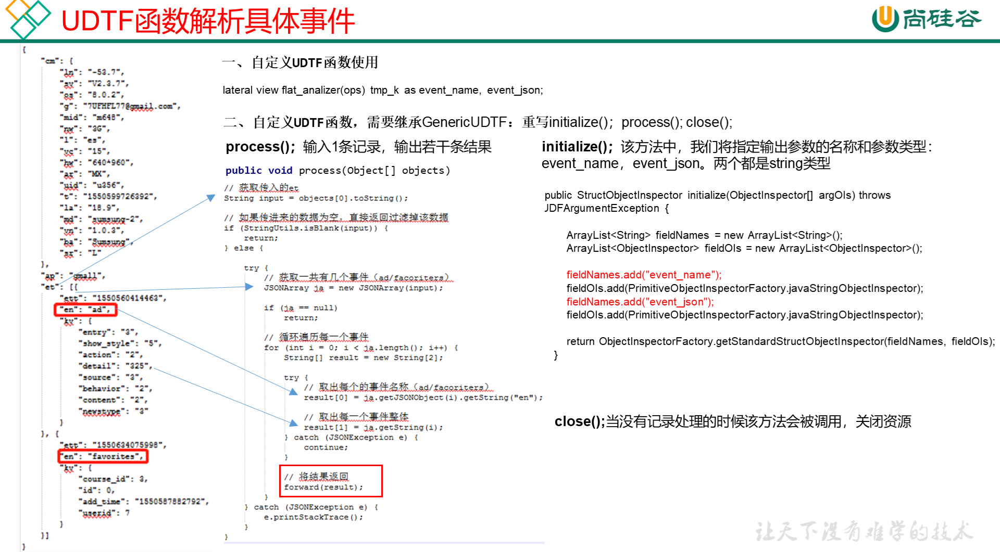
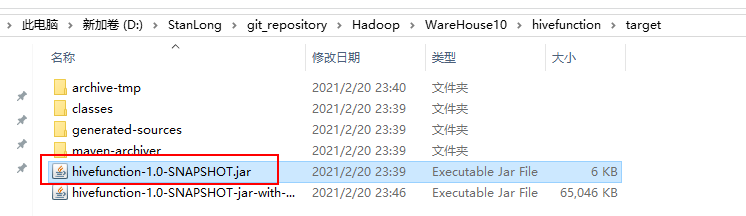
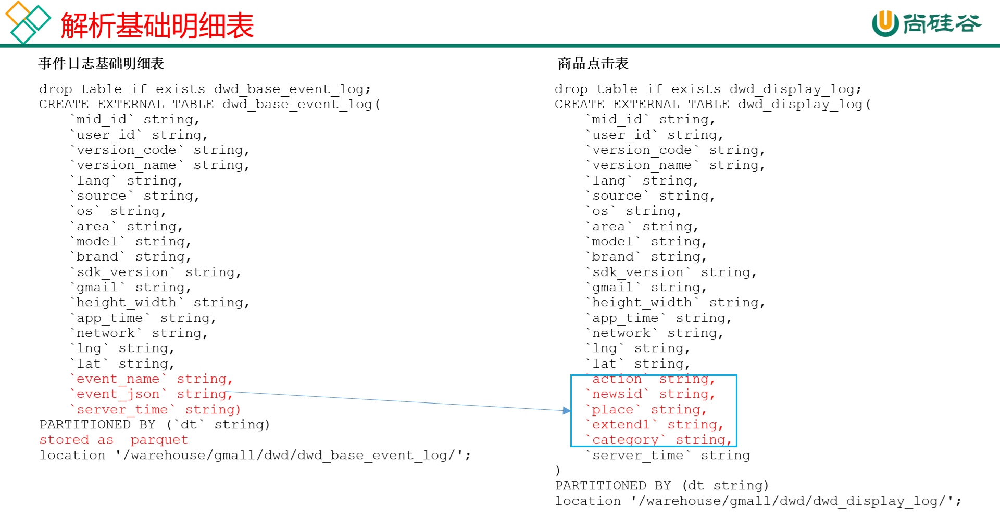

# DWD层

## 启动表

### 建表

```sql
drop table if exists dwd_start_log;
CREATE EXTERNAL TABLE dwd_start_log(
`mid_id` String,
`user_id` String, 
`version_code` String, 
`version_name` String, 
`lang` String, 
`source` String, 
`os` String, 
`area` String, 
`model` String,
`brand` String, 
`sdk_version` String, 
`gmail` String, 
`height_width` String,  
`app_time` String,
`network` String, 
`lng` String, 
`lat` String, 
`entry` String, 
`open_ad_type` String, 
`action` String, 
`loading_time` String, 
`detail` String, 
`extend1` String
)
PARTITIONED BY (pt_d String)
location '/warehouse/gmall/dwd/dwd_start_log/';
```

### 导数

```sql
insert overwrite table dwd_start_log
PARTITION (pt_d='2021-02-19')
select 
    get_json_object(line,'$.mid') mid_id,
    get_json_object(line,'$.uid') user_id,
    get_json_object(line,'$.vc') version_code,
    get_json_object(line,'$.vn') version_name,
    get_json_object(line,'$.l') lang,
    get_json_object(line,'$.sr') source,
    get_json_object(line,'$.os') os,
    get_json_object(line,'$.ar') area,
    get_json_object(line,'$.md') model,
    get_json_object(line,'$.ba') brand,
    get_json_object(line,'$.sv') sdk_version,
    get_json_object(line,'$.g') gmail,
    get_json_object(line,'$.hw') height_width,
    get_json_object(line,'$.t') app_time,
    get_json_object(line,'$.nw') network,
    get_json_object(line,'$.ln') lng,
    get_json_object(line,'$.la') lat,
    get_json_object(line,'$.entry') entry,
    get_json_object(line,'$.open_ad_type') open_ad_type,
    get_json_object(line,'$.action') action,
    get_json_object(line,'$.loading_time') loading_time,
    get_json_object(line,'$.detail') detail,
    get_json_object(line,'$.extend1') extend1
from ods_start_log 
where pt_d='2021-02-19';
```

### 测试

```sql
select * from dwd_start_log limit 1;
```

### 启动表加载脚本

```shell
[root@node01 appmain]# pwd
/opt/stanlong/appmain
[root@node01 appmain]# vi dwd_start_log.sh
```

```sql
#!/bin/bash

# 定义变量方便修改
APP=gmall
hive=/opt/stanlong/hive/apache-hive-1.2.2-bin/bin/hive

# 如果是输入的日期按照取输入日期；如果没输入日期取当前时间的前一天
if [ -n "$1" ] ;then
	do_date=$1
else 
	do_date=`date -d "-1 day" +%F`  
fi 

sql="
set hive.exec.dynamic.partition.mode=nonstrict;

insert overwrite table "$APP".dwd_start_log
PARTITION (pt_d='$do_date')
select 
    get_json_object(line,'$.mid') mid_id,
    get_json_object(line,'$.uid') user_id,
    get_json_object(line,'$.vc') version_code,
    get_json_object(line,'$.vn') version_name,
    get_json_object(line,'$.l') lang,
    get_json_object(line,'$.sr') source,
    get_json_object(line,'$.os') os,
    get_json_object(line,'$.ar') area,
    get_json_object(line,'$.md') model,
    get_json_object(line,'$.ba') brand,
    get_json_object(line,'$.sv') sdk_version,
    get_json_object(line,'$.g') gmail,
    get_json_object(line,'$.hw') height_width,
    get_json_object(line,'$.t') app_time,
    get_json_object(line,'$.nw') network,
    get_json_object(line,'$.ln') lng,
    get_json_object(line,'$.la') lat,
    get_json_object(line,'$.entry') entry,
    get_json_object(line,'$.open_ad_type') open_ad_type,
    get_json_object(line,'$.action') action,
    get_json_object(line,'$.loading_time') loading_time,
    get_json_object(line,'$.detail') detail,
    get_json_object(line,'$.extend1') extend1
from "$APP".ods_start_log 
where pt_d='$do_date';
"
$hive -e "$sql"
```

```sql
[root@node01 appmain]# chmod +x dwd_start_log.sh
```

## 事件表

### 基础明细表

明细表用于存储ODS层原始表转换过来的明细数据


```sql
drop table if exists dwd_base_event_log;
CREATE EXTERNAL TABLE dwd_base_event_log(
`mid_id` string,
`user_id` string, 
`version_code` string, 
`version_name` string, 
`lang` string, 
`source` string, 
`os` string, 
`area` string, 
`model` string,
`brand` string, 
`sdk_version` string, 
`gmail` string, 
`height_width` string, 
`app_time` string, 
`network` string, 
`lng` string, 
`lat` string, 
`event_name` string, 
`event_json` string, 
`server_time` string)
PARTITIONED BY (`pt_d` string)
stored as parquet
location '/warehouse/gmall/dwd/dwd_base_event_log/';
```

说明：其中event_name和event_json用来对应事件名和整个事件。这个地方将原始日志1对多的形式拆分出来了。操作的时候我们需要将原始日志展平，需要用到UDF和UDTF

### 自定义UDF函数

解析公共字段

1. 创建一个maven工程：hivefunction
2. 创建包名：com.stanlong.udf
3. 在pom.xml文件中添加如下内容

```xml
<properties>
    <project.build.sourceEncoding>UTF8</project.build.sourceEncoding>
    <hive.version>1.2.1</hive.version>
</properties>

<dependencies>
    <!--添加hive依赖-->
    <dependency>
        <groupId>org.apache.hive</groupId>
        <artifactId>hive-exec</artifactId>
        <version>${hive.version}</version>
    </dependency>
</dependencies>

<build>
    <plugins>
        <plugin>
            <artifactId>maven-compiler-plugin</artifactId>
            <version>2.3.2</version>
            <configuration>
                <source>1.8</source>
                <target>1.8</target>
            </configuration>
        </plugin>
        <plugin>
            <artifactId>maven-assembly-plugin</artifactId>
            <configuration>
                <descriptorRefs>
                    <descriptorRef>jar-with-dependencies</descriptorRef>
                </descriptorRefs>
            </configuration>
            <executions>
                <execution>
                    <id>make-assembly</id>
                    <phase>package</phase>
                    <goals>
                        <goal>single</goal>
                    </goals>
                </execution>
            </executions>
        </plugin>
    </plugins>
</build>
```

4. UDF用于解析公共字段

```java
package com.atguigu.udf;

import org.apache.commons.lang.StringUtils;
import org.apache.hadoop.hive.ql.exec.UDF;
import org.json.JSONException;
import org.json.JSONObject;

public class BaseFieldUDF extends UDF {

    public String evaluate(String line, String jsonkeysString) {
        
        // 0 准备一个sb
        StringBuilder sb = new StringBuilder();

        // 1 切割jsonkeys  mid uid vc vn l sr os ar md
        String[] jsonkeys = jsonkeysString.split(",");

        // 2 处理line   服务器时间 | json
        String[] logContents = line.split("\\|");

        // 3 合法性校验
        if (logContents.length != 2 || StringUtils.isBlank(logContents[1])) {
            return "";
        }

        // 4 开始处理json
        try {
            JSONObject jsonObject = new JSONObject(logContents[1]);

            // 获取cm里面的对象
            JSONObject base = jsonObject.getJSONObject("cm");

            // 循环遍历取值
            for (int i = 0; i < jsonkeys.length; i++) {
                String filedName = jsonkeys[i].trim();

                if (base.has(filedName)) {
                    sb.append(base.getString(filedName)).append("\t");
                } else {
                    sb.append("\t");
                }
            }

            sb.append(jsonObject.getString("et")).append("\t");
            sb.append(logContents[0]).append("\t");
        } catch (JSONException e) {
            e.printStackTrace();
        }

        return sb.toString();
    }

    public static void main(String[] args) {

        String line = "1541217850324|{\"cm\":{\"mid\":\"m7856\",\"uid\":\"u8739\",\"ln\":\"-74.8\",\"sv\":\"V2.2.2\",\"os\":\"8.1.3\",\"g\":\"P7XC9126@gmail.com\",\"nw\":\"3G\",\"l\":\"es\",\"vc\":\"6\",\"hw\":\"640*960\",\"ar\":\"MX\",\"t\":\"1541204134250\",\"la\":\"-31.7\",\"md\":\"huawei-17\",\"vn\":\"1.1.2\",\"sr\":\"O\",\"ba\":\"Huawei\"},\"ap\":\"weather\",\"et\":[{\"ett\":\"1541146624055\",\"en\":\"display\",\"kv\":{\"goodsid\":\"n4195\",\"copyright\":\"ESPN\",\"content_provider\":\"CNN\",\"extend2\":\"5\",\"action\":\"2\",\"extend1\":\"2\",\"place\":\"3\",\"showtype\":\"2\",\"category\":\"72\",\"newstype\":\"5\"}},{\"ett\":\"1541213331817\",\"en\":\"loading\",\"kv\":{\"extend2\":\"\",\"loading_time\":\"15\",\"action\":\"3\",\"extend1\":\"\",\"type1\":\"\",\"type\":\"3\",\"loading_way\":\"1\"}},{\"ett\":\"1541126195645\",\"en\":\"ad\",\"kv\":{\"entry\":\"3\",\"show_style\":\"0\",\"action\":\"2\",\"detail\":\"325\",\"source\":\"4\",\"behavior\":\"2\",\"content\":\"1\",\"newstype\":\"5\"}},{\"ett\":\"1541202678812\",\"en\":\"notification\",\"kv\":{\"ap_time\":\"1541184614380\",\"action\":\"3\",\"type\":\"4\",\"content\":\"\"}},{\"ett\":\"1541194686688\",\"en\":\"active_background\",\"kv\":{\"active_source\":\"3\"}}]}";
        String x = new BaseFieldUDF().evaluate(line, "mid,uid,vc,vn,l,sr,os,ar,md,ba,sv,g,hw,nw,ln,la,t");
        System.out.println(x);
    }
}
```

注意：使用main函数主要用于模拟数据测试

### 自定义UDTF函数

   

   1. 创建包名：com.stanlong.udtf

   2. 在com.stanlong.udtf包下创建类名：EventJsonUDTF

   3. 用于展开业务字段

```java
package com.stanlong.udtf;

import org.apache.commons.lang.StringUtils;
import org.apache.hadoop.hive.ql.exec.UDFArgumentException;
import org.apache.hadoop.hive.ql.metadata.HiveException;
import org.apache.hadoop.hive.ql.udf.generic.GenericUDTF;
import org.apache.hadoop.hive.serde2.objectinspector.ObjectInspector;
import org.apache.hadoop.hive.serde2.objectinspector.ObjectInspectorFactory;
import org.apache.hadoop.hive.serde2.objectinspector.StructObjectInspector;
import org.apache.hadoop.hive.serde2.objectinspector.primitive.PrimitiveObjectInspectorFactory;
import org.json.JSONArray;
import org.json.JSONException;

import java.util.ArrayList;

public class EventJsonUDTF extends GenericUDTF {

    //该方法中，我们将指定输出参数的名称和参数类型：
    @Override
    public StructObjectInspector initialize(ObjectInspector[] argOIs) throws UDFArgumentException {

        ArrayList<String> fieldNames = new ArrayList<String>();
        ArrayList<ObjectInspector> fieldOIs = new ArrayList<ObjectInspector>();

        fieldNames.add("event_name");
        fieldOIs.add(PrimitiveObjectInspectorFactory.javaStringObjectInspector);
        fieldNames.add("event_json");
        fieldOIs.add(PrimitiveObjectInspectorFactory.javaStringObjectInspector);

        return ObjectInspectorFactory.getStandardStructObjectInspector(fieldNames, fieldOIs);
    }

    //输入1条记录，输出若干条结果
    @Override
    public void process(Object[] objects) throws HiveException {

        // 获取传入的et
        String input = objects[0].toString();

        // 如果传进来的数据为空，直接返回过滤掉该数据
        if (StringUtils.isBlank(input)) {
            return;
        } else {

            try {
                // 获取一共有几个事件（ad/facoriters）
                JSONArray ja = new JSONArray(input);

                if (ja == null)
                    return;

                // 循环遍历每一个事件
                for (int i = 0; i < ja.length(); i++) {
                    String[] result = new String[2];

                    try {
                        // 取出每个的事件名称（ad/facoriters）
                        result[0] = ja.getJSONObject(i).getString("en");

                        // 取出每一个事件整体
                        result[1] = ja.getString(i);
                    } catch (JSONException e) {
                        continue;
                    }

                    // 将结果返回
                    forward(result);
                }
            } catch (JSONException e) {
                e.printStackTrace();
            }
        }
    }

    //当没有记录处理的时候该方法会被调用，用来清理代码或者产生额外的输出
    @Override
    public void close() throws HiveException {

    }
}
```

**打包**



**上传**

```shell
[root@node01 ~]# cp hivefunction-1.0-SNAPSHOT.jar /opt/stanlong/hive/apache-hive-1.2.2-bin/lib
[root@node01 ~]# cd /opt/stanlong/hive/apache-hive-1.2.2-bin/lib
[root@node01 lib]# scp hivefunction-1.0-SNAPSHOT.jar node02:`pwd`
hivefunction-1.0-SNAPSHOT.jar                                                                                                                                100% 5468   193.6KB/s   00:00    
[root@node01 lib]# scp hivefunction-1.0-SNAPSHOT.jar node03:`pwd`
hivefunction-1.0-SNAPSHOT.jar                                                                                                                                100% 5468     2.7MB/s   00:00    
```

**将jar包添加到Hive的classpath**

```sql
0: jdbc:hive2://node01:10000> add jar /opt/stanlong/hive/apache-hive-1.2.2-bin/lib/hivefunction-1.0-SNAPSHOT.jar;
INFO  : Added [/opt/stanlong/hive/apache-hive-1.2.2-bin/lib/hivefunction-1.0-SNAPSHOT.jar] to class path
INFO  : Added resources: [/opt/stanlong/hive/apache-hive-1.2.2-bin/lib/hivefunction-1.0-SNAPSHOT.jar]
No rows affected (25.401 seconds)
```

**创建临时函数与开发好的java class关联**

若hive重启，则需要重新创建函数

```sql
create temporary function base_analizer as 'com.stanlong.udf.BaseFieldUDF';
create temporary function flat_analizer as 'com.stanlong.udtf.EventJsonUDTF';
```

### 解析事件日志基础明细表

```sql
set hive.exec.dynamic.partition.mode=nonstrict;
insert overwrite table dwd_base_event_log 
PARTITION (pt_d='2021-02-19')
select
mid_id,
user_id,
version_code,
version_name,
lang,
source,
os,
area,
model,
brand,
sdk_version,
gmail,
height_width,
app_time,
network,
lng,
lat,
event_name,
event_json,
server_time
from
(
select
split(base_analizer(line,'mid,uid,vc,vn,l,sr,os,ar,md,ba,sv,g,hw,t,nw,ln,la'),'\t')[0]   as mid_id,
split(base_analizer(line,'mid,uid,vc,vn,l,sr,os,ar,md,ba,sv,g,hw,t,nw,ln,la'),'\t')[1]   as user_id,
split(base_analizer(line,'mid,uid,vc,vn,l,sr,os,ar,md,ba,sv,g,hw,t,nw,ln,la'),'\t')[2]   as version_code,
split(base_analizer(line,'mid,uid,vc,vn,l,sr,os,ar,md,ba,sv,g,hw,t,nw,ln,la'),'\t')[3]   as version_name,
split(base_analizer(line,'mid,uid,vc,vn,l,sr,os,ar,md,ba,sv,g,hw,t,nw,ln,la'),'\t')[4]   as lang,
split(base_analizer(line,'mid,uid,vc,vn,l,sr,os,ar,md,ba,sv,g,hw,t,nw,ln,la'),'\t')[5]   as source,
split(base_analizer(line,'mid,uid,vc,vn,l,sr,os,ar,md,ba,sv,g,hw,t,nw,ln,la'),'\t')[6]   as os,
split(base_analizer(line,'mid,uid,vc,vn,l,sr,os,ar,md,ba,sv,g,hw,t,nw,ln,la'),'\t')[7]   as area,
split(base_analizer(line,'mid,uid,vc,vn,l,sr,os,ar,md,ba,sv,g,hw,t,nw,ln,la'),'\t')[8]   as model,
split(base_analizer(line,'mid,uid,vc,vn,l,sr,os,ar,md,ba,sv,g,hw,t,nw,ln,la'),'\t')[9]   as brand,
split(base_analizer(line,'mid,uid,vc,vn,l,sr,os,ar,md,ba,sv,g,hw,t,nw,ln,la'),'\t')[10]   as sdk_version,
split(base_analizer(line,'mid,uid,vc,vn,l,sr,os,ar,md,ba,sv,g,hw,t,nw,ln,la'),'\t')[11]  as gmail,
split(base_analizer(line,'mid,uid,vc,vn,l,sr,os,ar,md,ba,sv,g,hw,t,nw,ln,la'),'\t')[12]  as height_width,
split(base_analizer(line,'mid,uid,vc,vn,l,sr,os,ar,md,ba,sv,g,hw,t,nw,ln,la'),'\t')[13]  as app_time,
split(base_analizer(line,'mid,uid,vc,vn,l,sr,os,ar,md,ba,sv,g,hw,t,nw,ln,la'),'\t')[14]  as network,
split(base_analizer(line,'mid,uid,vc,vn,l,sr,os,ar,md,ba,sv,g,hw,t,nw,ln,la'),'\t')[15]  as lng,
split(base_analizer(line,'mid,uid,vc,vn,l,sr,os,ar,md,ba,sv,g,hw,t,nw,ln,la'),'\t')[16]  as lat,
split(base_analizer(line,'mid,uid,vc,vn,l,sr,os,ar,md,ba,sv,g,hw,t,nw,ln,la'),'\t')[17]  as ops,
split(base_analizer(line,'mid,uid,vc,vn,l,sr,os,ar,md,ba,sv,g,hw,t,nw,ln,la'),'\t')[18]  as server_time
from ods_event_log where pt_d='2021-02-19'  and base_analizer(line,'mid,uid,vc,vn,l,sr,os,ar,md,ba,sv,g,hw,t,nw,ln,la')<>'' 
) sdk_log lateral view flat_analizer(ops) tmp_k as event_name, event_json;
```

### 测试

```sql
select * from dwd_base_event_log limit 2;
```

### 基础明细表脚本

```shell
[root@node01 appmain]# pwd
/opt/stanlong/appmain
[root@node01 appmain]# vi dwd_base_log.sh
```

```sql
#!/bin/bash

# 定义变量方便修改
APP=gmall
hive=/opt/stanlong/hive/apache-hive-1.2.2-bin/bin/hive

# 如果是输入的日期按照取输入日期；如果没输入日期取当前时间的前一天
if [ -n "$1" ] ;then
	do_date=$1
else 
	do_date=`date -d "-1 day" +%F`  
fi 

sql="
    add jar /opt/stanlong/hive/apache-hive-1.2.2-bin/lib/hivefunction-1.0-SNAPSHOT.jar;

	create temporary function base_analizer as 'com.stanlong.udf.BaseFieldUDF';
    create temporary function flat_analizer as 'com.stanlong.udtf.EventJsonUDTF';

 	set hive.exec.dynamic.partition.mode=nonstrict;

	insert overwrite table "$APP".dwd_base_event_log 
	PARTITION (pt_d='$do_date')
	select
	mid_id,
	user_id,
	version_code,
	version_name,
	lang,
	source ,
	os ,
	area ,
	model ,
	brand ,
	sdk_version ,
	gmail ,
	height_width ,
	network ,
	lng ,
	lat ,
	app_time ,
	event_name , 
	event_json , 
	server_time  
	from
	(
	select
	split(base_analizer(line,'mid,uid,vc,vn,l,sr,os,ar,md,ba,sv,g,hw,t,nw,ln,la'),'\t')[0]   as mid_id,
	split(base_analizer(line,'mid,uid,vc,vn,l,sr,os,ar,md,ba,sv,g,hw,t,nw,ln,la'),'\t')[1]   as user_id,
	split(base_analizer(line,'mid,uid,vc,vn,l,sr,os,ar,md,ba,sv,g,hw,t,nw,ln,la'),'\t')[2]   as version_code,
	split(base_analizer(line,'mid,uid,vc,vn,l,sr,os,ar,md,ba,sv,g,hw,t,nw,ln,la'),'\t')[3]   as version_name,
	split(base_analizer(line,'mid,uid,vc,vn,l,sr,os,ar,md,ba,sv,g,hw,t,nw,ln,la'),'\t')[4]   as lang,
	split(base_analizer(line,'mid,uid,vc,vn,l,sr,os,ar,md,ba,sv,g,hw,t,nw,ln,la'),'\t')[5]   as source,
	split(base_analizer(line,'mid,uid,vc,vn,l,sr,os,ar,md,ba,sv,g,hw,t,nw,ln,la'),'\t')[6]   as os,
	split(base_analizer(line,'mid,uid,vc,vn,l,sr,os,ar,md,ba,sv,g,hw,t,nw,ln,la'),'\t')[7]   as area,
	split(base_analizer(line,'mid,uid,vc,vn,l,sr,os,ar,md,ba,sv,g,hw,t,nw,ln,la'),'\t')[8]   as model,
	split(base_analizer(line,'mid,uid,vc,vn,l,sr,os,ar,md,ba,sv,g,hw,t,nw,ln,la'),'\t')[9]   as brand,
	split(base_analizer(line,'mid,uid,vc,vn,l,sr,os,ar,md,ba,sv,g,hw,t,nw,ln,la'),'\t')[10]   as sdk_version,
	split(base_analizer(line,'mid,uid,vc,vn,l,sr,os,ar,md,ba,sv,g,hw,t,nw,ln,la'),'\t')[11]  as gmail,
	split(base_analizer(line,'mid,uid,vc,vn,l,sr,os,ar,md,ba,sv,g,hw,t,nw,ln,la'),'\t')[12]  as height_width,
	split(base_analizer(line,'mid,uid,vc,vn,l,sr,os,ar,md,ba,sv,g,hw,t,nw,ln,la'),'\t')[13]  as app_time,
	split(base_analizer(line,'mid,uid,vc,vn,l,sr,os,ar,md,ba,sv,g,hw,t,nw,ln,la'),'\t')[14]  as network,
	split(base_analizer(line,'mid,uid,vc,vn,l,sr,os,ar,md,ba,sv,g,hw,t,nw,ln,la'),'\t')[15]  as lng,
	split(base_analizer(line,'mid,uid,vc,vn,l,sr,os,ar,md,ba,sv,g,hw,t,nw,ln,la'),'\t')[16]  as lat,
	split(base_analizer(line,'mid,uid,vc,vn,l,sr,os,ar,md,ba,sv,g,hw,t,nw,ln,la'),'\t')[17]  as ops,
	split(base_analizer(line,'mid,uid,vc,vn,l,sr,os,ar,md,ba,sv,g,hw,t,nw,ln,la'),'\t')[18]  as server_time
	from "$APP".ods_event_log where pt_d='$do_date'  and base_analizer(line,'mid,uid,vc,vn,l,sr,os,ar,md,ba,sv,g,hw,t,nw,ln,la')<>'' 
	) sdk_log lateral view flat_analizer(ops) tmp_k as event_name, event_json;
"

$hive -e "$sql"
```


### 事件表分析



#### 商品点击表

**建表**

```sql
drop table if exists dwd_display_log;
CREATE EXTERNAL TABLE dwd_display_log(
`mid_id` string,
`user_id` string,
`version_code` string,
`version_name` string,
`lang` string,
`source` string,
`os` string,
`area` string,
`model` string,
`brand` string,
`sdk_version` string,
`gmail` string,
`height_width` string,
`app_time` string,
`network` string,
`lng` string,
`lat` string,
`action` string,
`goodsid` string,
`place` string,
`extend1` string,
`category` string,
`server_time` string
)
PARTITIONED BY (pt_d string)
location '/warehouse/gmall/dwd/dwd_display_log/';
```

**导数**

```sql
set hive.exec.dynamic.partition.mode=nonstrict;

insert overwrite table dwd_display_log
PARTITION (pt_d='2021-02-19')
select 
mid_id,
user_id,
version_code,
version_name,
lang,
source,
os,
area,
model,
brand,
sdk_version,
gmail,
height_width,
app_time,
network,
lng,
lat,
get_json_object(event_json,'$.kv.action') action,
get_json_object(event_json,'$.kv.goodsid') goodsid,
get_json_object(event_json,'$.kv.place') place,
get_json_object(event_json,'$.kv.extend1') extend1,
get_json_object(event_json,'$.kv.category') category,
server_time
from dwd_base_event_log 
where pt_d='2021-02-19' and event_name='display';
```

#### 商品详情页表

**建表**

```sql
drop table if exists dwd_newsdetail_log;
CREATE EXTERNAL TABLE dwd_newsdetail_log(
`mid_id` string,
`user_id` string, 
`version_code` string, 
`version_name` string, 
`lang` string, 
`source` string, 
`os` string, 
`area` string, 
`model` string,
`brand` string, 
`sdk_version` string, 
`gmail` string, 
`height_width` string, 
`app_time` string,  
`network` string, 
`lng` string, 
`lat` string, 
`entry` string,
`action` string,
`goodsid` string,
`showtype` string,
`news_staytime` string,
`loading_time` string,
`type1` string,
`category` string,
`server_time` string)
PARTITIONED BY (pt_d string)
location '/warehouse/gmall/dwd/dwd_newsdetail_log/';
```

**导数**

```sql
set hive.exec.dynamic.partition.mode=nonstrict;

insert overwrite table dwd_newsdetail_log
PARTITION (pt_d='2021-02-19')
select 
mid_id,
user_id,
version_code,
version_name,
lang,
source,
os,
area,
model,
brand,
sdk_version,
gmail,
height_width,
app_time,
network,
lng,
lat,
get_json_object(event_json,'$.kv.entry') entry,
get_json_object(event_json,'$.kv.action') action,
get_json_object(event_json,'$.kv.goodsid') goodsid,
get_json_object(event_json,'$.kv.showtype') showtype,
get_json_object(event_json,'$.kv.news_staytime') news_staytime,
get_json_object(event_json,'$.kv.loading_time') loading_time,
get_json_object(event_json,'$.kv.type1') type1,
get_json_object(event_json,'$.kv.category') category,
server_time
from dwd_base_event_log
where pt_d='2021-02-19' and event_name='newsdetail';
```

#### 商品列表页表

**建表**

```sql
drop table if exists dwd_loading_log;
CREATE EXTERNAL TABLE dwd_loading_log(
`mid_id` string,
`user_id` string, 
`version_code` string, 
`version_name` string, 
`lang` string, 
`source` string, 
`os` string, 
`area` string, 
`model` string,
`brand` string, 
`sdk_version` string, 
`gmail` string,
`height_width` string,  
`app_time` string,
`network` string, 
`lng` string, 
`lat` string, 
`action` string,
`loading_time` string,
`loading_way` string,
`extend1` string,
`extend2` string,
`type` string,
`type1` string,
`server_time` string)
PARTITIONED BY (pt_d string)
location '/warehouse/gmall/dwd/dwd_loading_log/';
```

**导数**

```sql
set hive.exec.dynamic.partition.mode=nonstrict;

insert overwrite table dwd_loading_log
PARTITION (pt_d='2021-02-19')
select 
mid_id,
user_id,
version_code,
version_name,
lang,
source,
os,
area,
model,
brand,
sdk_version,
gmail,
height_width,
app_time,
network,
lng,
lat,
get_json_object(event_json,'$.kv.action') action,
get_json_object(event_json,'$.kv.loading_time') loading_time,
get_json_object(event_json,'$.kv.loading_way') loading_way,
get_json_object(event_json,'$.kv.extend1') extend1,
get_json_object(event_json,'$.kv.extend2') extend2,
get_json_object(event_json,'$.kv.type') type,
get_json_object(event_json,'$.kv.type1') type1,
server_time
from dwd_base_event_log
where pt_d='2021-02-19' and event_name='loading';
```

#### 广告表

**建表**

```sql
drop table if exists dwd_ad_log;
CREATE EXTERNAL TABLE dwd_ad_log(
`mid_id` string,
`user_id` string, 
`version_code` string, 
`version_name` string, 
`lang` string, 
`source` string, 
`os` string, 
`area` string, 
`model` string,
`brand` string, 
`sdk_version` string, 
`gmail` string, 
`height_width` string,  
`app_time` string,
`network` string, 
`lng` string, 
`lat` string, 
`entry` string,
`action` string,
`content` string,
`detail` string,
`ad_source` string,
`behavior` string,
`newstype` string,
`show_style` string,
`server_time` string)
PARTITIONED BY (pt_d string)
location '/warehouse/gmall/dwd/dwd_ad_log/';
```

**导数**

```sql
set hive.exec.dynamic.partition.mode=nonstrict;

insert overwrite table dwd_ad_log
PARTITION (pt_d='2021-02-19')
select 
mid_id,
user_id,
version_code,
version_name,
lang,
source,
os,
area,
model,
brand,
sdk_version,
gmail,
height_width,
app_time,
network,
lng,
lat,
get_json_object(event_json,'$.kv.entry') entry,
get_json_object(event_json,'$.kv.action') action,
get_json_object(event_json,'$.kv.content') content,
get_json_object(event_json,'$.kv.detail') detail,
get_json_object(event_json,'$.kv.source') ad_source,
get_json_object(event_json,'$.kv.behavior') behavior,
get_json_object(event_json,'$.kv.newstype') newstype,
get_json_object(event_json,'$.kv.show_style') show_style,
server_time
from dwd_base_event_log 
where pt_d='2021-02-19' and event_name='ad';
```

#### 消息通知表

**建表**

```sql
drop table if exists dwd_notification_log;
CREATE EXTERNAL TABLE dwd_notification_log(
`mid_id` string,
`user_id` string, 
`version_code` string, 
`version_name` string, 
`lang` string,
`source` string, 
`os` string, 
`area` string, 
`model` string,
`brand` string, 
`sdk_version` string, 
`gmail` string, 
`height_width` string,  
`app_time` string,
`network` string, 
`lng` string, 
`lat` string, 
`action` string,
`noti_type` string,
`ap_time` string,
`content` string,
`server_time` string
)
PARTITIONED BY (pt_d string)
location '/warehouse/gmall/dwd/dwd_notification_log/';
```

**导数**

```sql
set hive.exec.dynamic.partition.mode=nonstrict;

insert overwrite table dwd_notification_log
PARTITION (pt_d='2021-02-19')
select 
mid_id,
user_id,
version_code,
version_name,
lang,
source,
os,
area,
model,
brand,
sdk_version,
gmail,
height_width,
app_time,
network,
lng,
lat,
get_json_object(event_json,'$.kv.action') action,
get_json_object(event_json,'$.kv.noti_type') noti_type,
get_json_object(event_json,'$.kv.ap_time') ap_time,
get_json_object(event_json,'$.kv.content') content,
server_time
from dwd_base_event_log
where pt_d='2021-02-19' and event_name='notification';
```

#### 用户前台活跃表

**建表**

```sql
drop table if exists dwd_active_foreground_log;
CREATE EXTERNAL TABLE dwd_active_foreground_log(
`mid_id` string,
`user_id` string,
`version_code` string,
`version_name` string,
`lang` string,
`source` string,
`os` string,
`area` string,
`model` string,
`brand` string,
`sdk_version` string,
`gmail` string,
`height_width` string,
`app_time` string,
`network` string,
`lng` string,
`lat` string,
`push_id` string,
`access` string,
`server_time` string)
PARTITIONED BY (pt_d string)
location '/warehouse/gmall/dwd/dwd_foreground_log/';
```

**导数**

```sql
set hive.exec.dynamic.partition.mode=nonstrict;

insert overwrite table dwd_active_foreground_log
PARTITION (pt_d='2021-02-19')
select 
mid_id,
user_id,
version_code,
version_name,
lang,
source,
os,
area,
model,
brand,
sdk_version,
gmail,
height_width,
app_time,
network,
lng,
lat,
get_json_object(event_json,'$.kv.push_id') push_id,
get_json_object(event_json,'$.kv.access') access,
server_time
from dwd_base_event_log
where pt_d='2021-02-19' and event_name='active_foreground';
```

#### 用户后台活跃表

**建表**

```sql
drop table if exists dwd_active_background_log;
CREATE EXTERNAL TABLE dwd_active_background_log(
`mid_id` string,
`user_id` string,
`version_code` string,
`version_name` string,
`lang` string,
`source` string,
`os` string,
`area` string,
`model` string,
`brand` string,
`sdk_version` string,
`gmail` string,
 `height_width` string,
`app_time` string,
`network` string,
`lng` string,
`lat` string,
`active_source` string,
`server_time` string
)
PARTITIONED BY (pt_d string)
location '/warehouse/gmall/dwd/dwd_background_log/';
```

**导数**

```sql
set hive.exec.dynamic.partition.mode=nonstrict;

insert overwrite table dwd_active_background_log
PARTITION (pt_d='2021-02-19')
select 
mid_id,
user_id,
version_code,
version_name,
lang,
source,
os,
area,
model,
brand,
sdk_version,
gmail,
height_width,
app_time,
network,
lng,
lat,
get_json_object(event_json,'$.kv.active_source') active_source,
server_time
from dwd_base_event_log
where pt_d='2021-02-19' and event_name='active_background';
```

#### 评论表

**建表**

```sql
drop table if exists dwd_comment_log;
CREATE EXTERNAL TABLE dwd_comment_log(
`mid_id` string,
`user_id` string,
`version_code` string,
`version_name` string,
`lang` string,
`source` string,
`os` string,
`area` string,
`model` string,
`brand` string,
`sdk_version` string,
`gmail` string,
`height_width` string,
`app_time` string,
`network` string,
`lng` string,
`lat` string,
`comment_id` int,
`userid` int,
`p_comment_id` int, 
`content` string,
`addtime` string,
`other_id` int,
`praise_count` int,
`reply_count` int,
`server_time` string
)
PARTITIONED BY (pt_d string)
location '/warehouse/gmall/dwd/dwd_comment_log/';
```

**导数**

```sql
set hive.exec.dynamic.partition.mode=nonstrict;

insert overwrite table dwd_comment_log
PARTITION (pt_d='2021-02-19')
select 
mid_id,
user_id,
version_code,
version_name,
lang,
source,
os,
area,
model,
brand,
sdk_version,
gmail,
height_width,
app_time,
network,
lng,
lat,
get_json_object(event_json,'$.kv.comment_id') comment_id,
get_json_object(event_json,'$.kv.userid') userid,
get_json_object(event_json,'$.kv.p_comment_id') p_comment_id,
get_json_object(event_json,'$.kv.content') content,
get_json_object(event_json,'$.kv.addtime') addtime,
get_json_object(event_json,'$.kv.other_id') other_id,
get_json_object(event_json,'$.kv.praise_count') praise_count,
get_json_object(event_json,'$.kv.reply_count') reply_count,
server_time
from dwd_base_event_log
where pt_d='2021-02-19' and event_name='comment';
```

#### 收藏表

**建表**

```sql
drop table if exists dwd_favorites_log;
CREATE EXTERNAL TABLE dwd_favorites_log(
`mid_id` string,
`user_id` string, 
`version_code` string, 
`version_name` string, 
`lang` string, 
`source` string, 
`os` string, 
`area` string, 
`model` string,
`brand` string, 
`sdk_version` string, 
`gmail` string, 
`height_width` string,  
`app_time` string,
`network` string, 
`lng` string, 
`lat` string, 
`id` int, 
`course_id` int, 
`userid` int,
`add_time` string,
`server_time` string
)
PARTITIONED BY (pt_d string)
location '/warehouse/gmall/dwd/dwd_favorites_log/';
```

**导数**

```sql
set hive.exec.dynamic.partition.mode=nonstrict;

insert overwrite table dwd_favorites_log
PARTITION (pt_d='2021-02-19')
select 
mid_id,
user_id,
version_code,
version_name,
lang,
source,
os,
area,
model,
brand,
sdk_version,
gmail,
height_width,
app_time,
network,
lng,
lat,
get_json_object(event_json,'$.kv.id') id,
get_json_object(event_json,'$.kv.course_id') course_id,
get_json_object(event_json,'$.kv.userid') userid,
get_json_object(event_json,'$.kv.add_time') add_time,
server_time
from dwd_base_event_log 
where pt_d='2021-02-19' and event_name='favorites';
```

#### 点赞表

**建表**

```sql
drop table if exists dwd_praise_log;
CREATE EXTERNAL TABLE dwd_praise_log(
`mid_id` string,
`user_id` string, 
`version_code` string, 
`version_name` string, 
`lang` string, 
`source` string, 
`os` string, 
`area` string, 
`model` string,
`brand` string, 
`sdk_version` string, 
`gmail` string, 
`height_width` string,  
`app_time` string,
`network` string, 
`lng` string, 
`lat` string, 
`id` string, 
`userid` string, 
`target_id` string,
`type` string,
`add_time` string,
`server_time` string
)
PARTITIONED BY (pt_d string)
location '/warehouse/gmall/dwd/dwd_praise_log/';
```

**导数**

```sql
set hive.exec.dynamic.partition.mode=nonstrict;

insert overwrite table dwd_praise_log
PARTITION (pt_d='2021-02-19')
select 
mid_id,
user_id,
version_code,
version_name,
lang,
source,
os,
area,
model,
brand,
sdk_version,
gmail,
height_width,
app_time,
network,
lng,
lat,
get_json_object(event_json,'$.kv.id') id,
get_json_object(event_json,'$.kv.userid') userid,
get_json_object(event_json,'$.kv.target_id') target_id,
get_json_object(event_json,'$.kv.type') type,
get_json_object(event_json,'$.kv.add_time') add_time,
server_time
from dwd_base_event_log
where pt_d='2021-02-19' and event_name='praise';
```

#### 错误日志表

**建表**

```sql
drop table if exists dwd_error_log;
CREATE EXTERNAL TABLE dwd_error_log(
`mid_id` string,
`user_id` string, 
`version_code` string, 
`version_name` string, 
`lang` string, 
`source` string, 
`os` string, 
`area` string, 
`model` string,
`brand` string, 
`sdk_version` string, 
`gmail` string, 
`height_width` string,  
`app_time` string,
`network` string, 
`lng` string, 
`lat` string, 
`errorBrief` string, 
`errorDetail` string, 
`server_time` string)
PARTITIONED BY (pt_d string)
location '/warehouse/gmall/dwd/dwd_error_log/';
```

**导数**

```sql
set hive.exec.dynamic.partition.mode=nonstrict;

insert overwrite table dwd_error_log
PARTITION (pt_d='2021-02-19')
select 
mid_id,
user_id,
version_code,
version_name,
lang,
source,
os,
area,
model,
brand,
sdk_version,
gmail,
height_width,
app_time,
network,
lng,
lat,
get_json_object(event_json,'$.kv.errorBrief') errorBrief,
get_json_object(event_json,'$.kv.errorDetail') errorDetail,
server_time
from dwd_base_event_log 
where pt_d='2021-02-19' and event_name='error';
```

### 事件表加载数据脚本

```shell
[root@node01 appmain]# pwd
/opt/stanlong/appmain
[root@node01 appmain]# vi dwd_event_log.sh
```

```sql
#!/bin/bash

# 定义变量方便修改
APP=gmall
hive=/opt/stanlong/hive/apache-hive-1.2.2-bin/bin/hive

# 如果是输入的日期按照取输入日期；如果没输入日期取当前时间的前一天
if [ -n "$1" ] ;then
	do_date=$1
else 
	do_date=`date -d "-1 day" +%F`  
fi 

sql="
set hive.exec.dynamic.partition.mode=nonstrict;

insert overwrite table "$APP".dwd_display_log
PARTITION (pt_d='$do_date')
select 
	mid_id,
	user_id,
	version_code,
	version_name,
	lang,
	source,
	os,
	area,
	model,
	brand,
	sdk_version,
	gmail,
	height_width,
	app_time,
	network,
	lng,
	lat,
	get_json_object(event_json,'$.kv.action') action,
	get_json_object(event_json,'$.kv.goodsid') goodsid,
	get_json_object(event_json,'$.kv.place') place,
	get_json_object(event_json,'$.kv.extend1') extend1,
	get_json_object(event_json,'$.kv.category') category,
	server_time
from "$APP".dwd_base_event_log 
where pt_d='$do_date' and event_name='display';

insert overwrite table "$APP".dwd_newsdetail_log
PARTITION (pt_d='$do_date')
select 
	mid_id,
	user_id,
	version_code,
	version_name,
	lang,
	source,
	os,
	area,
	model,
	brand,
	sdk_version,
	gmail,
	height_width,
	app_time,
	network,
	lng,
	lat,
	get_json_object(event_json,'$.kv.entry') entry,
	get_json_object(event_json,'$.kv.action') action,
	get_json_object(event_json,'$.kv.goodsid') goodsid,
	get_json_object(event_json,'$.kv.showtype') showtype,
	get_json_object(event_json,'$.kv.news_staytime') news_staytime,
	get_json_object(event_json,'$.kv.loading_time') loading_time,
	get_json_object(event_json,'$.kv.type1') type1,
	get_json_object(event_json,'$.kv.category') category,
	server_time
from "$APP".dwd_base_event_log 
where pt_d='$do_date' and event_name='newsdetail';

insert overwrite table "$APP".dwd_loading_log
PARTITION (pt_d='$do_date')
select 
	mid_id,
	user_id,
	version_code,
	version_name,
	lang,
	source,
	os,
	area,
	model,
	brand,
	sdk_version,
	gmail,
	height_width,
	app_time,
	network,
	lng,
	lat,
	get_json_object(event_json,'$.kv.action') action,
	get_json_object(event_json,'$.kv.loading_time') loading_time,
	get_json_object(event_json,'$.kv.loading_way') loading_way,
	get_json_object(event_json,'$.kv.extend1') extend1,
	get_json_object(event_json,'$.kv.extend2') extend2,
	get_json_object(event_json,'$.kv.type') type,
	get_json_object(event_json,'$.kv.type1') type1,
	server_time
from "$APP".dwd_base_event_log 
where pt_d='$do_date' and event_name='loading';

insert overwrite table "$APP".dwd_ad_log
PARTITION (pt_d='$do_date')
select 
	mid_id,
	user_id,
	version_code,
	version_name,
	lang,
	source,
	os,
	area,
	model,
	brand,
	sdk_version,
	gmail,
	height_width,
	app_time,
	network,
	lng,
	lat,
	get_json_object(event_json,'$.kv.entry') entry,
	get_json_object(event_json,'$.kv.action') action,
	get_json_object(event_json,'$.kv.content') content,
	get_json_object(event_json,'$.kv.detail') detail,
	get_json_object(event_json,'$.kv.source') ad_source,
	get_json_object(event_json,'$.kv.behavior') behavior,
	get_json_object(event_json,'$.kv.newstype') newstype,
	get_json_object(event_json,'$.kv.show_style') show_style,
	server_time
from "$APP".dwd_base_event_log 
where pt_d='$do_date' and event_name='ad';

insert overwrite table "$APP".dwd_notification_log
PARTITION (pt_d='$do_date')
select 
	mid_id,
	user_id,
	version_code,
	version_name,
	lang,
	source,
	os,
	area,
	model,
	brand,
	sdk_version,
	gmail,
	height_width,
	app_time,
	network,
	lng,
	lat,
	get_json_object(event_json,'$.kv.action') action,
	get_json_object(event_json,'$.kv.noti_type') noti_type,
	get_json_object(event_json,'$.kv.ap_time') ap_time,
	get_json_object(event_json,'$.kv.content') content,
	server_time
from "$APP".dwd_base_event_log 
where pt_d='$do_date' and event_name='notification';

insert overwrite table "$APP".dwd_active_foreground_log
PARTITION (pt_d='$do_date')
select 
	mid_id,
	user_id,
	version_code,
	version_name,
	lang,
	source,
	os,
	area,
	model,
	brand,
	sdk_version,
	gmail,
	height_width,
	app_time,
	network,
	lng,
	lat,
get_json_object(event_json,'$.kv.push_id') push_id,
get_json_object(event_json,'$.kv.access') access,
	server_time
from "$APP".dwd_base_event_log 
where pt_d='$do_date' and event_name='active_foreground';

insert overwrite table "$APP".dwd_active_background_log
PARTITION (pt_d='$do_date')
select 
	mid_id,
	user_id,
	version_code,
	version_name,
	lang,
	source,
	os,
	area,
	model,
	brand,
	sdk_version,
	gmail,
	height_width,
	app_time,
	network,
	lng,
	lat,
	get_json_object(event_json,'$.kv.active_source') active_source,
	server_time
from "$APP".dwd_base_event_log 
where pt_d='$do_date' and event_name='active_background';

insert overwrite table "$APP".dwd_comment_log
PARTITION (pt_d='$do_date')
select 
	mid_id,
	user_id,
	version_code,
	version_name,
	lang,
	source,
	os,
	area,
	model,
	brand,
	sdk_version,
	gmail,
	height_width,
	app_time,
	network,
	lng,
	lat,
	get_json_object(event_json,'$.kv.comment_id') comment_id,
	get_json_object(event_json,'$.kv.userid') userid,
	get_json_object(event_json,'$.kv.p_comment_id') p_comment_id,
	get_json_object(event_json,'$.kv.content') content,
	get_json_object(event_json,'$.kv.addtime') addtime,
	get_json_object(event_json,'$.kv.other_id') other_id,
	get_json_object(event_json,'$.kv.praise_count') praise_count,
	get_json_object(event_json,'$.kv.reply_count') reply_count,
	server_time
from "$APP".dwd_base_event_log 
where pt_d='$do_date' and event_name='comment';

insert overwrite table "$APP".dwd_favorites_log
PARTITION (pt_d='$do_date')
select 
	mid_id,
	user_id,
	version_code,
	version_name,
	lang,
	source,
	os,
	area,
	model,
	brand,
	sdk_version,
	gmail,
	height_width,
	app_time,
	network,
	lng,
	lat,
	get_json_object(event_json,'$.kv.id') id,
	get_json_object(event_json,'$.kv.course_id') course_id,
	get_json_object(event_json,'$.kv.userid') userid,
	get_json_object(event_json,'$.kv.add_time') add_time,
	server_time
from "$APP".dwd_base_event_log 
where pt_d='$do_date' and event_name='favorites';

insert overwrite table "$APP".dwd_praise_log
PARTITION (pt_d='$do_date')
select 
	mid_id,
	user_id,
	version_code,
	version_name,
	lang,
	source,
	os,
	area,
	model,
	brand,
	sdk_version,
	gmail,
	height_width,
	app_time,
	network,
	lng,
	lat,
	get_json_object(event_json,'$.kv.id') id,
	get_json_object(event_json,'$.kv.userid') userid,
	get_json_object(event_json,'$.kv.target_id') target_id,
	get_json_object(event_json,'$.kv.type') type,
	get_json_object(event_json,'$.kv.add_time') add_time,
	server_time
from "$APP".dwd_base_event_log 
where pt_d='$do_date' and event_name='praise';

insert overwrite table "$APP".dwd_error_log
PARTITION (pt_d='$do_date')
select 
	mid_id,
	user_id,
	version_code,
	version_name,
	lang,
	source,
	os,
	area,
	model,
	brand,
	sdk_version,
	gmail,
	height_width,
	app_time,
	network,
	lng,
	lat,
	get_json_object(event_json,'$.kv.errorBrief') errorBrief,
	get_json_object(event_json,'$.kv.errorDetail') errorDetail,
	server_time
from "$APP".dwd_base_event_log 
where pt_d='$do_date' and event_name='error';
"

$hive -e "$sql"
```

```shell
[root@node01 appmain]# chmod +x dwd_event_log.sh 
```

```sql
show partitions dwd_display_log;
show partitions dwd_newsdetail_log;
show partitions dwd_loading_log;
show partitions dwd_ad_log;
show partitions dwd_notification_log;
show partitions dwd_active_foreground_log;
show partitions dwd_active_background_log;
show partitions dwd_comment_log;
show partitions dwd_favorites_log;
show partitions dwd_praise_log;
show partitions dwd_error_log;

select count(1) as c1 from dwd_display_log;
select count(1) as c1 from dwd_newsdetail_log;
select count(1) as c1 from dwd_loading_log;
select count(1) as c1 from dwd_ad_log;
select count(1) as c1 from dwd_notification_log;
select count(1) as c1 from dwd_active_foreground_log;
select count(1) as c1 from dwd_active_background_log;
select count(1) as c1 from dwd_comment_log;
select count(1) as c1 from dwd_favorites_log;
select count(1) as c1 from dwd_praise_log;
select count(1) as c1 from dwd_error_log;
```


