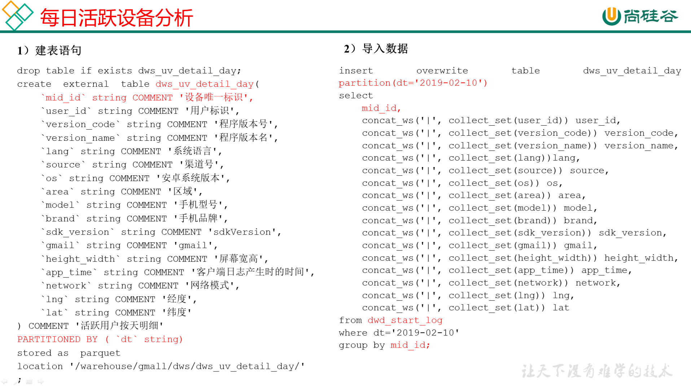

# 需求一：用户活跃主题

## DWS层

### 每日活跃设备明细



**建表**

```sql
drop table if exists dws_uv_detail_day;
create external table dws_uv_detail_day
(
    `mid_id` string COMMENT '设备唯一标识',
    `user_id` string COMMENT '用户标识', 
    `version_code` string COMMENT '程序版本号', 
    `version_name` string COMMENT '程序版本名', 
    `lang` string COMMENT '系统语言', 
    `source` string COMMENT '渠道号', 
    `os` string COMMENT '安卓系统版本', 
    `area` string COMMENT '区域', 
    `model` string COMMENT '手机型号', 
    `brand` string COMMENT '手机品牌', 
    `sdk_version` string COMMENT 'sdkVersion', 
    `gmail` string COMMENT 'gmail', 
    `height_width` string COMMENT '屏幕宽高',
    `app_time` string COMMENT '客户端日志产生时的时间',
    `network` string COMMENT '网络模式',
    `lng` string COMMENT '经度',
    `lat` string COMMENT '纬度'
)
partitioned by(pt_d string)
stored as parquet
location '/warehouse/gmall/dws/dws_uv_detail_day';
```

**导数**

以用户单日访问为key进行聚合，如果某个用户在一天中使用了两种操作系统、两个系统版本、多个地区，登录不同账号，只取其中之一

```sql
set hive.exec.dynamic.partition.mode=nonstrict;

insert overwrite table dws_uv_detail_day 
partition(pt_d='2021-02-19')
select  
    mid_id,
    concat_ws('|', collect_set(user_id)) user_id,
    concat_ws('|', collect_set(version_code)) version_code,
    concat_ws('|', collect_set(version_name)) version_name,
    concat_ws('|', collect_set(lang))lang,
    concat_ws('|', collect_set(source)) source,
    concat_ws('|', collect_set(os)) os,
    concat_ws('|', collect_set(area)) area, 
    concat_ws('|', collect_set(model)) model,
    concat_ws('|', collect_set(brand)) brand,
    concat_ws('|', collect_set(sdk_version)) sdk_version,
    concat_ws('|', collect_set(gmail)) gmail,
    concat_ws('|', collect_set(height_width)) height_width,
    concat_ws('|', collect_set(app_time)) app_time,
    concat_ws('|', collect_set(network)) network,
    concat_ws('|', collect_set(lng)) lng,
    concat_ws('|', collect_set(lat)) lat
from dwd_start_log
where pt_d='2021-02-19'
group by mid_id;
```

### 每周活跃设备明细


**建表**

```sql
drop table if exists dws_uv_detail_wk;
create external table dws_uv_detail_wk( 
    `mid_id` string COMMENT '设备唯一标识',
    `user_id` string COMMENT '用户标识', 
    `version_code` string COMMENT '程序版本号', 
    `version_name` string COMMENT '程序版本名', 
    `lang` string COMMENT '系统语言', 
    `source` string COMMENT '渠道号', 
    `os` string COMMENT '安卓系统版本', 
    `area` string COMMENT '区域', 
    `model` string COMMENT '手机型号', 
    `brand` string COMMENT '手机品牌', 
    `sdk_version` string COMMENT 'sdkVersion', 
    `gmail` string COMMENT 'gmail', 
    `height_width` string COMMENT '屏幕宽高',
    `app_time` string COMMENT '客户端日志产生时的时间',
    `network` string COMMENT '网络模式',
    `lng` string COMMENT '经度',
    `lat` string COMMENT '纬度',
    `monday_date` string COMMENT '周一日期',
    `sunday_date` string COMMENT  '周日日期' 
) COMMENT '活跃用户按周明细'
PARTITIONED BY (`pt_w` string)
stored as parquet
location '/warehouse/gmall/dws/dws_uv_detail_wk/';
```

**导数**

```sql
set hive.exec.dynamic.partition.mode=nonstrict;

insert overwrite table dws_uv_detail_wk partition(pt_w)
select  
    mid_id,
    concat_ws('|', collect_set(user_id)) user_id,
    concat_ws('|', collect_set(version_code)) version_code,
    concat_ws('|', collect_set(version_name)) version_name,
    concat_ws('|', collect_set(lang)) lang,
    concat_ws('|', collect_set(source)) source,
    concat_ws('|', collect_set(os)) os,
    concat_ws('|', collect_set(area)) area, 
    concat_ws('|', collect_set(model)) model,
    concat_ws('|', collect_set(brand)) brand,
    concat_ws('|', collect_set(sdk_version)) sdk_version,
    concat_ws('|', collect_set(gmail)) gmail,
    concat_ws('|', collect_set(height_width)) height_width,
    concat_ws('|', collect_set(app_time)) app_time,
    concat_ws('|', collect_set(network)) network,
    concat_ws('|', collect_set(lng)) lng,
    concat_ws('|', collect_set(lat)) lat,
    date_add(next_day('2021-02-19','MO'),-7),
    date_add(next_day('2021-02-19','MO'),-1),
    concat(date_add( next_day('2021-02-19','MO'),-7), '_' , date_add(next_day('2021-02-19','MO'),-1) 
)
from dws_uv_detail_day 
where pt_d>=date_add(next_day('2021-02-19','MO'),-7) and pt_d<=date_add(next_day('2021-02-19','MO'),-1) 
group by mid_id;
```

### 每月活跃设备明细


**建表**

```sql
drop table if exists dws_uv_detail_mn;

create external table dws_uv_detail_mn( 
    `mid_id` string COMMENT '设备唯一标识',
    `user_id` string COMMENT '用户标识', 
    `version_code` string COMMENT '程序版本号', 
    `version_name` string COMMENT '程序版本名', 
    `lang` string COMMENT '系统语言', 
    `source` string COMMENT '渠道号', 
    `os` string COMMENT '安卓系统版本', 
    `area` string COMMENT '区域', 
    `model` string COMMENT '手机型号', 
    `brand` string COMMENT '手机品牌', 
    `sdk_version` string COMMENT 'sdkVersion', 
    `gmail` string COMMENT 'gmail', 
    `height_width` string COMMENT '屏幕宽高',
    `app_time` string COMMENT '客户端日志产生时的时间',
    `network` string COMMENT '网络模式',
    `lng` string COMMENT '经度',
    `lat` string COMMENT '纬度'
) COMMENT '活跃用户按月明细'
PARTITIONED BY (`pt_m` string)
stored as parquet
location '/warehouse/gmall/dws/dws_uv_detail_mn/';
```

**导数**

```sql
set hive.exec.dynamic.partition.mode=nonstrict;

insert overwrite table dws_uv_detail_mn partition(pt_m)
select  
    mid_id,
    concat_ws('|', collect_set(user_id)) user_id,
    concat_ws('|', collect_set(version_code)) version_code,
    concat_ws('|', collect_set(version_name)) version_name,
    concat_ws('|', collect_set(lang)) lang,
    concat_ws('|', collect_set(source)) source,
    concat_ws('|', collect_set(os)) os,
    concat_ws('|', collect_set(area)) area, 
    concat_ws('|', collect_set(model)) model,
    concat_ws('|', collect_set(brand)) brand,
    concat_ws('|', collect_set(sdk_version)) sdk_version,
    concat_ws('|', collect_set(gmail)) gmail,
    concat_ws('|', collect_set(height_width)) height_width,
    concat_ws('|', collect_set(app_time)) app_time,
    concat_ws('|', collect_set(network)) network,
    concat_ws('|', collect_set(lng)) lng,
    concat_ws('|', collect_set(lat)) lat,
    date_format('2021-02-19','yyyy-MM')
from dws_uv_detail_day
where date_format(pt_d,'yyyy-MM') = date_format('2021-02-19','yyyy-MM')
group by mid_id;
```

### DWS层加载数据脚本

```sql
[root@node01 appmain]# pwd
/opt/stanlong/appmain
[root@node01 appmain]# vi dws_uv_log.sh
```

```sql
#!/bin/bash

# 定义变量方便修改
APP=gmall
hive=/opt/stanlong/hive/apache-hive-1.2.2-bin/bin/hive

# 如果是输入的日期按照取输入日期；如果没输入日期取当前时间的前一天
if [ -n "$1" ] ;then
	do_date=$1
else 
	do_date=`date -d "-1 day" +%F`  
fi 


sql="
  set hive.exec.dynamic.partition.mode=nonstrict;

  insert overwrite table "$APP".dws_uv_detail_day partition(pt_d='$do_date')
  select  
    mid_id,
    concat_ws('|', collect_set(user_id)) user_id,
    concat_ws('|', collect_set(version_code)) version_code,
    concat_ws('|', collect_set(version_name)) version_name,
    concat_ws('|', collect_set(lang)) lang,
    concat_ws('|', collect_set(source)) source,
    concat_ws('|', collect_set(os)) os,
    concat_ws('|', collect_set(area)) area, 
    concat_ws('|', collect_set(model)) model,
    concat_ws('|', collect_set(brand)) brand,
    concat_ws('|', collect_set(sdk_version)) sdk_version,
    concat_ws('|', collect_set(gmail)) gmail,
    concat_ws('|', collect_set(height_width)) height_width,
    concat_ws('|', collect_set(app_time)) app_time,
    concat_ws('|', collect_set(network)) network,
    concat_ws('|', collect_set(lng)) lng,
    concat_ws('|', collect_set(lat)) lat
  from "$APP".dwd_start_log
  where pt_d='$do_date'  
  group by mid_id;


  insert overwrite table "$APP".dws_uv_detail_wk partition(pt_w)
  select  
    mid_id,
    concat_ws('|', collect_set(user_id)) user_id,
    concat_ws('|', collect_set(version_code)) version_code,
    concat_ws('|', collect_set(version_name)) version_name,
    concat_ws('|', collect_set(lang)) lang,
    concat_ws('|', collect_set(source)) source,
    concat_ws('|', collect_set(os)) os,
    concat_ws('|', collect_set(area)) area, 
    concat_ws('|', collect_set(model)) model,
    concat_ws('|', collect_set(brand)) brand,
    concat_ws('|', collect_set(sdk_version)) sdk_version,
    concat_ws('|', collect_set(gmail)) gmail,
    concat_ws('|', collect_set(height_width)) height_width,
    concat_ws('|', collect_set(app_time)) app_time,
    concat_ws('|', collect_set(network)) network,
    concat_ws('|', collect_set(lng)) lng,
    concat_ws('|', collect_set(lat)) lat,
    date_add(next_day('$do_date','MO'),-7),
    date_add(next_day('$do_date','MO'),-1),
    concat(date_add( next_day('$do_date','MO'),-7), '_' , date_add(next_day('$do_date','MO'),-1) 
  )
  from "$APP".dws_uv_detail_day
  where pt_d>=date_add(next_day('$do_date','MO'),-7) and pt_d<=date_add(next_day('$do_date','MO'),-1) 
  group by mid_id; 


  insert overwrite table "$APP".dws_uv_detail_mn partition(pt_m)
  select
    mid_id,
    concat_ws('|', collect_set(user_id)) user_id,
    concat_ws('|', collect_set(version_code)) version_code,
    concat_ws('|', collect_set(version_name)) version_name,
    concat_ws('|', collect_set(lang))lang,
    concat_ws('|', collect_set(source)) source,
    concat_ws('|', collect_set(os)) os,
    concat_ws('|', collect_set(area)) area, 
    concat_ws('|', collect_set(model)) model,
    concat_ws('|', collect_set(brand)) brand,
    concat_ws('|', collect_set(sdk_version)) sdk_version,
    concat_ws('|', collect_set(gmail)) gmail,
    concat_ws('|', collect_set(height_width)) height_width,
    concat_ws('|', collect_set(app_time)) app_time,
    concat_ws('|', collect_set(network)) network,
    concat_ws('|', collect_set(lng)) lng,
    concat_ws('|', collect_set(lat)) lat,
    date_format('$do_date','yyyy-MM')
  from "$APP".dws_uv_detail_day
  where date_format(pt_d,'yyyy-MM') = date_format('$do_date','yyyy-MM')   
  group by mid_id;
"

$hive -e "$sql"
```

```sql
[root@node01 appmain]# chmod +x dws_uv_log.sh
```

```sql
show partitions dws_uv_detail_day;
show partitions dws_uv_detail_wk;
show partitions dws_uv_detail_mn;
```


## ADS层

目标：当日、当周、当月活跃设备数

### 活跃设备数


**建表**

```sql
drop table if exists ads_uv_count;
create external table ads_uv_count( 
    `dt` string COMMENT '统计日期',
    `day_count` bigint COMMENT '当日用户数量',
    `wk_count`  bigint COMMENT '当周用户数量',
    `mn_count`  bigint COMMENT '当月用户数量',
    `is_weekend` string COMMENT 'Y,N是否是周末,用于得到本周最终结果',
    `is_monthend` string COMMENT 'Y,N是否是月末,用于得到本月最终结果' 
) COMMENT '活跃设备数'
row format delimited fields terminated by '\t'
location '/warehouse/gmall/ads/ads_uv_count/'
;
```

**导数**

```sql
insert into table ads_uv_count 
select  
  '2021-02-19' dt,
   daycount.ct,
   wkcount.ct,
   mncount.ct,
   if(date_add(next_day('2021-02-19','MO'),-1)='2021-02-19','Y','N') ,
   if(last_day('2021-02-19')='2019-02-10','Y','N') 
from 
(
   select  
      '2021-02-19' dt,
       count(*) ct
   from dws_uv_detail_day
   where pt_d='2021-02-19'  
)daycount join 
( 
   select  
     '2021-02-19' dt,
     count (*) ct
   from dws_uv_detail_wk
   where pt_w=concat(date_add(next_day('2021-02-19','MO'),-7),'_' ,date_add(next_day('2021-02-19','MO'),-1) )
) wkcount on daycount.dt=wkcount.dt
join 
( 
   select  
     '2021-02-19' dt,
     count (*) ct
   from dws_uv_detail_mn
   where pt_m=date_format('2021-02-19','yyyy-MM')  
)mncount on daycount.dt=mncount.dt
;
```

### ADS层加载数据脚本

```shell
[root@node01 appmain]# pwd
/opt/stanlong/appmain
[root@node01 appmain]# vi ads_uv_log.sh
```

```sql
#!/bin/bash

# 定义变量方便修改
APP=gmall
hive=/opt/stanlong/hive/apache-hive-1.2.2-bin/bin/hive

# 如果是输入的日期按照取输入日期；如果没输入日期取当前时间的前一天
if [ -n "$1" ] ;then
	do_date=$1
else 
	do_date=`date -d "-1 day" +%F`  
fi 

sql="
  set hive.exec.dynamic.partition.mode=nonstrict;

insert into table "$APP".ads_uv_count 
select  
  '$do_date' dt,
   daycount.ct,
   wkcount.ct,
   mncount.ct,
   if(date_add(next_day('$do_date','MO'),-1)='$do_date','Y','N') ,
   if(last_day('$do_date')='$do_date','Y','N') 
from 
(
   select  
      '$do_date' dt,
       count(*) ct
   from "$APP".dws_uv_detail_day
   where pt_d='$do_date'  
)daycount   join 
( 
   select  
     '$do_date' dt,
     count (*) ct
   from "$APP".dws_uv_detail_wk
   where pt_w=concat(date_add(next_day('$do_date','MO'),-7),'_' ,date_add(next_day('$do_date','MO'),-1) )
)  wkcount  on daycount.dt=wkcount.dt
join 
( 
   select  
     '$do_date' dt,
     count (*) ct
   from "$APP".dws_uv_detail_mn
   where pt_m=date_format('$do_date','yyyy-MM')  
)mncount on daycount.dt=mncount.dt;
"

$hive -e "$sql"
```

```shell
[root@node01 appmain]# chmod +x ads_uv_log.sh 
```

