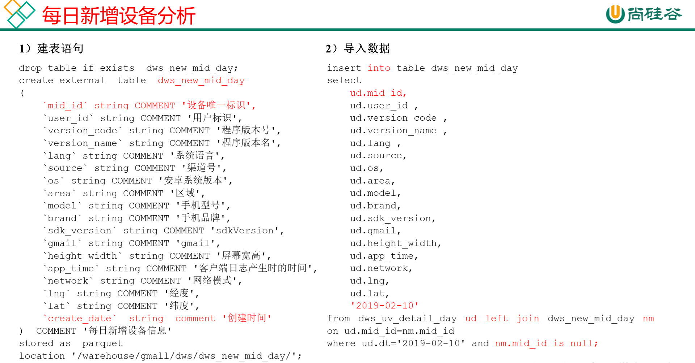
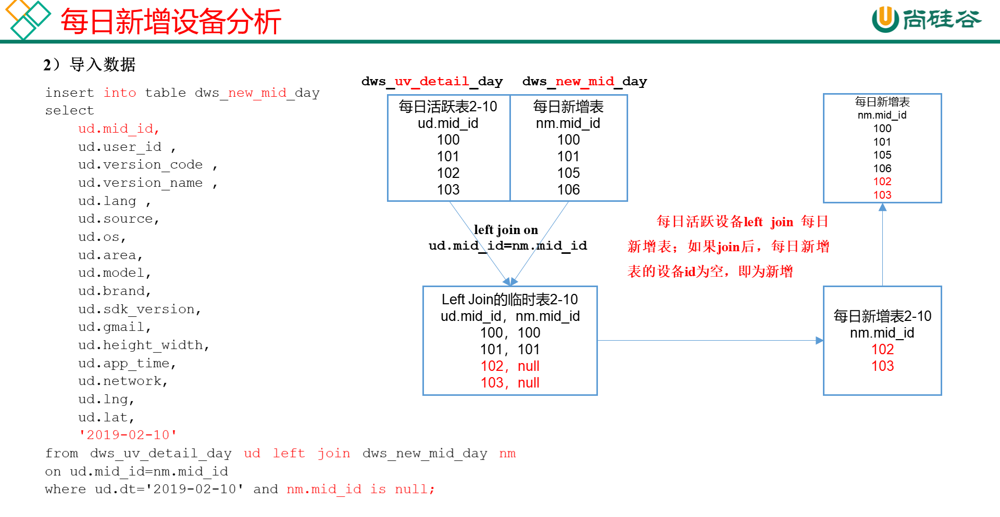
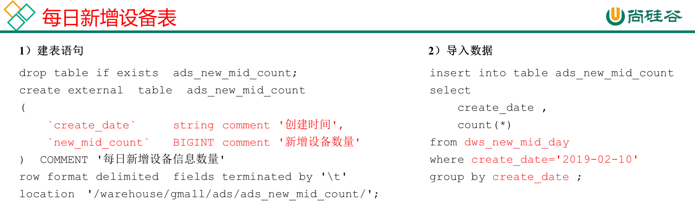

# 需求二：用户新增主题

首次联网使用应用的用户。如果一个用户首次打开某APP，那这个用户定义为新增用户；卸载再安装的设备，不会被算作一次新增。新增用户包括日新增用户、周新增用户、月新增用户。

## DWS层

### 每日新增设备明细表





**建表**

```sql
drop table if exists dws_new_mid_day;
create external table dws_new_mid_day
(
    `mid_id` string COMMENT '设备唯一标识',
    `user_id` string COMMENT '用户标识', 
    `version_code` string COMMENT '程序版本号', 
    `version_name` string COMMENT '程序版本名', 
    `lang` string COMMENT '系统语言', 
    `source` string COMMENT '渠道号', 
    `os` string COMMENT '安卓系统版本', 
    `area` string COMMENT '区域', 
    `model` string COMMENT '手机型号', 
    `brand` string COMMENT '手机品牌', 
    `sdk_version` string COMMENT 'sdkVersion', 
    `gmail` string COMMENT 'gmail', 
    `height_width` string COMMENT '屏幕宽高',
    `app_time` string COMMENT '客户端日志产生时的时间',
    `network` string COMMENT '网络模式',
    `lng` string COMMENT '经度',
    `lat` string COMMENT '纬度',
    `create_date`  string  comment '创建时间' 
)  COMMENT '每日新增设备信息'
stored as parquet
location '/warehouse/gmall/dws/dws_new_mid_day/';
```

**导数**

用每日活跃用户表Left Join每日新增设备表，关联的条件是mid_id相等。如果是每日新增的设备，则在每日新增设备表中为null。

```sql
insert into table dws_new_mid_day
select  
    ud.mid_id,
    ud.user_id , 
    ud.version_code , 
    ud.version_name , 
    ud.lang , 
    ud.source, 
    ud.os, 
    ud.area, 
    ud.model, 
    ud.brand, 
    ud.sdk_version, 
    ud.gmail, 
    ud.height_width,
    ud.app_time,
    ud.network,
    ud.lng,
    ud.lat,
    '2021-02-19'
from dws_uv_detail_day ud left join dws_new_mid_day nm on ud.mid_id=nm.mid_id
where ud.pt_d='2021-02-19' and nm.mid_id is null;
```

## ADS层

### 每日新增设备表



**建表**

```sql
drop table if exists ads_new_mid_count;
create external table ads_new_mid_count
(
    `create_date`     string comment '创建时间' ,
    `new_mid_count`   BIGINT comment '新增设备数量' 
)  COMMENT '每日新增设备信息数量'
row format delimited fields terminated by '\t'
location '/warehouse/gmall/ads/ads_new_mid_count/';

```

**导数**

```sql
insert into table ads_new_mid_count 
select
create_date,
count(*)
from dws_new_mid_day
where create_date='2021-02-19'
group by create_date;
```

