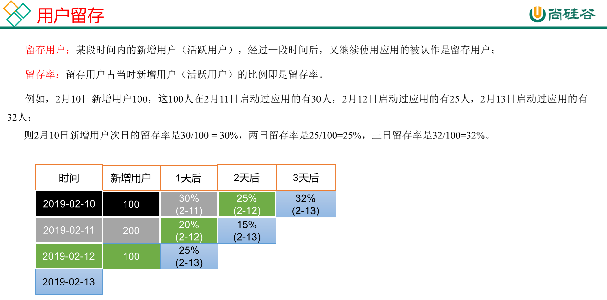

# 需求三：用户留存主题




## DWS层

### 每日留存用户明细表

**建表**

```sql
drop table if exists dws_user_retention_day;
create external table dws_user_retention_day 
(
    `mid_id` string COMMENT '设备唯一标识',
    `user_id` string COMMENT '用户标识', 
    `version_code` string COMMENT '程序版本号', 
    `version_name` string COMMENT '程序版本名', 
`lang` string COMMENT '系统语言', 
`source` string COMMENT '渠道号', 
`os` string COMMENT '安卓系统版本', 
`area` string COMMENT '区域', 
`model` string COMMENT '手机型号', 
`brand` string COMMENT '手机品牌', 
`sdk_version` string COMMENT 'sdkVersion', 
`gmail` string COMMENT 'gmail', 
`height_width` string COMMENT '屏幕宽高',
`app_time` string COMMENT '客户端日志产生时的时间',
`network` string COMMENT '网络模式',
`lng` string COMMENT '经度',
`lat` string COMMENT '纬度',
   `create_date`    string  comment '设备新增时间',
   `retention_day`  int comment '截止当前日期留存天数'
)  COMMENT '每日用户留存情况'
PARTITIONED BY (`pt_d` string)
stored as parquet
location '/warehouse/gmall/dws/dws_user_retention_day/';
```

**导数**

```sql
insert overwrite table dws_user_retention_day
partition(pt_d="2021-02-19")
select  
    nm.mid_id,
    nm.user_id , 
    nm.version_code , 
    nm.version_name , 
    nm.lang , 
    nm.source, 
    nm.os, 
    nm.area, 
    nm.model, 
    nm.brand, 
    nm.sdk_version, 
    nm.gmail, 
    nm.height_width,
    nm.app_time,
    nm.network,
    nm.lng,
    nm.lat,
nm.create_date,
1 retention_day 
from dws_uv_detail_day ud join dws_new_mid_day nm   on ud.mid_id =nm.mid_id 
where ud.pt_d='2021-02-19' and nm.create_date=date_add('2021-02-19',-1);
```

### 1,2,3,n天留存用户明细表

**导数**

```sql
insert overwrite table dws_user_retention_day
partition(pt_d="2021-02-19")
select
    nm.mid_id,
    nm.user_id,
    nm.version_code,
    nm.version_name,
    nm.lang,
    nm.source,
    nm.os,
    nm.area,
    nm.model,
    nm.brand,
    nm.sdk_version,
    nm.gmail,
    nm.height_width,
    nm.app_time,
    nm.network,
    nm.lng,
    nm.lat,
    nm.create_date,
    1 retention_day 
from dws_uv_detail_day ud join dws_new_mid_day nm  on ud.mid_id =nm.mid_id 
where ud.pt_d='2021-02-19' and nm.create_date=date_add('2021-02-19',-1)

union all

select  
    nm.mid_id,
    nm.user_id , 
    nm.version_code , 
    nm.version_name , 
    nm.lang , 
    nm.source, 
    nm.os, 
    nm.area, 
    nm.model, 
    nm.brand, 
    nm.sdk_version, 
    nm.gmail, 
    nm.height_width,
    nm.app_time,
    nm.network,
    nm.lng,
    nm.lat,
    nm.create_date,
    2 retention_day 
from  dws_uv_detail_day ud join dws_new_mid_day nm   on ud.mid_id =nm.mid_id 
where ud.pt_d='2021-02-19' and nm.create_date=date_add('2021-02-19',-2)

union all

select  
    nm.mid_id,
    nm.user_id , 
    nm.version_code , 
    nm.version_name , 
    nm.lang , 
    nm.source, 
    nm.os, 
    nm.area, 
    nm.model, 
    nm.brand, 
    nm.sdk_version, 
    nm.gmail, 
    nm.height_width,
    nm.app_time,
    nm.network,
    nm.lng,
    nm.lat,
    nm.create_date,
    3 retention_day 
from  dws_uv_detail_day ud join dws_new_mid_day nm   on ud.mid_id =nm.mid_id 
where ud.pt_d='2021-02-19' and nm.create_date=date_add('2021-02-19',-3);
```

### Union与Union all区别

（1）union会将联合的结果集去重，效率较union all差

（2）union all不会对结果集去重，所以效率高

## ADS层

### 留存用户数

**建表**

```sql
drop table if exists ads_user_retention_day_count;
create external table ads_user_retention_day_count 
(
   `create_date`       string  comment '设备新增日期',
   `retention_day`     int comment '截止当前日期留存天数',
   `retention_count`    bigint comment  '留存数量'
)  COMMENT '每日用户留存情况'
row format delimited fields terminated by '\t'
location '/warehouse/gmall/ads/ads_user_retention_day_count/';
```

**导数**

```sql
insert into table ads_user_retention_day_count 
select
    create_date,
    retention_day,
    count(*) retention_count
from dws_user_retention_day
where pt_d='2021-02-19' 
group by create_date,retention_day;
```

### 留存用户比率

**建表**

```sql
drop table if exists ads_user_retention_day_rate;
create external table ads_user_retention_day_rate 
(
     `stat_date`          string comment '统计日期',
     `create_date`       string  comment '设备新增日期',
     `retention_day`     int comment '截止当前日期留存天数',
     `retention_count`    bigint comment  '留存数量',
     `new_mid_count`     bigint comment '当日设备新增数量',
     `retention_ratio`   decimal(10,2) comment '留存率'
)  COMMENT '每日用户留存情况'
row format delimited fields terminated by '\t'
location '/warehouse/gmall/ads/ads_user_retention_day_rate/';
```

**导数**

```sql
insert into table ads_user_retention_day_rate
select 
    '2021-02-19', 
    ur.create_date,
    ur.retention_day, 
    ur.retention_count, 
    nc.new_mid_count,
    ur.retention_count/nc.new_mid_count*100
from 
(
    select
        create_date,
        retention_day,
        count(*) retention_count
    from dws_user_retention_day
    where pt_d='2021-02-19' 
    group by create_date,retention_day
) ur join ads_new_mid_count nc on nc.create_date=ur.create_date;
```


