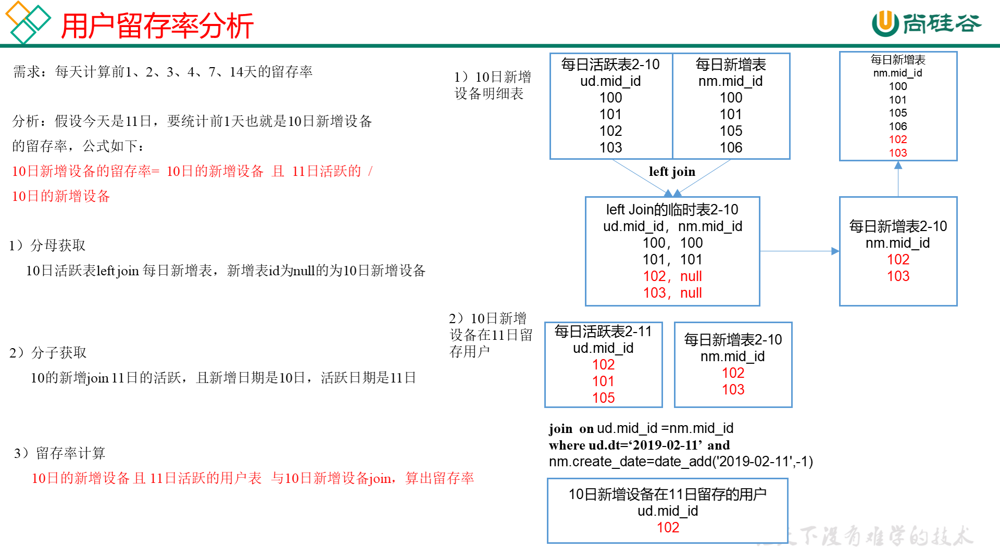

# 需求四：沉默用户数

为了分析沉默用户、本周回流用户数、流失用户、最近连续3周活跃用户、最近七天内连续三天活跃用户数，需要准备2021-02-23到2021-03-04日的数据。

仅作为学习记录，数据不要求准确。

## DWS层

使用日活明细表dws_uv_detail_day作为DWS层数据

## ADS层



**建表**

```sql
drop table if exists ads_slient_count;
create external table ads_slient_count( 
    `dt` string COMMENT '统计日期',
    `slient_count` bigint COMMENT '沉默设备数'
) 
row format delimited fields terminated by '\t'
location '/warehouse/gmall/ads/ads_slient_count';
```

**导数**

```sql
insert into table ads_slient_count
select 
    '2021-02-19' dt,
    count(*) slient_count
from 
(
    select mid_id
    from dws_uv_detail_day
    where pt_d<='2021-02-19'
    group by mid_id
    having count(*)=1 and min(pt_d)<date_add('2021-02-19',-7)
) t1;
```

**脚本**

```sql
[root@node01 appmain]# pwd
/opt/stanlong/appmain
[root@node01 appmain]# vi ads_slient_log.sh
```

```sql
#!/bin/bash

hive=/opt/stanlong/hive/apache-hive-1.2.2-bin/bin/hive
APP=gmall

if [ -n "$1" ];then
	do_date=$1
else
	do_date=`date -d "-1 day" +%F`
fi

echo "-----------导入日期$do_date-----------"

sql="
insert into table "$APP".ads_slient_count
select 
    '$do_date' dt,
    count(*) slient_count
from 
(
    select 
        mid_id
    from "$APP".dws_uv_detail_day
    where pt_d<='$do_date'
    group by mid_id
    having count(*)=1 and min(pt_d)<=date_add('$do_date',-7)
)t1;"

$hive -e "$sql"

```

```shell
[root@node01 appmain]# chmod +x ads_slient_log.sh 
```


