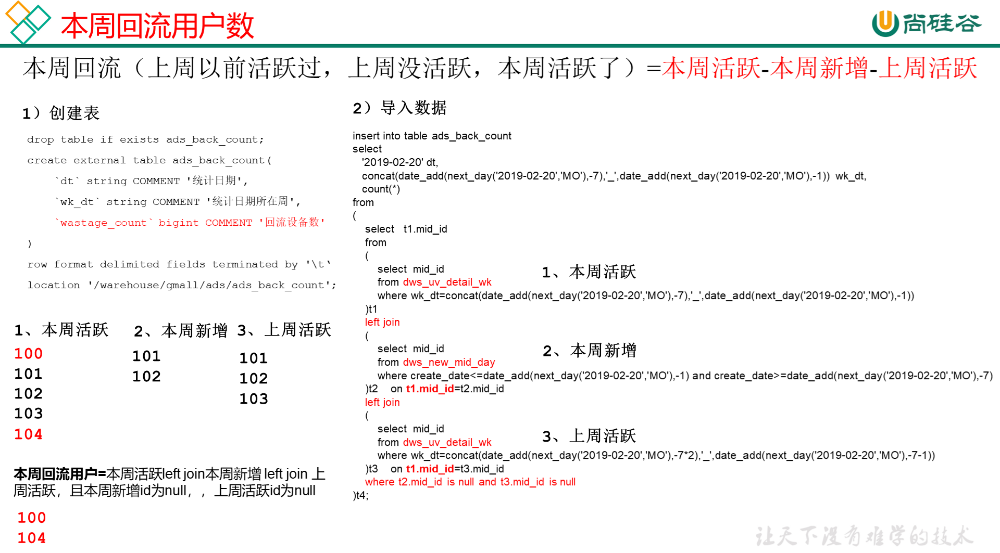

# 需求五：本周回流用户数

## DWS层

使用日活明细表dws_uv_detail_day作为DWS层数据

## ADS层



**建表**

```sql
drop table if exists ads_back_count;
create external table ads_back_count( 
    `dt` string COMMENT '统计日期',
    `wk_dt` string COMMENT '统计日期所在周',
    `wastage_count` bigint COMMENT '回流设备数'
) 
row format delimited fields terminated by '\t'
location '/warehouse/gmall/ads/ads_back_count';
```

**导数**

```sql
insert into table ads_back_count
select 
   '2021-02-19' dt,
   concat(date_add(next_day('2021-02-19','MO'),-7),'_',date_add(next_day('2021-02-19','MO'),-1)) wk_dt,
   count(*)
from 
(
    select t1.mid_id
    from 
    (
        select	mid_id
        from dws_uv_detail_wk
        where pt_w=concat(date_add(next_day('2021-02-19','MO'),-7),'_',date_add(next_day('2021-02-19','MO'),-1))
    )t1
    left join
    (
        select mid_id
        from dws_new_mid_day
        where create_date<=date_add(next_day('2021-02-19','MO'),-1) and create_date>=date_add(next_day('2021-02-19','MO'),-7)
    )t2
    on t1.mid_id=t2.mid_id
    left join
    (
        select mid_id
        from dws_uv_detail_wk
        where pt_w=concat(date_add(next_day('2021-02-19','MO'),-7*2),'_',date_add(next_day('2021-02-19','MO'),-7-1))
    )t3
    on t1.mid_id=t3.mid_id
    where t2.mid_id is null and t3.mid_id is null
)t4;
```

**脚本**

```sql
[root@node01 appmain]# pwd
/opt/stanlong/appmain
[root@node01 appmain]# vi ads_back_log.sh
```

```sql
#!/bin/bash

if [ -n "$1" ];then
	do_date=$1
else
	do_date=`date -d "-1 day" +%F`
fi

hive=/opt/stanlong/hive/apache-hive-1.2.2-bin/bin/hive
APP=gmall

echo "-----------导入日期$do_date-----------"

sql="
insert into table "$APP".ads_back_count
select 
       '$do_date' dt,
       concat(date_add(next_day('$do_date','MO'),-7),'_',date_add(next_day('$do_date','MO'),-1)) wk_dt,
       count(*)
from 
(
    select t1.mid_id
    from 
    (
        select mid_id
        from "$APP".dws_uv_detail_wk
        where pt_w=concat(date_add(next_day('$do_date','MO'),-7),'_',date_add(next_day('$do_date','MO'),-1))
    )t1
    left join
    (
        select mid_id
        from "$APP".dws_new_mid_day
        where create_date<=date_add(next_day('$do_date','MO'),-1) and create_date>=date_add(next_day('$do_date','MO'),-7)
    )t2
    on t1.mid_id=t2.mid_id
    left join
    (
        select mid_id
        from "$APP".dws_uv_detail_wk
        where pt_w=concat(date_add(next_day('$do_date','MO'),-7*2),'_',date_add(next_day('$do_date','MO'),-7-1))
    )t3
    on t1.mid_id=t3.mid_id
    where t2.mid_id is null and t3.mid_id is null
)t4;
"

$hive -e "$sql"
```

```shell
[root@node01 appmain]# chmod +x ads_back_log.sh 
```

