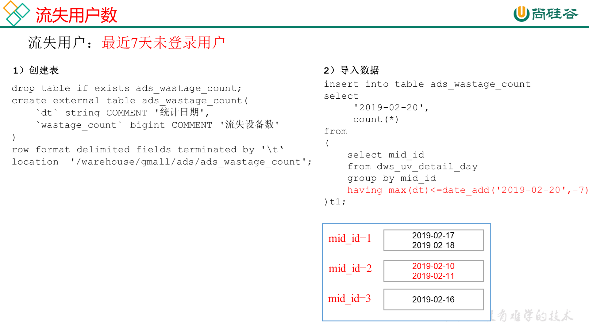

# 需求六：流失用户数

流失用户：最近7天未登录我们称之为流失用户

## DWS层

使用日活明细表dws_uv_detail_day作为DWS层数据

## ADS层



**建表**

```sql
drop table if exists ads_wastage_count;
create external table ads_wastage_count( 
    `dt` string COMMENT '统计日期',
    `wastage_count` bigint COMMENT '流失设备数'
) 
row format delimited fields terminated by '\t'
location '/warehouse/gmall/ads/ads_wastage_count';
```

**导数**

```sql
insert into table ads_wastage_count
select
     '2021-02-19',
     count(*)
from 
(
    select mid_id
from dws_uv_detail_day
    group by mid_id
    having max(pt_d)<=date_add('2021-02-19',-7)
)t1;
```

**脚本**

```shell
[root@node01 appmain]# pwd
/opt/stanlong/appmain
[root@node01 appmain]# vi ads_wastage_log.sh
```

```sql
#!/bin/bash

if [ -n "$1" ];then
	do_date=$1
else
	do_date=`date -d "-1 day" +%F`
fi

hive=/opt/stanlong/hive/apache-hive-1.2.2-bin/bin/hive
APP=gmall

echo "-----------导入日期$do_date-----------"

sql="
insert into table "$APP".ads_wastage_count
select
     '$do_date',
     count(*)
from 
(
    select mid_id
    from "$APP".dws_uv_detail_day
    group by mid_id
    having max(pt_d)<=date_add('$do_date',-7)
)t1;
"

$hive -e "$sql"

```

```shell
[root@node01 appmain]# chmod +x ads_wastage_log.sh 
```

