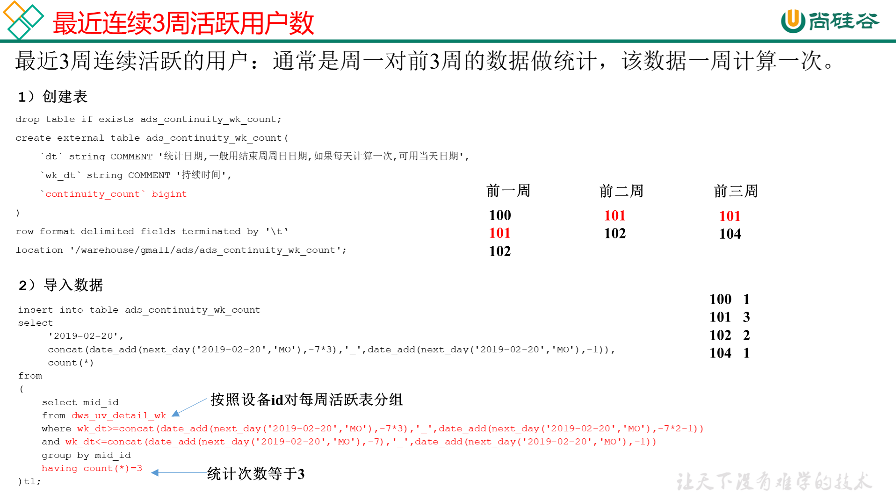

# 需求七：最近连续3周活跃用户数

最近3周连续活跃的用户：通常是周一对前3周的数据做统计，该数据一周计算一次。

## DWS层

使用周活明细表dws_uv_detail_wk作为DWS层数据

## ADS层



**建表**

```sql
drop table if exists ads_continuity_wk_count;
create external table ads_continuity_wk_count( 
    `dt` string COMMENT '统计日期,一般用结束周周日日期,如果每天计算一次,可用当天日期',
    `wk_dt` string COMMENT '持续时间',
    `continuity_count` bigint
) 
row format delimited fields terminated by '\t'
location '/warehouse/gmall/ads/ads_continuity_wk_count';
```

**导数**

```sql
insert into table ads_continuity_wk_count
select 
     '2021-02-19',
     concat(date_add(next_day('2021-02-19','MO'),-7*3),'_',date_add(next_day('2021-02-19','MO'),-1)),
     count(*)
from 
(
    select mid_id
    from dws_uv_detail_wk
    where pt_w>=concat(date_add(next_day('2021-02-19','MO'),-7*3),'_',date_add(next_day('2021-02-19','MO'),-7*2-1)) 
    and pt_w<=concat(date_add(next_day('2021-02-19','MO'),-7),'_',date_add(next_day('2021-02-19','MO'),-1))
    group by mid_id
    having count(*)=3
)t1;
```

**脚本**

```shell
[root@node01 appmain]# pwd
/opt/stanlong/appmain
[root@node01 appmain]# vi ads_continuity_wk_log.sh
```

```sql
#!/bin/bash

if [ -n "$1" ];then
	do_date=$1
else
	do_date=`date -d "-1 day" +%F`
fi

hive=/opt/stanlong/hive/apache-hive-1.2.2-bin/bin/hive
APP=gmall

echo "-----------导入日期$do_date-----------"

sql="
insert into table "$APP".ads_continuity_wk_count
select 
     '$do_date',
     concat(date_add(next_day('$do_date','MO'),-7*3),'_',date_add(next_day('$do_date','MO'),-1)),
     count(*)
from 
(
    select mid_id
    from "$APP".dws_uv_detail_wk
    where pt_w>=concat(date_add(next_day('$do_date','MO'),-7*3),'_',date_add(next_day('$do_date','MO'),-7*2-1)) 
    and pt_w<=concat(date_add(next_day('$do_date','MO'),-7),'_',date_add(next_day('$do_date','MO'),-1))
    group by mid_id
    having count(*)=3
)t1;"

$hive -e "$sql"

```

```shell
[root@node01 appmain]# chmod +x ads_continuity_wk_log.sh
```


