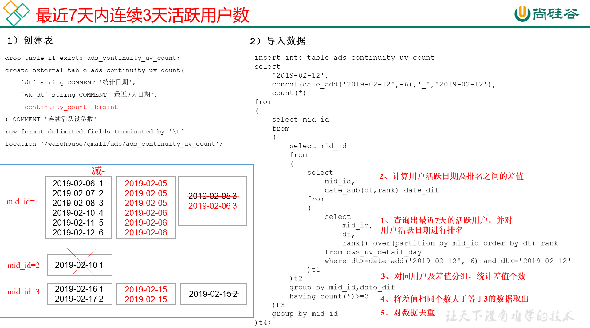

# 需求八：最近七天内连续三天活跃用户数

说明：最近7天内连续3天活跃用户数

## DWS层

使用日活明细表dws_uv_detail_day作为DWS层数据

## ADS层



**建表**

```sql
drop table if exists ads_continuity_uv_count;
create external table ads_continuity_uv_count( 
    `dt` string COMMENT '统计日期',
    `wk_dt` string COMMENT '最近7天日期',
    `continuity_count` bigint
) COMMENT '连续活跃设备数'
row format delimited fields terminated by '\t'
location '/warehouse/gmall/ads/ads_continuity_uv_count';
```

**导数**

```sql
insert into table ads_continuity_uv_count
select
    '2021-02-19',
    concat(date_add('2021-02-19',-6),'_','2021-02-19'),
    count(*)
from
(
    select mid_id
    from
    (
        select mid_id      
        from
        (
            select 
                mid_id,
                date_sub(pt_d,rank) date_dif
            from
            (
                select 
                    mid_id,
                    pt_d,
                    rank() over(partition by mid_id order by pt_d) rank
                from dws_uv_detail_day
                where pt_d>=date_add('2021-02-19',-6) and pt_d<='2021-02-19'
            )t1
        )t2 
        group by mid_id,date_dif
        having count(*)>=3
    )t3 
    group by mid_id
)t4;
```

**脚本**

```shell
[root@node01 appmain]# pwd
/opt/stanlong/appmain
[root@node01 appmain]# vi ads_continuity_log.sh
```

```sql
#!/bin/bash

if [ -n "$1" ];then
	do_date=$1
else
	do_date=`date -d "-1 day" +%F`
fi

hive=/opt/stanlong/hive/apache-hive-1.2.2-bin/bin/hive
APP=gmall

echo "-----------导入日期$do_date-----------"

sql="
insert into table "$APP".ads_continuity_uv_count
select 
     '$do_date',
     concat(date_add('$do_date',-6),'_','$do_date') dt,
     count(*) 
from 
(
    select mid_id
    from
    (
        select mid_id
        from 
        (
            select
                mid_id,
                date_sub(pt_d,rank) date_diff
            from 
            (
                select 
                    mid_id,
                    pt_d,
                    rank() over(partition by mid_id order by pt_d) rank
                from "$APP".dws_uv_detail_day
                where pt_d>=date_add('$do_date',-6) and pt_d<='$do_date'
            )t1
        )t2
        group by mid_id,date_diff
        having count(*)>=3
    )t3 
    group by mid_id
)t4;
"

$hive -e "$sql"
```

```shell
[root@node01 appmain]# chmod +x ads_continuity_log.sh
```

