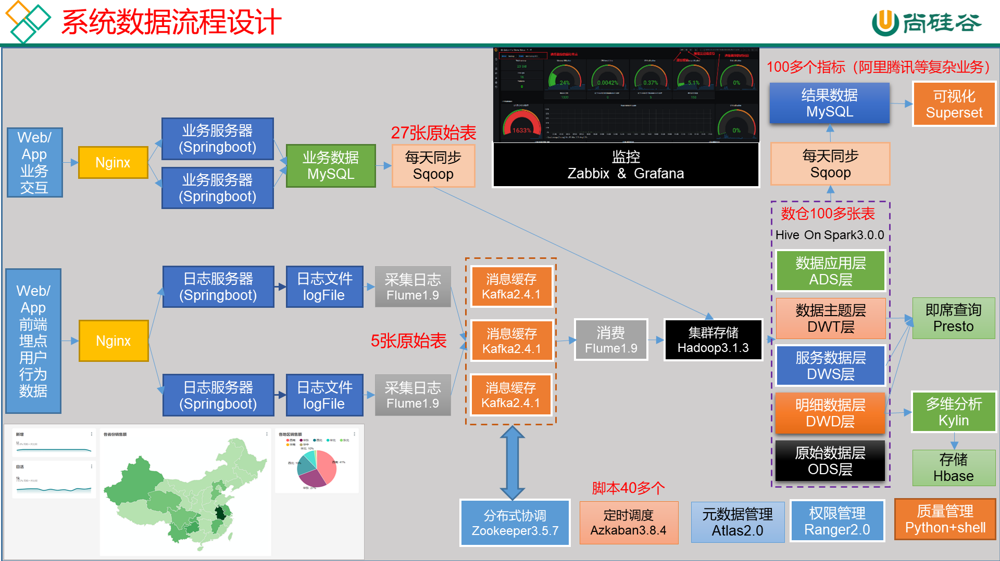

# 数据仓库

对数据进行存储、分析、计算的仓库，为企业决策提供数据支撑。

## 一、项目需求

1. 用户行为数据采集平台搭建
2. 业务数据采集平台搭建
3. 数据仓库维度建模 
4. 分析设备、会员、商品、地区、活动等电商核心主题，统计的报表指标进100个
5. 采用即席查询工具，随时进行指标分析
6. 对集群性能进行监控，发生异常需要报警
7. 元数据管理
8. 质量监控
9. 权限管理

## 二、项目框架

### 技术选型

- 数据采集传输：Flume, Kafka, Sqoop
- 数据存储：MySql, Hdfs, Hbase
- 数据计算：Hive, Tez, Spark
- 数据查询：Presto, Kylin
- 数据可视化：Echarts, Superset
- 任务调度：Azkaban
- 集群监控：Zabbix
- 元数据管理：Atlas
- 权限管理：Ranger

### 系统数据流程设计

### 集群规划

如何确认集群规模

1. 每条日活跃用户100万，每人一天平均100条：100万*100条=1亿条
2. 每条日志1K左右， 每条一亿条：1亿/1024/1024=约100G
3. 半年内不扩容服务器来算：100G*180天=约18T
4. 保存3副本：18T*3=54T
5. 预留20%-30%Buf=54T/0.7=77T
6. 算到这约8T*10台服务器

### 版本选择

以当前集群版本为准

