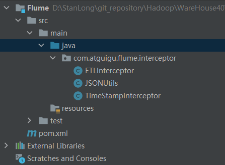
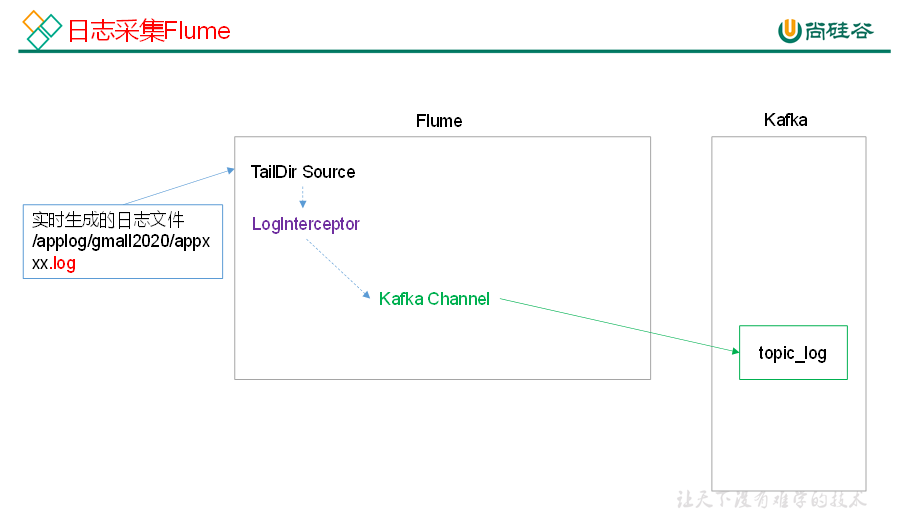
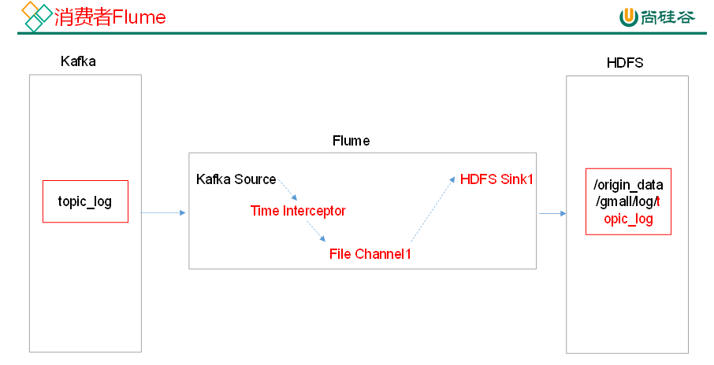
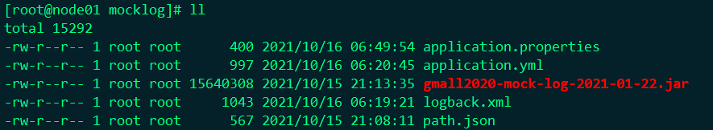
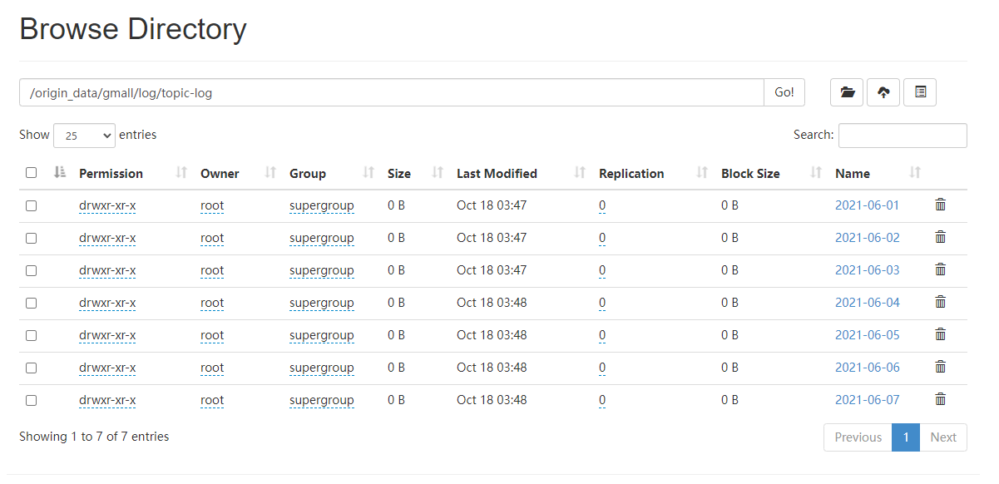

# 用户行为数据采集

## Flume拦截器



```java
package com.atguigu.flume.interceptor;

import org.apache.flume.Context;
import org.apache.flume.Event;
import org.apache.flume.interceptor.Interceptor;

import java.nio.charset.StandardCharsets;
import java.util.Iterator;
import java.util.List;

/**
 * 过滤非JSON格式的数据
 */
public class ETLInterceptor implements Interceptor {
    @Override
    public void initialize() {

    }

    @Override
    public Event intercept(Event event) {

        byte[] body = event.getBody();
        String log = new String(body, StandardCharsets.UTF_8);

        if (JSONUtils.isJSONValidate(log)) {
            return event;
        } else {
            return null;
        }
    }

    @Override
    public List<Event> intercept(List<Event> list) {

        Iterator<Event> iterator = list.iterator();

        while (iterator.hasNext()){
            Event next = iterator.next();
            if(intercept(next)==null){
                iterator.remove();
            }
        }

        return list;
    }

    public static class Builder implements Interceptor.Builder{

        @Override
        public Interceptor build() {
            return new ETLInterceptor();
        }
        @Override
        public void configure(Context context) {

        }

    }

    @Override
    public void close() {

    }

}
```

```java
package com.atguigu.flume.interceptor;

import com.alibaba.fastjson.JSON;
import com.alibaba.fastjson.JSONException;

/**
 * JSON格式校验工具类
 */
public class JSONUtils {

    public static boolean isJSONValidate(String log){
        try {
            JSON.parse(log);
            return true;
        }catch (JSONException e){
            return false;
        }
    }

}
```

```java
package com.atguigu.flume.interceptor;

import com.alibaba.fastjson.JSONObject;
import org.apache.flume.Context;
import org.apache.flume.Event;
import org.apache.flume.interceptor.Interceptor;

import java.nio.charset.StandardCharsets;
import java.util.ArrayList;
import java.util.List;
import java.util.Map;

/**
 * 时间戳拦截器，解决零点漂移的问题
 */
public class TimeStampInterceptor implements Interceptor{

    private ArrayList<Event> events = new ArrayList<>();

    @Override
    public void initialize() {

    }

    @Override
    public Event intercept(Event event) {

        Map<String, String> headers = event.getHeaders();
        String log = new String(event.getBody(), StandardCharsets.UTF_8);

        JSONObject jsonObject = JSONObject.parseObject(log);

        String ts = jsonObject.getString("ts");
        headers.put("timestamp", ts);

        return event;
    }

    @Override
    public List<Event> intercept(List<Event> list) {
        events.clear();
        for (Event event : list) {
            events.add(intercept(event));
        }

        return events;
    }

    @Override
    public void close() {

    }

    public static class Builder implements Interceptor.Builder {
        @Override
        public Interceptor build() {
            return new TimeStampInterceptor();
        }

        @Override
        public void configure(Context context) {
        }
    }
}
```

pom.xml

```xml
<?xml version="1.0" encoding="UTF-8"?>
<project xmlns="http://maven.apache.org/POM/4.0.0"
         xmlns:xsi="http://www.w3.org/2001/XMLSchema-instance"
         xsi:schemaLocation="http://maven.apache.org/POM/4.0.0 http://maven.apache.org/xsd/maven-4.0.0.xsd">
    <modelVersion>4.0.0</modelVersion>

    <groupId>org.example</groupId>
    <artifactId>flume-interceptor</artifactId>
    <version>1.0-SNAPSHOT</version>

    <dependencies>
        <dependency>
            <groupId>org.apache.flume</groupId>
            <artifactId>flume-ng-core</artifactId>
            <version>1.9.0</version>
            <scope>provided</scope>
        </dependency>

        <dependency>
            <groupId>com.alibaba</groupId>
            <artifactId>fastjson</artifactId>
            <version>1.2.62</version>
        </dependency>
    </dependencies>

    <build>
        <plugins>
            <plugin>
                <artifactId>maven-compiler-plugin</artifactId>
                <version>2.3.2</version>
                <configuration>
                    <source>1.8</source>
                    <target>1.8</target>
                </configuration>
            </plugin>
            <plugin>
                <artifactId>maven-assembly-plugin</artifactId>
                <configuration>
                    <descriptorRefs>
                        <descriptorRef>jar-with-dependencies</descriptorRef>
                    </descriptorRefs>
                </configuration>
                <executions>
                    <execution>
                        <id>make-assembly</id>
                        <phase>package</phase>
                        <goals>
                            <goal>single</goal>
                        </goals>
                    </execution>
                </executions>
            </plugin>
        </plugins>
    </build>
</project>
```

 编译打包拦截器，生成 flume-interceptor-1.0-SNAPSHOT-jar-with-dependencies.jar 上传到 flume lib目录下

```shell
[root@node01 lib]# pwd
/opt/stanlong/flume/apache-flume-1.9.0-bin/lib
```

并分发到其他节点

## 日志采集Flume



日志采集Flume配置文件

```shell
[root@node01 conf]# pwd
/opt/stanlong/flume/apache-flume-1.9.0-bin/conf
[root@node01 conf]# vi file-flume-kafka.conf
```

```properties
# 定义组件
a1.sources=r1
a1.channels=c1

# 配置 source
a1.sources.r1.type = TAILDIR
a1.sources.r1.positionFile = /opt/stanlong/flume/tmp/taildir_position.json
a1.sources.r1.filegroups = f1
a1.sources.r1.filegroups.f1 = /opt/stanlong/applog/log/app.+
a1.sources.r1.fileHeader = true

# 配置拦截器
a1.sources.r1.interceptors =  i1
a1.sources.r1.interceptors.i1.type = com.atguigu.flume.interceptor.ETLInterceptor$Builder

# 配置 channel
a1.channels.c1.type = org.apache.flume.channel.kafka.KafkaChannel
a1.channels.c1.kafka.bootstrap.servers = node01:9092,node02:9092,node03:9092:node04:9092
a1.channels.c1.kafka.topic = topic-log
a1.channels.c1.parseAsFlumeEvent = false
a1.channels.c1.kafka.consumer.group.id = flume-consumer

# 拼接组件
a1.sources.r1.channels = c1
```

## 日志消费Flume



日志采集Flume配置文件

```properties
# 定义组件
a1.sources=r1
a1.channels=c1
a1.sinks=k1

# 配置 source
a1.sources.r1.type = org.apache.flume.source.kafka.KafkaSource
a1.sources.r1.batchSize = 5000
a1.sources.r1.batchDurationMillis = 2000
a1.sources.r1.kafka.bootstrap.servers = node01:9092,node02:9092,node03:9092:node04:9092
a1.sources.r1.kafka.topics=topic-log

# 配置拦截器
a1.sources.r1.interceptors = i1
a1.sources.r1.interceptors.i1.type = com.atguigu.flume.interceptor.TimeStampInterceptor$Builder

#  配置 channel
a1.channels.c1.type = file
a1.channels.c1.checkpointDir = /opt/stanlong/flume/apache-flume-1.9.0-bin/checkpoint/behavior1
a1.channels.c1.dataDirs = /opt/stanlong/flume/apache-flume-1.9.0-bin/data/behavior1/


# 配置 sink
a1.sinks.k1.type = hdfs
a1.sinks.k1.hdfs.path = hdfs://hacluster/origin_data/gmall/log/topic-log/%Y-%m-%d
a1.sinks.k1.hdfs.filePrefix = log-
a1.sinks.k1.hdfs.round = false

# 控制生成的小文件
a1.sinks.k1.hdfs.rollInterval = 10
a1.sinks.k1.hdfs.rollSize = 134217728
a1.sinks.k1.hdfs.rollCount = 0

## 控制输出文件是原生文件。
a1.sinks.k1.hdfs.fileType = CompressedStream
a1.sinks.k1.hdfs.codeC = lzop

# 拼接组件
a1.sources.r1.channels = c1
a1.sinks.k1.channel= c1
```

## 测试数据采集

### 新建topic

1. 启动kafka

2. 创建

   ```shell
   [root@node01 myshell]# kafka-topics.sh --zookeeper node02:2181 --create --replication-factor 3 --partitions 1 --topic topic-log
   Created topic topic-log.
   
   [root@node01 myshell]# kafka-topics.sh --zookeeper node02:2181 --list
   __consumer_offsets
   sensor
   spark-kafka
   topic-log
   [root@node01 myshell]# 
   ```

### 生成用户访问日志文件

 日志文件存放路径配置在 logback.xml 

   ```xml
   <?xml version="1.0" encoding="UTF-8"?>
   <configuration>
       <property name="LOG_HOME" value="/opt/stanlong/applog/log" />
       <appender name="console" class="ch.qos.logback.core.ConsoleAppender">
           <encoder>
               <pattern>%msg%n</pattern>
           </encoder>
       </appender>
   
       <appender name="rollingFile" class="ch.qos.logback.core.rolling.RollingFileAppender">
           <rollingPolicy class="ch.qos.logback.core.rolling.TimeBasedRollingPolicy">
               <fileNamePattern>${LOG_HOME}/app.%d{yyyy-MM-dd}.log</fileNamePattern>
           </rollingPolicy>
           <encoder>
               <pattern>%msg%n</pattern>
           </encoder>
       </appender>
   
       <!-- 将某一个包下日志单独打印日志 -->
       <logger name="com.atgugu.gmall2020.mock.log.util.LogUtil"
               level="INFO" additivity="false">
           <appender-ref ref="rollingFile" />
           <appender-ref ref="console" />
       </logger>
   
       <root level="error"  >
           <appender-ref ref="console" />
       </root>
   </configuration>
   
   ```

 日志生成时间配置在 application.properties

   ```properties
   logging.config=./logback.xml
    mock.date=2021-06-01
    mock.type=log
    mock.startup.count=200
    mock.max.mid=500000
    mock.max.uid=500
    mock.max.sku-id=35
    mock.page.during-time-ms=20000
    mock.error.rate=3
    mock.log.sleep=10
    mock.detail.source-type-rate=40:25:15:20
    mock.if_get_coupon_rate=75
    mock.max.coupon-id=3
    mock.search.keyword=图书,小米,iphone11,电视,口红,ps5,苹果手机,小米盒子
   ```

 linux 时间戳转日期格式

   ```shell
date -d @1556519685 +"%Y-%m-%d %H:%M:%S"
   ```

 生成 2021-06-01 到 2021-06-07 的数据

### 采集日志

**flume 采集日志脚本**

```shell
[root@node01 appmain]# vi flume-producer.sh 

#! /bin/bash

F_HOME="/opt/stanlong/flume/apache-flume-1.9.0-bin"
case $1 in
"start"){
    for i in node01 node02
    do
        echo " --------启动 $i 采集flume-------"
        ssh $i "nohup $F_HOME/bin/flume-ng agent --conf-file $F_HOME/conf/file-flume-kafka.conf --name a1 -Dflume.root.logger=INFO,LOGFILE >$F_HOME/log/log1.txt 2>&1  &"
    done
};;
"stop"){
        for i in node01 node02
        do
                echo " --------停止 $i 采集flume-------"
                ssh $i "ps -ef | grep file-flume-kafka | grep -v grep |awk  '{print \$2}' | xargs -n1 kill -9 "
        done

};;
esac

[root@node01 appmain]# chmod 755 flume-producer.sh 
```

启动kafka消费者

```shell
[root@node04 ~]# kafka-console-consumer.sh --bootstrap-server hadoop102:9092 --from-beginning --topic topic-log
```

等个几秒钟，kafka消费者会在控制台打印出消费到的数据。

**flume消费者脚本**

```shell
[root@node01 appmain]# vi flume-consumer.sh

#! /bin/bash

F_HOME="/opt/stanlong/flume/apache-flume-1.9.0-bin"
case $1 in
"start"){
    for i in node03 node04
    do
        echo " --------启动 $i 消费flume-------"
        ssh $i "nohup $F_HOME/bin/flume-ng agent --conf-file $F_HOME/conf/kafka-flume-hdfs.conf --name a1 -Dflume.root.logger=INFO,LOGFILE >$F_HOME/log/log2.txt   2>&1 &"
        done
};;
"stop"){
    for i in node03 node04
    do
        echo " --------停止 $i 消费flume-------"
        ssh $i "ps -ef | grep kafka-flume-hdfs | grep -v grep |awk '{print \$2}' | xargs -n1 kill"
    done

};;
esac

[root@node01 appmain]# chmod 755 flume-consumer.sh
```

## 脚本启动顺序

kafka -》 flume消费者 -》 flume 生产者




