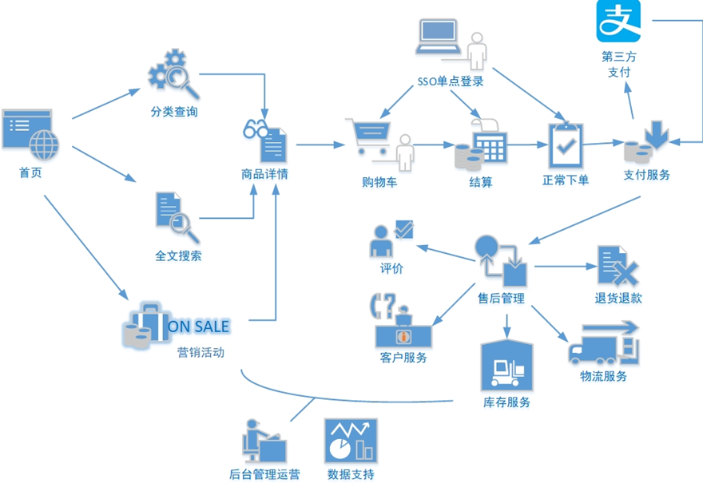
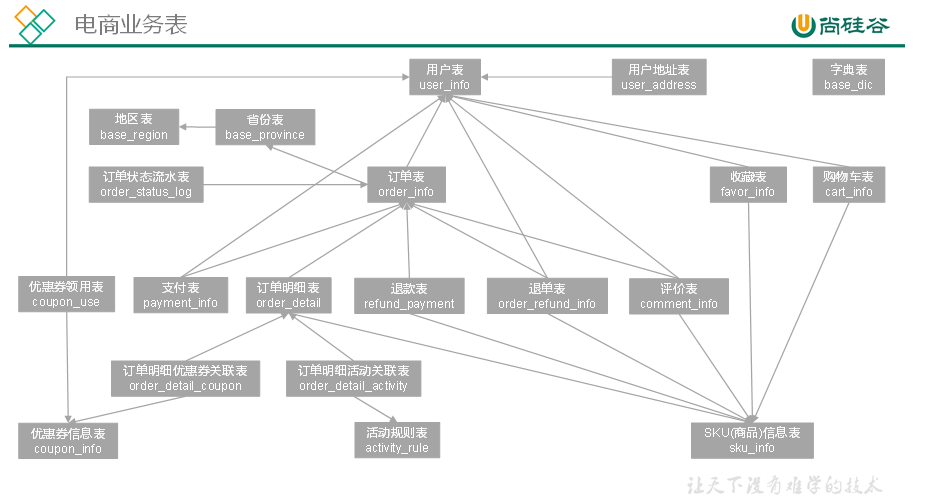
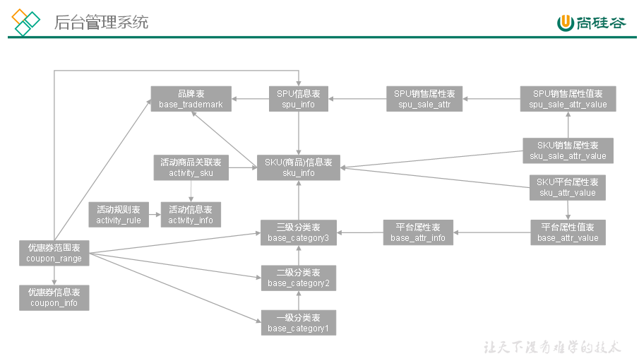

# 电商常识

## 电商业务流程

电商的业务流程可以以一个普通用户的浏览足迹为例进行说明，用户点开电商首页开始浏览，可能会通过分类查询也可能通过全文搜索寻找自己中意的商品，这些商品无疑都是存储在后台的管理系统中的。

当用户寻找到自己中意的商品，可能会想要购买，将商品添加到购物车后发现需要登录，登录后对商品进行结算，这时候购物车的管理和商品订单信息的生成都会对业务数据库产生影响，会生成相应的订单数据和支付数据。

订单正式生成之后，还会对订单进行跟踪处理，直到订单全部完成。

电商的主要业务流程包括用户前台浏览商品时的商品详情的管理，用户商品加入购物车进行支付时用户个人中心&支付服务的管理，用户支付完成后订单后台服务的管理，这些流程涉及到了十几个甚至几十个业务数据表，甚至更多。

## SKU和SPU

SKU = Stock Keeping Unit（库存量基本单位）。现在已经被引申为产品统一编号的简称，每种产品均对应有唯一的SKU号。

 SPU（Standard Product Unit）：是商品信息聚合的最小单位，是一组可复用、易检索的标准化信息集合。

例如：iPhoneX手机就是SPU。一台银色、128G内存的、支持联通网络的iPhoneX，就是SKU。

# 电商业务表结构

以下为本电商数仓系统涉及到的业务数据表结构关系。这34个表以订单表、用户表、SKU商品表、活动表和优惠券表为中心，延伸出了优惠券领用表、支付流水表、活动订单表、订单详情表、订单状态表、商品评论表、编码字典表退单表、SPU商品表等，用户表提供用户的详细信息，支付流水表提供该订单的支付详情，订单详情表提供订单的商品数量等情况，商品表给订单详情表提供商品的详细信息。本次讲解以此34个表为例，实际项目中，业务数据库中表格远远不止这些。

### 1 活动信息表（activity_info）

| **字段名**        | **字段说明**                 |
| ----------------- | ---------------------------- |
| **id**            | 活动id                       |
| **activity_name** | 活动名称                     |
| **activity_type** | 活动类型（1：满减，2：折扣） |
| **activity_desc** | 活动描述                     |
| **start_time**    | 开始时间                     |
| **end_time**      | 结束时间                     |
| **create_time**   | 创建时间                     |

### 2 活动规则表（activity_rule）

| **id**               | **编号** |
| -------------------- | -------- |
| **activity_id**      | 活动ID   |
| **activity_type**    | 活动类型 |
| **condition_amount** | 满减金额 |
| **condition_num**    | 满减件数 |
| **benefit_amount**   | 优惠金额 |
| **benefit_discount** | 优惠折扣 |
| **benefit_level**    | 优惠级别 |

### 3 活动商品关联表（activity_sku）

| **字段名**      | **字段说明** |
| --------------- | ------------ |
| **id**          | 编号         |
| **activity_id** | 活动id       |
| **sku_id**      | sku_id       |
| **create_time** | 创建时间     |

### 4 平台属性表（base_attr_info）

| **字段名**         | **字段说明** |
| ------------------ | ------------ |
| **id**             | 编号         |
| **attr_name**      | 属性名称     |
| **category_id**    | 分类id       |
| **category_level** | 分类层级     |

### 5 平台属性值表（base_attr_value）

| **字段名**     | **字段说明** |
| -------------- | ------------ |
| **id**         | 编号         |
| **value_name** | 属性值名称   |
| **attr_id**    | 属性id       |

### 6 一级分类表（base_category1）

| **字段名** | **字段说明** |
| ---------- | ------------ |
| **id**     | 编号         |
| **name**   | 分类名称     |

### 7 二级分类表（base_category2）

| **字段名**       | **字段说明** |
| ---------------- | ------------ |
| **id**           | 编号         |
| **name**         | 二级分类名称 |
| **category1_id** | 一级分类编号 |

### 8 三级分类表（base_category3）

| **字段名**       | **字段说明** |
| ---------------- | ------------ |
| **id**           | 编号         |
| **name**         | 三级分类名称 |
| **category2_id** | 二级分类编号 |

### 9 字典表（base_dic）

| **字段名**       | **字段说明** |
| ---------------- | ------------ |
| **dic_code**     | 编号         |
| **dic_name**     | 编码名称     |
| **parent_code**  | 父编号       |
| **create_time**  | 创建日期     |
| **operate_time** | 修改日期     |

### 10 省份表（base_province）

| **字段名**     | **字段说明** |
| -------------- | ------------ |
| **id**         | id           |
| **name**       | 省名称       |
| **region_id**  | 大区id       |
| **area_code**  | 行政区位码   |
| **iso_code**   | 国际编码     |
| **iso_3166_2** | ISO3166编码  |

### 11 地区表（base_region）

| **字段名**      | **字段说明** |
| --------------- | ------------ |
| **id**          | 大区id       |
| **region_name** | 大区名称     |

### 12 品牌表（base_trademark）

| **字段名**   | **字段说明**       |
| ------------ | ------------------ |
| **id**       | 编号               |
| **tm_name**  | 属性值             |
| **logo_url** | 品牌logo的图片路径 |

### 13 购物车表（cart_info）

| **字段名**       | **字段说明**     |
| ---------------- | ---------------- |
| **id**           | 编号             |
| **user_id**      | 用户id           |
| **sku_id**       | skuid            |
| **cart_price**   | 放入购物车时价格 |
| **sku_num**      | 数量             |
| **img_url**      | 图片文件         |
| **sku_name**     | sku名称 (冗余)   |
| **is_checked**   | 是否已经下单     |
| **create_time**  | 创建时间         |
| **operate_time** | 修改时间         |
| **is_ordered**   | 是否已经下单     |
| **order_time**   | 下单时间         |
| **source_type**  | 来源类型         |
| **source_id**    | 来源编号         |

### 14 评价表（comment_info）

| **字段名**       | **字段说明**              |
| ---------------- | ------------------------- |
| **id**           | 编号                      |
| **user_id**      | 用户id                    |
| **nick_name**    | 用户昵称                  |
| **head_img**     | 图片                      |
| **sku_id**       | 商品sku_id                |
| **spu_id**       | 商品spu_id                |
| **order_id**     | 订单编号                  |
| **appraise**     | 评价 1 好评 2 中评 3 差评 |
| **comment_txt**  | 评价内容                  |
| **create_time**  | 创建时间                  |
| **operate_time** | 修改时间                  |

### 15 优惠券信息表（coupon_info）

| **字段名**           | **字段说明**                                        |
| -------------------- | --------------------------------------------------- |
| **id**               | 购物券编号                                          |
| **coupon_name**      | 购物券名称                                          |
| **coupon_type**      | 购物券类型 1 现金券 2 折扣券 3 满减券 4 满件打折券  |
| **condition_amount** | 满额数（3）                                         |
| **condition_num**    | 满件数（4）                                         |
| **activity_id**      | 活动编号                                            |
| **benefit_amount**   | 减金额（1 3）                                       |
| **benefit_discount** | 折扣（2 4）                                         |
| **create_time**      | 创建时间                                            |
| **range_type**       | 范围类型 1、商品(spuid) 2、品类(三级分类id) 3、品牌 |
| **limit_num**        | 最多领用次数                                        |
| **taken_count**      | 已领用次数                                          |
| **start_time**       | 可以领取的开始日期                                  |
| **end_time**         | 可以领取的结束日期                                  |
| **operate_time**     | 修改时间                                            |
| **expire_time**      | 过期时间                                            |
| **range_desc**       | 范围描述                                            |

### 16 优惠券优惠范围表（coupon_range）

| **字段名**     | **字段说明**                                        |
| -------------- | --------------------------------------------------- |
| **id**         | 购物券编号                                          |
| **coupon_id**  | 优惠券id                                            |
| **range_type** | 范围类型 1、商品(spuid) 2、品类(三级分类id) 3、品牌 |
| **range_id**   | 范围id                                              |

### 17 优惠券领用表（coupon_use）

| **字段名**        | **字段说明**                      |
| ----------------- | --------------------------------- |
| **id**            | 编号                              |
| **coupon_id**     | 购物券ID                          |
| **user_id**       | 用户ID                            |
| **order_id**      | 订单ID                            |
| **coupon_status** | 购物券状态（1：未使用 2：已使用） |
| **get_time**      | 获取时间                          |
| **using_time**    | 使用时间                          |
| **used_time**     | 支付时间                          |
| **expire_time**   | 过期时间                          |

### 18 收藏表（favor_info）

| **字段名**      | **字段说明**               |
| --------------- | -------------------------- |
| **id**          | 编号                       |
| **user_id**     | 用户id                     |
| **sku_id**      | skuid                      |
| **spu_id**      | 商品id                     |
| **is_cancel**   | 是否已取消 0 正常 1 已取消 |
| **create_time** | 创建时间                   |
| **cancel_time** | 修改时间                   |

### 19 订单明细表（order_detail）

| **字段名**                | **字段说明**             |
| ------------------------- | ------------------------ |
| **id**                    | 编号                     |
| **order_id**              | 订单编号                 |
| **sku_id**                | sku_id                   |
| **sku_name**              | sku名称（冗余)           |
| **img_url**               | 图片名称（冗余)          |
| **order_price**           | 购买价格(下单时sku价格） |
| **sku_num**               | 购买个数                 |
| **create_time**           | 创建时间                 |
| **source_type**           | 来源类型                 |
| **source_id**             | 来源编号                 |
| **split_total_amount**    | 分摊总金额               |
| **split_activity_amount** | 分摊活动减免金额         |
| **split_coupon_amount**   | 分摊优惠券减免金额       |

### 20 订单明细活动关联表（order_detail_activity）

| **字段名**           | **字段说明** |
| -------------------- | ------------ |
| **id**               | 编号         |
| **order_id**         | 订单id       |
| **order_detail_id**  | 订单明细id   |
| **activity_id**      | 活动ID       |
| **activity_rule_id** | 活动规则     |
| **sku_id**           | skuID        |
| **create_time**      | 获取时间     |

### 21 订单明细优惠券关联表（order_detail_coupon）

| **字段名**          | **字段说明** |
| ------------------- | ------------ |
| **id**              | 编号         |
| **order_id**        | 订单id       |
| **order_detail_id** | 订单明细id   |
| **coupon_id**       | 购物券ID     |
| **coupon_use_id**   | 购物券领用id |
| **sku_id**          | skuID        |
| **create_time**     | 获取时间     |

### 22 订单表(order_info）

| **字段名**                 | **字段说明**                |
| -------------------------- | --------------------------- |
| **id**                     | 编号                        |
| **consignee**              | 收货人                      |
| **consignee_tel**          | 收件人电话                  |
| **total_amount**           | 总金额                      |
| **order_status**           | 订单状态                    |
| **user_id**                | 用户id                      |
| **payment_way**            | 付款方式                    |
| **delivery_address**       | 送货地址                    |
| **order_comment**          | 订单备注                    |
| **out_trade_no**           | 订单交易编号（第三方支付用) |
| **trade_body**             | 订单描述(第三方支付用)      |
| **create_time**            | 创建时间                    |
| **operate_time**           | 操作时间                    |
| **expire_time**            | 失效时间                    |
| **process_status**         | 进度状态                    |
| **tracking_no**            | 物流单编号                  |
| **parent_order_id**        | 父订单编号                  |
| **img_url**                | 图片路径                    |
| **province_id**            | 地区                        |
| **activity_reduce_amount** | 促销金额                    |
| **coupon_reduce_amount**   | 优惠金额                    |
| **original_total_amount**  | 原价金额                    |
| **feight_fee**             | 运费                        |
| **feight_fee_reduce**      | 运费减免                    |
| **refundable_time**        | 可退款日期（签收后30天）    |

### 23 退单表（order_refund_info）

| **字段名**             | **字段说明**                    |
| ---------------------- | ------------------------------- |
| **id**                 | 编号                            |
| **user_id**            | 用户id                          |
| **order_id**           | 订单id                          |
| **sku_id**             | skuid                           |
| **refund_type**        | 退款类型                        |
| **refund_num**         | 退货件数                        |
| **refund_amount**      | 退款金额                        |
| **refund_reason_type** | 原因类型                        |
| **refund_reason_txt**  | 原因内容                        |
| **refund_status**      | 退款状态（0：待审批 1：已退款） |
| **create_time**        | 创建时间                        |

### 24 订单状态流水表（order_status_log）

| **字段名**       | **字段说明** |
| ---------------- | ------------ |
| **id**           | 编号         |
| **order_id**     | 订单编号     |
| **order_status** | 订单状态     |
| **operate_time** | 操作时间     |

### 25 支付表（payment_info）

| **字段名**           | **字段说明**            |
| -------------------- | ----------------------- |
| **id**               | 编号                    |
| **out_trade_no**     | 对外业务编号            |
| **order_id**         | 订单编号                |
| **user_id**          |                         |
| **payment_type**     | 支付类型（微信 支付宝） |
| **trade_no**         | 交易编号                |
| **total_amount**     | 支付金额                |
| **subject**          | 交易内容                |
| **payment_status**   | 支付状态                |
| **create_time**      | 创建时间                |
| **callback_time**    | 回调时间                |
| **callback_content** | 回调信息                |

### 26 退款表（refund_payment）

| **字段名**           | **字段说明**            |
| -------------------- | ----------------------- |
| **id**               | 编号                    |
| **out_trade_no**     | 对外业务编号            |
| **order_id**         | 订单编号                |
| **sku_id**           | 商品sku_id              |
| **payment_type**     | 支付类型（微信 支付宝） |
| **trade_no**         | 交易编号                |
| **total_amount**     | 退款金额                |
| **subject**          | 交易内容                |
| **refund_status**    | 退款状态                |
| **create_time**      | 创建时间                |
| **callback_time**    | 回调时间                |
| **callback_content** | 回调信息                |

### 27 SKU平台属性表（sku_attr_value）

| **字段名**     | **字段说明**  |
| -------------- | ------------- |
| **id**         | 编号          |
| **attr_id**    | 属性id（冗余) |
| **value_id**   | 属性值id      |
| **sku_id**     | skuid         |
| **attr_name**  | 属性名称      |
| **value_name** | 属性值名称    |

### 28 SKU信息表（sku_info）

| **字段名**          | **字段说明**            |
| ------------------- | ----------------------- |
| **id**              | 库存id(itemID)          |
| **spu_id**          | 商品id                  |
| **price**           | 价格                    |
| **sku_name**        | sku名称                 |
| **sku_desc**        | 商品规格描述            |
| **weight**          | 重量                    |
| **tm_id**           | 品牌(冗余)              |
| **category3_id**    | 三级分类id（冗余)       |
| **sku_default_img** | 默认显示图片(冗余)      |
| **is_sale**         | 是否销售（1：是 0：否） |
| **create_time**     | 创建时间                |

### 29 SKU销售属性表（sku_sale_attr_value）

| **字段名**               | **字段说明**   |
| ------------------------ | -------------- |
| **id**                   | id             |
| **sku_id**               | 库存单元id     |
| **spu_id**               | spu_id（冗余） |
| **sale_attr_value_id**   | 销售属性值id   |
| **sale_attr_id**         | 销售属性id     |
| **sale_attr_name**       | 销售属性值名称 |
| **sale_attr_value_name** | 销售属性值名称 |

### 30 SPU信息表（spu_info）

| **字段名**       | **字段说明**        |
| ---------------- | ------------------- |
| **id**           | 商品id              |
| **spu_name**     | 商品名称            |
| **description**  | 商品描述(后台简述） |
| **category3_id** | 三级分类id          |
| **tm_id**        | 品牌id              |

### 31 SPU销售属性表（spu_sale_attr）

| **字段名**            | **字段说明**         |
| --------------------- | -------------------- |
| **id**                | 编号（业务中无关联） |
| **spu_id**            | 商品id               |
| **base_sale_attr_id** | 销售属性id           |
| **sale_attr_name**    | 销售属性名称（冗余） |

### 32 SPU销售属性值表（spu_sale_attr_value）

| **字段名**               | **字段说明**         |
| ------------------------ | -------------------- |
| **id**                   | 销售属性值编号       |
| **spu_id**               | 商品id               |
| **base_sale_attr_id**    | 销售属性id           |
| **sale_attr_value_name** | 销售属性值名称       |
| **sale_attr_name**       | 销售属性名称（冗余） |

### 33 用户地址表（user_address）

| **字段名**       | **字段说明** |
| ---------------- | ------------ |
| **id**           | 编号         |
| **user_id**      | 用户id       |
| **province_id**  | 省份id       |
| **user_address** | 用户地址     |
| **consignee**    | 收件人       |
| **phone_num**    | 联系方式     |
| **is_default**   | 是否是默认   |

### 34 用户信息表（user_info）

| **字段名**       | **字段说明** |
| ---------------- | ------------ |
| **id**           | 编号         |
| **login_name**   | 用户名称     |
| **nick_name**    | 用户昵称     |
| **passwd**       | 用户密码     |
| **name**         | 用户姓名     |
| **phone_num**    | 手机号       |
| **email**        | 邮箱         |
| **head_img**     | 头像         |
| **user_level**   | 用户级别     |
| **birthday**     | 用户生日     |
| **gender**       | 性别 M男,F女 |
| **create_time**  | 创建时间     |
| **operate_time** | 修改时间     |
| **status**       | 状态         |