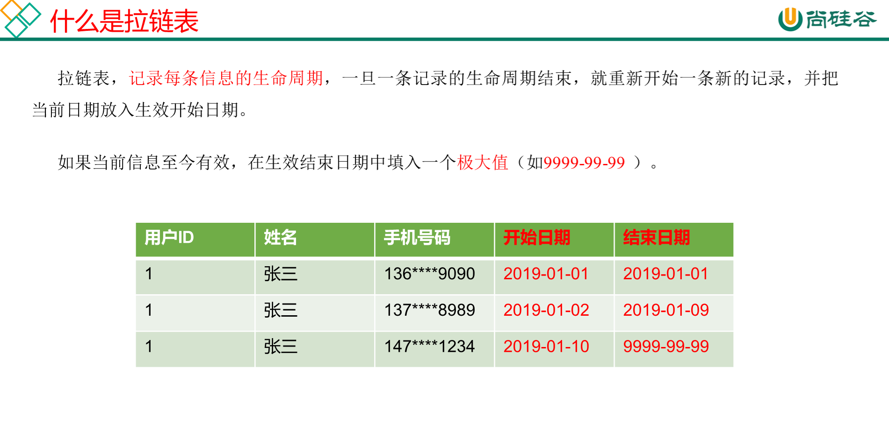
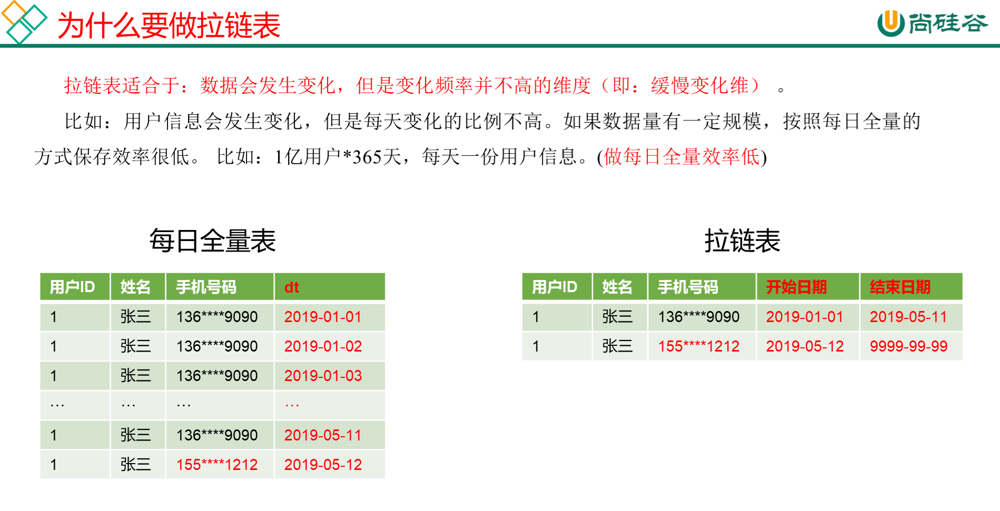
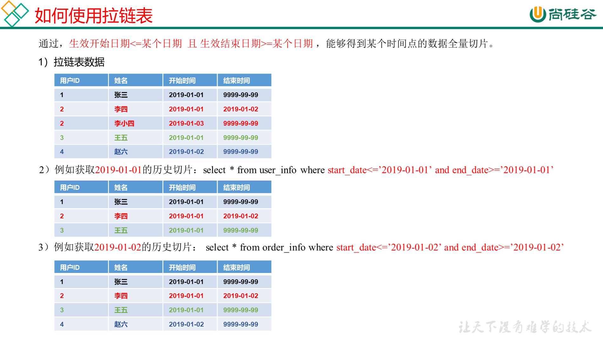
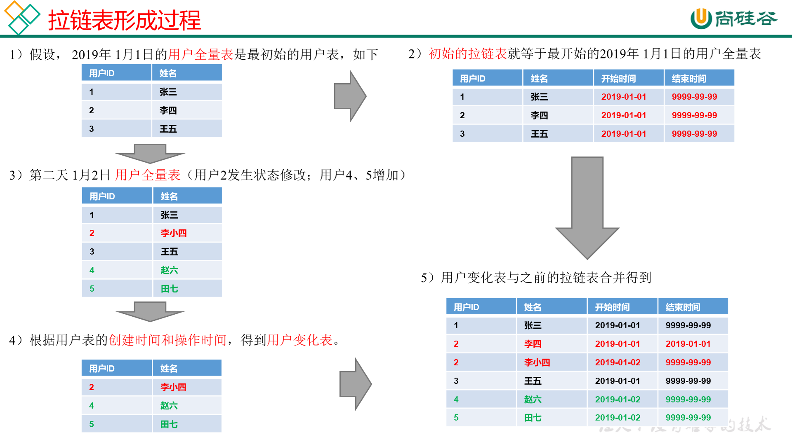
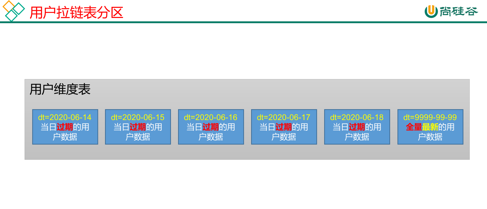
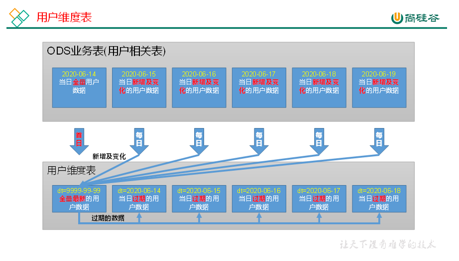
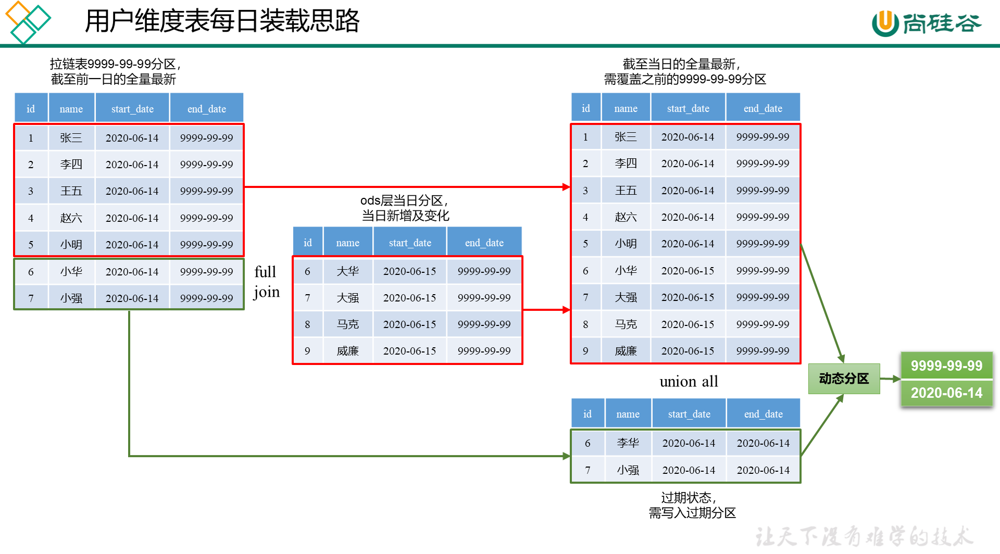

# 数仓搭建-DIM

DIM层保存维度模型的维度表

### 商品维度表

```sql
DROP TABLE IF EXISTS dim_sku_info;
CREATE EXTERNAL TABLE dim_sku_info (
    `id` STRING COMMENT '商品id',
    `price` DECIMAL(16,2) COMMENT '商品价格',
    `sku_name` STRING COMMENT '商品名称',
    `sku_desc` STRING COMMENT '商品描述',
    `weight` DECIMAL(16,2) COMMENT '重量',
    `is_sale` BOOLEAN COMMENT '是否在售',
    `spu_id` STRING COMMENT 'spu编号',
    `spu_name` STRING COMMENT 'spu名称',
    `category3_id` STRING COMMENT '三级分类id',
    `category3_name` STRING COMMENT '三级分类名称',
    `category2_id` STRING COMMENT '二级分类id',
    `category2_name` STRING COMMENT '二级分类名称',
    `category1_id` STRING COMMENT '一级分类id',
    `category1_name` STRING COMMENT '一级分类名称',
    `tm_id` STRING COMMENT '品牌id',
    `tm_name` STRING COMMENT '品牌名称',
    `sku_attr_values` ARRAY<STRUCT<attr_id:STRING,value_id:STRING,attr_name:STRING,value_name:STRING>> COMMENT '平台属性',
    `sku_sale_attr_values` ARRAY<STRUCT<sale_attr_id:STRING,sale_attr_value_id:STRING,sale_attr_name:STRING,sale_attr_value_name:STRING>> COMMENT '销售属性',
    `create_time` STRING COMMENT '创建时间'
) COMMENT '商品维度表'
PARTITIONED BY (`dt` STRING)
STORED AS PARQUET
LOCATION '/warehouse/gmall/dim/dim_sku_info/'
TBLPROPERTIES ("parquet.compression"="lzo");
```

同步策略： 全量同步

#### 首日装载

```sql
with
sku as
(
    select
        id,
        price,
        sku_name,
        sku_desc,
        weight,
        is_sale,
        spu_id,
        category3_id,
        tm_id,
        create_time
    from ods_sku_info
    where dt='2021-06-01'
),
spu as
(
    select
        id,
        spu_name
    from ods_spu_info
    where dt='2021-06-01'
),
c3 as
(
    select
        id,
        name,
        category2_id
    from ods_base_category3
    where dt='2021-06-01'
),
c2 as
(
    select
        id,
        name,
        category1_id
    from ods_base_category2
    where dt='2021-06-01'
),
c1 as
(
    select
        id,
        name
    from ods_base_category1
    where dt='2021-06-01'
),
tm as
(
    select
        id,
        tm_name
    from ods_base_trademark
    where dt='2021-06-01'
),
attr as
(
    select
        sku_id,
        collect_set(named_struct('attr_id',attr_id,'value_id',value_id,'attr_name',attr_name,'value_name',value_name)) attrs
    from ods_sku_attr_value
    where dt='2021-06-01'
    group by sku_id
),
sale_attr as
(
    select
        sku_id,
        collect_set(named_struct('sale_attr_id',sale_attr_id,'sale_attr_value_id',sale_attr_value_id,'sale_attr_name',sale_attr_name,'sale_attr_value_name',sale_attr_value_name)) sale_attrs
    from ods_sku_sale_attr_value
    where dt='2021-06-01'
    group by sku_id
)
insert overwrite table dim_sku_info partition(dt='2021-06-01')
select
    sku.id,
    sku.price,
    sku.sku_name,
    sku.sku_desc,
    sku.weight,
    sku.is_sale,
    sku.spu_id,
    spu.spu_name,
    sku.category3_id,
    c3.name,
    c3.category2_id,
    c2.name,
    c2.category1_id,
    c1.name,
    sku.tm_id,
    tm.tm_name,
    attr.attrs,
    sale_attr.sale_attrs,
    sku.create_time
from sku
left join spu on sku.spu_id=spu.id
left join c3 on sku.category3_id=c3.id
left join c2 on c3.category2_id=c2.id
left join c1 on c2.category1_id=c1.id
left join tm on sku.tm_id=tm.id
left join attr on sku.id=attr.sku_id
left join sale_attr on sku.id=sale_attr.sku_id;
```

#### 每日装载

```sql
with
sku as
(
    select
        id,
        price,
        sku_name,
        sku_desc,
        weight,
        is_sale,
        spu_id,
        category3_id,
        tm_id,
        create_time
    from ods_sku_info
    where dt='2020-06-02'
),
spu as
(
    select
        id,
        spu_name
    from ods_spu_info
    where dt='2020-06-02'
),
c3 as
(
    select
        id,
        name,
        category2_id
    from ods_base_category3
    where dt='2020-06-02'
),
c2 as
(
    select
        id,
        name,
        category1_id
    from ods_base_category2
    where dt='2020-06-02'
),
c1 as
(
    select
        id,
        name
    from ods_base_category1
    where dt='2020-06-02'
),
tm as
(
    select
        id,
        tm_name
    from ods_base_trademark
    where dt='2020-06-02'
),
attr as
(
    select
        sku_id,
        collect_set(named_struct('attr_id',attr_id,'value_id',value_id,'attr_name',attr_name,'value_name',value_name)) attrs
    from ods_sku_attr_value
    where dt='2020-06-02'
    group by sku_id
),
sale_attr as
(
    select
        sku_id,
        collect_set(named_struct('sale_attr_id',sale_attr_id,'sale_attr_value_id',sale_attr_value_id,'sale_attr_name',sale_attr_name,'sale_attr_value_name',sale_attr_value_name)) sale_attrs
    from ods_sku_sale_attr_value
    where dt='2020-06-02'
    group by sku_id
)
insert overwrite table dim_sku_info partition(dt='2020-06-02')
select
    sku.id,
    sku.price,
    sku.sku_name,
    sku.sku_desc,
    sku.weight,
    sku.is_sale,
    sku.spu_id,
    spu.spu_name,
    sku.category3_id,
    c3.name,
    c3.category2_id,
    c2.name,
    c2.category1_id,
    c1.name,
    sku.tm_id,
    tm.tm_name,
    attr.attrs,
    sale_attr.sale_attrs,
    sku.create_time
from sku
left join spu on sku.spu_id=spu.id
left join c3 on sku.category3_id=c3.id
left join c2 on c3.category2_id=c2.id
left join c1 on c2.category1_id=c1.id
left join tm on sku.tm_id=tm.id
left join attr on sku.id=attr.sku_id
left join sale_attr on sku.id=sale_attr.sku_id;
```

### 优惠价维度表

```sql
DROP TABLE IF EXISTS dim_coupon_info;
CREATE EXTERNAL TABLE dim_coupon_info(
    `id` STRING COMMENT '购物券编号',
    `coupon_name` STRING COMMENT '购物券名称',
    `coupon_type` STRING COMMENT '购物券类型 1 现金券 2 折扣券 3 满减券 4 满件打折券',
    `condition_amount` DECIMAL(16,2) COMMENT '满额数',
    `condition_num` BIGINT COMMENT '满件数',
    `activity_id` STRING COMMENT '活动编号',
    `benefit_amount` DECIMAL(16,2) COMMENT '减金额',
    `benefit_discount` DECIMAL(16,2) COMMENT '折扣',
    `create_time` STRING COMMENT '创建时间',
    `range_type` STRING COMMENT '范围类型 1、商品 2、品类 3、品牌',
    `limit_num` BIGINT COMMENT '最多领取次数',
    `taken_count` BIGINT COMMENT '已领取次数',
    `start_time` STRING COMMENT '可以领取的开始日期',
    `end_time` STRING COMMENT '可以领取的结束日期',
    `operate_time` STRING COMMENT '修改时间',
    `expire_time` STRING COMMENT '过期时间'
) COMMENT '优惠券维度表'
PARTITIONED BY (`dt` STRING)
STORED AS PARQUET
LOCATION '/warehouse/gmall/dim/dim_coupon_info/'
TBLPROPERTIES ("parquet.compression"="lzo");
```

同步策略：全量同步

#### 首日装载数据

```sql
insert overwrite table dim_coupon_info partition(dt='2021-06-01')
select
    id,
    coupon_name,
    coupon_type,
    condition_amount,
    condition_num,
    activity_id,
    benefit_amount,
    benefit_discount,
    create_time,
    range_type,
    limit_num,
    taken_count,
    start_time,
    end_time,
    operate_time,
    expire_time
from ods_coupon_info
where dt='2021-06-01';
```

#### 每日装载数据

```sql
insert overwrite table dim_coupon_info partition(dt='2020-06-15')
select
    id,
    coupon_name,
    coupon_type,
    condition_amount,
    condition_num,
    activity_id,
    benefit_amount,
    benefit_discount,
    create_time,
    range_type,
    limit_num,
    taken_count,
    start_time,
    end_time,
    operate_time,
    expire_time
from ods_coupon_info
where dt='2020-06-15';
```

### 活动维度表

```sql
DROP TABLE IF EXISTS dim_activity_rule_info;
CREATE EXTERNAL TABLE dim_activity_rule_info(
    `activity_rule_id` STRING COMMENT '活动规则ID',
    `activity_id` STRING COMMENT '活动ID',
    `activity_name` STRING  COMMENT '活动名称',
    `activity_type` STRING  COMMENT '活动类型',
    `start_time` STRING  COMMENT '开始时间',
    `end_time` STRING  COMMENT '结束时间',
    `create_time` STRING  COMMENT '创建时间',
    `condition_amount` DECIMAL(16,2) COMMENT '满减金额',
    `condition_num` BIGINT COMMENT '满减件数',
    `benefit_amount` DECIMAL(16,2) COMMENT '优惠金额',
    `benefit_discount` DECIMAL(16,2) COMMENT '优惠折扣',
    `benefit_level` STRING COMMENT '优惠级别'
) COMMENT '活动信息表'
PARTITIONED BY (`dt` STRING)
STORED AS PARQUET
LOCATION '/warehouse/gmall/dim/dim_activity_rule_info/'
TBLPROPERTIES ("parquet.compression"="lzo");
```

同步策略：全量同步

#### 首日装载脚本

```sql
insert overwrite table dim_activity_rule_info partition(dt='2021-06-01')
select
    ar.id,
    ar.activity_id,
    ai.activity_name,
    ar.activity_type,
    ai.start_time,
    ai.end_time,
    ai.create_time,
    ar.condition_amount,
    ar.condition_num,
    ar.benefit_amount,
    ar.benefit_discount,
    ar.benefit_level
from
(
    select
        id,
        activity_id,
        activity_type,
        condition_amount,
        condition_num,
        benefit_amount,
        benefit_discount,
        benefit_level
    from ods_activity_rule
    where dt='2021-06-01'
)ar
left join
(
    select
        id,
        activity_name,
        start_time,
        end_time,
        create_time
    from ods_activity_info
    where dt='2021-06-01'
)ai
on ar.activity_id=ai.id;
```

#### 每日装载数据

```sql
insert overwrite table dim_activity_rule_info partition(dt='2020-06-15')
select
    ar.id,
    ar.activity_id,
    ai.activity_name,
    ar.activity_type,
    ai.start_time,
    ai.end_time,
    ai.create_time,
    ar.condition_amount,
    ar.condition_num,
    ar.benefit_amount,
    ar.benefit_discount,
    ar.benefit_level
from
(
    select
        id,
        activity_id,
        activity_type,
        condition_amount,
        condition_num,
        benefit_amount,
        benefit_discount,
        benefit_level
    from ods_activity_rule
    where dt='2020-06-15'
)ar
left join
(
    select
        id,
        activity_name,
        start_time,
        end_time,
        create_time
    from ods_activity_info
    where dt='2020-06-15'
)ai
on ar.activity_id=ai.id;
```

### 地区维度表

```sql
DROP TABLE IF EXISTS dim_base_province;
CREATE EXTERNAL TABLE dim_base_province (
    `id` STRING COMMENT 'id',
    `province_name` STRING COMMENT '省市名称',
    `area_code` STRING COMMENT '地区编码',
    `iso_code` STRING COMMENT 'ISO-3166编码，供可视化使用',
    `iso_3166_2` STRING COMMENT 'IOS-3166-2编码，供可视化使用',
    `region_id` STRING COMMENT '地区id',
    `region_name` STRING COMMENT '地区名称'
) COMMENT '地区维度表'
STORED AS PARQUET
LOCATION '/warehouse/gmall/dim/dim_base_province/'
TBLPROPERTIES ("parquet.compression"="lzo");
```

同步策略：地区维度表数据相对稳定，变化概率较低，故无需每日装载

#### 数据装载

```sql
insert overwrite table dim_base_province
select
    bp.id,
    bp.name,
    bp.area_code,
    bp.iso_code,
    bp.iso_3166_2,
    bp.region_id,
    br.region_name
from ods_base_province bp
join ods_base_region br on bp.region_id = br.id;
```

### 时间维度表

```sql
DROP TABLE IF EXISTS dim_date_info;
CREATE EXTERNAL TABLE dim_date_info(
    `date_id` STRING COMMENT '日',
    `week_id` STRING COMMENT '周ID',
    `week_day` STRING COMMENT '周几',
    `day` STRING COMMENT '每月的第几天',
    `month` STRING COMMENT '第几月',
    `quarter` STRING COMMENT '第几季度',
    `year` STRING COMMENT '年',
    `is_workday` STRING COMMENT '是否是工作日',
    `holiday_id` STRING COMMENT '节假日'
) COMMENT '时间维度表'
STORED AS PARQUET
LOCATION '/warehouse/gmall/dim/dim_date_info/'
TBLPROPERTIES ("parquet.compression"="lzo");
```

同步策略：通常情况下，时间维度表的数据并不是来自于业务系统，而是手动写入，并且由于时间维度表数据的可预见性，无须每日导入，一般可一次性导入一年的数据。因为涉及到数据格式转换，因此先建一张临时表

1. 创建临时表

   ```sql
   DROP TABLE IF EXISTS tmp_dim_date_info;
   CREATE EXTERNAL TABLE tmp_dim_date_info (
       `date_id` STRING COMMENT '日',
       `week_id` STRING COMMENT '周ID',
       `week_day` STRING COMMENT '周几',
       `day` STRING COMMENT '每月的第几天',
       `month` STRING COMMENT '第几月',
       `quarter` STRING COMMENT '第几季度',
       `year` STRING COMMENT '年',
       `is_workday` STRING COMMENT '是否是工作日',
       `holiday_id` STRING COMMENT '节假日'
   ) COMMENT '时间维度表'
   ROW FORMAT DELIMITED FIELDS TERMINATED BY '\t'
   LOCATION '/warehouse/gmall/tmp/tmp_dim_date_info/';
   ```

2. 将数据文件上传到HFDS上临时表指定路径/warehouse/gmall/tmp/tmp_dim_date_info/. 

   数据文件在 Hadoop/WareHouse40/doc/date_info.txt

   ```shell
   [root@node01 ~]# hdfs dfs -put -f date_info.txt hdfs://hacluster/warehouse/gmall/tmp/tmp_dim_date_info/
   ```

3. 执行以下语句将其导入时间维度表

   ```sql
   insert overwrite table dim_date_info select * from tmp_dim_date_info;
   ```

4. 检查数据

   ```sql
   select * from dim_date_info;
   ```

### 用户维度表（拉链表）

#### 拉链表概述

能更加高效的存储历史状态









#### 制作拉链表

```sql
DROP TABLE IF EXISTS dim_user_info;
CREATE EXTERNAL TABLE dim_user_info(
    `id` STRING COMMENT '用户id',
    `login_name` STRING COMMENT '用户名称',
    `nick_name` STRING COMMENT '用户昵称',
    `name` STRING COMMENT '用户姓名',
    `phone_num` STRING COMMENT '手机号码',
    `email` STRING COMMENT '邮箱',
    `user_level` STRING COMMENT '用户等级',
    `birthday` STRING COMMENT '生日',
    `gender` STRING COMMENT '性别',
    `create_time` STRING COMMENT '创建时间',
    `operate_time` STRING COMMENT '操作时间',
    `start_date` STRING COMMENT '开始日期',
    `end_date` STRING COMMENT '结束日期'
) COMMENT '用户表'
PARTITIONED BY (`dt` STRING)
STORED AS PARQUET
LOCATION '/warehouse/gmall/dim/dim_user_info/'
TBLPROPERTIES ("parquet.compression"="lzo");
```

#### 分区规划

9999-99-99分区保存最新的数据， 过期数据保存到其他分区里。




#### 数据装载



**首日装载**

拉链表首日装载，需要进行初始化操作，具体工作为将截止到初始化当日的全部历史用户导入一次性导入到拉链表中。目前的ods_user_info表的第一个分区，即2021-06-01分区中就是全部的历史用户，故将该分区数据进行一定处理后导入拉链表的9999-99-99分区即可。

```sql
insert overwrite table dim_user_info partition(dt='9999-99-99')
select
    id,
    login_name,
    nick_name,
    md5(name),
    md5(phone_num),
    md5(email),
    user_level,
    birthday,
    gender,
    create_time,
    operate_time,
    '2021-06-01',
    '9999-99-99'
from ods_user_info
where dt='2021-06-01';
```

**每日装载**



```sql
with
tmp as
(
    select
        old.id old_id,
        old.login_name old_login_name,
        old.nick_name old_nick_name,
        old.name old_name,
        old.phone_num old_phone_num,
        old.email old_email,
        old.user_level old_user_level,
        old.birthday old_birthday,
        old.gender old_gender,
        old.create_time old_create_time,
        old.operate_time old_operate_time,
        old.start_date old_start_date,
        old.end_date old_end_date,
        new.id new_id,
        new.login_name new_login_name,
        new.nick_name new_nick_name,
        new.name new_name,
        new.phone_num new_phone_num,
        new.email new_email,
        new.user_level new_user_level,
        new.birthday new_birthday,
        new.gender new_gender,
        new.create_time new_create_time,
        new.operate_time new_operate_time,
        new.start_date new_start_date,
        new.end_date new_end_date
    from
    (
        select
            id,
            login_name,
            nick_name,
            name,
            phone_num,
            email,
            user_level,
            birthday,
            gender,
            create_time,
            operate_time,
            start_date,
            end_date
        from dim_user_info
        where dt='9999-99-99'
    )old
    full outer join
    (
        select
            id,
            login_name,
            nick_name,
            md5(name) name,
            md5(phone_num) phone_num,
            md5(email) email,
            user_level,
            birthday,
            gender,
            create_time,
            operate_time,
            '2020-06-15' start_date,
            '9999-99-99' end_date
        from ods_user_info
        where dt='2020-06-15'
    )new
    on old.id=new.id
)
insert overwrite table dim_user_info partition(dt)
select
    nvl(new_id,old_id),
    nvl(new_login_name,old_login_name),
    nvl(new_nick_name,old_nick_name),
    nvl(new_name,old_name),
    nvl(new_phone_num,old_phone_num),
    nvl(new_email,old_email),
    nvl(new_user_level,old_user_level),
    nvl(new_birthday,old_birthday),
    nvl(new_gender,old_gender),
    nvl(new_create_time,old_create_time),
    nvl(new_operate_time,old_operate_time),
    nvl(new_start_date,old_start_date),
    nvl(new_end_date,old_end_date),
    nvl(new_end_date,old_end_date) dt
from tmp
union all
select
    old_id,
    old_login_name,
    old_nick_name,
    old_name,
    old_phone_num,
    old_email,
    old_user_level,
    old_birthday,
    old_gender,
    old_create_time,
    old_operate_time,
    old_start_date,
    cast(date_add('2020-06-15',-1) as string),
    cast(date_add('2020-06-15',-1) as string) dt
from tmp
where new_id is not null and old_id is not null;
```

## DIM层首日数据装载脚本

```shell
[atguigu@hadoop102 bin]$ vim ods_to_dim_db_init.sh
[atguigu@hadoop102 bin]$ chmod +x ods_to_dim_db_init.sh
[atguigu@hadoop102 bin]$ ods_to_dim_db_init.sh all 2021-06-01 # 执行
```

```shell
#!/bin/bash

APP=gmall

if [ -n "$2" ] ;then
   do_date=$2
else 
   echo "请传入日期参数"
   exit
fi 

dim_user_info="
set hive.input.format=org.apache.hadoop.hive.ql.io.HiveInputFormat;
insert overwrite table ${APP}.dim_user_info partition(dt='9999-99-99')
select
    id,
    login_name,
    nick_name,
    md5(name),
    md5(phone_num),
    md5(email),
    user_level,
    birthday,
    gender,
    create_time,
    operate_time,
    '$do_date',
    '9999-99-99'
from ${APP}.ods_user_info
where dt='$do_date';
"

dim_sku_info="
set hive.input.format=org.apache.hadoop.hive.ql.io.HiveInputFormat;
with
sku as
(
    select
        id,
        price,
        sku_name,
        sku_desc,
        weight,
        is_sale,
        spu_id,
        category3_id,
        tm_id,
        create_time
    from ${APP}.ods_sku_info
    where dt='$do_date'
),
spu as
(
    select
        id,
        spu_name
    from ${APP}.ods_spu_info
    where dt='$do_date'
),
c3 as
(
    select
        id,
        name,
        category2_id
    from ${APP}.ods_base_category3
    where dt='$do_date'
),
c2 as
(
    select
        id,
        name,
        category1_id
    from ${APP}.ods_base_category2
    where dt='$do_date'
),
c1 as
(
    select
        id,
        name
    from ${APP}.ods_base_category1
    where dt='$do_date'
),
tm as
(
    select
        id,
        tm_name
    from ${APP}.ods_base_trademark
    where dt='$do_date'
),
attr as
(
    select
        sku_id,
        collect_set(named_struct('attr_id',attr_id,'value_id',value_id,'attr_name',attr_name,'value_name',value_name)) attrs
    from ${APP}.ods_sku_attr_value
    where dt='$do_date'
    group by sku_id
),
sale_attr as
(
    select
        sku_id,
        collect_set(named_struct('sale_attr_id',sale_attr_id,'sale_attr_value_id',sale_attr_value_id,'sale_attr_name',sale_attr_name,'sale_attr_value_name',sale_attr_value_name)) sale_attrs
    from ${APP}.ods_sku_sale_attr_value
    where dt='$do_date'
    group by sku_id
)

insert overwrite table ${APP}.dim_sku_info partition(dt='$do_date')
select
    sku.id,
    sku.price,
    sku.sku_name,
    sku.sku_desc,
    sku.weight,
    sku.is_sale,
    sku.spu_id,
    spu.spu_name,
    sku.category3_id,
    c3.name,
    c3.category2_id,
    c2.name,
    c2.category1_id,
    c1.name,
    sku.tm_id,
    tm.tm_name,
    attr.attrs,
    sale_attr.sale_attrs,
    sku.create_time
from sku
left join spu on sku.spu_id=spu.id
left join c3 on sku.category3_id=c3.id
left join c2 on c3.category2_id=c2.id
left join c1 on c2.category1_id=c1.id
left join tm on sku.tm_id=tm.id
left join attr on sku.id=attr.sku_id
left join sale_attr on sku.id=sale_attr.sku_id;
"

dim_base_province="
set hive.input.format=org.apache.hadoop.hive.ql.io.HiveInputFormat;
insert overwrite table ${APP}.dim_base_province
select
    bp.id,
    bp.name,
    bp.area_code,
    bp.iso_code,
    bp.iso_3166_2,
    bp.region_id,
    br.region_name
from ${APP}.ods_base_province bp
join ${APP}.ods_base_region br on bp.region_id = br.id;
"

dim_coupon_info="
set hive.input.format=org.apache.hadoop.hive.ql.io.HiveInputFormat;
insert overwrite table ${APP}.dim_coupon_info partition(dt='$do_date')
select
    id,
    coupon_name,
    coupon_type,
    condition_amount,
    condition_num,
    activity_id,
    benefit_amount,
    benefit_discount,
    create_time,
    range_type,
    limit_num,
    taken_count,
    start_time,
    end_time,
    operate_time,
    expire_time
from ${APP}.ods_coupon_info
where dt='$do_date';
"

dim_activity_rule_info="
set hive.input.format=org.apache.hadoop.hive.ql.io.HiveInputFormat;
insert overwrite table ${APP}.dim_activity_rule_info partition(dt='$do_date')
select
    ar.id,
    ar.activity_id,
    ai.activity_name,
    ar.activity_type,
    ai.start_time,
    ai.end_time,
    ai.create_time,
    ar.condition_amount,
    ar.condition_num,
    ar.benefit_amount,
    ar.benefit_discount,
    ar.benefit_level
from
(
    select
        id,
        activity_id,
        activity_type,
        condition_amount,
        condition_num,
        benefit_amount,
        benefit_discount,
        benefit_level
    from ${APP}.ods_activity_rule
    where dt='$do_date'
)ar
left join
(
    select
        id,
        activity_name,
        start_time,
        end_time,
        create_time
    from ${APP}.ods_activity_info
    where dt='$do_date'
)ai
on ar.activity_id=ai.id;
"

case $1 in
"dim_user_info"){
    hive -e "$dim_user_info"
};;
"dim_sku_info"){
    hive -e "$dim_sku_info"
};;
"dim_base_province"){
    hive -e "$dim_base_province"
};;
"dim_coupon_info"){
    hive -e "$dim_coupon_info"
};;
"dim_activity_rule_info"){
    hive -e "$dim_activity_rule_info"
};;
"all"){
    hive -e "$dim_user_info$dim_sku_info$dim_coupon_info$dim_activity_rule_info$dim_base_province"
};;
esac
```

##  DIM层每日数据装载脚本

```shell
[atguigu@hadoop102 bin]$ vim ods_to_dim_db.sh
[atguigu@hadoop102 bin]$ chmod +x ods_to_dim_db.sh
[atguigu@hadoop102 bin]$ ods_to_dim_db.sh all 2021-06-01 # 执行
```

```shell
#!/bin/bash

APP=gmall

# 如果是输入的日期按照取输入日期；如果没输入日期取当前时间的前一天
if [ -n "$2" ] ;then
    do_date=$2
else 
    do_date=`date -d "-1 day" +%F`
fi

dim_user_info="
set hive.exec.dynamic.partition.mode=nonstrict;
set hive.input.format=org.apache.hadoop.hive.ql.io.HiveInputFormat;
with
tmp as
(
    select
        old.id old_id,
        old.login_name old_login_name,
        old.nick_name old_nick_name,
        old.name old_name,
        old.phone_num old_phone_num,
        old.email old_email,
        old.user_level old_user_level,
        old.birthday old_birthday,
        old.gender old_gender,
        old.create_time old_create_time,
        old.operate_time old_operate_time,
        old.start_date old_start_date,
        old.end_date old_end_date,
        new.id new_id,
        new.login_name new_login_name,
        new.nick_name new_nick_name,
        new.name new_name,
        new.phone_num new_phone_num,
        new.email new_email,
        new.user_level new_user_level,
        new.birthday new_birthday,
        new.gender new_gender,
        new.create_time new_create_time,
        new.operate_time new_operate_time,
        new.start_date new_start_date,
        new.end_date new_end_date
    from
    (
        select
            id,
            login_name,
            nick_name,
            name,
            phone_num,
            email,
            user_level,
            birthday,
            gender,
            create_time,
            operate_time,
            start_date,
            end_date
        from ${APP}.dim_user_info
        where dt='9999-99-99'
        and start_date<'$do_date'
    )old
    full outer join
    (
        select
            id,
            login_name,
            nick_name,
            md5(name) name,
            md5(phone_num) phone_num,
            md5(email) email,
            user_level,
            birthday,
            gender,
            create_time,
            operate_time,
            '$do_date' start_date,
            '9999-99-99' end_date
        from ${APP}.ods_user_info
        where dt='$do_date'
    )new
    on old.id=new.id
)
insert overwrite table ${APP}.dim_user_info partition(dt)
select
    nvl(new_id,old_id),
    nvl(new_login_name,old_login_name),
    nvl(new_nick_name,old_nick_name),
    nvl(new_name,old_name),
    nvl(new_phone_num,old_phone_num),
    nvl(new_email,old_email),
    nvl(new_user_level,old_user_level),
    nvl(new_birthday,old_birthday),
    nvl(new_gender,old_gender),
    nvl(new_create_time,old_create_time),
    nvl(new_operate_time,old_operate_time),
    nvl(new_start_date,old_start_date),
    nvl(new_end_date,old_end_date),
    nvl(new_end_date,old_end_date) dt
from tmp
union all
select
    old_id,
    old_login_name,
    old_nick_name,
    old_name,
    old_phone_num,
    old_email,
    old_user_level,
    old_birthday,
    old_gender,
    old_create_time,
    old_operate_time,
    old_start_date,
    cast(date_add('$do_date',-1) as string),
    cast(date_add('$do_date',-1) as string) dt
from tmp
where new_id is not null and old_id is not null;
"

dim_sku_info="
set hive.input.format=org.apache.hadoop.hive.ql.io.HiveInputFormat;
with
sku as
(
    select
        id,
        price,
        sku_name,
        sku_desc,
        weight,
        is_sale,
        spu_id,
        category3_id,
        tm_id,
        create_time
    from ${APP}.ods_sku_info
    where dt='$do_date'
),
spu as
(
    select
        id,
        spu_name
    from ${APP}.ods_spu_info
    where dt='$do_date'
),
c3 as
(
    select
        id,
        name,
        category2_id
    from ${APP}.ods_base_category3
    where dt='$do_date'
),
c2 as
(
    select
        id,
        name,
        category1_id
    from ${APP}.ods_base_category2
    where dt='$do_date'
),
c1 as
(
    select
        id,
        name
    from ${APP}.ods_base_category1
    where dt='$do_date'
),
tm as
(
    select
        id,
        tm_name
    from ${APP}.ods_base_trademark
    where dt='$do_date'
),
attr as
(
    select
        sku_id,
        collect_set(named_struct('attr_id',attr_id,'value_id',value_id,'attr_name',attr_name,'value_name',value_name)) attrs
    from ${APP}.ods_sku_attr_value
    where dt='$do_date'
    group by sku_id
),
sale_attr as
(
    select
        sku_id,
        collect_set(named_struct('sale_attr_id',sale_attr_id,'sale_attr_value_id',sale_attr_value_id,'sale_attr_name',sale_attr_name,'sale_attr_value_name',sale_attr_value_name)) sale_attrs
    from ${APP}.ods_sku_sale_attr_value
    where dt='$do_date'
    group by sku_id
)

insert overwrite table ${APP}.dim_sku_info partition(dt='$do_date')
select
    sku.id,
    sku.price,
    sku.sku_name,
    sku.sku_desc,
    sku.weight,
    sku.is_sale,
    sku.spu_id,
    spu.spu_name,
    sku.category3_id,
    c3.name,
    c3.category2_id,
    c2.name,
    c2.category1_id,
    c1.name,
    sku.tm_id,
    tm.tm_name,
    attr.attrs,
    sale_attr.sale_attrs,
    sku.create_time
from sku
left join spu on sku.spu_id=spu.id
left join c3 on sku.category3_id=c3.id
left join c2 on c3.category2_id=c2.id
left join c1 on c2.category1_id=c1.id
left join tm on sku.tm_id=tm.id
left join attr on sku.id=attr.sku_id
left join sale_attr on sku.id=sale_attr.sku_id;
"

dim_base_province="
set hive.input.format=org.apache.hadoop.hive.ql.io.HiveInputFormat;
insert overwrite table ${APP}.dim_base_province
select
    bp.id,
    bp.name,
    bp.area_code,
    bp.iso_code,
    bp.iso_3166_2,
    bp.region_id,
    bp.name
from ${APP}.ods_base_province bp
join ${APP}.ods_base_region br on bp.region_id = br.id;
"

dim_coupon_info="
set hive.input.format=org.apache.hadoop.hive.ql.io.HiveInputFormat;
insert overwrite table ${APP}.dim_coupon_info partition(dt='$do_date')
select
    id,
    coupon_name,
    coupon_type,
    condition_amount,
    condition_num,
    activity_id,
    benefit_amount,
    benefit_discount,
    create_time,
    range_type,
    limit_num,
    taken_count,
    start_time,
    end_time,
    operate_time,
    expire_time
from ${APP}.ods_coupon_info
where dt='$do_date';
"

dim_activity_rule_info="
set hive.input.format=org.apache.hadoop.hive.ql.io.HiveInputFormat;
insert overwrite table ${APP}.dim_activity_rule_info partition(dt='$do_date')
select
    ar.id,
    ar.activity_id,
    ai.activity_name,
    ar.activity_type,
    ai.start_time,
    ai.end_time,
    ai.create_time,
    ar.condition_amount,
    ar.condition_num,
    ar.benefit_amount,
    ar.benefit_discount,
    ar.benefit_level
from
(
    select
        id,
        activity_id,
        activity_type,
        condition_amount,
        condition_num,
        benefit_amount,
        benefit_discount,
        benefit_level
    from ${APP}.ods_activity_rule
    where dt='$do_date'
)ar
left join
(
    select
        id,
        activity_name,
        start_time,
        end_time,
        create_time
    from ${APP}.ods_activity_info
    where dt='$do_date'
)ai
on ar.activity_id=ai.id;
"

case $1 in
"dim_user_info"){
    hive -e "$dim_user_info"
};;
"dim_sku_info"){
    hive -e "$dim_sku_info"
};;
"dim_base_province"){
    hive -e "$dim_base_province"
};;
"dim_coupon_info"){
    hive -e "$dim_coupon_info"
};;
"dim_activity_rule_info"){
    hive -e "$dim_activity_rule_info"
};;
"all"){
    hive -e "$dim_user_info$dim_sku_info$dim_coupon_info$dim_activity_rule_info"
};;
esac
```


