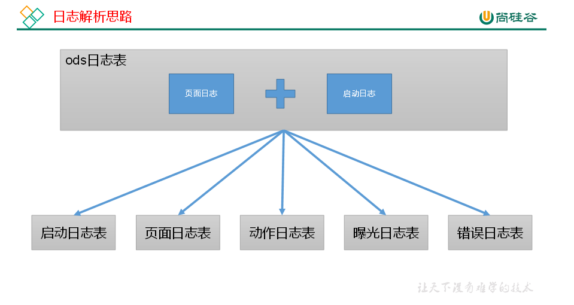
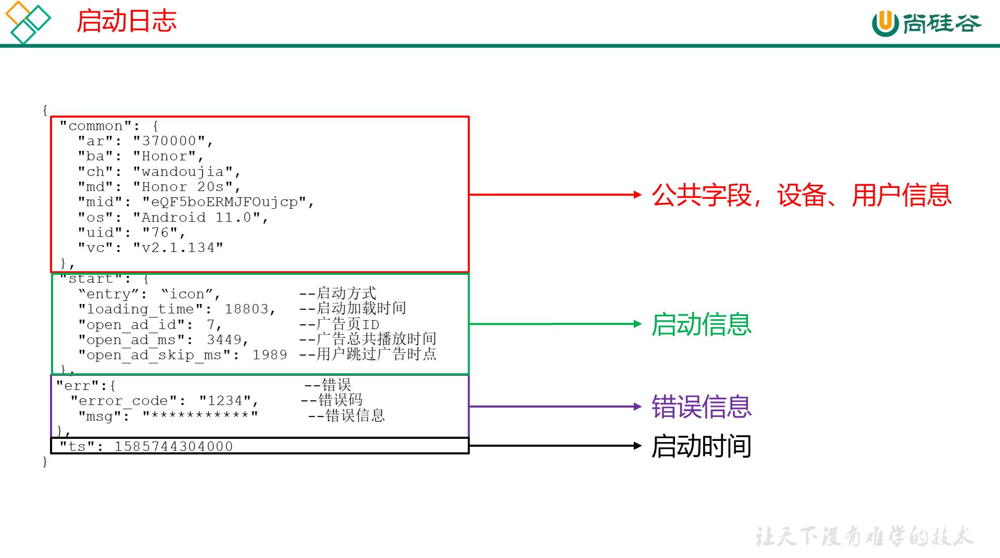
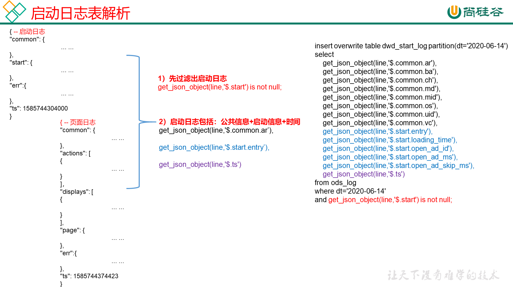
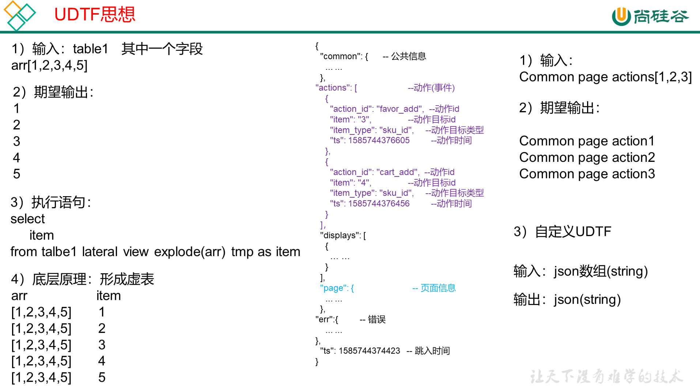
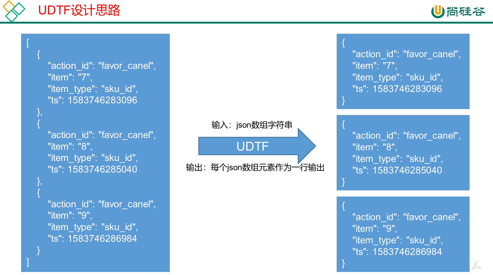

# 数仓搭建-DWD层

DWD层明细数据层，保存所有的明细数据。在DWD层注要做两件事

1）对用户行为数据解析。

2）对业务数据采用**维度模型**重新建模。

## DWD层（用户行为日志）




### 启动日志表





**启动日志解析思路** ：启动日志表中每行数据对应一个启动记录，一个启动记录应该包含日志中的公共信息和启动信息。先将所有包含start字段的日志过滤出来，然后使用get_json_object函数解析每个字段。

```sql
DROP TABLE IF EXISTS dwd_start_log;
CREATE EXTERNAL TABLE dwd_start_log(
    `area_code` STRING COMMENT '地区编码',
    `brand` STRING COMMENT '手机品牌',
    `channel` STRING COMMENT '渠道',
    `is_new` STRING COMMENT '是否首次启动',
    `model` STRING COMMENT '手机型号',
    `mid_id` STRING COMMENT '设备id',
    `os` STRING COMMENT '操作系统',
    `user_id` STRING COMMENT '会员id',
    `version_code` STRING COMMENT 'app版本号',
    `entry` STRING COMMENT 'icon手机图标 notice 通知 install 安装后启动',
    `loading_time` BIGINT COMMENT '启动加载时间',
    `open_ad_id` STRING COMMENT '广告页ID ',
    `open_ad_ms` BIGINT COMMENT '广告总共播放时间',
    `open_ad_skip_ms` BIGINT COMMENT '用户跳过广告时点',
    `ts` BIGINT COMMENT '时间'
) COMMENT '启动日志表'
PARTITIONED BY (`dt` STRING) -- 按照时间创建分区
STORED AS PARQUET -- 采用parquet列式存储
LOCATION '/warehouse/gmall/dwd/dwd_start_log' -- 指定在HDFS上存储位置
TBLPROPERTIES('parquet.compression'='lzo') -- 采用LZO压缩
;
```

同步策略：增量同步（当日全量同步）

**装载数据**

```sql
insert overwrite table dwd_start_log partition(dt='2021-06-01')
select
    get_json_object(line,'$.common.ar'),
    get_json_object(line,'$.common.ba'),
    get_json_object(line,'$.common.ch'),
    get_json_object(line,'$.common.is_new'),
    get_json_object(line,'$.common.md'),
    get_json_object(line,'$.common.mid'),
    get_json_object(line,'$.common.os'),
    get_json_object(line,'$.common.uid'),
    get_json_object(line,'$.common.vc'),
    get_json_object(line,'$.start.entry'),
    get_json_object(line,'$.start.loading_time'),
    get_json_object(line,'$.start.open_ad_id'),
    get_json_object(line,'$.start.open_ad_ms'),
    get_json_object(line,'$.start.open_ad_skip_ms'),
    get_json_object(line,'$.ts')
from ods_log
where dt='2021-06-01'
and get_json_object(line,'$.start') is not null;
```

### 页面日志表

**页面日志解析思路 ** ：页面日志表中每行数据对应一个页面访问记录，一个页面访问记录应该包含日志中的公共信息和页面信息。先将所有包含page字段的日志过滤出来，然后使用get_json_object函数解析每个字段。

```sql
DROP TABLE IF EXISTS dwd_page_log;
CREATE EXTERNAL TABLE dwd_page_log(
    `area_code` STRING COMMENT '地区编码',
    `brand` STRING COMMENT '手机品牌',
    `channel` STRING COMMENT '渠道',
    `is_new` STRING COMMENT '是否首次启动',
    `model` STRING COMMENT '手机型号',
    `mid_id` STRING COMMENT '设备id',
    `os` STRING COMMENT '操作系统',
    `user_id` STRING COMMENT '会员id',
    `version_code` STRING COMMENT 'app版本号',
    `during_time` BIGINT COMMENT '持续时间毫秒',
    `page_item` STRING COMMENT '目标id ',
    `page_item_type` STRING COMMENT '目标类型',
    `last_page_id` STRING COMMENT '上页类型',
    `page_id` STRING COMMENT '页面ID ',
    `source_type` STRING COMMENT '来源类型',
    `ts` bigint
) COMMENT '页面日志表'
PARTITIONED BY (`dt` STRING)
STORED AS PARQUET
LOCATION '/warehouse/gmall/dwd/dwd_page_log'
TBLPROPERTIES('parquet.compression'='lzo');
```

同步策略：增量同步（当日全量同步）

**装载数据**

```sql
insert overwrite table dwd_page_log partition(dt='2021-06-01')
select
    get_json_object(line,'$.common.ar'),
    get_json_object(line,'$.common.ba'),
    get_json_object(line,'$.common.ch'),
    get_json_object(line,'$.common.is_new'),
    get_json_object(line,'$.common.md'),
    get_json_object(line,'$.common.mid'),
    get_json_object(line,'$.common.os'),
    get_json_object(line,'$.common.uid'),
    get_json_object(line,'$.common.vc'),
    get_json_object(line,'$.page.during_time'),
    get_json_object(line,'$.page.item'),
    get_json_object(line,'$.page.item_type'),
    get_json_object(line,'$.page.last_page_id'),
    get_json_object(line,'$.page.page_id'),
    get_json_object(line,'$.page.source_type'),
    get_json_object(line,'$.ts')
from ods_log
where dt='2021-06-01'
and get_json_object(line,'$.page') is not null;
```

### 动作日志表

**动作日志解析思路**   ：动作日志表中每行数据对应用户的一个动作记录，一个动作记录应当包含公共信息、页面信息以及动作信息。先将包含action字段的日志过滤出来，然后通过UDTF函数，将action数组“炸开”（类似于explode函数的效果），然后使用get_json_object函数解析每个字段。同步策略：每条全量

```sql
DROP TABLE IF EXISTS dwd_action_log;
CREATE EXTERNAL TABLE dwd_action_log(
    `area_code` STRING COMMENT '地区编码',
    `brand` STRING COMMENT '手机品牌',
    `channel` STRING COMMENT '渠道',
    `is_new` STRING COMMENT '是否首次启动',
    `model` STRING COMMENT '手机型号',
    `mid_id` STRING COMMENT '设备id',
    `os` STRING COMMENT '操作系统',
    `user_id` STRING COMMENT '会员id',
    `version_code` STRING COMMENT 'app版本号',
    `during_time` BIGINT COMMENT '持续时间毫秒',
    `page_item` STRING COMMENT '目标id ',
    `page_item_type` STRING COMMENT '目标类型',
    `last_page_id` STRING COMMENT '上页类型',
    `page_id` STRING COMMENT '页面id ',
    `source_type` STRING COMMENT '来源类型',
    `action_id` STRING COMMENT '动作id',
    `item` STRING COMMENT '目标id ',
    `item_type` STRING COMMENT '目标类型',
    `ts` BIGINT COMMENT '时间'
) COMMENT '动作日志表'
PARTITIONED BY (`dt` STRING)
STORED AS PARQUET
LOCATION '/warehouse/gmall/dwd/dwd_action_log'
TBLPROPERTIES('parquet.compression'='lzo');
```

同步策略：增量同步（当日全量同步）

**设计自定义函数**





创建UDTF函数——编写代码

（1）创建一个maven工程：hivefunction

（2）创建包名：com.atguigu.hive.udtf

（3）引入如下依赖

```xml
<dependencies>
    <!--添加hive依赖-->
    <dependency>
        <groupId>org.apache.hive</groupId>
        <artifactId>hive-exec</artifactId>
        <version>3.1.2</version>
    </dependency>
</dependencies>
```

（4）编码

```java
package com.atguigu.hive.udtf;

import org.apache.hadoop.hive.ql.exec.UDFArgumentException;
import org.apache.hadoop.hive.ql.metadata.HiveException;
import org.apache.hadoop.hive.ql.udf.generic.GenericUDTF;
import org.apache.hadoop.hive.serde2.objectinspector.ObjectInspector;
import org.apache.hadoop.hive.serde2.objectinspector.ObjectInspectorFactory;
import org.apache.hadoop.hive.serde2.objectinspector.PrimitiveObjectInspector;
import org.apache.hadoop.hive.serde2.objectinspector.StructObjectInspector;
import org.apache.hadoop.hive.serde2.objectinspector.primitive.PrimitiveObjectInspectorFactory;
import org.json.JSONArray;

import java.util.ArrayList;
import java.util.List;

public class ExplodeJSONArray extends GenericUDTF {

    @Override
    public StructObjectInspector initialize(ObjectInspector[] argOIs) throws UDFArgumentException {

        // 1 参数合法性检查
        if (argOIs.length != 1) {
            throw new UDFArgumentException("explode_json_array 只需要一个参数");
        }

        // 2 第一个参数必须为string
        //判断参数是否为基础数据类型
        if (argOIs[0].getCategory() != ObjectInspector.Category.PRIMITIVE) {
            throw new UDFArgumentException("explode_json_array 只接受基础类型参数");
        }

        //将参数对象检查器强转为基础类型对象检查器
        PrimitiveObjectInspector argumentOI = (PrimitiveObjectInspector) argOIs[0];

        //判断参数是否为String类型
        if (argumentOI.getPrimitiveCategory() != PrimitiveObjectInspector.PrimitiveCategory.STRING) {
            throw new UDFArgumentException("explode_json_array 只接受string类型的参数");
        }

        // 3 定义返回值名称和类型
        List<String> fieldNames = new ArrayList<String>();
        List<ObjectInspector> fieldOIs = new ArrayList<ObjectInspector>();

        fieldNames.add("items");
        fieldOIs.add(PrimitiveObjectInspectorFactory.javaStringObjectInspector);

        return ObjectInspectorFactory.getStandardStructObjectInspector(fieldNames, fieldOIs);
    }

    public void process(Object[] objects) throws HiveException {

        // 1 获取传入的数据
        String jsonArray = objects[0].toString();

        // 2 将string转换为json数组
        JSONArray actions = new JSONArray(jsonArray);

        // 3 循环一次，取出数组中的一个json，并写出
        for (int i = 0; i < actions.length(); i++) {

            String[] result = new String[1];
            result[0] = actions.getString(i);
            forward(result);
        }
    }

    public void close() throws HiveException {

    }

}
```

（5）打包

（6）上传

```shell
[root@node01 ~]# hadoop fs -mkdir -p /user/hive/jars
[root@node01 ~]# hadoop fs -put hivefunction-1.0-SNAPSHOT.jar /user/hive/jars
```

（7）函数关联

```sql
0: jdbc:hive2://node01:10000> create function explode_json_array as 'com.atguigu.hive.udtf.ExplodeJSONArray' using jar 'hdfs://hacluster:8020/user/hive/jars/hivefunction-1.0-SNAPSHOT.jar';

0: jdbc:hive2://node01:10000> show functions like "*json*";
+---------------------------+
|         tab_name          |
+---------------------------+
| get_json_object           |
| gmall.explode_json_array  |
| json_tuple                |
+---------------------------+
```

**装载数据**

```sql
insert overwrite table dwd_action_log partition(dt='2021-06-01')
select
    get_json_object(line,'$.common.ar'),
    get_json_object(line,'$.common.ba'),
    get_json_object(line,'$.common.ch'),
    get_json_object(line,'$.common.is_new'),
    get_json_object(line,'$.common.md'),
    get_json_object(line,'$.common.mid'),
    get_json_object(line,'$.common.os'),
    get_json_object(line,'$.common.uid'),
    get_json_object(line,'$.common.vc'),
    get_json_object(line,'$.page.during_time'),
    get_json_object(line,'$.page.item'),
    get_json_object(line,'$.page.item_type'),
    get_json_object(line,'$.page.last_page_id'),
    get_json_object(line,'$.page.page_id'),
    get_json_object(line,'$.page.source_type'),
    get_json_object(action,'$.action_id'),
    get_json_object(action,'$.item'),
    get_json_object(action,'$.item_type'),
    get_json_object(action,'$.ts')
from ods_log lateral view explode_json_array(get_json_object(line,'$.actions')) tmp as action
where dt='2021-06-01'
and get_json_object(line,'$.actions') is not null;
```

同步策略：增量同步（当日全量同步）

### 曝光日志表

**曝光日志解析思路**  ： 曝光日志表中每行数据对应一个曝光记录，一个曝光记录应当包含公共信息、页面信息以及曝光信息。先将包含display字段的日志过滤出来，然后通过UDTF函数，将display数组“炸开”（类似于explode函数的效果），然后使用get_json_object函数解析每个字段。

```sql
DROP TABLE IF EXISTS dwd_display_log;
CREATE EXTERNAL TABLE dwd_display_log(
    `area_code` STRING COMMENT '地区编码',
    `brand` STRING COMMENT '手机品牌',
    `channel` STRING COMMENT '渠道',
    `is_new` STRING COMMENT '是否首次启动',
    `model` STRING COMMENT '手机型号',
    `mid_id` STRING COMMENT '设备id',
    `os` STRING COMMENT '操作系统',
    `user_id` STRING COMMENT '会员id',
    `version_code` STRING COMMENT 'app版本号',
    `during_time` BIGINT COMMENT 'app版本号',
    `page_item` STRING COMMENT '目标id ',
    `page_item_type` STRING COMMENT '目标类型',
    `last_page_id` STRING COMMENT '上页类型',
    `page_id` STRING COMMENT '页面ID ',
    `source_type` STRING COMMENT '来源类型',
    `ts` BIGINT COMMENT 'app版本号',
    `display_type` STRING COMMENT '曝光类型',
    `item` STRING COMMENT '曝光对象id ',
    `item_type` STRING COMMENT 'app版本号',
    `order` BIGINT COMMENT '曝光顺序',
    `pos_id` BIGINT COMMENT '曝光位置'
) COMMENT '曝光日志表'
PARTITIONED BY (`dt` STRING)
STORED AS PARQUET
LOCATION '/warehouse/gmall/dwd/dwd_display_log'
TBLPROPERTIES('parquet.compression'='lzo'); 
```

同步策略：增量同步（当日全量同步）

**装载数据**

```sql
insert overwrite table dwd_display_log partition(dt='2021-06-01')
select
    get_json_object(line,'$.common.ar'),
    get_json_object(line,'$.common.ba'),
    get_json_object(line,'$.common.ch'),
    get_json_object(line,'$.common.is_new'),
    get_json_object(line,'$.common.md'),
    get_json_object(line,'$.common.mid'),
    get_json_object(line,'$.common.os'),
    get_json_object(line,'$.common.uid'),
    get_json_object(line,'$.common.vc'),
    get_json_object(line,'$.page.during_time'),
    get_json_object(line,'$.page.item'),
    get_json_object(line,'$.page.item_type'),
    get_json_object(line,'$.page.last_page_id'),
    get_json_object(line,'$.page.page_id'),
    get_json_object(line,'$.page.source_type'),
    get_json_object(line,'$.ts'),
    get_json_object(display,'$.display_type'),
    get_json_object(display,'$.item'),
    get_json_object(display,'$.item_type'),
    get_json_object(display,'$.order'),
    get_json_object(display,'$.pos_id')
from ods_log lateral view explode_json_array(get_json_object(line,'$.displays')) tmp as display
where dt='2021-06-01'
and get_json_object(line,'$.displays') is not null;
```

### 错误日志表

**错误日志解析思路**  ： 错误日志表中每行数据对应一个错误记录，为方便定位错误，一个错误记录应当包含与之对应的公共信息、页面信息、曝光信息、动作信息、启动信息以及错误信息。先将包含err字段的日志过滤出来，然后使用get_json_object函数解析所有字段。

```sql
DROP TABLE IF EXISTS dwd_error_log;
CREATE EXTERNAL TABLE dwd_error_log(
    `area_code` STRING COMMENT '地区编码',
    `brand` STRING COMMENT '手机品牌',
    `channel` STRING COMMENT '渠道',
    `is_new` STRING COMMENT '是否首次启动',
    `model` STRING COMMENT '手机型号',
    `mid_id` STRING COMMENT '设备id',
    `os` STRING COMMENT '操作系统',
    `user_id` STRING COMMENT '会员id',
    `version_code` STRING COMMENT 'app版本号',
    `page_item` STRING COMMENT '目标id ',
    `page_item_type` STRING COMMENT '目标类型',
    `last_page_id` STRING COMMENT '上页类型',
    `page_id` STRING COMMENT '页面ID ',
    `source_type` STRING COMMENT '来源类型',
    `entry` STRING COMMENT ' icon手机图标  notice 通知 install 安装后启动',
    `loading_time` STRING COMMENT '启动加载时间',
    `open_ad_id` STRING COMMENT '广告页ID ',
    `open_ad_ms` STRING COMMENT '广告总共播放时间',
    `open_ad_skip_ms` STRING COMMENT '用户跳过广告时点',
    `actions` STRING COMMENT '动作',
    `displays` STRING COMMENT '曝光',
    `ts` STRING COMMENT '时间',
    `error_code` STRING COMMENT '错误码',
    `msg` STRING COMMENT '错误信息'
) COMMENT '错误日志表'
PARTITIONED BY (`dt` STRING)
STORED AS PARQUET
LOCATION '/warehouse/gmall/dwd/dwd_error_log'
TBLPROPERTIES('parquet.compression'='lzo');
```

同步策略：增量同步（当日全量同步）

说明：此处为对动作数组和曝光数组做处理，如需分析错误与单个动作或曝光的关联，可先使用explode_json_array函数将数组“炸开”，再使用get_json_object函数获取具体字段。

**装载数据**

```sql
insert overwrite table dwd_error_log partition(dt='2021-06-01')
select
    get_json_object(line,'$.common.ar'),
    get_json_object(line,'$.common.ba'),
    get_json_object(line,'$.common.ch'),
    get_json_object(line,'$.common.is_new'),
    get_json_object(line,'$.common.md'),
    get_json_object(line,'$.common.mid'),
    get_json_object(line,'$.common.os'),
    get_json_object(line,'$.common.uid'),
    get_json_object(line,'$.common.vc'),
    get_json_object(line,'$.page.item'),
    get_json_object(line,'$.page.item_type'),
    get_json_object(line,'$.page.last_page_id'),
    get_json_object(line,'$.page.page_id'),
    get_json_object(line,'$.page.source_type'),
    get_json_object(line,'$.start.entry'),
    get_json_object(line,'$.start.loading_time'),
    get_json_object(line,'$.start.open_ad_id'),
    get_json_object(line,'$.start.open_ad_ms'),
    get_json_object(line,'$.start.open_ad_skip_ms'),
    get_json_object(line,'$.actions'),
    get_json_object(line,'$.displays'),
    get_json_object(line,'$.ts'),
    get_json_object(line,'$.err.error_code'),
    get_json_object(line,'$.err.msg')
from ods_log
where dt='2021-06-01'
and get_json_object(line,'$.err') is not null;
```

### DWD层用户行为数据加载脚本

```shell
[root@node01 appmain]# vi ods_to_dwd_log.sh
[root@node01 appmain]# chmod +x ods_to_dwd_log.sh 
[root@node01 appmain]# ./ods_to_dwd_log.sh all 2021-06-01
```

```sql
#!/bin/bash

APP=gmall
# 如果是输入的日期按照取输入日期；如果没输入日期取当前时间的前一天
if [ -n "$2" ] ;then
    do_date=$2
else 
    do_date=`date -d "-1 day" +%F`
fi

dwd_start_log="
set hive.input.format=org.apache.hadoop.hive.ql.io.HiveInputFormat;
insert overwrite table ${APP}.dwd_start_log partition(dt='$do_date')
select
    get_json_object(line,'$.common.ar'),
    get_json_object(line,'$.common.ba'),
    get_json_object(line,'$.common.ch'),
    get_json_object(line,'$.common.is_new'),
    get_json_object(line,'$.common.md'),
    get_json_object(line,'$.common.mid'),
    get_json_object(line,'$.common.os'),
    get_json_object(line,'$.common.uid'),
    get_json_object(line,'$.common.vc'),
    get_json_object(line,'$.start.entry'),
    get_json_object(line,'$.start.loading_time'),
    get_json_object(line,'$.start.open_ad_id'),
    get_json_object(line,'$.start.open_ad_ms'),
    get_json_object(line,'$.start.open_ad_skip_ms'),
    get_json_object(line,'$.ts')
from ${APP}.ods_log
where dt='$do_date'
and get_json_object(line,'$.start') is not null;"

dwd_page_log="
set hive.input.format=org.apache.hadoop.hive.ql.io.HiveInputFormat;
insert overwrite table ${APP}.dwd_page_log partition(dt='$do_date')
select
    get_json_object(line,'$.common.ar'),
    get_json_object(line,'$.common.ba'),
    get_json_object(line,'$.common.ch'),
    get_json_object(line,'$.common.is_new'),
    get_json_object(line,'$.common.md'),
    get_json_object(line,'$.common.mid'),
    get_json_object(line,'$.common.os'),
    get_json_object(line,'$.common.uid'),
    get_json_object(line,'$.common.vc'),
    get_json_object(line,'$.page.during_time'),
    get_json_object(line,'$.page.item'),
    get_json_object(line,'$.page.item_type'),
    get_json_object(line,'$.page.last_page_id'),
    get_json_object(line,'$.page.page_id'),
    get_json_object(line,'$.page.source_type'),
    get_json_object(line,'$.ts')
from ${APP}.ods_log
where dt='$do_date'
and get_json_object(line,'$.page') is not null;"

dwd_action_log="
set hive.input.format=org.apache.hadoop.hive.ql.io.HiveInputFormat;
insert overwrite table ${APP}.dwd_action_log partition(dt='$do_date')
select
    get_json_object(line,'$.common.ar'),
    get_json_object(line,'$.common.ba'),
    get_json_object(line,'$.common.ch'),
    get_json_object(line,'$.common.is_new'),
    get_json_object(line,'$.common.md'),
    get_json_object(line,'$.common.mid'),
    get_json_object(line,'$.common.os'),
    get_json_object(line,'$.common.uid'),
    get_json_object(line,'$.common.vc'),
    get_json_object(line,'$.page.during_time'),
    get_json_object(line,'$.page.item'),
    get_json_object(line,'$.page.item_type'),
    get_json_object(line,'$.page.last_page_id'),
    get_json_object(line,'$.page.page_id'),
    get_json_object(line,'$.page.source_type'),
    get_json_object(action,'$.action_id'),
    get_json_object(action,'$.item'),
    get_json_object(action,'$.item_type'),
    get_json_object(action,'$.ts')
from ${APP}.ods_log lateral view ${APP}.explode_json_array(get_json_object(line,'$.actions')) tmp as action
where dt='$do_date'
and get_json_object(line,'$.actions') is not null;"


dwd_display_log="
set hive.input.format=org.apache.hadoop.hive.ql.io.HiveInputFormat;
insert overwrite table ${APP}.dwd_display_log partition(dt='$do_date')
select
    get_json_object(line,'$.common.ar'),
    get_json_object(line,'$.common.ba'),
    get_json_object(line,'$.common.ch'),
    get_json_object(line,'$.common.is_new'),
    get_json_object(line,'$.common.md'),
    get_json_object(line,'$.common.mid'),
    get_json_object(line,'$.common.os'),
    get_json_object(line,'$.common.uid'),
    get_json_object(line,'$.common.vc'),
    get_json_object(line,'$.page.during_time'),
    get_json_object(line,'$.page.item'),
    get_json_object(line,'$.page.item_type'),
    get_json_object(line,'$.page.last_page_id'),
    get_json_object(line,'$.page.page_id'),
    get_json_object(line,'$.page.source_type'),
    get_json_object(line,'$.ts'),
    get_json_object(display,'$.display_type'),
    get_json_object(display,'$.item'),
    get_json_object(display,'$.item_type'),
    get_json_object(display,'$.order'),
    get_json_object(display,'$.pos_id')
from ${APP}.ods_log lateral view ${APP}.explode_json_array(get_json_object(line,'$.displays')) tmp as display
where dt='$do_date'
and get_json_object(line,'$.displays') is not null;"


dwd_error_log="
set hive.input.format=org.apache.hadoop.hive.ql.io.HiveInputFormat;
insert overwrite table ${APP}.dwd_error_log partition(dt='$do_date')
select
    get_json_object(line,'$.common.ar'),
    get_json_object(line,'$.common.ba'),
    get_json_object(line,'$.common.ch'),
    get_json_object(line,'$.common.is_new'),
    get_json_object(line,'$.common.md'),
    get_json_object(line,'$.common.mid'),
    get_json_object(line,'$.common.os'),
    get_json_object(line,'$.common.uid'),
    get_json_object(line,'$.common.vc'),
    get_json_object(line,'$.page.item'),
    get_json_object(line,'$.page.item_type'),
    get_json_object(line,'$.page.last_page_id'),
    get_json_object(line,'$.page.page_id'),
    get_json_object(line,'$.page.source_type'),
    get_json_object(line,'$.start.entry'),
    get_json_object(line,'$.start.loading_time'),
    get_json_object(line,'$.start.open_ad_id'),
    get_json_object(line,'$.start.open_ad_ms'),
    get_json_object(line,'$.start.open_ad_skip_ms'),
    get_json_object(line,'$.actions'),
    get_json_object(line,'$.displays'),
    get_json_object(line,'$.ts'),
    get_json_object(line,'$.err.error_code'),
    get_json_object(line,'$.err.msg')
from ${APP}.ods_log
where dt='$do_date'
and get_json_object(line,'$.err') is not null;"


case $1 in
    dwd_start_log )
        hive -e "$dwd_start_log"
    ;;
    dwd_page_log )
        hive -e "$dwd_page_log"
    ;;
    dwd_action_log )
        hive -e "$dwd_action_log"
    ;;
    dwd_display_log )
        hive -e "$dwd_display_log"
    ;;
    dwd_error_log )
        hive -e "$dwd_error_log"
    ;;
    all )
        hive -e "$dwd_start_log$dwd_page_log$dwd_action_log$dwd_display_log$dwd_error_log"
    ;;
esac
```


