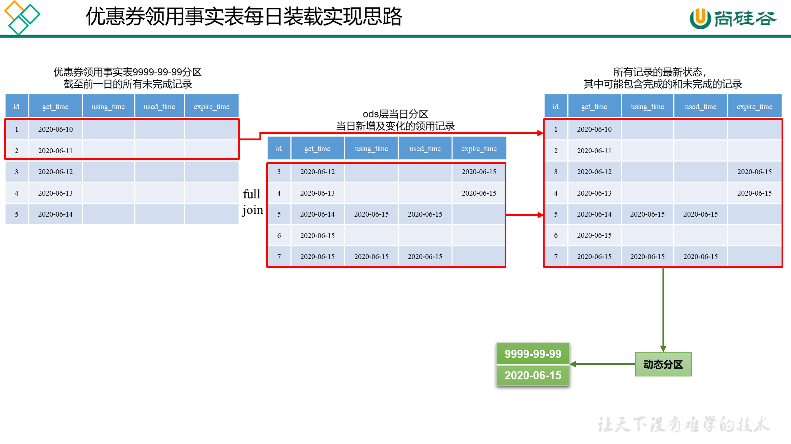

# 数仓搭建-DWD层

## DWD层（业务数据）

业务数据方面DWD层的搭建主要注意点在于维度建模。

- 事务型事实表

  以每个事务或事件为单位，例如一个销售订单记录，一笔支付记录，作为事实表里的一行数据。一旦事务被提交，事实表被插入，数据就不再进行更改，其更新方式为增量更新。

- 周期型快照事实表

  周期型快照事实表中不会保留所有数据，只保留固定时间间隔的数据，例如每天或者每月的销售额，或每月的账户余额等

  例如购物车，有加减商品，随时都有可能变化，但是我们更关心每天结束时这里面有多少商品，方便后期统计分析

- 累积型快照事实表

  累计快照事实表用于跟踪业务事实的变化。例如，数据仓库中可能需要累积或者存储订单从下订单开始，到订单商品被打包、运输、和签收的各个业务阶段的时间点数据来跟踪订单声明周期的进展情况。当这个业务过程进行时，事实表的记录也要不断更新。

  | 订单id | 用户id | 下单时间 | 打包时间 | 发货时间 | 签收时间 | 订单金额 |
  | ------ | ------ | -------- | -------- | -------- | -------- | -------- |
  |        |        | 3-8      | 3-8      | 3-9      | 3-10     |          |

### 评价事实表

事务型事实表

```sql
DROP TABLE IF EXISTS dwd_comment_info;
CREATE EXTERNAL TABLE dwd_comment_info(
    `id` STRING COMMENT '编号',
    `user_id` STRING COMMENT '用户ID',
    `sku_id` STRING COMMENT '商品sku',
    `spu_id` STRING COMMENT '商品spu',
    `order_id` STRING COMMENT '订单ID',
    `appraise` STRING COMMENT '评价(好评、中评、差评、默认评价)',
    `create_time` STRING COMMENT '评价时间'
) COMMENT '评价事实表'
PARTITIONED BY (`dt` STRING)
STORED AS PARQUET
LOCATION '/warehouse/gmall/dwd/dwd_comment_info/'
TBLPROPERTIES ("parquet.compression"="lzo");
```

同步策略：首日的全量评价记录按记录生成的时间（create_time）创建动态分区，数据按create_time保存到对应的分区里，每日同步策略则采用增量同步（当日全量同步）

**首日装载**

```sql
set hive.exec.dynamic.partition.mode=nonstrict;
set hive.input.format=org.apache.hadoop.hive.ql.io.HiveInputFormat;
insert overwrite table dwd_comment_info partition (dt)
select
    id,
    user_id,
    sku_id,
    spu_id,
    order_id,
    appraise,
    create_time,
    date_format(create_time,'yyyy-MM-dd') as dt
from ods_comment_info
where dt='2021-06-01';
```

**每日装载**

```sql
insert overwrite table dwd_comment_info partition(dt='2020-06-15')
select
    id,
    user_id,
    sku_id,
    spu_id,
    order_id,
    appraise,
    create_time
from ods_comment_info where dt='2020-06-15';
```

### 订单明细事实表

事务型事实表

```sql
DROP TABLE IF EXISTS dwd_order_detail;
CREATE EXTERNAL TABLE dwd_order_detail (
    `id` STRING COMMENT '订单编号',
    `order_id` STRING COMMENT '订单号',
    `user_id` STRING COMMENT '用户id',
    `sku_id` STRING COMMENT 'sku商品id',
    `province_id` STRING COMMENT '省份ID',
    `activity_id` STRING COMMENT '活动ID',
    `activity_rule_id` STRING COMMENT '活动规则ID',
    `coupon_id` STRING COMMENT '优惠券ID',
    `create_time` STRING COMMENT '创建时间',
    `source_type` STRING COMMENT '来源类型',
    `source_id` STRING COMMENT '来源编号',
    `sku_num` BIGINT COMMENT '商品数量',
    `original_amount` DECIMAL(16,2) COMMENT '原始价格',
    `split_activity_amount` DECIMAL(16,2) COMMENT '活动优惠分摊',
    `split_coupon_amount` DECIMAL(16,2) COMMENT '优惠券优惠分摊',
    `split_final_amount` DECIMAL(16,2) COMMENT '最终价格分摊'
) COMMENT '订单明细事实表表'
PARTITIONED BY (`dt` STRING)
STORED AS PARQUET
LOCATION '/warehouse/gmall/dwd/dwd_order_detail/'
TBLPROPERTIES ("parquet.compression"="lzo");
```

同步策略：首日的全量评价记录按记录生成的时间（create_time）创建动态分区，数据按create_time保存到对应的分区里，每日同步策略则采用增量同步（当日全量同步）

**首日装载**

```sql
set hive.exec.dynamic.partition.mode=nonstrict;
set hive.input.format=org.apache.hadoop.hive.ql.io.HiveInputFormat;
insert overwrite table dwd_order_detail partition(dt)
select
    od.id,
    od.order_id,
    oi.user_id,
    od.sku_id,
    oi.province_id,
    oda.activity_id,
    oda.activity_rule_id,
    odc.coupon_id,
    od.create_time,
    od.source_type,
    od.source_id,
    od.sku_num,
    od.order_price*od.sku_num,
    od.split_activity_amount,
    od.split_coupon_amount,
    od.split_final_amount,
    date_format(create_time,'yyyy-MM-dd') as dt
from
(
    select
        *
    from ods_order_detail
    where dt='2021-06-01'
)od
left join
(
    select
        id,
        user_id,
        province_id
    from ods_order_info
    where dt='2021-06-01'
)oi
on od.order_id=oi.id
left join
(
    select
        order_detail_id,
        activity_id,
        activity_rule_id
    from ods_order_detail_activity
    where dt='2021-06-01'
)oda
on od.id=oda.order_detail_id
left join
(
    select
        order_detail_id,
        coupon_id
    from ods_order_detail_coupon
    where dt='2021-06-01'
)odc
on od.id=odc.order_detail_id;
```

**每日装载**

```sql
insert overwrite table dwd_order_detail partition(dt='2020-06-15')
select
    od.id,
    od.order_id,
    oi.user_id,
    od.sku_id,
    oi.province_id,
    oda.activity_id,
    oda.activity_rule_id,
    odc.coupon_id,
    od.create_time,
    od.source_type,
    od.source_id,
    od.sku_num,
    od.order_price*od.sku_num,
    od.split_activity_amount,
    od.split_coupon_amount,
    od.split_final_amount
from
(
    select
        *
    from ods_order_detail
    where dt='2020-06-15'
)od
left join
(
    select
        id,
        user_id,
        province_id
    from ods_order_info
    where dt='2020-06-15'
)oi
on od.order_id=oi.id
left join
(
    select
        order_detail_id,
        activity_id,
        activity_rule_id
    from ods_order_detail_activity
    where dt='2020-06-15'
)oda
on od.id=oda.order_detail_id
left join
(
    select
        order_detail_id,
        coupon_id
    from ods_order_detail_coupon
    where dt='2020-06-15'
)odc
on od.id=odc.order_detail_id;
```

### 退单事实表

事务型事实表

```sql
DROP TABLE IF EXISTS dwd_order_refund_info;
CREATE EXTERNAL TABLE dwd_order_refund_info(
    `id` STRING COMMENT '编号',
    `user_id` STRING COMMENT '用户ID',
    `order_id` STRING COMMENT '订单ID',
    `sku_id` STRING COMMENT '商品ID',
    `province_id` STRING COMMENT '地区ID',
    `refund_type` STRING COMMENT '退单类型',
    `refund_num` BIGINT COMMENT '退单件数',
    `refund_amount` DECIMAL(16,2) COMMENT '退单金额',
    `refund_reason_type` STRING COMMENT '退单原因类型',
    `create_time` STRING COMMENT '退单时间'
) COMMENT '退单事实表'
PARTITIONED BY (`dt` STRING)
STORED AS PARQUET
LOCATION '/warehouse/gmall/dwd/dwd_order_refund_info/'
TBLPROPERTIES ("parquet.compression"="lzo");
```

同步策略：首日的全量评价记录按记录生成的时间（create_time）创建动态分区，数据按create_time保存到对应的分区里，每日同步策略则采用增量同步（当日全量同步）

**首日装载**

```sql
set hive.exec.dynamic.partition.mode=nonstrict;
set hive.input.format=org.apache.hadoop.hive.ql.io.HiveInputFormat;
insert overwrite table dwd_order_refund_info partition(dt)
select
    ri.id,
    ri.user_id,
    ri.order_id,
    ri.sku_id,
    oi.province_id,
    ri.refund_type,
    ri.refund_num,
    ri.refund_amount,
    ri.refund_reason_type,
    ri.create_time,
    date_format(ri.create_time,'yyyy-MM-dd') as dt
from
(
    select * from ods_order_refund_info where dt='2021-06-01'
)ri
left join
(
    select id,province_id from ods_order_info where dt='2021-06-01'
)oi
on ri.order_id=oi.id;
```

**每日装载**

```sql
insert overwrite table dwd_order_refund_info partition(dt='2020-06-15')
select
    ri.id,
    ri.user_id,
    ri.order_id,
    ri.sku_id,
    oi.province_id,
    ri.refund_type,
    ri.refund_num,
    ri.refund_amount,
    ri.refund_reason_type,
    ri.create_time
from
(
    select * from ods_order_refund_info where dt='2020-06-15'
)ri
left join
(
    select id,province_id from ods_order_info where dt='2020-06-15'
)oi
on ri.order_id=oi.id;
```

### 加购事实表

周期型快照事实表，每日快照

```sql
DROP TABLE IF EXISTS dwd_cart_info;
CREATE EXTERNAL TABLE dwd_cart_info(
    `id` STRING COMMENT '编号',
    `user_id` STRING COMMENT '用户ID',
    `sku_id` STRING COMMENT '商品ID',
    `source_type` STRING COMMENT '来源类型',
    `source_id` STRING COMMENT '来源编号',
    `cart_price` DECIMAL(16,2) COMMENT '加入购物车时的价格',
    `is_ordered` STRING COMMENT '是否已下单',
    `create_time` STRING COMMENT '创建时间',
    `operate_time` STRING COMMENT '修改时间',
    `order_time` STRING COMMENT '下单时间',
    `sku_num` BIGINT COMMENT '加购数量'
) COMMENT '加购事实表'
PARTITIONED BY (`dt` STRING)
STORED AS PARQUET
LOCATION '/warehouse/gmall/dwd/dwd_cart_info/'
TBLPROPERTIES ("parquet.compression"="lzo");
```

同步策略：当日全量购物车数据，首日装载和每日装载逻辑相同

**装载数据**

```sql
insert overwrite table dwd_cart_info partition(dt='2021-06-01')
select
    id,
    user_id,
    sku_id,
    source_type,
    source_id,
    cart_price,
    is_ordered,
    create_time,
    operate_time,
    order_time,
    sku_num
from ods_cart_info
where dt='2021-06-01';
```

### 收藏事实表

周期型快照事实表，每日快照

```sql
DROP TABLE IF EXISTS dwd_favor_info;
CREATE EXTERNAL TABLE dwd_favor_info(
    `id` STRING COMMENT '编号',
    `user_id` STRING  COMMENT '用户id',
    `sku_id` STRING  COMMENT 'skuid',
    `spu_id` STRING  COMMENT 'spuid',
    `is_cancel` STRING  COMMENT '是否取消',
    `create_time` STRING  COMMENT '收藏时间',
    `cancel_time` STRING  COMMENT '取消时间'
) COMMENT '收藏事实表'
PARTITIONED BY (`dt` STRING)
STORED AS PARQUET
LOCATION '/warehouse/gmall/dwd/dwd_favor_info/'
TBLPROPERTIES ("parquet.compression"="lzo");
```

同步策略：当日全量收藏记录， 首日装载和每日装载逻辑相同

**装载数据**

```sql
insert overwrite table dwd_favor_info partition(dt='2021-06-01')
select
    id,
    user_id,
    sku_id,
    spu_id,
    is_cancel,
    create_time,
    cancel_time
from ods_favor_info
where dt='2021-06-01';
```

### 优惠券领用事实表

累积型快照事实表

```sql
DROP TABLE IF EXISTS dwd_coupon_use;
CREATE EXTERNAL TABLE dwd_coupon_use(
    `id` STRING COMMENT '编号',
    `coupon_id` STRING  COMMENT '优惠券ID',
    `user_id` STRING  COMMENT 'userid',
    `order_id` STRING  COMMENT '订单id',
    `coupon_status` STRING  COMMENT '优惠券状态',
    `get_time` STRING  COMMENT '领取时间',
    `using_time` STRING  COMMENT '使用时间(下单)',
    `used_time` STRING  COMMENT '使用时间(支付)',
    `expire_time` STRING COMMENT '过期时间'
) COMMENT '优惠券领用事实表'
PARTITIONED BY (`dt` STRING)
STORED AS PARQUET
LOCATION '/warehouse/gmall/dwd/dwd_coupon_use/'
TBLPROPERTIES ("parquet.compression"="lzo");
```

同步策略：当天分区存放当日完成的优惠劵领用记录， 目前未完成的优惠劵领用记录放在9999-99-99分区中

**首日加载**

```sql
set hive.exec.dynamic.partition.mode=nonstrict;
set hive.input.format=org.apache.hadoop.hive.ql.io.HiveInputFormat;
insert overwrite table dwd_coupon_use partition(dt)
select
    id,
    coupon_id,
    user_id,
    order_id,
    coupon_status,
    get_time,
    using_time,
    used_time,
    expire_time,
    coalesce(date_format(used_time,'yyyy-MM-dd'),date_format(expire_time,'yyyy-MM-dd'),'9999-99-99') as dt
from ods_coupon_use
where dt='2021-06-01';
```




**每日装载**

```sql
insert overwrite table dwd_coupon_use partition(dt)
select
    nvl(new.id,old.id),
    nvl(new.coupon_id,old.coupon_id),
    nvl(new.user_id,old.user_id),
    nvl(new.order_id,old.order_id),
    nvl(new.coupon_status,old.coupon_status),
    nvl(new.get_time,old.get_time),
    nvl(new.using_time,old.using_time),
    nvl(new.used_time,old.used_time),
    nvl(new.expire_time,old.expire_time),
    coalesce(date_format(nvl(new.used_time,old.used_time),'yyyy-MM-dd'),date_format(nvl(new.expire_time,old.expire_time),'yyyy-MM-dd'),'9999-99-99')
from
(
    select
        id,
        coupon_id,
        user_id,
        order_id,
        coupon_status,
        get_time,
        using_time,
        used_time,
        expire_time
    from dwd_coupon_use
    where dt='9999-99-99'
)old
full outer join
(
    select
        id,
        coupon_id,
        user_id,
        order_id,
        coupon_status,
        get_time,
        using_time,
        used_time,
        expire_time
    from ods_coupon_use
    where dt='2020-06-15'
)new
on old.id=new.id;
```

### 支付事实表

累积型快照事实表

```sql
DROP TABLE IF EXISTS dwd_payment_info;
CREATE EXTERNAL TABLE dwd_payment_info (
    `id` STRING COMMENT '编号',
    `order_id` STRING COMMENT '订单编号',
    `user_id` STRING COMMENT '用户编号',
    `province_id` STRING COMMENT '地区ID',
    `trade_no` STRING COMMENT '交易编号',
    `out_trade_no` STRING COMMENT '对外交易编号',
    `payment_type` STRING COMMENT '支付类型',
    `payment_amount` DECIMAL(16,2) COMMENT '支付金额',
    `payment_status` STRING COMMENT '支付状态',
    `create_time` STRING COMMENT '创建时间',--调用第三方支付接口的时间
    `callback_time` STRING COMMENT '完成时间'--支付完成时间，即支付成功回调时间
) COMMENT '支付事实表表'
PARTITIONED BY (`dt` STRING)
STORED AS PARQUET
LOCATION '/warehouse/gmall/dwd/dwd_payment_info/'
TBLPROPERTIES ("parquet.compression"="lzo");
```

同步策略：首日同步，往后新增及变化同步

**首日装载**

```sql
insert overwrite table dwd_payment_info partition(dt)
select
    pi.id,
    pi.order_id,
    pi.user_id,
    oi.province_id,
    pi.trade_no,
    pi.out_trade_no,
    pi.payment_type,
    pi.payment_amount,
    pi.payment_status,
    pi.create_time,
    pi.callback_time,
    nvl(date_format(pi.callback_time,'yyyy-MM-dd'),'9999-99-99')
from
(
    select * from ods_payment_info where dt='2021-06-01'
)pi
left join
(
    select id,province_id from ods_order_info where dt='2021-06-01'
)oi
on pi.order_id=oi.id;
```

**每日装载**

```sql
insert overwrite table dwd_payment_info partition(dt)
select
    nvl(new.id,old.id),
    nvl(new.order_id,old.order_id),
    nvl(new.user_id,old.user_id),
    nvl(new.province_id,old.province_id),
    nvl(new.trade_no,old.trade_no),
    nvl(new.out_trade_no,old.out_trade_no),
    nvl(new.payment_type,old.payment_type),
    nvl(new.payment_amount,old.payment_amount),
    nvl(new.payment_status,old.payment_status),
    nvl(new.create_time,old.create_time),
    nvl(new.callback_time,old.callback_time),
    nvl(date_format(nvl(new.callback_time,old.callback_time),'yyyy-MM-dd'),'9999-99-99')
from
(
    select id,
       order_id,
       user_id,
       province_id,
       trade_no,
       out_trade_no,
       payment_type,
       payment_amount,
       payment_status,
       create_time,
       callback_time
    from dwd_payment_info
    where dt = '9999-99-99'
)old
full outer join
(
    select
        pi.id,
        pi.out_trade_no,
        pi.order_id,
        pi.user_id,
        oi.province_id,
        pi.payment_type,
        pi.trade_no,
        pi.payment_amount,
        pi.payment_status,
        pi.create_time,
        pi.callback_time
    from
    (
        select * from ods_payment_info where dt='2020-06-15'
    )pi
    left join
    (
        select id,province_id from ods_order_info where dt='2020-06-15'
    )oi
    on pi.order_id=oi.id
)new
on old.id=new.id;
```

### 退款事实表

累积型快照事实表

```sql
DROP TABLE IF EXISTS dwd_refund_payment;
CREATE EXTERNAL TABLE dwd_refund_payment (
    `id` STRING COMMENT '编号',
    `user_id` STRING COMMENT '用户ID',
    `order_id` STRING COMMENT '订单编号',
    `sku_id` STRING COMMENT 'SKU编号',
    `province_id` STRING COMMENT '地区ID',
    `trade_no` STRING COMMENT '交易编号',
    `out_trade_no` STRING COMMENT '对外交易编号',
    `payment_type` STRING COMMENT '支付类型',
    `refund_amount` DECIMAL(16,2) COMMENT '退款金额',
    `refund_status` STRING COMMENT '退款状态',
    `create_time` STRING COMMENT '创建时间',--调用第三方支付接口的时间
    `callback_time` STRING COMMENT '回调时间'--支付接口回调时间，即支付成功时间
) COMMENT '退款事实表'
PARTITIONED BY (`dt` STRING)
STORED AS PARQUET
LOCATION '/warehouse/gmall/dwd/dwd_refund_payment/'
TBLPROPERTIES ("parquet.compression"="lzo");
```

同步策略：首日同步，往后新增及变化同步

**首日加载**

```sql
insert overwrite table dwd_refund_payment partition(dt)
select
    rp.id,
    user_id,
    order_id,
    sku_id,
    province_id,
    trade_no,
    out_trade_no,
    payment_type,
    refund_amount,
    refund_status,
    create_time,
    callback_time,
    nvl(date_format(callback_time,'yyyy-MM-dd'),'9999-99-99')
from
(
    select
        id,
        out_trade_no,
        order_id,
        sku_id,
        payment_type,
        trade_no,
        refund_amount,
        refund_status,
        create_time,
        callback_time
    from ods_refund_payment
    where dt='2021-06-01'
)rp
left join
(
    select
        id,
        user_id,
        province_id
    from ods_order_info
    where dt='2021-06-01'
)oi
on rp.order_id=oi.id;
```

**每日加载**

```sql
insert overwrite table dwd_refund_payment partition(dt)
select
    nvl(new.id,old.id),
    nvl(new.user_id,old.user_id),
    nvl(new.order_id,old.order_id),
    nvl(new.sku_id,old.sku_id),
    nvl(new.province_id,old.province_id),
    nvl(new.trade_no,old.trade_no),
    nvl(new.out_trade_no,old.out_trade_no),
    nvl(new.payment_type,old.payment_type),
    nvl(new.refund_amount,old.refund_amount),
    nvl(new.refund_status,old.refund_status),
    nvl(new.create_time,old.create_time),
    nvl(new.callback_time,old.callback_time),
    nvl(date_format(nvl(new.callback_time,old.callback_time),'yyyy-MM-dd'),'9999-99-99')
from
(
    select
        id,
        user_id,
        order_id,
        sku_id,
        province_id,
        trade_no,
        out_trade_no,
        payment_type,
        refund_amount,
        refund_status,
        create_time,
        callback_time
    from dwd_refund_payment
    where dt='9999-99-99'
)old
full outer join
(
    select
        rp.id,
        user_id,
        order_id,
        sku_id,
        province_id,
        trade_no,
        out_trade_no,
        payment_type,
        refund_amount,
        refund_status,
        create_time,
        callback_time
    from
    (
        select
            id,
            out_trade_no,
            order_id,
            sku_id,
            payment_type,
            trade_no,
            refund_amount,
            refund_status,
            create_time,
            callback_time
        from ods_refund_payment
        where dt='2020-06-15'
    )rp
    left join
    (
        select
            id,
            user_id,
            province_id
        from ods_order_info
        where dt='2020-06-15'
    )oi
    on rp.order_id=oi.id
)new
on old.id=new.id;
```

### 订单事实表

累积型快照事实表

```sql
DROP TABLE IF EXISTS dwd_order_info;
CREATE EXTERNAL TABLE dwd_order_info(
    `id` STRING COMMENT '编号',
    `order_status` STRING COMMENT '订单状态',
    `user_id` STRING COMMENT '用户ID',
    `province_id` STRING COMMENT '地区ID',
    `payment_way` STRING COMMENT '支付方式',
    `delivery_address` STRING COMMENT '邮寄地址',
    `out_trade_no` STRING COMMENT '对外交易编号',
    `tracking_no` STRING COMMENT '物流单号',
    `create_time` STRING COMMENT '创建时间(未支付状态)',
    `payment_time` STRING COMMENT '支付时间(已支付状态)',
    `cancel_time` STRING COMMENT '取消时间(已取消状态)',
    `finish_time` STRING COMMENT '完成时间(已完成状态)',
    `refund_time` STRING COMMENT '退款时间(退款中状态)',
    `refund_finish_time` STRING COMMENT '退款完成时间(退款完成状态)',
    `expire_time` STRING COMMENT '过期时间',
    `feight_fee` DECIMAL(16,2) COMMENT '运费',
    `feight_fee_reduce` DECIMAL(16,2) COMMENT '运费减免',
    `activity_reduce_amount` DECIMAL(16,2) COMMENT '活动减免',
    `coupon_reduce_amount` DECIMAL(16,2) COMMENT '优惠券减免',
    `original_amount` DECIMAL(16,2) COMMENT '订单原始价格',
    `final_amount` DECIMAL(16,2) COMMENT '订单最终价格'
) COMMENT '订单事实表'
PARTITIONED BY (`dt` STRING)
STORED AS PARQUET
LOCATION '/warehouse/gmall/dwd/dwd_order_info/'
TBLPROPERTIES ("parquet.compression"="lzo");
```

同步策略：首日全量同步，往后新增及变化同步

**首日装载**

```sql
insert overwrite table dwd_order_info partition(dt)
select
    oi.id,
    oi.order_status,
    oi.user_id,
    oi.province_id,
    oi.payment_way,
    oi.delivery_address,
    oi.out_trade_no,
    oi.tracking_no,
    oi.create_time,
    times.ts['1002'] payment_time,
    times.ts['1003'] cancel_time,
    times.ts['1004'] finish_time,
    times.ts['1005'] refund_time,
    times.ts['1006'] refund_finish_time,
    oi.expire_time,
    feight_fee,
    feight_fee_reduce,
    activity_reduce_amount,
    coupon_reduce_amount,
    original_amount,
    final_amount,
    case
        when times.ts['1003'] is not null then date_format(times.ts['1003'],'yyyy-MM-dd')
        when times.ts['1004'] is not null and date_add(date_format(times.ts['1004'],'yyyy-MM-dd'),7)<='2021-06-01' and times.ts['1005'] is null then date_add(date_format(times.ts['1004'],'yyyy-MM-dd'),7)
        when times.ts['1006'] is not null then date_format(times.ts['1006'],'yyyy-MM-dd')
        when oi.expire_time is not null then date_format(oi.expire_time,'yyyy-MM-dd')
        else '9999-99-99'
    end
from
(
    select
        *
    from ods_order_info
    where dt='2021-06-01'
)oi
left join
(
    select
        order_id,
        str_to_map(concat_ws(',',collect_set(concat(order_status,'=',operate_time))),',','=') ts
    from ods_order_status_log
    where dt='2021-06-01'
    group by order_id
)times
on oi.id=times.order_id;
```

**每日装载**

```sql
insert overwrite table dwd_order_info partition(dt)
select
    nvl(new.id,old.id),
    nvl(new.order_status,old.order_status),
    nvl(new.user_id,old.user_id),
    nvl(new.province_id,old.province_id),
    nvl(new.payment_way,old.payment_way),
    nvl(new.delivery_address,old.delivery_address),
    nvl(new.out_trade_no,old.out_trade_no),
    nvl(new.tracking_no,old.tracking_no),
    nvl(new.create_time,old.create_time),
    nvl(new.payment_time,old.payment_time),
    nvl(new.cancel_time,old.cancel_time),
    nvl(new.finish_time,old.finish_time),
    nvl(new.refund_time,old.refund_time),
    nvl(new.refund_finish_time,old.refund_finish_time),
    nvl(new.expire_time,old.expire_time),
    nvl(new.feight_fee,old.feight_fee),
    nvl(new.feight_fee_reduce,old.feight_fee_reduce),
    nvl(new.activity_reduce_amount,old.activity_reduce_amount),
    nvl(new.coupon_reduce_amount,old.coupon_reduce_amount),
    nvl(new.original_amount,old.original_amount),
    nvl(new.final_amount,old.final_amount),
    case
        when new.cancel_time is not null then date_format(new.cancel_time,'yyyy-MM-dd')
        when new.finish_time is not null and date_add(date_format(new.finish_time,'yyyy-MM-dd'),7)='2020-06-15' and new.refund_time is null then '2020-06-15'
        when new.refund_finish_time is not null then date_format(new.refund_finish_time,'yyyy-MM-dd')
        when new.expire_time is not null then date_format(new.expire_time,'yyyy-MM-dd')
        else '9999-99-99'
    end
from
(
    select
        id,
        order_status,
        user_id,
        province_id,
        payment_way,
        delivery_address,
        out_trade_no,
        tracking_no,
        create_time,
        payment_time,
        cancel_time,
        finish_time,
        refund_time,
        refund_finish_time,
        expire_time,
        feight_fee,
        feight_fee_reduce,
        activity_reduce_amount,
        coupon_reduce_amount,
        original_amount,
        final_amount
    from dwd_order_info
    where dt='9999-99-99'
)old
full outer join
(
    select
        oi.id,
        oi.order_status,
        oi.user_id,
        oi.province_id,
        oi.payment_way,
        oi.delivery_address,
        oi.out_trade_no,
        oi.tracking_no,
        oi.create_time,
        times.ts['1002'] payment_time,
        times.ts['1003'] cancel_time,
        times.ts['1004'] finish_time,
        times.ts['1005'] refund_time,
        times.ts['1006'] refund_finish_time,
        oi.expire_time,
        feight_fee,
        feight_fee_reduce,
        activity_reduce_amount,
        coupon_reduce_amount,
        original_amount,
        final_amount
    from
    (
        select
            *
        from ods_order_info
        where dt='2020-06-15'
    )oi
    left join
    (
        select
            order_id,
            str_to_map(concat_ws(',',collect_set(concat(order_status,'=',operate_time))),',','=') ts
        from ods_order_status_log
        where dt='2020-06-15'
        group by order_id
    )times
    on oi.id=times.order_id
)new
on old.id=new.id;
```

## DWD层业务数据首日装载脚本

```shell
[atguigu@hadoop102 bin]$ vim ods_to_dwd_db_init.sh
[atguigu@hadoop102 bin]$ chmod +x ods_to_dwd_db_init.sh
[atguigu@hadoop102 bin]$ ods_to_dwd_db_init.sh all 2021-06-01
```

```shell
#!/bin/bash
APP=gmall

if [ -n "$2" ] ;then
   do_date=$2
else 
   echo "请传入日期参数"
   exit
fi 

dwd_order_info="
set hive.exec.dynamic.partition.mode=nonstrict;
set hive.input.format=org.apache.hadoop.hive.ql.io.HiveInputFormat;
insert overwrite table ${APP}.dwd_order_info partition(dt)
select
    oi.id,
    oi.order_status,
    oi.user_id,
    oi.province_id,
    oi.payment_way,
    oi.delivery_address,
    oi.out_trade_no,
    oi.tracking_no,
    oi.create_time,
    times.ts['1002'] payment_time,
    times.ts['1003'] cancel_time,
    times.ts['1004'] finish_time,
    times.ts['1005'] refund_time,
    times.ts['1006'] refund_finish_time,
    oi.expire_time,
    feight_fee,
    feight_fee_reduce,
    activity_reduce_amount,
    coupon_reduce_amount,
    original_amount,
    final_amount,
    case
        when times.ts['1003'] is not null then date_format(times.ts['1003'],'yyyy-MM-dd')
        when times.ts['1004'] is not null and date_add(date_format(times.ts['1004'],'yyyy-MM-dd'),7)<='$do_date' and times.ts['1005'] is null then date_add(date_format(times.ts['1004'],'yyyy-MM-dd'),7)
        when times.ts['1006'] is not null then date_format(times.ts['1006'],'yyyy-MM-dd')
        when oi.expire_time is not null then date_format(oi.expire_time,'yyyy-MM-dd')
        else '9999-99-99'
    end
from
(
    select
        *
    from ${APP}.ods_order_info
    where dt='$do_date'
)oi
left join
(
    select
        order_id,
        str_to_map(concat_ws(',',collect_set(concat(order_status,'=',operate_time))),',','=') ts
    from ${APP}.ods_order_status_log
    where dt='$do_date'
    group by order_id
)times
on oi.id=times.order_id;"

dwd_order_detail="
set hive.exec.dynamic.partition.mode=nonstrict;
set hive.input.format=org.apache.hadoop.hive.ql.io.HiveInputFormat;
insert overwrite table ${APP}.dwd_order_detail partition(dt)
select
    od.id,
    od.order_id,
    oi.user_id,
    od.sku_id,
    oi.province_id,
    oda.activity_id,
    oda.activity_rule_id,
    odc.coupon_id,
    od.create_time,
    od.source_type,
    od.source_id,
    od.sku_num,
    od.order_price*od.sku_num,
    od.split_activity_amount,
    od.split_coupon_amount,
    od.split_final_amount,
    date_format(create_time,'yyyy-MM-dd')
from
(
    select
        *
    from ${APP}.ods_order_detail
    where dt='$do_date'
)od
left join
(
    select
        id,
        user_id,
        province_id
    from ${APP}.ods_order_info
    where dt='$do_date'
)oi
on od.order_id=oi.id
left join
(
    select
        order_detail_id,
        activity_id,
        activity_rule_id
    from ${APP}.ods_order_detail_activity
    where dt='$do_date'
)oda
on od.id=oda.order_detail_id
left join
(
    select
        order_detail_id,
        coupon_id
    from ${APP}.ods_order_detail_coupon
    where dt='$do_date'
)odc
on od.id=odc.order_detail_id;"

dwd_payment_info="
set hive.exec.dynamic.partition.mode=nonstrict;
set hive.input.format=org.apache.hadoop.hive.ql.io.HiveInputFormat;
insert overwrite table ${APP}.dwd_payment_info partition(dt)
select
    pi.id,
    pi.order_id,
    pi.user_id,
    oi.province_id,
    pi.trade_no,
    pi.out_trade_no,
    pi.payment_type,
    pi.payment_amount,
    pi.payment_status,
    pi.create_time,
    pi.callback_time,
    nvl(date_format(pi.callback_time,'yyyy-MM-dd'),'9999-99-99')
from
(
    select * from ${APP}.ods_payment_info where dt='$do_date'
)pi
left join
(
    select id,province_id from ${APP}.ods_order_info where dt='$do_date'
)oi
on pi.order_id=oi.id;"

dwd_cart_info="
set hive.input.format=org.apache.hadoop.hive.ql.io.HiveInputFormat;
insert overwrite table ${APP}.dwd_cart_info partition(dt='$do_date')
select
    id,
    user_id,
    sku_id,
    source_type,
    source_id,
    cart_price,
    is_ordered,
    create_time,
    operate_time,
    order_time,
    sku_num
from ${APP}.ods_cart_info
where dt='$do_date';"

dwd_comment_info="
set hive.exec.dynamic.partition.mode=nonstrict;
set hive.input.format=org.apache.hadoop.hive.ql.io.HiveInputFormat;
insert overwrite table ${APP}.dwd_comment_info partition(dt)
select
    id,
    user_id,
    sku_id,
    spu_id,
    order_id,
    appraise,
    create_time,
    date_format(create_time,'yyyy-MM-dd')
from ${APP}.ods_comment_info
where dt='$do_date';
"

dwd_favor_info="
set hive.input.format=org.apache.hadoop.hive.ql.io.HiveInputFormat;
insert overwrite table ${APP}.dwd_favor_info partition(dt='$do_date')
select
    id,
    user_id,
    sku_id,
    spu_id,
    is_cancel,
    create_time,
    cancel_time
from ${APP}.ods_favor_info
where dt='$do_date';"

dwd_coupon_use="
set hive.exec.dynamic.partition.mode=nonstrict;
set hive.input.format=org.apache.hadoop.hive.ql.io.HiveInputFormat;
insert overwrite table ${APP}.dwd_coupon_use partition(dt)
select
    id,
    coupon_id,
    user_id,
    order_id,
    coupon_status,
    get_time,
    using_time,
    used_time,
    expire_time,
    coalesce(date_format(used_time,'yyyy-MM-dd'),date_format(expire_time,'yyyy-MM-dd'),'9999-99-99')
from ${APP}.ods_coupon_use
where dt='$do_date';"

dwd_order_refund_info="
set hive.exec.dynamic.partition.mode=nonstrict;
set hive.input.format=org.apache.hadoop.hive.ql.io.HiveInputFormat;
insert overwrite table ${APP}.dwd_order_refund_info partition(dt)
select
    ri.id,
    ri.user_id,
    ri.order_id,
    ri.sku_id,
    oi.province_id,
    ri.refund_type,
    ri.refund_num,
    ri.refund_amount,
    ri.refund_reason_type,
    ri.create_time,
    date_format(ri.create_time,'yyyy-MM-dd')
from
(
    select * from ${APP}.ods_order_refund_info where dt='$do_date'
)ri
left join
(
    select id,province_id from ${APP}.ods_order_info where dt='$do_date'
)oi
on ri.order_id=oi.id;"

dwd_refund_payment="
set hive.exec.dynamic.partition.mode=nonstrict;
set hive.input.format=org.apache.hadoop.hive.ql.io.HiveInputFormat;
insert overwrite table ${APP}.dwd_refund_payment partition(dt)
select
    rp.id,
    user_id,
    order_id,
    sku_id,
    province_id,
    trade_no,
    out_trade_no,
    payment_type,
    refund_amount,
    refund_status,
    create_time,
    callback_time,
    nvl(date_format(callback_time,'yyyy-MM-dd'),'9999-99-99')
from
(
    select
        id,
        out_trade_no,
        order_id,
        sku_id,
        payment_type,
        trade_no,
        refund_amount,
        refund_status,
        create_time,
        callback_time
    from ${APP}.ods_refund_payment
    where dt='$do_date'
)rp
left join
(
    select
        id,
        user_id,
        province_id
    from ${APP}.ods_order_info
    where dt='$do_date'
)oi
on rp.order_id=oi.id;"

case $1 in
    dwd_order_info )
        hive -e "$dwd_order_info"
    ;;
    dwd_order_detail )
        hive -e "$dwd_order_detail"
    ;;
    dwd_payment_info )
        hive -e "$dwd_payment_info"
    ;;
    dwd_cart_info )
        hive -e "$dwd_cart_info"
    ;;
    dwd_comment_info )
        hive -e "$dwd_comment_info"
    ;;
    dwd_favor_info )
        hive -e "$dwd_favor_info"
    ;;
    dwd_coupon_use )
        hive -e "$dwd_coupon_use"
    ;;
    dwd_order_refund_info )
        hive -e "$dwd_order_refund_info"
    ;;
    dwd_refund_payment )
        hive -e "$dwd_refund_payment"
    ;;
    all )
        hive -e "$dwd_order_info$dwd_order_detail$dwd_payment_info$dwd_cart_info$dwd_comment_info$dwd_favor_info$dwd_coupon_use$dwd_order_refund_info$dwd_refund_payment"
    ;;
esac
```

## DWD层业务数据每日装载脚本

```shell
[atguigu@hadoop102 bin]$ vim ods_to_dwd_db.sh
[atguigu@hadoop102 bin]$ chmod + ods_to_dwd_db.sh
[atguigu@hadoop102 bin]$ ods_to_dwd_db.sh all 2021-06-01
```

```shell
#!/bin/bash

APP=gmall
# 如果是输入的日期按照取输入日期；如果没输入日期取当前时间的前一天
if [ -n "$2" ] ;then
    do_date=$2
else 
    do_date=`date -d "-1 day" +%F`
fi


# 假设某累积型快照事实表，某天所有的业务记录全部完成，则会导致9999-99-99分区的数据未被覆盖，从而导致数据重复，该函数根据9999-99-99分区的数据的末次修改时间判断其是否被覆盖了，如果未被覆盖，就手动清理
clear_data(){
    current_date=`date +%F`
    current_date_timestamp=`date -d "$current_date" +%s`

    last_modified_date=`hadoop fs -ls /warehouse/gmall/dwd/$1 | grep '9999-99-99' | awk '{print $6}'`
    last_modified_date_timestamp=`date -d "$last_modified_date" +%s`

    if [[ $last_modified_date_timestamp -lt $current_date_timestamp ]]; then
        echo "clear table $1 partition(dt=9999-99-99)"
        hadoop fs -rm -r -f /warehouse/gmall/dwd/$1/dt=9999-99-99/*
    fi
}

dwd_order_info="
set hive.input.format=org.apache.hadoop.hive.ql.io.HiveInputFormat;
set hive.exec.dynamic.partition.mode=nonstrict;
insert overwrite table ${APP}.dwd_order_info partition(dt)
select
    nvl(new.id,old.id),
    nvl(new.order_status,old.order_status),
    nvl(new.user_id,old.user_id),
    nvl(new.province_id,old.province_id),
    nvl(new.payment_way,old.payment_way),
    nvl(new.delivery_address,old.delivery_address),
    nvl(new.out_trade_no,old.out_trade_no),
    nvl(new.tracking_no,old.tracking_no),
    nvl(new.create_time,old.create_time),
    nvl(new.payment_time,old.payment_time),
    nvl(new.cancel_time,old.cancel_time),
    nvl(new.finish_time,old.finish_time),
    nvl(new.refund_time,old.refund_time),
    nvl(new.refund_finish_time,old.refund_finish_time),
    nvl(new.expire_time,old.expire_time),
    nvl(new.feight_fee,old.feight_fee),
    nvl(new.feight_fee_reduce,old.feight_fee_reduce),
    nvl(new.activity_reduce_amount,old.activity_reduce_amount),
    nvl(new.coupon_reduce_amount,old.coupon_reduce_amount),
    nvl(new.original_amount,old.original_amount),
    nvl(new.final_amount,old.final_amount),
    case
        when new.cancel_time is not null then date_format(new.cancel_time,'yyyy-MM-dd')
        when new.finish_time is not null and date_add(date_format(new.finish_time,'yyyy-MM-dd'),7)='$do_date' and new.refund_time is null then '$do_date'
        when new.refund_finish_time is not null then date_format(new.refund_finish_time,'yyyy-MM-dd')
        when new.expire_time is not null then date_format(new.expire_time,'yyyy-MM-dd')
        else '9999-99-99'
    end
from
(
    select
        id,
        order_status,
        user_id,
        province_id,
        payment_way,
        delivery_address,
        out_trade_no,
        tracking_no,
        create_time,
        payment_time,
        cancel_time,
        finish_time,
        refund_time,
        refund_finish_time,
        expire_time,
        feight_fee,
        feight_fee_reduce,
        activity_reduce_amount,
        coupon_reduce_amount,
        original_amount,
        final_amount
    from ${APP}.dwd_order_info
    where dt='9999-99-99'
)old
full outer join
(
    select
        oi.id,
        oi.order_status,
        oi.user_id,
        oi.province_id,
        oi.payment_way,
        oi.delivery_address,
        oi.out_trade_no,
        oi.tracking_no,
        oi.create_time,
        times.ts['1002'] payment_time,
        times.ts['1003'] cancel_time,
        times.ts['1004'] finish_time,
        times.ts['1005'] refund_time,
        times.ts['1006'] refund_finish_time,
        oi.expire_time,
        feight_fee,
        feight_fee_reduce,
        activity_reduce_amount,
        coupon_reduce_amount,
        original_amount,
        final_amount
    from
    (
        select
            *
        from ${APP}.ods_order_info
        where dt='$do_date'
    )oi
    left join
    (
        select
            order_id,
            str_to_map(concat_ws(',',collect_set(concat(order_status,'=',operate_time))),',','=') ts
        from ${APP}.ods_order_status_log
        where dt='$do_date'
        group by order_id
    )times
    on oi.id=times.order_id
)new
on old.id=new.id;"

dwd_order_detail="
set hive.input.format=org.apache.hadoop.hive.ql.io.HiveInputFormat;
insert overwrite table ${APP}.dwd_order_detail partition(dt='$do_date')
select
    od.id,
    od.order_id,
    oi.user_id,
    od.sku_id,
    oi.province_id,
    oda.activity_id,
    oda.activity_rule_id,
    odc.coupon_id,
    od.create_time,
    od.source_type,
    od.source_id,
    od.sku_num,
    od.order_price*od.sku_num,
    od.split_activity_amount,
    od.split_coupon_amount,
    od.split_final_amount
from
(
    select
        *
    from ${APP}.ods_order_detail
    where dt='$do_date'
)od
left join
(
    select
        id,
        user_id,
        province_id
    from ${APP}.ods_order_info
    where dt='$do_date'
)oi
on od.order_id=oi.id
left join
(
    select
        order_detail_id,
        activity_id,
        activity_rule_id
    from ${APP}.ods_order_detail_activity
    where dt='$do_date'
)oda
on od.id=oda.order_detail_id
left join
(
    select
        order_detail_id,
        coupon_id
    from ${APP}.ods_order_detail_coupon
    where dt='$do_date'
)odc
on od.id=odc.order_detail_id;"


dwd_payment_info="
set hive.input.format=org.apache.hadoop.hive.ql.io.HiveInputFormat;
set hive.exec.dynamic.partition.mode=nonstrict;
insert overwrite table ${APP}.dwd_payment_info partition(dt)
select
    nvl(new.id,old.id),
    nvl(new.order_id,old.order_id),
    nvl(new.user_id,old.user_id),
    nvl(new.province_id,old.province_id),
    nvl(new.trade_no,old.trade_no),
    nvl(new.out_trade_no,old.out_trade_no),
    nvl(new.payment_type,old.payment_type),
    nvl(new.payment_amount,old.payment_amount),
    nvl(new.payment_status,old.payment_status),
    nvl(new.create_time,old.create_time),
    nvl(new.callback_time,old.callback_time),
    nvl(date_format(nvl(new.callback_time,old.callback_time),'yyyy-MM-dd'),'9999-99-99')
from
(
    select id,
       order_id,
       user_id,
       province_id,
       trade_no,
       out_trade_no,
       payment_type,
       payment_amount,
       payment_status,
       create_time,
       callback_time
    from ${APP}.dwd_payment_info
    where dt = '9999-99-99'
)old
full outer join
(
    select
        pi.id,
        pi.out_trade_no,
        pi.order_id,
        pi.user_id,
        oi.province_id,
        pi.payment_type,
        pi.trade_no,
        pi.payment_amount,
        pi.payment_status,
        pi.create_time,
        pi.callback_time
    from
    (
        select * from ${APP}.ods_payment_info where dt='$do_date'
    )pi
    left join
    (
        select id,province_id from ${APP}.ods_order_info where dt='$do_date'
    )oi
    on pi.order_id=oi.id
)new
on old.id=new.id;"

dwd_cart_info="
set hive.input.format=org.apache.hadoop.hive.ql.io.HiveInputFormat;
insert overwrite table ${APP}.dwd_cart_info partition(dt='$do_date')
select
    id,
    user_id,
    sku_id,
    source_type,
    source_id,
    cart_price,
    is_ordered,
    create_time,
    operate_time,
    order_time,
    sku_num
from ${APP}.ods_cart_info
where dt='$do_date';"


dwd_comment_info="
set hive.input.format=org.apache.hadoop.hive.ql.io.HiveInputFormat;
insert overwrite table ${APP}.dwd_comment_info partition(dt='$do_date')
select
    id,
    user_id,
    sku_id,
    spu_id,
    order_id,
    appraise,
    create_time
from ${APP}.ods_comment_info where dt='$do_date';"


dwd_favor_info="
set hive.input.format=org.apache.hadoop.hive.ql.io.HiveInputFormat;
insert overwrite table ${APP}.dwd_favor_info partition(dt='$do_date')
select
    id,
    user_id,
    sku_id,
    spu_id,
    is_cancel,
    create_time,
    cancel_time
from ${APP}.ods_favor_info
where dt='$do_date';"


dwd_coupon_use="
set hive.input.format=org.apache.hadoop.hive.ql.io.HiveInputFormat;
set hive.exec.dynamic.partition.mode=nonstrict;
insert overwrite table ${APP}.dwd_coupon_use partition(dt)
select
    nvl(new.id,old.id),
    nvl(new.coupon_id,old.coupon_id),
    nvl(new.user_id,old.user_id),
    nvl(new.order_id,old.order_id),
    nvl(new.coupon_status,old.coupon_status),
    nvl(new.get_time,old.get_time),
    nvl(new.using_time,old.using_time),
    nvl(new.used_time,old.used_time),
    nvl(new.expire_time,old.expire_time),
    coalesce(date_format(nvl(new.used_time,old.used_time),'yyyy-MM-dd'),date_format(nvl(new.expire_time,old.expire_time),'yyyy-MM-dd'),'9999-99-99')
from
(
    select
        id,
        coupon_id,
        user_id,
        order_id,
        coupon_status,
        get_time,
        using_time,
        used_time,
        expire_time
    from ${APP}.dwd_coupon_use
    where dt='9999-99-99'
)old
full outer join
(
    select
        id,
        coupon_id,
        user_id,
        order_id,
        coupon_status,
        get_time,
        using_time,
        used_time,
        expire_time
    from ${APP}.ods_coupon_use
    where dt='$do_date'
)new
on old.id=new.id;"

dwd_order_refund_info="
set hive.input.format=org.apache.hadoop.hive.ql.io.HiveInputFormat;
insert overwrite table ${APP}.dwd_order_refund_info partition(dt='$do_date')
select
    ri.id,
    ri.user_id,
    ri.order_id,
    ri.sku_id,
    oi.province_id,
    ri.refund_type,
    ri.refund_num,
    ri.refund_amount,
    ri.refund_reason_type,
    ri.create_time
from
(
    select * from ${APP}.ods_order_refund_info where dt='$do_date'
)ri
left join
(
    select id,province_id from ${APP}.ods_order_info where dt='$do_date'
)oi
on ri.order_id=oi.id;"


dwd_refund_payment="
set hive.input.format=org.apache.hadoop.hive.ql.io.HiveInputFormat;
set hive.exec.dynamic.partition.mode=nonstrict;
insert overwrite table ${APP}.dwd_refund_payment partition(dt)
select
    nvl(new.id,old.id),
    nvl(new.user_id,old.user_id),
    nvl(new.order_id,old.order_id),
    nvl(new.sku_id,old.sku_id),
    nvl(new.province_id,old.province_id),
    nvl(new.trade_no,old.trade_no),
    nvl(new.out_trade_no,old.out_trade_no),
    nvl(new.payment_type,old.payment_type),
    nvl(new.refund_amount,old.refund_amount),
    nvl(new.refund_status,old.refund_status),
    nvl(new.create_time,old.create_time),
    nvl(new.callback_time,old.callback_time),
    nvl(date_format(nvl(new.callback_time,old.callback_time),'yyyy-MM-dd'),'9999-99-99')
from
(
    select
        id,
        user_id,
        order_id,
        sku_id,
        province_id,
        trade_no,
        out_trade_no,
        payment_type,
        refund_amount,
        refund_status,
        create_time,
        callback_time
    from ${APP}.dwd_refund_payment
    where dt='9999-99-99'
)old
full outer join
(
    select
        rp.id,
        user_id,
        order_id,
        sku_id,
        province_id,
        trade_no,
        out_trade_no,
        payment_type,
        refund_amount,
        refund_status,
        create_time,
        callback_time
    from
    (
        select
            id,
            out_trade_no,
            order_id,
            sku_id,
            payment_type,
            trade_no,
            refund_amount,
            refund_status,
            create_time,
            callback_time
        from ${APP}.ods_refund_payment
        where dt='$do_date'
    )rp
    left join
    (
        select
            id,
            user_id,
            province_id
        from ${APP}.ods_order_info
        where dt='$do_date'
    )oi
    on rp.order_id=oi.id
)new
on old.id=new.id;"

case $1 in
    dwd_order_info )
        hive -e "$dwd_order_info"
        clear_data dwd_order_info
    ;;
    dwd_order_detail )
        hive -e "$dwd_order_detail"
    ;;
    dwd_payment_info )
        hive -e "$dwd_payment_info"
        clear_data dwd_payment_info
    ;;
    dwd_cart_info )
        hive -e "$dwd_cart_info"
    ;;
    dwd_comment_info )
        hive -e "$dwd_comment_info"
    ;;
    dwd_favor_info )
        hive -e "$dwd_favor_info"
    ;;
    dwd_coupon_use )
        hive -e "$dwd_coupon_use"
        clear_data dwd_coupon_use
    ;;
    dwd_order_refund_info )
        hive -e "$dwd_order_refund_info"
    ;;
    dwd_refund_payment )
        hive -e "$dwd_refund_payment"
        clear_data dwd_refund_payment
    ;;
    all )
        hive -e "$dwd_order_info$dwd_order_detail$dwd_payment_info$dwd_cart_info$dwd_comment_info$dwd_favor_info$dwd_coupon_use$dwd_order_refund_info$dwd_refund_payment"
        clear_data dwd_order_info
        clear_data dwd_payment_info
        clear_data dwd_coupon_use
        clear_data dwd_refund_payment
    ;;
esac
```


