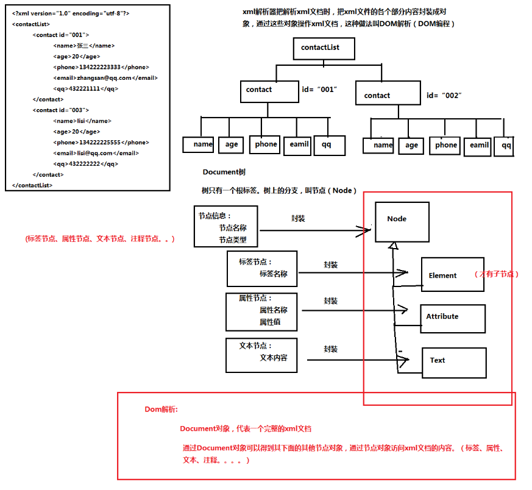

# XML语法

​          xml文件以xml后缀名结尾。

​          xml文件需要使用xml解析器去解析。浏览器内置了xml解析器。

## 标签

语法：

```xml
语法： <student></student>  开始标签  标签体内容  结束标签
1）<student/> 或 <student></student> 空标签。没有标签体内容
2）xml标签名称区分大小写。
3）xml标签一定要正确配对。
4）xml标签名中间不能使用空格
5）xml标签名不能以数字开头
6）注意： 在一个xml文档中，有且仅有一个根标签
```

## 属性

 ```xml
语法： <Student name="eric">student</Student>
注意：
1）属性值必须以引号包含，不能省略，也不能单双引号混用！！！
2）一个标签内可以有多个属性，但不能出现重复的属性名！！！
 ```

## 注释

 ```xml
语言： <!-- xml注释 -->
 ```

## 文档声明

```xml
语法： <?xml version="1.0" encoding="utf-8"?>
    version: xml的版本号
	encoding： 解析xml文件时查询的码表（解码过程时查询的码表）

注意：
1）如果在ecplise工具中开发xml文件，保存xml文件时自动按照文档声明的encoding来保存文件。
2）如果用记事本工具修改xml文件，注意保存xml文件按照文档声明的encoding的码表来保存。 
```

## 转义字符

 ```xml
在xml中内置了一些特殊字符，这些特殊字符不能直接被浏览器原样输出。如果希望把这些特殊字符按照原样输出到浏览器，对这些特殊字符进行转义。转义之后的字符就叫转义字节。
 ```

| 特殊字符 | 转义字符 |
| -------- | -------- |
| <        | `&lt;`   |
| \>       | `&gt;`   |
| "        | `&quot;` |
| &        | `&amp;`  |
| 空格     | `&nsbp;` |

## CDATA块

 作用： 可以让一些需要进行包含特殊字符的内容统一进行原样输出。

## 处理指令

```xml
作用： 告诉xml解析如果解析xml文档

案例： <?xml-stylesheet type="text/css" href="1.css"?> 告诉xml解析该xml文档引用了哪个css文件
需要提前xml内容可以使用xml-stylesheet指令指令
```

# XML解析 

## 引入

 xml文件除了给开发者看，更多的情况使用程序读取xml文件的内容。这叫做xml解析

## XML解析方式（原理不同）

- DOM解析

- SAX解析

## XML解析工具

DOM解析原理:

- JAXP （oracle-Sun公司官方）

- JDOM工具（非官方）

- Dom4J工具（非官方）

三大框架（默认读取xml的工具就是Dom4j）

SAX解析原理：

- Sax解析工具（oracle-sun公司官方）

 ## 什么是DOM解析

DOM解析原理：xml解析器一次性把整个xml文档加载进内存，然后在内存中构建一颗Document的对象树，通过Document对象，得到树上的节点对象，通过节点对象访问（操作）到xml文档的内容。

**DOM解析原理示意**



## Dom4j工具

非官方，不在jdk中。

使用步骤：

1. 导入dom4j的核心包。 dom4j-1.6.1.jar

2. 编写Dom4j读取xml文件代码

```java
public static void main(String[] args) {
		try {
			//1.创建一个xml解析器对象
			SAXReader reader = new SAXReader();
			//2.读取xml文档，返回Document对象
			Document doc = reader.read(new File("./src/contact.xml"));
			
			System.out.println(doc);
		} catch (DocumentException e) {
			e.printStackTrace();
			throw new RuntimeException(e);
		}
}
```

## Domj4读取xml文件API

```java
节点：
Iterator Element.nodeIterator(); //获取当前标签节点下的所有子节点


标签：

Element Document.getRootElement(); //获取xml文档的根标签       

Element  ELement.element("标签名") //指定名称的第一个子标签

Iterator<Element> Element.elementIterator("标签名");// 指定名称的所有子标签

List<Element>  Element.elements(); //获取所有子标签
                            

属性：

String  Element.attributeValue("属性名") //获取指定名称的属性值

Attribute  Element.attribute("属性名")；//获取指定名称的属性对象   

Attribute.getName() //获取属性名称

Attibute.getValue() //获取属性值

List<Attribute>      Element.attributes(); //获取所有属性对象

Iterator<Attribute>          Element.attibuteIterator(); //获取所有属性对象
 

文本：

Element.getText(); //获取当前标签的文本

Element.elementText("标签名") //获取当前标签的指定名称的子标签的文本内容
```

# xml中文乱码问题

